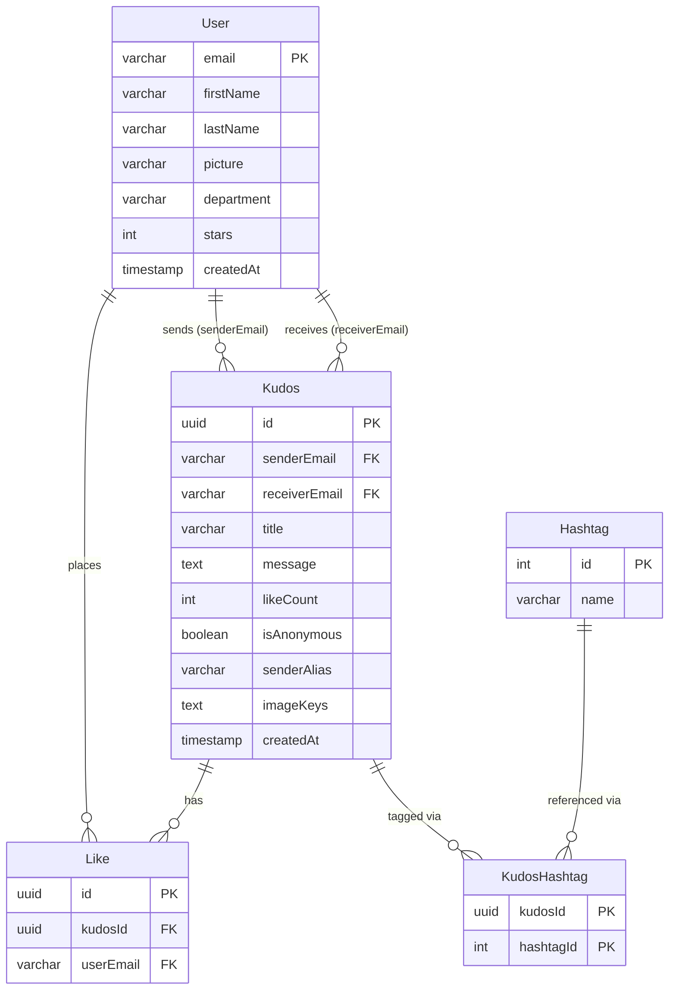

# Data Model

**Project**: Sun* Kudos
**Generated**: 2026-06-01

## Entity Relationship Diagram

## Entities

### MODEL001 — User

**Table**: `user`
**Description**: A platform user authenticated via Google OAuth2. Email is the natural PK (no surrogate). Populated on first login; seeded with 10 defaults via migration.

| Attribute | PG Type | Constraints | Notes |
|-----------|---------|-------------|-------|
| `email` | `character varying` | PK, NOT NULL | Google account email; natural key |
| `firstName` | `character varying` | NOT NULL | From Google profile |
| `lastName` | `character varying` | NOT NULL | From Google profile |
| `picture` | `character varying` | NULL | Google avatar URL; nullable |
| `department` | `character varying` | NULL, DEFAULT `''` | From JWT profile; may be empty string |
| `stars` | `integer` | NOT NULL, DEFAULT `0` | Accumulated star (hoa thị) counter |
| `createdAt` | `timestamp` | NOT NULL, DEFAULT `now()` | Auto-set by `@CreateDateColumn` |

**Relationships**:
- One-to-Many → Kudos (as sender) via `senderEmail`
- One-to-Many → Kudos (as receiver) via `receiverEmail`
- One-to-Many → Like via `userEmail`

---

### MODEL002 — Kudos

**Table**: `kudos`
**Description**: A peer-recognition post. Sender sends a message (rich HTML) to a receiver; supports anonymity, image attachments, and hashtag tagging. `likeCount` is a denormalized counter kept in sync with the Like table.

| Attribute | PG Type | Constraints | Notes |
|-----------|---------|-------------|-------|
| `id` | `uuid` | PK, NOT NULL, DEFAULT `uuid_generate_v4()` | Surrogate PK |
| `senderEmail` | `character varying` | NOT NULL, FK → user.email | Added migration 1748264000000 columns |
| `receiverEmail` | `character varying` | NOT NULL, FK → user.email | |
| `title` | `character varying` | NULL | "Danh hiệu"; added in migration 1779800000000 |
| `message` | `text` | NOT NULL | Rich HTML from Tiptap; max 5000 chars (DTO) |
| `likeCount` | `integer` | NOT NULL, DEFAULT `0` | Denormalized; incremented/decremented in service |
| `isAnonymous` | `boolean` | NOT NULL, DEFAULT `false` | Added in migration 1748264000000 |
| `senderAlias` | `character varying` | NULL | Used when `isAnonymous = true`; added in migration 1748264000000 |
| `imageKeys` | `text` | NULL | TypeORM `simple-array`; comma-separated S3 object keys; added in migration 1748264000000 |
| `createdAt` | `timestamp` | NOT NULL, DEFAULT `now()` | Auto-set by `@CreateDateColumn` |

**Relationships**:
- Many-to-One → User (sender) via `senderEmail` (no eager load, no cascade delete)
- Many-to-One → User (receiver) via `receiverEmail` (no eager load, no cascade delete)
- One-to-Many → KudosHashtag via `kudosId`
- One-to-Many → Like via `kudosId` (CASCADE DELETE on Like)

---

### MODEL003 — Like

**Table**: `like`
**Description**: Records that a user liked a specific kudos. Unique per `(kudosId, userEmail)` pair. Deletion of the parent kudos cascades to delete likes.

| Attribute | PG Type | Constraints | Notes |
|-----------|---------|-------------|-------|
| `id` | `uuid` | PK, NOT NULL, DEFAULT `uuid_generate_v4()` | Surrogate PK |
| `kudosId` | `uuid` | NOT NULL, FK → kudos.id ON DELETE CASCADE | |
| `userEmail` | `character varying` | NOT NULL, FK → user.email | |

**Unique constraint**: `UQ_cf9f31d9dba7ce19a4f4aa56dfa` on `(kudosId, userEmail)` — one like per user per kudos.

**Relationships**:
- Many-to-One → Kudos via `kudosId` (CASCADE DELETE)
- Many-to-One → User via `userEmail` (no cascade)

---

### MODEL004 — Hashtag

**Table**: `hashtag`
**Description**: Canonical hashtag label. Names are unique; auto-created when a new tag appears in a kudos post.

| Attribute | PG Type | Constraints | Notes |
|-----------|---------|-------------|-------|
| `id` | `integer` | PK, NOT NULL, SERIAL | Auto-increment surrogate PK |
| `name` | `character varying` | NOT NULL, UNIQUE | Constraint: `UQ_347fec870eafea7b26c8a73bac1` |

**Relationships**:
- One-to-Many → KudosHashtag via `hashtagId`

---

### MODEL005 — KudosHashtag

**Table**: `kudos_hashtag`
**Description**: Explicit M2M join table between Kudos and Hashtag. Composite PK `(kudosId, hashtagId)`. Both FK sides cascade delete — removing a kudos or a hashtag cleans up the join rows.

| Attribute | PG Type | Constraints | Notes |
|-----------|---------|-------------|-------|
| `kudosId` | `uuid` | PK (composite), NOT NULL, FK → kudos.id ON DELETE CASCADE | |
| `hashtagId` | `integer` | PK (composite), NOT NULL, FK → hashtag.id ON DELETE CASCADE | |

**Relationships**:
- Many-to-One → Kudos via `kudosId` (CASCADE DELETE)
- Many-to-One → Hashtag via `hashtagId` (CASCADE DELETE)

---

## Validation Rules

Validation is applied at the DTO layer (`class-validator`) before data reaches entities. Column-level DB constraints are documented in entity tables above.

### MODEL002 — Kudos (via CreateKudosDto)

| Rule | Field | Constraint | Source |
|------|-------|------------|--------|
| MODEL002-V01 | `receiverEmail` | `@IsEmail()` — must be valid email format | `create-kudos.dto.ts:13` |
| MODEL002-V02 | `title` | `@IsOptional() @IsString() @MaxLength(200)` | `create-kudos.dto.ts:17-20` |
| MODEL002-V03 | `message` | `@IsString() @MaxLength(5000)` — required, max 5000 chars | `create-kudos.dto.ts:22-24` |
| MODEL002-V04 | `hashtags` | `@IsArray() @IsString({ each: true })` — required array of strings | `create-kudos.dto.ts:26-28` |
| MODEL002-V05 | `isAnonymous` | `@IsOptional() @IsBoolean()` with `@Transform` (`true`/`'true'` coercion) | `create-kudos.dto.ts:31-34` |
| MODEL002-V06 | `senderAlias` | `@IsOptional() @IsString() @MaxLength(100)` | `create-kudos.dto.ts:37-40` |
| MODEL002-V07 | `imageKeys` | `@IsOptional() @IsArray() @ArrayMaxSize(5) @IsString({ each: true }) @MaxLength(300, { each: true })` — max 5 keys, each ≤300 chars | `create-kudos.dto.ts:47-51` |

### MODEL001 — User

No DTO validation rules (user is created by auth service from Google OAuth profile; no user-submitted creation form). Column constraints only (`NOT NULL` on `firstName`/`lastName`/`email`).

### MODEL003 — Like

No DTO. Like creation is via `POST /kudos/:id/like` (JWT-authenticated endpoint); uniqueness enforced by DB unique constraint on `(kudosId, userEmail)`.

### MODEL004 — Hashtag

No DTO. Hashtag records are upserted by the kudos service from raw string names; uniqueness enforced by DB `UNIQUE` on `name`.

---

## Seed Data

Migration `1780000000000-seed-default-users.ts` inserts 10 default users (idempotent via `ON CONFLICT DO NOTHING`):

| Email | Department |
|-------|-----------|
| an.nguyen@sun-asterisk.com | CTO |
| binh.tran@sun-asterisk.com | SPD |
| chi.le@sun-asterisk.com | FCOV |
| dung.pham@sun-asterisk.com | CEVC1 |
| em.hoang@sun-asterisk.com | CEVC2 |
| phong.vu@sun-asterisk.com | STVC - R&D |
| giang.do@sun-asterisk.com | OPDC - HRF |
| huy.bui@sun-asterisk.com | CEVEC |
| khanh.dang@sun-asterisk.com | PAO |
| linh.ngo@sun-asterisk.com | BDV |

---

## Migration History

| Migration | Timestamp | Change |
|-----------|-----------|--------|
| `InitTables` | 1740264000000 | Creates all 5 tables + FK constraints |
| `AddKudosAnonymousImages` | 1748264000000 | Adds `isAnonymous`, `senderAlias`, `imageKeys` to `kudos` |
| `AddKudosTitle` | 1779800000000 | Adds `title` (varchar, nullable) to `kudos` |
| `SeedDefaultUsers` | 1780000000000 | Inserts 10 seed users; idempotent |

---

## Summary

- **Total Entities**: 5 (User, Kudos, Like, Hashtag, KudosHashtag)
- **Total Relationships**: 6
  - User →(1:N)→ Kudos (sender)
  - User →(1:N)→ Kudos (receiver)
  - User →(1:N)→ Like
  - Kudos →(1:N)→ Like (CASCADE DELETE)
  - Kudos →(1:N)→ KudosHashtag (CASCADE DELETE)
  - Hashtag →(1:N)→ KudosHashtag (CASCADE DELETE)
- **Denormalized counters**: `kudos.likeCount` mirrors row count in `like` for the same `kudosId`
- **Storage note**: `imageKeys` stored as PostgreSQL `text` column with TypeORM `simple-array` serialization (comma-delimited); application enforces max 5 keys
