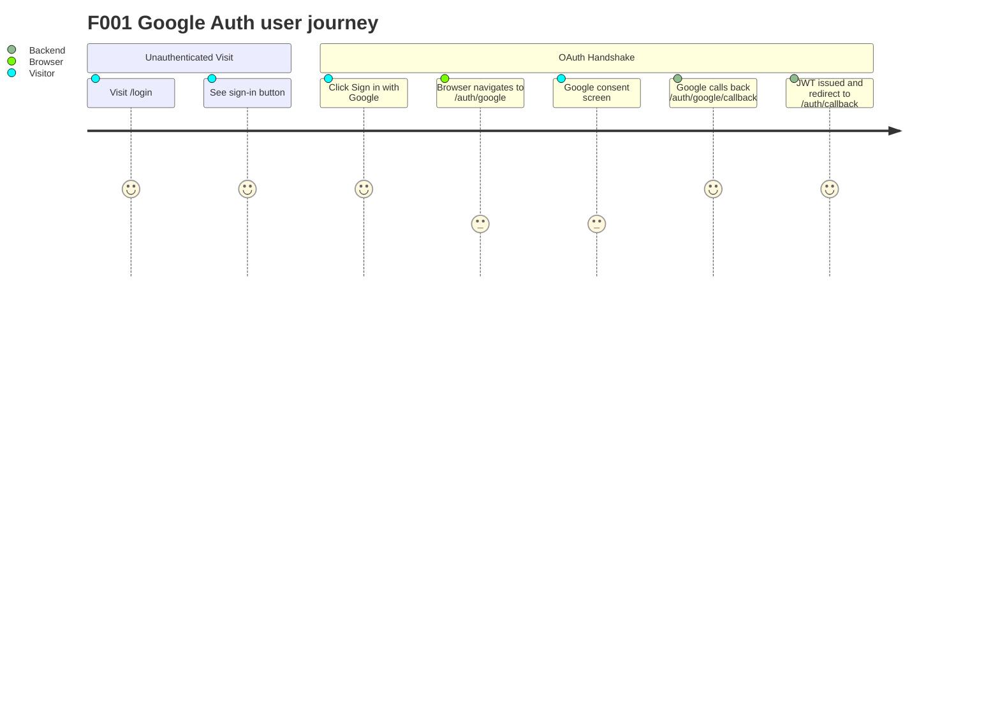
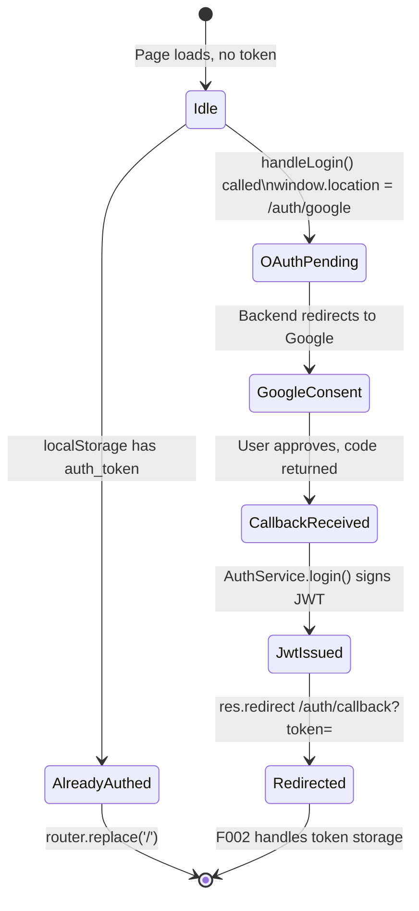

# Feature Specification: F001_GoogleAuth

**Priority**: P0
**Type**: ui
**Generated**: 2026-06-01

## Overview

F001_GoogleAuth covers the full Google OAuth 2.0 initiation and server-side completion flow. The user clicks "Sign in with Google" on SCR002_LoginPage; the browser navigates to `GET /auth/google` which triggers a Passport GoogleAuthGuard redirect to Google's consent screen. Google calls back to `GET /auth/google/callback`; the backend validates the OAuth token, upserts the User record, signs a JWT, and redirects the browser to `{FRONTEND_URL}/auth/callback?token=<jwt>`. This feature spans the backend auth module (`auth.controller.ts`, `auth.service.ts`, `google.strategy.ts`) and the frontend login page/component (`login/page.tsx`, `login-hero.tsx`).

## Why This Exists

Sun* Kudos uses Google SSO as the sole authentication mechanism to leverage Sun Asterisk's corporate Google Workspace accounts. This eliminates password management, ties user identity to the corporate directory, and ensures only employees can access the platform.

## Who Uses It

- **Unauthenticated visitor** — navigates to `/login`, clicks the sign-in button to authenticate (PERM002_BackendGoogleOAuthGuard)
- **Already-authenticated user** — visits `/login` and is immediately redirected to `/` without re-authenticating

## Business Workflow

```
1. Visitor hits /login → LoginPage renders (frontend/app/login/page.tsx:13-17)
   → checks localStorage for auth_token; if present → router.replace('/') immediately
2. Visitor clicks "ĐĂNG NHẬP với Google" button (frontend/components/login/login-hero.tsx:46-49)
   → sets loading=true → window.location.href = `${NEXT_PUBLIC_BACKEND_URL}/auth/google`
3. Backend GET /auth/google → GoogleAuthGuard (backend/src/auth/guards/google-auth.guard.ts:1-5)
   → Passport initiates OAuth2 redirect to Google consent screen with scopes ['email', 'profile']
4. Google redirects to GET /auth/google/callback with authorization code
   → GoogleStrategy.validate() (backend/src/auth/strategies/google.strategy.ts:18-33)
   → extracts GoogleUserDto {email, firstName, lastName, picture, accessToken}
5. AuthController.googleCallback() (backend/src/auth/auth.controller.ts:22-27)
   → calls AuthService.login(user) → JwtService.sign(payload)
   → payload: {sub, email, firstName, lastName, picture} (backend/src/auth/auth.service.ts:9-17)
6. JWT issued with expiry from JWT_EXPIRES_IN env (default 7d)
   → res.redirect(`${FRONTEND_URL}/auth/callback?token=${jwt}`)
7. Browser lands on /auth/callback → F002_AuthCallback takes over
```

## Screen Flow

**See:** ScreenFlow § F001_GoogleAuth

| Screen | Route | Purpose |
|--------|-------|---------|
| SCR002_LoginPage | `/login` | Renders "Sign in with Google" button; checks existing token |
| SCR003_AuthCallback | `/auth/callback` | Receives JWT from redirect (owned by F002) |



## Cross-Cutting Logic

### Requirements

| Code | Description | Endpoint/Handler | Verifiable |
|------|-------------|------------------|------------|
| FR-001 | Login page must check existing token and skip OAuth if already authenticated | `GET /login` (frontend) via `LoginPage` | yes |

### Business Rules

None.

### State Machines

None.

### Algorithms

None.

### External Integrations

None.

### Verification

- **SC-001** — FR-001: visiting `/login` with a valid `auth_token` in localStorage redirects to `/` without rendering the login UI (covers FR-001)

## User Stories

### US001_SignInWithGoogle — Sign In with Google (Priority: P0)

**What happens:** An unauthenticated visitor on `/login` clicks "Sign in with Google." The browser navigates away to `GET /auth/google`, Google's consent screen appears, OAuth handshake completes on the backend, a JWT is signed and the browser is sent to `/auth/callback?token=<jwt>`.
**Why this priority:** Without this flow no user can authenticate; it is the sole entry point to the platform.
**Independent Test:** Open the app in an incognito window (no token in localStorage), visit `/login`, click the button — observe browser redirect to Google and eventual landing on `/` after consent.

**Acceptance Scenarios:**

1. **Given** no `auth_token` in localStorage and user is on `/login`, **When** user clicks "Sign in with Google", **Then** `window.location.href` is set to `${NEXT_PUBLIC_BACKEND_URL}/auth/google` and the browser navigates to the Google consent screen.
2. **Given** `auth_token` already exists in localStorage, **When** user visits `/login`, **Then** `router.replace('/')` is called immediately without rendering the sign-in button interaction.
3. **Given** Google returns a valid OAuth code to `/auth/google/callback`, **When** `GoogleStrategy.validate()` runs, **Then** a `GoogleUserDto` is returned with `email`, `firstName`, `lastName`, `picture`, and the controller redirects to `${FRONTEND_URL}/auth/callback?token=<signed_jwt>`.

**Requirements fulfilled:**
- **FR-002** Frontend renders "Sign in with Google" button navigating to `${NEXT_PUBLIC_BACKEND_URL}/auth/google` — `GET /auth/google` via `LoginHero::handleLogin`
- **FR-003** Backend validates Google OAuth code and issues a signed JWT — `GET /auth/google/callback` via `AuthController::googleCallback`
- **FR-004** JWT payload contains `{sub, email, firstName, lastName, picture}` — `POST N/A` via `AuthService::login`

**Rules enforced:**

### BR-001_GoogleOAuthScopeConstraint
**Source:** `backend/src/auth/strategies/google.strategy.ts:10-16`
**Applies to:** `GET /auth/google` OAuth initiation
**Linked FR:** FR-003
**Rule:** Passport GoogleStrategy is configured with scopes `['email', 'profile']`. Only these two scopes are requested from Google; no additional permissions are granted. If Google does not return email or profile fields, `validate()` will fail (undefined access on `emails[0]` or `photos[0]`).

**Pseudocode:**
```ts
// GoogleStrategy constructor
super({
  clientID: configService.getOrThrow('GOOGLE_CLIENT_ID'),
  clientSecret: configService.getOrThrow('GOOGLE_CLIENT_SECRET'),
  callbackURL: configService.getOrThrow('GOOGLE_CALLBACK_URL'),
  scope: ['email', 'profile'],   // ONLY these two scopes
})
// validate() extracts emails[0].value, name.givenName, name.familyName, photos[0].value
```

### BR-002_JwtPayloadShape
**Source:** `backend/src/auth/auth.service.ts:9-17`
**Applies to:** JWT issuance on `GET /auth/google/callback`
**Linked FR:** FR-004
**Rule:** The JWT payload is exactly `{sub: user.email, email, firstName, lastName, picture}`. The `sub` claim equals `email`. No roles or permissions are embedded. Expiry defaults to `7d` via `JWT_EXPIRES_IN` env var (`auth.module.ts:20`).

**Pseudocode:**
```ts
function login(user: GoogleUserDto): string {
  const payload = {
    sub: user.email,        // subject = email
    email: user.email,
    firstName: user.firstName,
    lastName: user.lastName,
    picture: user.picture,
  };
  return jwtService.sign(payload);  // signed with JWT_SECRET, expires in JWT_EXPIRES_IN
}
```

### BR-003_AlreadyAuthenticatedRedirect
**Source:** `frontend/app/login/page.tsx:13-17`
**Applies to:** `GET /login` (frontend)
**Linked FR:** FR-001
**Rule:** On mount, `LoginPage` checks `localStorage.getItem('auth_token')`. If a token exists (regardless of validity), `router.replace('/')` is called immediately. The login UI is technically rendered but the `useEffect` fires before the user can interact.

**Pseudocode:**
```ts
useEffect(() => {
  if (localStorage.getItem('auth_token')) {
    router.replace('/');
  }
}, [router]);
```

**State transitions:**

### SM-001_AuthFlowLifecycle
**Source:** `frontend/components/login/login-hero.tsx:42-49`
**Linked FR:** FR-002
**States:** Idle, OAuthPending, JwtIssued, Redirected



**Transition rules:**
- `Idle → AlreadyAuthed`: guard = `localStorage.getItem('auth_token') !== null`; side effects = `router.replace('/')`
- `Idle → OAuthPending`: guard = button click, `loading` flag set to prevent double-submit; side effects = `window.location.href` mutation
- `CallbackReceived → JwtIssued`: guard = GoogleStrategy.validate() succeeds; side effects = JWT signed with `JWT_SECRET`
- `JwtIssued → Redirected`: side effects = HTTP 302 to `${FRONTEND_URL}/auth/callback?token=<jwt>`

**External integrations:**

### INT-001_GoogleOAuth2
**Source:** `backend/src/auth/strategies/google.strategy.ts:1-34`
**Linked FR:** FR-003
**Type:** api-call (OAuth2 redirect flow)
**Target:** Google OAuth2 authorization endpoint (`accounts.google.com`)
**Trigger:** `GET /auth/google` — Passport intercepts and redirects browser
**Payload:** OAuth2 authorization request with `client_id`, `redirect_uri` (`GOOGLE_CALLBACK_URL`), `scope=email profile`, `response_type=code`
**Failure handling:** If Google returns an error (user denies, invalid client), Passport throws; no explicit retry or compensation — user lands on callback with no token and `F002` falls through to redirect `/`.

**Pseudocode:**
```ts
// Passport handles redirect automatically in GoogleAuthGuard
// validate() called on callback:
validate(accessToken, _refreshToken, profile, done) {
  const user: GoogleUserDto = {
    email: profile.emails[0].value,
    firstName: profile.name.givenName,
    lastName: profile.name.familyName,
    picture: profile.photos[0].value,
    accessToken,   // NOT put in JWT — not stored beyond request
  };
  done(null, user);
}
```

**Verification:**
- **SC-002** Backend redirects to `/auth/callback?token=<non-empty-string>` after successful Google consent (covers FR-003, BR-002)
- **SC-003** JWT decoded payload contains exactly `{sub, email, firstName, lastName, picture}` with no extra fields (covers FR-004, BR-002)
- **SC-004** Button loading state prevents duplicate clicks while OAuth is in flight (covers FR-002, BR-003)

---

### Edge Cases

| Scenario | Behavior |
|----------|----------|
| `GOOGLE_CLIENT_ID`, `GOOGLE_CLIENT_SECRET`, or `GOOGLE_CALLBACK_URL` env vars missing | `configService.getOrThrow()` throws at startup — app fails to boot before any request is served |
| Google account has no profile photo (`photos` array empty) | `photos[0].value` throws `TypeError`; Passport calls `done(err)` → 500 Internal Server Error on callback |
| `FRONTEND_URL` env var not set | `configService.get('FRONTEND_URL')` returns `undefined`; redirect target becomes `undefined/auth/callback?token=...` — broken redirect (HTTP 302 to invalid URL) |
| `JWT_SECRET` not set | `configService.get('JWT_SECRET')` returns `undefined`; `JwtModule` registers with `undefined` secret; token signing succeeds but verification will fail across restarts |
| User denies Google consent | Google redirects to `GOOGLE_CALLBACK_URL` with `error=access_denied`; `GoogleStrategy.validate()` is not called; NestJS/Passport throws `UnauthorizedException` → 401 |
| Button clicked multiple times rapidly | `loading=true` disables the button after first click; `window.location.href` assignment is idempotent — only one navigation occurs |

## Key Entities

| Entity | Table | Key Columns | Purpose |
|--------|-------|-------------|---------|
| User | `user` | `email` (PK), `firstName`, `lastName`, `picture`, `department` | Upserted on callback in F001 context (upsert happens in `KudosService.create` on first kudos; on auth itself no DB write in F001 — user record created lazily) |

> Note: `F001_GoogleAuth` itself does NOT write to the `user` table. `AuthService.login()` only signs a JWT from the Google profile DTO. The `user` row is upserted in `KudosService.create()` when the user first posts kudos. This is an important architectural assumption — see Assumptions below.

## Related Artifacts

- **Screens** (from ScreenList): SCR002_LoginPage
- **User Stories** (from UserStories): US001_SignInWithGoogle
- **Routes** (from RouteList): GET /auth/google, GET /auth/google/callback
- **Data Models** (from DataModel): MODEL001 — User (read-only in this feature; no DB write on auth)
- **Background Logic** (from BackgroundLogic): none
- **Permissions** (from Permissions): PERM002_BackendGoogleOAuthGuard

## Spec Documents

- [x] [System Overview](../../system-overview.md) — architecture, auth flow, JWT design
- [x] [Feature List](../../feature-list.md) — F001_GoogleAuth, US001_SignInWithGoogle, SCR002_LoginPage, PERM002_BackendGoogleOAuthGuard
- [x] [Route List](../../route-list.md) — GET /auth/google, GET /auth/google/callback
- [ ] [Data Model](../../data-model.md) — MODEL001 (User; not written by this feature)
- [x] [Screen List](../../screen-list.md) — SCR002_LoginPage, SCR003_AuthCallback
- [ ] [Screen Flow](../../screen-flow.md)
- [ ] [Background Logic](../../background-logic.md) — none
- [x] [Permissions](../../permissions.md) — PERM002_BackendGoogleOAuthGuard
- [x] [User Stories](../../user-stories.md) — US001_SignInWithGoogle

## Assumptions

- `AuthService.login()` does NOT upsert a User row into the database. The backend issues a JWT purely from the Google profile DTO without any DB interaction. The User record is lazily created on first `POST /kudos` via `KudosService.create()`. This means a user who authenticates but never posts kudos will have no DB record.
- The `accessToken` (Google OAuth access token) is captured in `GoogleUserDto.accessToken` but is NOT stored anywhere — not in the JWT, not in the DB. It is discarded after `validate()` returns.
- JWT expiry uses the `JWT_EXPIRES_IN` env var with a default of `7d`. There is no refresh token mechanism; after expiry the user must re-authenticate via Google.
- The `LoginPage` auth check (`localStorage.getItem('auth_token')`) does not validate the token cryptographically — an expired or tampered token will still bypass the login UI (but subsequent API calls will 401).
- `GOOGLE_CALLBACK_URL` must be set to `{backend_base}/auth/google/callback` and must be registered in the Google Cloud Console OAuth credentials.

## Source Code References

| Symbol | Path | Purpose |
|--------|------|---------|
| `AuthController` | `backend/src/auth/auth.controller.ts:1-28` | `googleAuth()` initiates OAuth; `googleCallback()` signs JWT and redirects |
| `AuthService` | `backend/src/auth/auth.service.ts:1-19` | `login()` signs JWT from `GoogleUserDto` |
| `GoogleStrategy` | `backend/src/auth/strategies/google.strategy.ts:1-34` | OAuth scopes, `validate()` extracts user profile |
| `GoogleAuthGuard` | `backend/src/auth/guards/google-auth.guard.ts:1-5` | Passport guard applied to both auth routes |
| `AuthModule` | `backend/src/auth/auth.module.ts:1-28` | JWT module registration with `JWT_SECRET` / `JWT_EXPIRES_IN` |
| `LoginPage` | `frontend/app/login/page.tsx:1-28` | Already-auth redirect check |
| `LoginHero` | `frontend/components/login/login-hero.tsx:41-49` | "Sign in with Google" button + `handleLogin()` |

## Unresolved Questions

1. **No User DB write on login**: The system has no signup step. If a user authenticates but never submits kudos, they have no `user` row. Is this intentional? Edge: if any endpoint queries `user` by email (e.g. profile lookup by another user) for an auth-only user with no kudos, the lookup may 404 or return empty.
2. **Google account with no photo**: `profile.photos[0].value` will throw if Google returns an empty photos array (possible for some Google Workspace configs). No null-guard in `GoogleStrategy.validate()` (line 29). Confirm whether this edge is protected elsewhere.
3. **`JWT_SECRET` undefined behavior**: If `JWT_SECRET` is not set in `.env`, `configService.get('JWT_SECRET')` returns `undefined` (not `getOrThrow`). `JwtModule.registerAsync` registers with `undefined` secret — tokens are signed but the strategy would also use `undefined` as the secret, so verification would pass. This is a misconfiguration risk.
