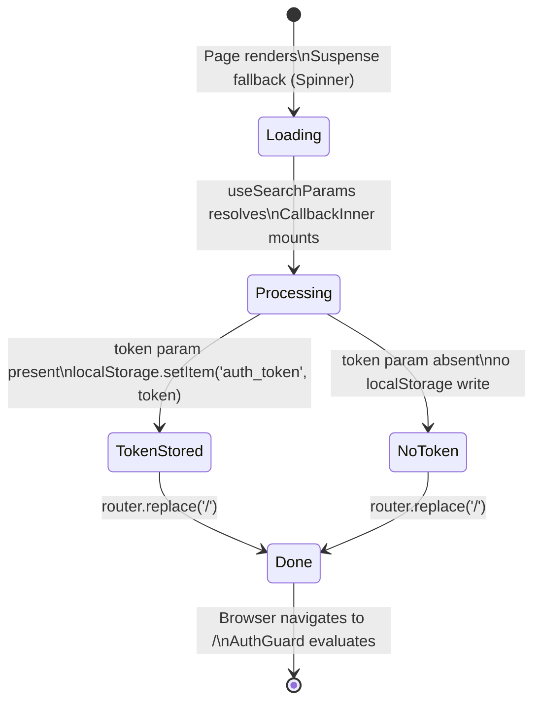

# Feature Specification: F002_AuthCallback

**Priority**: P0
**Type**: ui
**Generated**: 2026-06-01

## Overview

F002_AuthCallback is the frontend-only page at `/auth/callback` that completes the Google OAuth flow initiated by F001_GoogleAuth. It reads the `?token=` query parameter delivered by the backend redirect, persists the JWT to `localStorage` under key `auth_token`, displays a full-screen spinner during processing, and calls `router.replace('/')` unconditionally. No backend API call is made; the entire logic is client-side. Source: `frontend/app/auth/callback/page.tsx`.

## Why This Exists

After the backend issues a JWT it cannot set an HttpOnly cookie in a cross-origin redirect (frontend and backend may be on different origins). The chosen pattern is to carry the token in the redirect URL query string. This page acts as the landing receptor that extracts and stores the token before forwarding the user into the authenticated app.

## Who Uses It

- **Browser (OAuth redirect target)** — the Google OAuth callback chain ends here; no user action required (PERM003_FrontendAuthGuard is exempted for this path)
- **Unauthenticated visitor** — passively processed; sees only a spinner for <1s

## Business Workflow

```
1. Backend redirects browser to ${FRONTEND_URL}/auth/callback?token=<jwt>
   (backend/src/auth/auth.controller.ts:26)
2. Next.js renders AuthCallbackPage → Suspense wrapper → CallbackInner mounts
   (frontend/app/auth/callback/page.tsx:35-41)
3. useEffect fires: searchParams.get('token') called
   (frontend/app/auth/callback/page.tsx:25-29)
4. If token present → localStorage.setItem('auth_token', token)
   If token absent → no write; no error thrown
5. router.replace('/') called unconditionally — navigates to home page
   (frontend/app/auth/callback/page.tsx:29)
6. AuthGuard in app/layout.tsx evaluates /; finds auth_token → renders HomePage
```

## Screen Flow

**See:** ScreenFlow § F002_AuthCallback

| Screen | Route | Purpose |
|--------|-------|---------|
| SCR003_AuthCallback | `/auth/callback` | Token extraction, localStorage write, redirect to `/` |
| SCR001_HomePage | `/` | Post-auth destination |

## Cross-Cutting Logic

### Requirements

None.

### Business Rules

None.

### State Machines

None.

### Algorithms

None.

### External Integrations

None.

### Verification

None.

## User Stories

### US002_CompleteOAuthCallback — Complete OAuth Callback (Priority: P0)

**What happens:** After Google OAuth completes, the backend redirects the browser to `/auth/callback?token=<jwt>`. The `CallbackInner` component reads the token, stores it in `localStorage`, and redirects the user to `/`. The user sees a spinner for the brief duration of this processing. If no token is present in the URL, the redirect still fires (graceful fallback — user lands on `/` without a token and `AuthGuard` will redirect them to `/login`).
**Why this priority:** This is the mandatory bridge between the backend JWT issuance and the frontend's localStorage-based auth state. Without it, authenticated users would never reach the app.
**Independent Test:** Navigate directly to `/auth/callback?token=test-jwt-value` in a browser; observe that `localStorage.getItem('auth_token')` equals `'test-jwt-value'` and the browser URL becomes `/`.

**Acceptance Scenarios:**

1. **Given** the backend redirected to `/auth/callback?token=<valid_jwt>`, **When** `CallbackInner` mounts and `useEffect` fires, **Then** `localStorage.setItem('auth_token', <valid_jwt>)` is called and `router.replace('/')` navigates to home.
2. **Given** the URL is `/auth/callback` with no `token` query parameter, **When** `CallbackInner` mounts, **Then** `localStorage` is NOT written to and `router.replace('/')` still fires (user lands on `/` → AuthGuard redirects to `/login`).
3. **Given** `/auth/callback` is loading (Suspense boundary), **When** `useSearchParams` is resolving, **Then** the `Spinner` component is visible (full-screen dark background with animated SVG).

**Requirements fulfilled:**
- **FR-001** Read `?token=` query param and persist to `localStorage['auth_token']` — client-only via `CallbackInner::useEffect`
- **FR-002** Show spinner during token processing — `Spinner` component rendered by Suspense fallback and by `CallbackInner` return value
- **FR-003** Redirect to `/` after token handling regardless of token presence — `router.replace('/')` unconditional call

**Rules enforced:**

### BR-001_TokenPersistenceKey
**Source:** `frontend/app/auth/callback/page.tsx:27`
**Applies to:** `localStorage` write in `CallbackInner`
**Linked FR:** FR-001
**Rule:** The token MUST be stored under the exact key `auth_token`. This key is the contract between this page, `AuthGuard` (`frontend/components/auth/auth-guard.tsx:15`), `apiFetch` (`frontend/lib/api.ts:4`), and `UserProfileDropdown.handleLogout()` (`frontend/components/homepage/user-profile-dropdown.tsx:37`). Any deviation breaks all consumers.

**Pseudocode:**
```ts
const token = searchParams.get('token');
if (token) {
  localStorage.setItem('auth_token', token);  // key MUST be 'auth_token'
}
router.replace('/');
```

### BR-002_UnconditionalRedirect
**Source:** `frontend/app/auth/callback/page.tsx:29`
**Applies to:** `router.replace('/')` call
**Linked FR:** FR-003
**Rule:** `router.replace('/')` is called unconditionally regardless of whether a token was found. This means:
- Token present → user stored and forwarded to home (AuthGuard passes).
- Token absent → user forwarded to home (AuthGuard detects no token → redirect to `/login`).
- Error in storage (e.g. localStorage blocked) → uncaught; no try/catch; browser console error but redirect still fires if reachable.

**Pseudocode:**
```ts
useEffect(() => {
  const token = searchParams.get('token');
  if (token) {
    localStorage.setItem('auth_token', token);
  }
  router.replace('/');   // always runs — no conditional
}, [router, searchParams]);
```

**State transitions:**

### SM-001_CallbackPageLifecycle
**Source:** `frontend/app/auth/callback/page.tsx:1-41`
**Linked FR:** FR-001
**States:** Loading, Processing, Done



**Transition rules:**
- `Loading → Processing`: guard = Suspense resolves (Next.js hydration complete); side effects = `CallbackInner` mounts, `useEffect` enqueued
- `Processing → TokenStored`: guard = `searchParams.get('token') !== null`; side effects = `localStorage.setItem('auth_token', token)`
- `Processing → NoToken`: guard = `searchParams.get('token') === null`; side effects = none
- `TokenStored/NoToken → Done`: guard = none; side effects = `router.replace('/')` called

**Algorithms:** None.

**External integrations:** None.

**Verification:**
- **SC-001** After navigating to `/auth/callback?token=abc123`, `localStorage.getItem('auth_token')` equals `'abc123'` and current route is `/` (covers FR-001, FR-003, BR-001)
- **SC-002** After navigating to `/auth/callback` (no token), `localStorage.getItem('auth_token')` is null/unchanged and current route is `/` (covers FR-003, BR-002)
- **SC-003** During Suspense resolution, the spinner SVG is present in the DOM (covers FR-002)

---

### Edge Cases

| Scenario | Behavior |
|----------|----------|
| `localStorage` is blocked (private browsing with strict settings) | `localStorage.setItem` throws `DOMException`; not caught — unhandled error logged to console; `router.replace('/')` does NOT fire if the exception propagates before it; user stays on `/auth/callback` with spinner |
| Token query param contains special characters (e.g. `+`, `=`) | `useSearchParams().get('token')` handles URL decoding automatically (Next.js built-in); JWT Base64url encoding is safe in URLs |
| User navigates directly to `/auth/callback` with no prior OAuth flow | No token in URL → `BR-002` fires; redirect to `/` → AuthGuard redirects to `/login` |
| Token is expired or tampered | Stored as-is in localStorage; subsequent API calls will receive 401 from backend `JwtAuthGuard` → frontend shows error state (not handled in this feature) |
| `router.replace` called before hydration completes | Suspense boundary with `fallback={<Spinner />}` ensures `CallbackInner` only mounts after hydration; `useRouter` is available at mount time |

## Key Entities

| Entity | Table | Key Columns | Purpose |
|--------|-------|-------------|---------|
| (none — no DB reads or writes) | — | — | F002 is purely client-side; the JWT is a self-contained credential |

## Related Artifacts

- **Screens** (from ScreenList): SCR003_AuthCallback
- **User Stories** (from UserStories): US002_CompleteOAuthCallback
- **Routes** (from RouteList): none (client-only; `/auth/callback` is a Next.js frontend page route, not a backend API route)
- **Data Models** (from DataModel): none
- **Background Logic** (from BackgroundLogic): none
- **Permissions** (from Permissions): PERM003_FrontendAuthGuard (this path is in `PUBLIC_PATHS` — exempt from the guard)

## Spec Documents

- [x] [System Overview](../../system-overview.md) — authentication flow diagram
- [x] [Feature List](../../feature-list.md) — F002_AuthCallback, US002_CompleteOAuthCallback, SCR003_AuthCallback, PERM003_FrontendAuthGuard
- [ ] [Route List](../../route-list.md) — no backend routes for this feature
- [ ] [Data Model](../../data-model.md) — no entities
- [x] [Screen List](../../screen-list.md) — SCR003_AuthCallback
- [ ] [Screen Flow](../../screen-flow.md)
- [ ] [Background Logic](../../background-logic.md) — none
- [x] [Permissions](../../permissions.md) — PERM003_FrontendAuthGuard (public path exemption)
- [x] [User Stories](../../user-stories.md) — US002_CompleteOAuthCallback

## Assumptions

- `localStorage` is available in the browser. Next.js `'use client'` directive ensures this only runs client-side, but restrictive browser privacy settings (e.g. Firefox strict mode, Safari ITP) can block `localStorage` in some contexts. No fallback (sessionStorage, cookie) exists.
- The JWT in the `?token=` param is the complete, unmodified token produced by `AuthService.login()`. No re-encoding is applied by the backend's `res.redirect()` call (`auth.controller.ts:26`).
- `router.replace('/')` vs `router.push('/')` — `replace` is used intentionally so that `/auth/callback` does not appear in the browser's history stack (pressing Back from Home does not return to the callback page).
- The `useEffect` dependency array `[router, searchParams]` means the effect re-runs if `searchParams` changes. In practice this only fires once (SSR/hydration), but a future component tree re-mount could write to localStorage again with the same token — idempotent and harmless.

## Source Code References

| Symbol | Path | Purpose |
|--------|------|---------|
| `AuthCallbackPage` | `frontend/app/auth/callback/page.tsx:35-41` | Root page component; wraps `CallbackInner` in Suspense |
| `CallbackInner` | `frontend/app/auth/callback/page.tsx:20-33` | Core logic: reads `?token=`, writes localStorage, redirects |
| `Spinner` | `frontend/app/auth/callback/page.tsx:6-18` | Full-screen loading indicator shown during processing |
| `apiFetch` | `frontend/lib/api.ts:1-20` | Reads `auth_token` from localStorage on every API call — consumer of the key written here |
| `AuthGuard` | `frontend/components/auth/auth-guard.tsx:6-24` | Reads `auth_token` to gate navigation — consumer of the key written here |

## Unresolved Questions

1. **No error handling for localStorage failure**: If `localStorage.setItem` throws (private browsing, storage quota exceeded), the exception bubbles unhandled inside `useEffect`. The user remains stuck on the spinner at `/auth/callback`. Should a `try/catch` be added with a fallback redirect to `/login?error=storage_blocked`?
2. **Token in URL bar**: The JWT is visible in the browser's URL bar and browser history (before `router.replace` fires). Browser history may persist the token-bearing URL. Confirm whether this is an acceptable security trade-off vs. cookie-based delivery.
