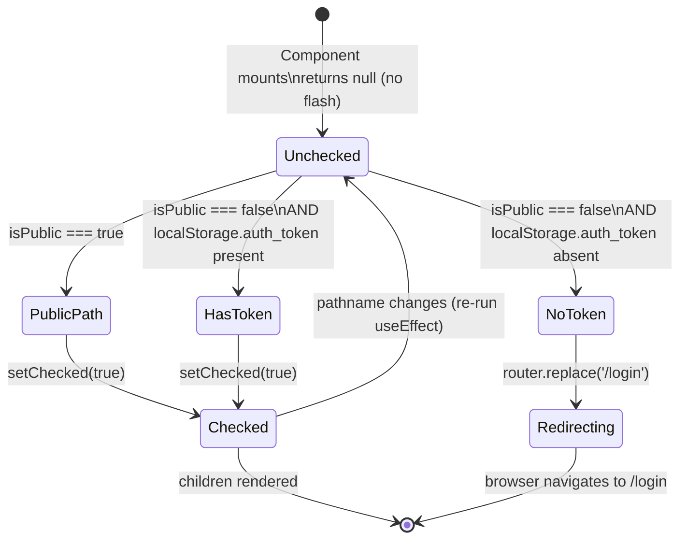

# Feature Specification: F003_FrontendAuthGuard

**Priority**: P0
**Type**: ui
**Generated**: 2026-06-01

## Overview

F003_FrontendAuthGuard is the client-side route protection layer mounted in `frontend/app/layout.tsx`. The `AuthGuard` component wraps every page in the Next.js 16 App Router tree. On every path change it reads `auth_token` from `localStorage`; if the path is not in `PUBLIC_PATHS` (`['/login', '/countdown', '/auth/callback']`) and no token is found, it calls `router.replace('/login')`. It renders `null` until the check completes (`checked` state) to prevent a flash of protected content. This feature touches SCR001, SCR005, SCR006, SCR007, SCR008, SCR009 — every auth-required screen.

## Why This Exists

The backend JWT guard (PERM001) protects API routes, but frontend pages need an independent gate to prevent unauthenticated users from rendering protected UI before any API call is made. `AuthGuard` provides this UX-layer gate: it acts as the first line of defense, redirecting unauth users to `/login` immediately on navigation without waiting for an API 401.

## Who Uses It

- **Unauthenticated visitor** — attempting to access any non-public path is redirected to `/login` (PERM003_FrontendAuthGuard)
- **Authenticated user** — passes through transparently; sees protected pages normally
- **Every page in the app** — `AuthGuard` wraps all pages via `app/layout.tsx`; it is not opt-in per route

## Business Workflow

```
1. User navigates to any path (initial load or client-side navigation)
   → Next.js App Router renders RootLayout → AuthGuard mounts/updates
   (frontend/app/layout.tsx:43-60)
2. useEffect fires with [pathname, router] deps
   → isPublic computed: PUBLIC_PATHS.some(p => pathname === p || pathname.startsWith(p + '/'))
   (frontend/components/auth/auth-guard.tsx:14)
3. Branch A — public path (e.g. /login, /countdown, /auth/callback):
   → setChecked(true) → children rendered immediately
4. Branch B — protected path, no auth_token in localStorage:
   → router.replace('/login') → user redirected; children NOT rendered
5. Branch C — protected path, auth_token present (value not validated):
   → setChecked(true) → children rendered
6. Until setChecked(true) fires, component returns null
   → no flash of protected content during check
```

## Screen Flow

**See:** ScreenFlow § F003_FrontendAuthGuard

| Screen | Route | Purpose |
|--------|-------|---------|
| SCR001_HomePage | `/` | Protected — guard passes if token present |
| SCR005_AwardsPage | `/awards` | Protected — guard passes if token present |
| SCR006_CommunityStandardsPage | `/community-standards` | Protected — guard passes if token present |
| SCR007_KudosPage | `/kudos` | Protected — guard passes if token present |
| SCR008_KudosDetailModal | `/kudos/:id` | Protected — guard passes if token present |
| SCR009_ProfilePage | `/profile/:email` | Protected — guard passes if token present |

> Public paths (exempt): `/login`, `/countdown`, `/auth/callback` — guard calls `setChecked(true)` without token check.

## Cross-Cutting Logic

### Requirements

| Code | Description | Endpoint/Handler | Verifiable |
|------|-------------|------------------|------------|
| FR-001 | Guard must cover ALL non-public routes globally without per-page opt-in | `app/layout.tsx` via `AuthGuard` wrapper | yes |
| FR-002 | Render `null` until auth check completes to prevent content flash | `AuthGuard` via `checked` state | yes |

### Business Rules

### BR-001_PublicPathsDefinition
**Source:** `frontend/components/auth/auth-guard.tsx:6`
**Applies to:** Every navigation event handled by `AuthGuard`
**Linked FR:** FR-001
**Rule:** Exactly three paths are public: `/login`, `/countdown`, `/auth/callback`. The check uses `pathname === p || pathname.startsWith(p + '/')` — so `/auth/callback/extra` is also public (startsWith). Any path not matching these patterns requires `auth_token` in localStorage.

**Pseudocode:**
```ts
const PUBLIC_PATHS = ['/login', '/countdown', '/auth/callback'];
const isPublic = PUBLIC_PATHS.some(
  (p) => pathname === p || pathname.startsWith(p + '/')
);
```

### BR-002_TokenPresenceCheckOnly
**Source:** `frontend/components/auth/auth-guard.tsx:15`
**Applies to:** Auth check logic in `useEffect`
**Linked FR:** FR-002
**Rule:** The guard checks only for the PRESENCE of `auth_token` in localStorage — it does NOT validate the token's signature, expiry, or format. An expired or tampered token passes the frontend guard; the backend JWT validation (PERM001) is the authoritative enforcement. This is a UX gate, not a security boundary.

**Pseudocode:**
```ts
// Only existence check — no JWT decode/verify
if (!isPublic && !localStorage.getItem('auth_token')) {
  router.replace('/login');
} else {
  setChecked(true);
}
```

### State Machines

### SM-001_AuthGuardCheckLifecycle
**Source:** `frontend/components/auth/auth-guard.tsx:8-23`
**Linked FR:** FR-001
**States:** Unchecked, Redirecting, Checked



**Transition rules:**
- `Unchecked → PublicPath`: guard = `PUBLIC_PATHS` match; side effects = `setChecked(true)`
- `Unchecked → HasToken`: guard = `!isPublic && localStorage.getItem('auth_token') !== null`; side effects = `setChecked(true)`
- `Unchecked → NoToken`: guard = `!isPublic && !localStorage.getItem('auth_token')`; side effects = `router.replace('/login')`
- `Checked → Unchecked`: trigger = `pathname` changes (useEffect dep); `checked` resets to `false` is NOT done — see Assumptions

### Algorithms

None.

### External Integrations

None.

### Verification

- **SC-001** — navigating to `/kudos` without `auth_token` in localStorage redirects to `/login` with no visible flash of the Kudos page (covers FR-001, FR-002, BR-001, BR-002)
- **SC-002** — navigating to `/login`, `/countdown`, `/auth/callback` without a token renders the page normally (covers BR-001)
- **SC-003** — placing any non-empty string in `localStorage['auth_token']` and navigating to `/kudos` renders the Kudos page (covers BR-002 — value is not validated)

## User Stories

> F003 is a cross-cutting guard with no independently owned user story. The post-logout enforcement path (blocking protected routes after token removal) is handled by US008_LogOut — see F004_Logout for the authoritative US008 block.

### Edge Cases

| Scenario | Behavior |
|----------|----------|
| SSR / initial server render | `useEffect` does not run on the server; `checked` starts `false` → server sends `null` (empty body for the guarded wrapper); client hydrates and runs the check. No server-side redirect. |
| `localStorage` unavailable (SSR context, or blocked) | `localStorage.getItem` throws `ReferenceError` on server; `'use client'` directive prevents this — `useEffect` only runs in browser. If browser blocks localStorage, `getItem` returns `null` → guard redirects to `/login`. |
| Token removed mid-session (another tab logs out) | `AuthGuard` only re-checks on `pathname` change. If the user stays on the same page and token is removed by another tab, no redirect occurs until the next navigation. |
| `/auth/callback/x` (sub-path of public path) | `pathname.startsWith('/auth/callback/')` → `isPublic = true`; guard passes. Unintended sub-paths under public roots are also public. |
| Dynamic routes like `/kudos/some-uuid` | `startsWith` not used for `/kudos`; only exact match of `/kudos` passes. `/kudos/some-uuid` does not match any PUBLIC_PATH → requires token (correct behavior). |

## Key Entities

| Entity | Table | Key Columns | Purpose |
|--------|-------|-------------|---------|
| (none — no DB interaction) | — | — | Guard is purely client-side; reads only from localStorage |

## Related Artifacts

- **Screens** (from ScreenList): SCR001_HomePage, SCR005_AwardsPage, SCR006_CommunityStandardsPage, SCR007_KudosPage, SCR008_KudosDetailModal, SCR009_ProfilePage
- **User Stories** (from UserStories): none (cross-cutting guard; US008_LogOut is owned by F004_Logout)
- **Routes** (from RouteList): none (client-side only; no backend routes)
- **Data Models** (from DataModel): none
- **Background Logic** (from BackgroundLogic): none
- **Permissions** (from Permissions): PERM003_FrontendAuthGuard

## Spec Documents

- [x] [System Overview](../../system-overview.md) — auth architecture, localStorage JWT storage
- [x] [Feature List](../../feature-list.md) — F003_FrontendAuthGuard, US008_LogOut, SCR001/005/006/007/008/009, PERM003_FrontendAuthGuard
- [ ] [Route List](../../route-list.md) — no backend routes
- [ ] [Data Model](../../data-model.md) — no entities
- [x] [Screen List](../../screen-list.md) — SCR001, SCR005, SCR006, SCR007, SCR008, SCR009
- [ ] [Screen Flow](../../screen-flow.md)
- [ ] [Background Logic](../../background-logic.md) — none
- [x] [Permissions](../../permissions.md) — PERM003_FrontendAuthGuard
- [ ] [User Stories](../../user-stories.md) — no user story owned by this feature

## Assumptions

- `checked` state is initialized to `false` and set to `true` once the auth check passes. It is NOT reset to `false` on subsequent path changes — the `useEffect` re-runs on `pathname` changes and calls `setChecked(true)` again (or redirects), but the intermediate `null` flash on subsequent navigations does NOT occur because `checked` stays `true` from the prior navigation. This means there is no "flash prevention" on route transitions after the first check — only on initial load.
- The guard is a UX convenience layer. A user who manually injects a token string into localStorage (even an invalid JWT) will pass the frontend guard. Backend PERM001 remains the authoritative security boundary.
- `/auth/callback` is in `PUBLIC_PATHS` because F002_AuthCallback needs to run without a token (it IS the step that stores the token). If removed from PUBLIC_PATHS, the OAuth flow would break.
- `router.replace` (not `router.push`) is used to prevent the protected path from being added to browser history, so pressing Back from `/login` does not revisit the redirect-triggering URL.

## Source Code References

| Symbol | Path | Purpose |
|--------|------|---------|
| `AuthGuard` | `frontend/components/auth/auth-guard.tsx:1-24` | Core guard: PUBLIC_PATHS check, localStorage read, conditional redirect or render |
| `RootLayout` | `frontend/app/layout.tsx:43-60` | Mounts `AuthGuard` wrapping all children globally |
| `PUBLIC_PATHS` | `frontend/components/auth/auth-guard.tsx:6` | Constant array of exempt paths |

## Unresolved Questions

1. **No mid-session re-check**: The guard only fires on `pathname` changes. A session expiry (JWT expiry after 7 days) while the user remains on the same page is not detected until the next navigation. Should a periodic token-validity poll or `storage` event listener be added?
2. **`checked` not reset on pathname change**: After the first successful check, `checked` remains `true`. Subsequent navigation re-runs `useEffect` but if the token was just removed (same-tab scenario), the guard redirects — but `checked` was already `true` so a brief render of `children` may occur before the redirect completes. Confirm whether this causes a visible flash.
3. **`/auth/callback/` sub-paths**: The `startsWith(p + '/')` check makes any path under `/auth/callback/` public. There are no such paths currently, but future routes under this prefix would be unintentionally exempt.
