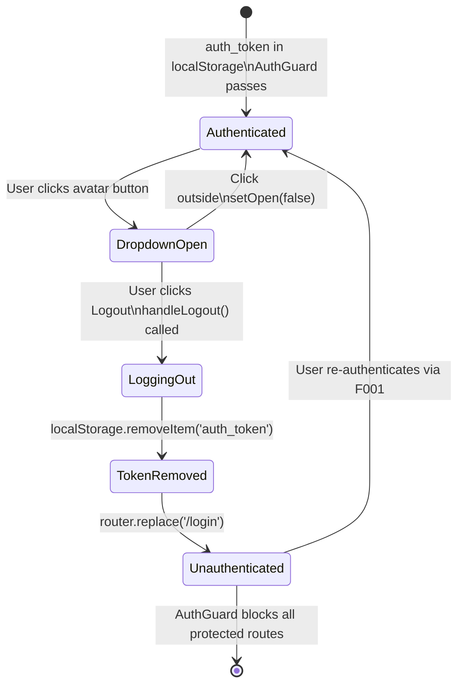

# Feature Specification: F004_Logout

**Priority**: P0
**Type**: ui
**Generated**: 2026-06-01

## Overview

F004_Logout is the client-side session termination flow triggered from the header dropdown available on every auth-required page. The user clicks "Logout" in `UserProfileDropdown`; `handleLogout()` calls `localStorage.removeItem('auth_token')`, closes the dropdown, and calls `router.replace('/login')`. No backend API call is made — the JWT is simply discarded client-side. Subsequent navigations to any protected route are blocked by `AuthGuard` (F003_FrontendAuthGuard / PERM003). The entire implementation is in `frontend/components/homepage/user-profile-dropdown.tsx:36-40`.

## Why This Exists

Users need a reliable way to terminate their session, particularly on shared devices. Without logout, the JWT persists in `localStorage` for its full 7-day lifetime with no server-side invalidation mechanism. Logout provides a deterministic client-side termination even though it does not invalidate the JWT on the backend.

## Who Uses It

- **Authenticated user** — clicks "Logout" in the header avatar dropdown from any auth-required page (PERM003_FrontendAuthGuard)

## Business Workflow

```
1. User clicks avatar button in SiteHeader → UserProfileDropdown opens (setOpen(true))
   (frontend/components/homepage/user-profile-dropdown.tsx:50-54)
2. User clicks "Logout" menu item → handleLogout() fires
   (frontend/components/homepage/user-profile-dropdown.tsx:36-40)
3. localStorage.removeItem('auth_token') — token deleted from browser storage
   (frontend/components/homepage/user-profile-dropdown.tsx:37)
4. setOpen(false) — dropdown closes
   (frontend/components/homepage/user-profile-dropdown.tsx:38)
5. router.replace('/login') — browser navigates to /login; current page removed from history
   (frontend/components/homepage/user-profile-dropdown.tsx:39)
6. AuthGuard on /login: PUBLIC_PATHS includes '/login' → setChecked(true) → LoginPage renders
7. Any future navigation to protected path: AuthGuard finds no auth_token → redirect to /login
```

## Screen Flow

**See:** ScreenFlow § F004_Logout

| Screen | Route | Purpose |
|--------|-------|---------|
| SCR001_HomePage | `/` | Logout available via header dropdown |
| SCR005_AwardsPage | `/awards` | Logout available via header dropdown |
| SCR006_CommunityStandardsPage | `/community-standards` | Logout available via header dropdown |
| SCR007_KudosPage | `/kudos` | Logout available via header dropdown |
| SCR009_ProfilePage | `/profile/:email` | Logout available via header dropdown |

## Cross-Cutting Logic

### Requirements

None.

### Business Rules

None.

### State Machines

None.

### Algorithms

None.

### External Integrations

None.

### Verification

None.

## User Stories

### US008_LogOut — Log Out (Priority: P0)

**What happens:** An authenticated user opens the header avatar dropdown and clicks "Logout." `handleLogout()` removes `auth_token` from `localStorage`, closes the dropdown, and redirects to `/login` via `router.replace`. No API call is made. From this point, the `AuthGuard` (F003) blocks all protected routes for this browser session until the user re-authenticates.
**Why this priority:** Session termination is a security baseline requirement; users on shared devices must be able to end their session reliably.
**Independent Test:** Log in, note that `/kudos` loads. Click Logout in the header dropdown. Verify: (1) `localStorage.getItem('auth_token')` is `null`, (2) current URL is `/login`, (3) navigating back to `/kudos` redirects to `/login`.

**Acceptance Scenarios:**

1. **Given** user is authenticated and on any auth-required page, **When** user opens the header dropdown and clicks "Logout", **Then** `localStorage.removeItem('auth_token')` is called, the dropdown closes, and `router.replace('/login')` navigates to `/login`.
2. **Given** user has just logged out (no `auth_token`), **When** user manually navigates to `/kudos`, **Then** `AuthGuard` redirects to `/login` (enforced by F003/PERM003).
3. **Given** user opens the dropdown, **When** user clicks outside the dropdown (not on Logout), **Then** the dropdown closes via the `mousedown` listener without triggering logout.

**Requirements fulfilled:**
- **FR-001** Remove `auth_token` from localStorage on logout — `UserProfileDropdown::handleLogout` via `localStorage.removeItem('auth_token')`
- **FR-002** Redirect to `/login` immediately after token removal — `UserProfileDropdown::handleLogout` via `router.replace('/login')`
- **FR-003** No API call on logout — client-side only; confirmed no `fetch`/`apiFetch` in `handleLogout`

**Rules enforced:**

### BR-001_NoServerSideInvalidation
**Source:** `frontend/components/homepage/user-profile-dropdown.tsx:36-40`
**Applies to:** Logout action
**Linked FR:** FR-001
**Rule:** Logout is purely client-side. The JWT issued by the backend is NOT invalidated on the server. A user who copies the JWT before clicking logout retains a valid token until the 7-day expiry (`JWT_EXPIRES_IN`). There is no token blocklist, revocation endpoint, or session store. This is a documented architectural trade-off (stateless API design).

**Pseudocode:**
```ts
const handleLogout = () => {
  localStorage.removeItem('auth_token');  // only client-side removal
  setOpen(false);
  router.replace('/login');
  // NO: await apiFetch('/auth/logout') — does not exist
  // NO: server-side token invalidation — JWT is stateless
};
```

### BR-002_DropdownClickOutsideClose
**Source:** `frontend/components/homepage/user-profile-dropdown.tsx:19-27`
**Applies to:** Dropdown open/close behavior
**Linked FR:** FR-003
**Rule:** A `mousedown` event listener on `document` closes the dropdown if the click target is outside `ref.current`. This is independent of logout — clicking outside merely closes the dropdown without any auth side-effect.

**Pseudocode:**
```ts
useEffect(() => {
  const handler = (e: MouseEvent) => {
    if (ref.current && !ref.current.contains(e.target as Node)) {
      setOpen(false);  // close only — no token removal
    }
  };
  document.addEventListener('mousedown', handler);
  return () => document.removeEventListener('mousedown', handler);
}, []);
```

**State transitions:**

### SM-001_LogoutSessionLifecycle
**Source:** `frontend/components/homepage/user-profile-dropdown.tsx:36-40`
**Linked FR:** FR-001
**States:** Authenticated, LoggingOut, Unauthenticated



**Transition rules:**
- `Authenticated → DropdownOpen`: guard = avatar button click; side effects = `setOpen(true)`
- `DropdownOpen → LoggingOut`: guard = "Logout" menu item click; side effects = `handleLogout()` invoked
- `LoggingOut → TokenRemoved`: guard = none; side effects = `localStorage.removeItem('auth_token')`, `setOpen(false)`
- `TokenRemoved → Unauthenticated`: guard = none; side effects = `router.replace('/login')`

**Algorithms:** None.

**External integrations:** None.

**Verification:**
- **SC-001** After clicking Logout, `localStorage.getItem('auth_token')` returns `null` (covers FR-001, BR-001)
- **SC-002** After logout, browser URL is `/login` and pressing the Back button does not return to the previously protected page (covers FR-002 — `replace` not `push`)
- **SC-003** No network requests are made during or after the logout action (covers FR-003, BR-001)
- **SC-004** Navigating to `/kudos` after logout redirects to `/login` (covers F003/PERM003 enforcement)

---

### Edge Cases

| Scenario | Behavior |
|----------|----------|
| User has multiple tabs open; logs out in one tab | `auth_token` removed from localStorage (shared across same-origin tabs). Other tabs: `AuthGuard` only re-checks on next navigation in that tab — until then, API calls from other tabs will 401 (backend rejects expired/absent token). No cross-tab logout event dispatched. |
| `router.replace('/login')` called while already on `/login` | No-op navigation; `AuthGuard` sees public path, renders login page normally. |
| `localStorage.removeItem` throws (storage blocked) | Extremely rare; `removeItem` generally does not throw. If it did, the `router.replace` on the next line would still execute — user navigates to `/login` but token may still be in storage. |
| JWT was already expired before logout | User clicks Logout on a session with an expired token; `removeItem` cleans up the expired token; behavior identical to normal logout. |
| User clicks Logout rapidly multiple times | `handleLogout` is synchronous; `router.replace` with the same target is idempotent. Dropdown is closed after first click so subsequent clicks are not possible without reopening. |

## Key Entities

| Entity | Table | Key Columns | Purpose |
|--------|-------|-------------|---------|
| (none — no DB interaction) | — | — | Logout is client-side only; no server session record to invalidate |

## Related Artifacts

- **Screens** (from ScreenList): SCR001_HomePage, SCR005_AwardsPage, SCR006_CommunityStandardsPage, SCR007_KudosPage, SCR009_ProfilePage
- **User Stories** (from UserStories): US008_LogOut
- **Routes** (from RouteList): none (client-side only)
- **Data Models** (from DataModel): none
- **Background Logic** (from BackgroundLogic): none
- **Permissions** (from Permissions): PERM003_FrontendAuthGuard (enforces post-logout protection)

## Spec Documents

- [x] [System Overview](../../system-overview.md) — stateless JWT design, localStorage storage decision
- [x] [Feature List](../../feature-list.md) — F004_Logout, US008_LogOut, SCR001/005/006/007/009, PERM003_FrontendAuthGuard
- [ ] [Route List](../../route-list.md) — no backend routes
- [ ] [Data Model](../../data-model.md) — no entities
- [x] [Screen List](../../screen-list.md) — SCR001, SCR005, SCR006, SCR007, SCR009
- [ ] [Screen Flow](../../screen-flow.md)
- [ ] [Background Logic](../../background-logic.md) — none
- [x] [Permissions](../../permissions.md) — PERM003_FrontendAuthGuard
- [x] [User Stories](../../user-stories.md) — US008_LogOut

## Assumptions

- `UserProfileDropdown` receives `user: JwtUser | null` as a prop decoded from the JWT in localStorage (by `SiteHeader` or similar parent). On logout, the `user` prop becomes stale but this is irrelevant because the component unmounts with the page on redirect.
- `router.replace('/login')` is used (not `router.push`) so the protected page that was being viewed does not remain in browser history — pressing Back from `/login` does not return to the pre-logout page.
- There is no server-side logout endpoint. The backend has no token blocklist. This is intentional per the system's stateless design (system-overview.md, Decision 4). A copied JWT remains valid until expiry.
- `SiteHeader` (which renders `UserProfileDropdown`) is present on all five auth-required page shells: SCR001 (F024), SCR005 (F027), SCR006 (F030), SCR007 (F034), SCR009 (F014). SCR008_KudosDetailModal is a modal overlay — it does not render its own SiteHeader, so logout from within the detail modal is not directly available (the parent page's header is still accessible if the modal is a route intercept).

## Source Code References

| Symbol | Path | Purpose |
|--------|------|---------|
| `UserProfileDropdown` | `frontend/components/homepage/user-profile-dropdown.tsx:1-120` | Full dropdown component: avatar button, Profile link, Logout button |
| `handleLogout` | `frontend/components/homepage/user-profile-dropdown.tsx:36-40` | Core logout logic: removeItem + setOpen(false) + router.replace |
| `AuthGuard` | `frontend/components/auth/auth-guard.tsx:13-19` | Post-logout enforcement: blocks protected routes when auth_token absent |

## Unresolved Questions

1. **No backend token invalidation**: The JWT remains valid on the server for up to 7 days after logout. If a token is stolen before logout, the attacker retains access. Is a server-side token blocklist or shorter JWT expiry warranted?
2. **Multi-tab logout**: Logging out in one tab does not close/redirect other open tabs. Should a `storage` event listener be added to `AuthGuard` to react to `auth_token` removal across tabs?
3. **SCR008 logout accessibility**: The Kudos Detail Modal at `/kudos/:id` is rendered as a parallel route intercept over the Kudos page. Is the SiteHeader (and thus the logout button) accessible while the modal is open?
