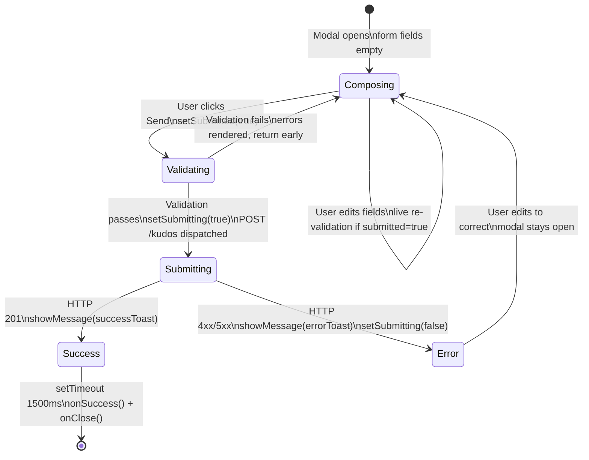

# Feature Specification: F005_SubmitKudos

**Priority**: P0
**Type**: ui
**Generated**: 2026-06-01

## Overview

F005_SubmitKudos covers the end-to-end kudos submission flow: the user completes all required fields in `WriteKudosModal` (recipient, title, rich-text message, ≥1 hashtag) and clicks "Send." The frontend validates, then POSTs `CreateKudosDto` to `POST /kudos` via `apiFetch`. On success, a toast fires, the modal closes, and the caller's `onSuccess` callback refreshes the feed. On error, the modal stays open with an error toast. The backend runs inside a DB transaction: upserts the sender `User`, ensures receiver `User` exists, validates S3 image key ownership (PERM004), persists `Kudos`, upserts `Hashtag` rows, creates `KudosHashtag` join rows, and returns a `KudosCardDto`. This feature spans `WriteKudosModal` (frontend) and `KudosController.create` / `KudosService.create` (backend).

## Why This Exists

Peer recognition is the core value proposition of Sun* Kudos. This feature is the primary write path — without it no kudos can be created and all feed/spotlight/profile features render empty.

## Who Uses It

- **Authenticated employee (sender)** — fills the modal and submits kudos to a colleague (PERM001_BackendJwtRouteGuard, PERM004_S3ImageKeyOwnership, PERM005_AnonymousSenderMasking)

## Business Workflow

```
1. User opens WriteKudosModal (via F010 trigger); form state initialised to empty
   (frontend/components/kudos/write-kudos-modal.tsx:36-46)
2. User fills: recipient (UserSearchResult), title (≤200 chars), Tiptap HTML message (≤5000 chars),
   ≥1 hashtag, optional images (keys already uploaded via F011 POST /kudos/images),
   optional isAnonymous + senderAlias
3. Send button disabled until: recipient !== null AND title.trim() !== '' AND
   editor.getText().trim() !== '' AND hashtags.length > 0
   (frontend/components/kudos/write-kudos-modal.tsx:148-149)
4. User clicks Send → handleSubmit() fires:
   a. setSubmitted(true) → triggers live re-validation
   b. runValidation() called → if invalid, errors rendered, return early (no API call)
   c. If valid: setSubmitting(true); build CreateKudosDto; call apiFetch('/kudos', {method:'POST'})
   (frontend/components/kudos/write-kudos-modal.tsx:109-139)
5. apiFetch reads auth_token from localStorage → sets Authorization: Bearer <token>
   (frontend/lib/api.ts:3-13)
6. Backend: KudosController.create() receives validated CreateKudosDto + req.user (JwtUser)
   (backend/src/kudos/kudos.controller.ts:98-102)
7. KudosService.create() opens DB transaction:
   a. Upsert sender User row (email, firstName, lastName, picture) on conflict email
   b. Find or create receiver User row (minimal: email, firstName from email prefix, stars=0)
   c. Validate imageKeys ownership: each key must start with kudos-images/{user.email}/
      → throws BadRequestException if any key fails (HTTP 400)
   d. INSERT kudos row: senderEmail, receiverEmail, title (trimmed/nulled), message (HTML),
      likeCount=0, isAnonymous, senderAlias (null if not anonymous), imageKeys (null if empty)
   e. For each hashtag name: UPSERT hashtag on conflict name; upsert kudos_hashtag join row
   f. Reload kudos with sender+receiver relations; call toCard() → KudosCardDto
   (backend/src/kudos/kudos.service.ts:380-451)
8. On 201 success: frontend shows success toast (3s), then calls onSuccess() + onClose()
   (frontend/components/kudos/write-kudos-modal.tsx:133-134)
9. On error: catch block calls showMessage(errorToast); setSubmitting(false); modal stays open
   (frontend/components/kudos/write-kudos-modal.tsx:135-138)
```

## Screen Flow

**See:** ScreenFlow § F005_SubmitKudos

| Screen | Route | Purpose |
|--------|-------|---------|
| SCR007_KudosPage/REG003_AllKudosFeed | `/kudos` | Modal trigger surface; feed refreshes on success |

## Cross-Cutting Logic

### Requirements

| Code | Description | Endpoint/Handler | Verifiable |
|------|-------------|------------------|------------|
| FR-001 | Send button disabled until all required fields satisfied (recipient, title, message, ≥1 hashtag) | client-only via `WriteKudosModal` computed `isSubmitDisabled` | yes |
| FR-002 | Show inline field errors on first submit attempt with invalid form | client-only via `runValidation` + `errors` state | yes |

### Business Rules

None in cross-cutting (all rules are under US027 which is the sole US).

### State Machines

None in cross-cutting.

### Algorithms

None in cross-cutting.

### External Integrations

None in cross-cutting.

### Verification

- **SC-001** — FR-001: Send button has `disabled` attribute when any required field is empty (covers FR-001)
- **SC-002** — FR-002: Clicking Send with no recipient renders error text under the recipient field without making a network request (covers FR-002)

## User Stories

### US027_SubmitKudos — Submit Kudos (Priority: P0)

**What happens:** An authenticated employee fills all required fields in WriteKudosModal (recipient, title, rich-text message, ≥1 hashtag) and clicks Send. The frontend validates synchronously; if valid, calls `POST /kudos` with `CreateKudosDto`. The backend runs a DB transaction creating/updating `user`, `kudos`, `hashtag`, and `kudos_hashtag` rows, validates S3 key ownership (PERM004), and returns a `KudosCardDto`. On success the modal closes and the kudos feed refreshes. On error the modal stays open with an error toast.
**Why this priority:** Core write path — the platform's primary purpose. No kudos = no value.
**Independent Test:** Log in, open WriteKudosModal, fill all required fields (any existing user as recipient, any title, any message, select one hashtag), click Send. Verify: (1) POST /kudos called with correct payload, (2) success toast appears, (3) modal closes, (4) new card appears in the All Kudos Feed.

**Acceptance Scenarios:**

1. **Given** all required fields are valid, **When** user clicks Send, **Then** `POST /kudos` is called with `{receiverEmail, title, message (HTML), hashtags[], isAnonymous, imageKeys?}`; on 201 response, success toast shown, modal closes, `onSuccess()` called.
2. **Given** recipient field is empty, **When** user clicks Send, **Then** `runValidation()` returns false; error message rendered under recipient field; no API call made; `submitting` stays false.
3. **Given** title field is empty, **When** user clicks Send, **Then** error message rendered under title field; no API call made.
4. **Given** no hashtag selected, **When** user clicks Send, **Then** hashtag error rendered; no API call made.
5. **Given** message editor is empty (no text content), **When** user clicks Send, **Then** content error rendered; no API call made.
6. **Given** API returns 5xx, **When** response received, **Then** error toast shown; modal stays open; `submitting` set back to false.
7. **Given** `imageKeys` contains a key not prefixed with `kudos-images/{senderEmail}/`, **When** `POST /kudos` processed by backend, **Then** `BadRequestException('One or more image keys do not belong to the current user')` → HTTP 400; frontend catch block shows error toast.
8. **Given** `isAnonymous=true` and `senderAlias` provided, **When** kudos stored, **Then** `kudos.isAnonymous=true`, `kudos.senderAlias=<alias>` in DB; `toCard()` returns sender with masked name/email/picture.

**Requirements fulfilled:**
- **FR-003** POST /kudos with complete `CreateKudosDto` payload — `POST /kudos` via `KudosController::create`
- **FR-004** Backend upserts sender User record on every kudos creation — `KudosService::create` transaction (line 383–392)
- **FR-005** Backend creates receiver User record if not present (minimal record) — `KudosService::create` (line 394–406)
- **FR-006** Hashtags upserted atomically; `kudos_hashtag` join rows created — `KudosService::create` (line 432–439)
- **FR-007** Response is `KudosCardDto` with presigned S3 URLs for images — `KudosService::toCard` (line 62–98)
- **FR-001** (cross-cutting) — Send button disabled until form valid
- **FR-002** (cross-cutting) — Inline errors on first invalid submit

**Rules enforced:**

### BR-001_RequiredFieldValidation
**Source:** `frontend/components/kudos/write-kudos-modal.tsx:84-99`
**Applies to:** `handleSubmit()` → `runValidation()` call
**Linked FR:** FR-001
**Rule:** Four fields are required client-side. Missing any one prevents API call. Error messages use i18n keys `t.writeKudosRequiredField` (recipient/title/content) and `t.writeKudosHashtagRequired` (hashtags). Validation state is re-run live after first submit attempt (`submitted=true`) on every change to recipient, title, or hashtags.

**Pseudocode:**
```ts
function runValidation(r, titleVal, ht, contentText): boolean {
  const next: FormErrors = {};
  if (!r) next.recipient = t.writeKudosRequiredField;
  if (!titleVal.trim()) next.title = t.writeKudosRequiredField;
  if (!contentText) next.content = t.writeKudosRequiredField;
  if (ht.length === 0) next.hashtags = t.writeKudosHashtagRequired;
  setErrors(next);
  return Object.keys(next).length === 0;
}
```

### BR-002_SendButtonDisabledState
**Source:** `frontend/components/kudos/write-kudos-modal.tsx:148-149`
**Applies to:** Send button `disabled` attribute
**Linked FR:** FR-001
**Rule:** Send button is disabled if ANY of: `submitting`, `!recipient`, `!title.trim()`, `!getContentText()`, `hashtags.length === 0`. This is a computed value — live, not triggered by submit. Provides immediate UX feedback without requiring a submit attempt.

**Pseudocode:**
```ts
const isSubmitDisabled =
  submitting ||
  !recipient ||
  !title.trim() ||
  !getContentText() ||       // editor.getText().trim() === ''
  hashtags.length === 0;
```

### BR-003_DtoFieldMapping
**Source:** `frontend/components/kudos/write-kudos-modal.tsx:121-129`
**Applies to:** `CreateKudosDto` construction before `apiFetch`
**Linked FR:** FR-003
**Rule:** `message` is set to `editor.getHTML()` (Tiptap HTML output), NOT `editor.getText()`. `title` is trimmed. `imageKeys` is only included if there are successfully uploaded images (`remoteKey !== null && !img.error`). `senderAlias` is only included when `isAnonymous=true` AND the alias input has non-empty trimmed content.

**Pseudocode:**
```ts
const dto: CreateKudosDto = {
  receiverEmail: recipient!.email,
  title: title.trim(),
  message: editor?.getHTML() ?? '',  // HTML, not plaintext
  hashtags: hashtags.map((h) => h.name),
  imageKeys: imageKeys.length ? imageKeys : undefined,
  isAnonymous,
  senderAlias: isAnonymous && senderAlias.trim() ? senderAlias.trim() : undefined,
};
```

### BR-004_BackendDtoValidation
**Source:** `backend/src/kudos/dto/create-kudos.dto.ts:1-52`
**Applies to:** `POST /kudos` request body via global `ValidationPipe({ whitelist: true, transform: true })`
**Linked FR:** FR-003
**Rule:** Backend DTO constraints: `receiverEmail` must be valid email format (`@IsEmail`); `title` optional but ≤200 chars; `message` required string ≤5000 chars; `hashtags` required string array; `isAnonymous` optional boolean (transformed from string `'true'`); `senderAlias` optional ≤100 chars; `imageKeys` optional array, max 5 items, each ≤300 chars. Violations → HTTP 400 from `ValidationPipe` before controller is reached.

**Pseudocode:**
```ts
// DTO constraints (class-validator):
@IsEmail() receiverEmail: string
@IsOptional() @MaxLength(200) title?: string
@IsString() @MaxLength(5000) message: string
@IsArray() @IsString({each:true}) hashtags: string[]
@IsOptional() @IsBoolean() isAnonymous?: boolean
@IsOptional() @MaxLength(100) senderAlias?: string
@IsOptional() @IsArray() @ArrayMaxSize(5) @MaxLength(300,{each:true}) imageKeys?: string[]
```

### BR-005_S3KeyOwnershipCheck
**Source:** `backend/src/kudos/kudos.service.ts:408-417`
**Applies to:** `KudosService.create()` transaction, imageKeys validation step
**Linked FR:** FR-003
**Rule:** Every key in `dto.imageKeys` must start with `kudos-images/{user.email}/`. Keys violating this prefix → `BadRequestException('One or more image keys do not belong to the current user')` → HTTP 400. This prevents users from attaching images uploaded by other users.

**Pseudocode:**
```ts
if (dto.imageKeys?.length) {
  const prefix = `kudos-images/${user.email}/`;
  const invalid = dto.imageKeys.filter((k) => !k.startsWith(prefix));
  if (invalid.length) {
    throw new BadRequestException(
      'One or more image keys do not belong to the current user'
    );
  }
}
```

### BR-006_ReceiverUserAutoCreate
**Source:** `backend/src/kudos/kudos.service.ts:394-406`
**Applies to:** `KudosService.create()` transaction
**Linked FR:** FR-005
**Rule:** If the receiver's email does not exist in the `user` table, a minimal User record is auto-created: `firstName` = email prefix (before `@`), `lastName = ''`, `department = ''`, `stars = 0`. This allows kudos to be sent to any email address, even users who have never logged in. The record will be enriched when the user logs in (upsert on auth callback — actually on their first kudos creation per BR assumption).

**Pseudocode:**
```ts
const existing = await em.findOne(User, { where: { email: dto.receiverEmail } });
if (!existing) {
  await em.save(User, {
    email: dto.receiverEmail,
    firstName: dto.receiverEmail.split('@')[0],
    lastName: '',
    department: '',
    stars: 0,
  });
}
```

### BR-007_HashtagUpsertAtomic
**Source:** `backend/src/kudos/kudos.service.ts:431-439`
**Applies to:** `KudosService.create()` transaction — hashtag persistence
**Linked FR:** FR-006
**Rule:** For each hashtag name, `em.upsert(Hashtag, {name}, ['name'])` ensures the hashtag exists without error on duplicate. Then `em.upsert(KudosHashtag, {kudosId, hashtagId}, ['kudosId','hashtagId'])` creates the join row. Both upserts run within the same transaction, preventing orphaned join rows on partial failure. Hashtag names are passed as-is from the DTO — no normalisation (lowercase/trim) is applied server-side.

**Pseudocode:**
```ts
for (const name of dto.hashtags) {
  await em.upsert(Hashtag, { name }, ['name']);
  const tag = await em.findOneOrFail(Hashtag, { where: { name } });
  await em.upsert(KudosHashtag, { kudosId: kudos.id, hashtagId: tag.id },
    ['kudosId', 'hashtagId']);
}
```

### BR-008_TitleNullCoercion
**Source:** `backend/src/kudos/kudos.service.ts:423`
**Applies to:** `kudos.title` column on INSERT
**Linked FR:** FR-003
**Rule:** `title` is stored as `null` if the DTO value is falsy or whitespace-only (`dto.title?.trim() ? dto.title.trim() : null`). Frontend always sends a trimmed non-empty title (BR-001 requires it), so this null coercion is a backend safety net only.

**Pseudocode:**
```ts
title: dto.title?.trim() ? dto.title.trim() : null,
```

**State transitions:**

### SM-001_SubmissionLifecycle
**Source:** `frontend/components/kudos/write-kudos-modal.tsx:109-139`
**Linked FR:** FR-003
**States:** Composing, Validating, Submitting, Success, Error



**Transition rules:**
- `Composing → Validating`: guard = Send button clicked; side effects = `setSubmitted(true)`, `runValidation()` called
- `Validating → Composing`: guard = `runValidation()` returns `false`; side effects = `errors` state updated
- `Validating → Submitting`: guard = `runValidation()` returns `true`; side effects = `setSubmitting(true)`, `apiFetch('/kudos', POST)` dispatched
- `Submitting → Success`: guard = response `res.ok`; side effects = `showMessage(successToast)`, 1500ms timeout then `onSuccess()` + `onClose()`
- `Submitting → Error`: guard = `res.ok === false` or network error; side effects = `showMessage(errorToast)`, `setSubmitting(false)`

**Algorithms:**

### ALG-001_ImageKeyFilter
**Source:** `frontend/components/kudos/write-kudos-modal.tsx:117-119`
**Linked FR:** FR-003
**Input:** `images: UploadedImage[]` — array of objects with `remoteKey: string | null` and `error: boolean`
**Output:** `imageKeys: string[]` — only successfully uploaded keys
**Complexity:** O(n) — single filter pass
**Description:** Before building the DTO, filters the in-memory image list to exclude failed uploads (`img.error === true`) and pending/not-yet-uploaded images (`img.remoteKey === null`). Only images with a non-null `remoteKey` and no error flag are included. This ensures the backend only receives keys for images that are confirmed in S3.

**Pseudocode:**
```ts
const imageKeys = images
  .filter((img) => img.remoteKey !== null && !img.error)
  .map((img) => img.remoteKey as string);
// imageKeys: string[] of confirmed S3 keys owned by current user
```

**External integrations:**

### INT-001_KudosPostApi
**Source:** `frontend/components/kudos/write-kudos-modal.tsx:131`
**Linked FR:** FR-003
**Type:** api-call
**Target:** `POST ${NEXT_PUBLIC_BACKEND_URL}/kudos`
**Trigger:** `handleSubmit()` after `runValidation()` passes
**Payload:** `CreateKudosDto` JSON body — `{receiverEmail, title, message, hashtags, imageKeys?, isAnonymous, senderAlias?}`; `Authorization: Bearer <auth_token>` header; `Content-Type: application/json`
**Failure handling:** `apiFetch` throws on `!res.ok` (`throw new Error('API error ${res.status}')`); caught by `try/catch` in `handleSubmit`; error toast shown; modal stays open; `setSubmitting(false)` resets button. No retry logic.

**Pseudocode:**
```ts
await apiFetch('/kudos', {
  method: 'POST',
  body: JSON.stringify(dto),
  // headers: Content-Type + Authorization added by apiFetch internally
});
// throws on !res.ok; caught by handleSubmit catch block
```

**Verification:**
- **SC-003** POST /kudos with valid payload returns HTTP 201 and response body matching `KudosCardDto` shape (covers FR-003, FR-007)
- **SC-004** DB contains new row in `kudos` table with correct `senderEmail`, `receiverEmail`, `title`, `message`, `likeCount=0` (covers FR-003, FR-004)
- **SC-005** DB contains rows in `hashtag` and `kudos_hashtag` for each submitted hashtag (covers FR-006, BR-007)
- **SC-006** Submitting with `imageKeys` from another user returns HTTP 400 `'One or more image keys do not belong to the current user'` (covers BR-005, PERM004)
- **SC-007** Send button shows spinner and is non-interactive during in-flight request (covers BR-002, SM-001 Submitting state)
- **SC-008** `POST /kudos` with `receiverEmail = 'nonexistent@sun-asterisk.com'` creates a minimal User row and succeeds (covers BR-006)

---

### Edge Cases

| Scenario | Behavior |
|----------|----------|
| `receiverEmail` not found in `user` table | BR-006 fires: minimal User auto-created; kudos saved normally; HTTP 201 |
| `message` exceeds 5000 chars (backend DTO) | `ValidationPipe` rejects; HTTP 400 with validation error array before `KudosService` is called |
| `hashtags` array is empty (bypass frontend) | Backend DTO: `@IsArray() hashtags: string[]` passes with empty array (no `@ArrayMinSize`); service's `for` loop runs zero iterations; kudos saved with no hashtag joins — **no server-side minimum hashtag enforcement** |
| `isAnonymous=true` but no `senderAlias` | `senderAlias` stored as `null`; `toCard()` falls back to `'Ẩn danh'` for sender name |
| Transaction fails mid-way (e.g. DB constraint on hashtag upsert) | TypeORM rolls back entire transaction; kudos row NOT committed; `NotFoundException('Created kudos not found')` or DB error propagates → HTTP 500 |
| Network timeout during POST /kudos | `apiFetch` fetch throws `TypeError: Failed to fetch`; catch block shows error toast; `setSubmitting(false)`; modal stays open |
| `auth_token` expires between modal open and send | Backend `JwtAuthGuard` rejects; HTTP 401; `apiFetch` throws; error toast shown. Frontend does not detect 401 specifically — generic error toast only |
| Concurrent submission (double-click bypassing disabled state) | `submitting=true` after first click sets `isSubmitDisabled=true`; button disabled for second click. Race possible only if `submitting` state hasn't flushed yet (React batching) — edge case, but second POST would simply create a duplicate kudos |

## Key Entities

| Entity | Table | Key Columns | Purpose |
|--------|-------|-------------|---------|
| Kudos | `kudos` | `id` (PK uuid), `senderEmail` (FK), `receiverEmail` (FK), `title`, `message`, `likeCount=0`, `isAnonymous`, `senderAlias`, `imageKeys` | Primary record created by this feature |
| User (sender) | `user` | `email` (PK), `firstName`, `lastName`, `picture` | Upserted on every kudos creation — keeps profile current |
| User (receiver) | `user` | `email` (PK), `firstName`, `stars=0` | Auto-created if not present (minimal record) |
| Hashtag | `hashtag` | `id` (PK), `name` (UNIQUE) | Upserted per hashtag name submitted |
| KudosHashtag | `kudos_hashtag` | `kudosId` (PK composite), `hashtagId` (PK composite) | M2M join row created per hashtag |

## Related Artifacts

- **Screens** (from ScreenList): SCR007_KudosPage/REG003_AllKudosFeed
- **User Stories** (from UserStories): US027_SubmitKudos
- **Routes** (from RouteList): POST /kudos
- **Data Models** (from DataModel): MODEL001 — User, MODEL002 — Kudos, MODEL004 — Hashtag, MODEL005 — KudosHashtag
- **Background Logic** (from BackgroundLogic): none
- **Permissions** (from Permissions): PERM001_BackendJwtRouteGuard, PERM004_S3ImageKeyOwnership, PERM005_AnonymousSenderMasking

## Spec Documents

- [x] [System Overview](../../system-overview.md) — kudos creation flow diagram, DB design decisions
- [x] [Feature List](../../feature-list.md) — F005_SubmitKudos, US027_SubmitKudos, SCR007/REG003, MODEL001/002/004/005, PERM001/004/005
- [x] [Route List](../../route-list.md) — POST /kudos
- [x] [Data Model](../../data-model.md) — MODEL001 (User), MODEL002 (Kudos), MODEL004 (Hashtag), MODEL005 (KudosHashtag)
- [x] [Screen List](../../screen-list.md) — SCR007_KudosPage/REG003_AllKudosFeed
- [ ] [Screen Flow](../../screen-flow.md)
- [ ] [Background Logic](../../background-logic.md) — none
- [x] [Permissions](../../permissions.md) — PERM001_BackendJwtRouteGuard, PERM004_S3ImageKeyOwnership, PERM005_AnonymousSenderMasking
- [x] [User Stories](../../user-stories.md) — US027_SubmitKudos

## Assumptions

- Frontend validation requires ≥1 hashtag (client-side: `hashtags.length === 0` triggers error). However the backend DTO has no `@ArrayMinSize(1)` on `hashtags` — an API call bypassing the frontend could submit kudos with zero hashtags and it would succeed. Recommend adding `@ArrayMinSize(1)` to `CreateKudosDto`.
- Hashtag names are NOT normalised (lowercased/trimmed) on the backend. Case variants like `#teamwork` and `#Teamwork` would create two distinct `hashtag` rows. Client-side normalisation (if any) is not visible in the reviewed code — this was not confirmed.
- The `onSuccess` callback passed to `WriteKudosModal` is responsible for refreshing the kudos feed. F005 itself does not directly trigger a feed refresh — the contract is caller-defined.
- `editor.getHTML()` is sent as `message`. Tiptap outputs valid HTML; the backend stores it as-is. Consumers sanitize via `lib/sanitize-html.ts` before rendering. No sanitization occurs at write time.
- The `toCard()` function calls `s3.getPresignedUrl(key)` for each image key on every read. This means presigned URLs in the create response are short-lived. No TTL value was found in `S3Service` — presigned URL expiry is assumed to be AWS default (1 hour) unless `S3Service` overrides it.

## Source Code References

| Symbol | Path | Purpose |
|--------|------|---------|
| `WriteKudosModal` | `frontend/components/kudos/write-kudos-modal.tsx:32-140` | Form state, validation, DTO build, apiFetch call, toast/close logic |
| `handleSubmit` | `frontend/components/kudos/write-kudos-modal.tsx:109-140` | Core submit handler |
| `runValidation` | `frontend/components/kudos/write-kudos-modal.tsx:84-99` | Synchronous field validation; returns boolean |
| `apiFetch` | `frontend/lib/api.ts:3-19` | HTTP helper: attaches Bearer token, throws on !res.ok |
| `KudosController.create` | `backend/src/kudos/kudos.controller.ts:98-102` | Route handler: receives DTO + JwtUser, delegates to service |
| `KudosService.create` | `backend/src/kudos/kudos.service.ts:380-451` | DB transaction: upsert user, validate keys, insert kudos/hashtags |
| `CreateKudosDto` | `backend/src/kudos/dto/create-kudos.dto.ts:1-52` | DTO with class-validator constraints |
| `KudosService.toCard` | `backend/src/kudos/kudos.service.ts:62-98` | Maps Kudos entity → KudosCardDto with anonymous masking + presigned URLs |

## Unresolved Questions

1. **No `@ArrayMinSize(1)` on `hashtags` in DTO**: The backend accepts an empty `hashtags` array. Frontend prevents this, but a direct API call can submit kudos with zero hashtags. Is this intentional?
2. **Hashtag name normalisation**: Are hashtag names expected to be case-insensitive? Currently `#Teamwork` and `#teamwork` are distinct rows. If the frontend enforces lowercase display but sends mixed-case values, duplicates could proliferate in the `hashtag` table.
3. **Presigned URL expiry in `toCard()`**: `S3Service.getPresignedUrl(key)` is called synchronously inside the transaction response. The presigned URL TTL was not found in `S3Service` source — confirm expiry duration and whether the create response URL can be cached by the client.
4. **`kudos.stars` field**: The `user` table has a `stars` integer column (default 0). No code in F005 increments it. Is star accumulation a future feature or already implemented elsewhere?
5. **`likedByMe: false` on create response**: `toCard()` is called with `likedByMe=false` hardcoded (line 449). The creator cannot like their own freshly created kudos via the response DTO, but no backend rule prevents self-liking via `POST /kudos/:id/like` after creation.
