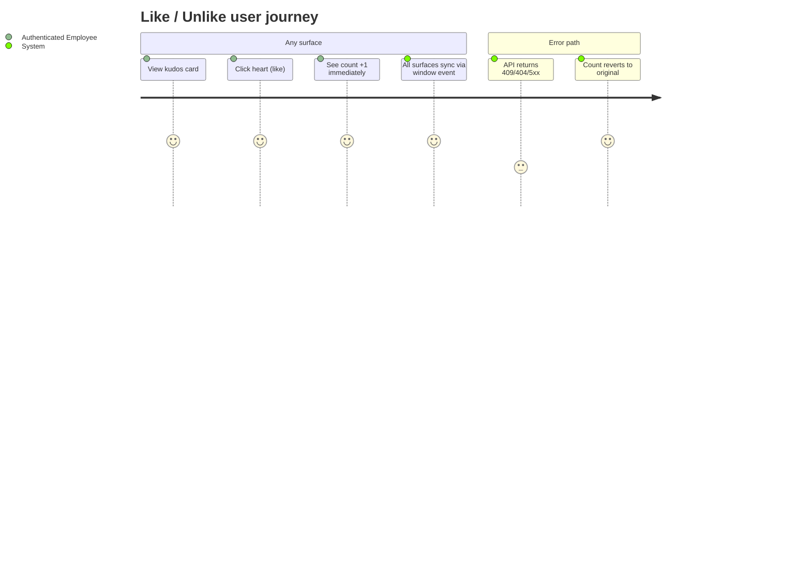
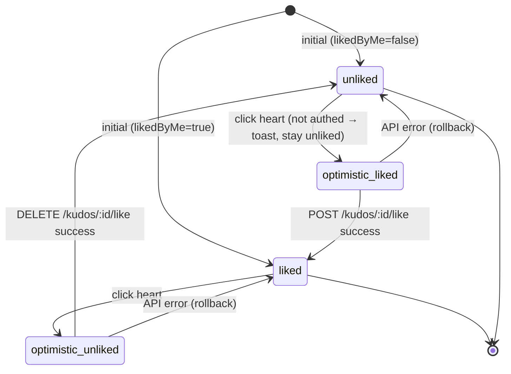

# Feature Specification: F006_LikeUnlike

**Priority**: P0
**Type**: ui
**Generated**: 2026-06-01

## Overview

Authenticated users toggle a like/heart on any kudos card across four surfaces: highlight carousel (REG001), all-kudos feed (REG003), kudos detail modal (SCR008), and profile feed (SCR009/REG003). Optimistic UI update fires immediately; `kudos:liked` window event propagates the change to all surfaces. Backend enforces uniqueness via a `Like` entity and increments/decrements the denormalized `kudos.likeCount` counter inside a transaction. 409/404 API errors trigger an in-place rollback.

## Why This Exists

Enables social validation of peer recognition — likes signal community endorsement and drive the Highlight feed ranking (`kudos.likeCount` DESC). Without likes, the highlight carousel would default to arbitrary ordering.

## Who Uses It

- **Authenticated employee** — toggles like/unlike on any kudos card from any surface (PERM001_BackendJwtRouteGuard, PERM006_LikeUniquenessConstraint)

## Business Workflow

```
1. User clicks heart on a KudosCard → optimistic update: likedByMe flips, likeCount ±1 locally.
2. window.dispatchEvent(kudos:liked CustomEvent {id, likedByMe, likeCount}) → all surfaces update in-place.
3. Frontend calls POST /kudos/:id/like (like) or DELETE /kudos/:id/like (unlike) via apiFetch.
4. KudosController.like/unlike → KudosService.like/unlike: query kudos entity, check Like existence.
5. If guard fails (409 already-liked or 404 not-liked), API returns error → rollback: emitLikeChange(original likedByMe, original likeCount).
6. On success: dataSource.transaction saves/deletes Like row, increments/decrements kudos.likeCount in kudos table.
```

## Screen Flow

**See:** ScreenFlow § F006_LikeUnlike

| Screen | Route | Purpose |
|--------|-------|---------|
| SCR007_KudosPage/REG001_HighlightSection | `/kudos` | Like from highlight carousel card |
| SCR007_KudosPage/REG003_AllKudosFeed | `/kudos` | Like from all-kudos feed card |
| SCR008_KudosDetailModal | `/kudos/:id` | Like from full-detail modal overlay |
| SCR009_ProfilePage/REG003_ProfileKudosList | `/profile/:email` | Like from profile kudos list card |



## Cross-Cutting Logic

### Requirements

| Code | Description | Endpoint/Handler | Verifiable |
|------|-------------|------------------|------------|
| FR-001 | Toggle like on a kudos card from any of 4 surfaces with optimistic update | POST /kudos/:id/like or DELETE /kudos/:id/like via KudosController@like/unlike | yes |
| FR-002 | Emit `kudos:liked` CustomEvent on window so all card instances on page update in-place | N/A (client-side event) via KudosPostCard, HighlightKudosCard | yes |
| FR-003 | Roll back optimistic state on API error | N/A (client catch block) via KudosPostCard:67-69, HighlightKudosCard:62-64 | yes |

### Business Rules

### BR-001_LikeUniquenessGuard
**Source:** `backend/src/kudos/kudos.service.ts:453-466`
**Applies to:** POST /kudos/:id/like
**Linked FR:** FR-001
**Rule:** Before inserting a Like row, service checks for an existing Like with the same `{kudosId, userEmail}` pair. If found → ConflictException('Already liked') → HTTP 409. Kudos existence checked first → NotFoundException if not found → HTTP 404.

**Pseudocode:**
```ts
async like(kudosId, userEmail) {
  const kudos = await kudosRepo.findOne({ where: { id: kudosId } });
  if (!kudos) throw NotFoundException(`Kudos ${kudosId} not found`);
  const existing = await likeRepo.findOne({ where: { kudosId, userEmail } });
  if (existing) throw ConflictException('Already liked');
  await transaction(em => {
    em.save(Like, { kudosId, userEmail });
    em.increment(Kudos, { id: kudosId }, 'likeCount', 1);
  });
}
```

### BR-002_UnlikeExistenceGuard
**Source:** `backend/src/kudos/kudos.service.ts:468-481`
**Applies to:** DELETE /kudos/:id/like
**Linked FR:** FR-001
**Rule:** Unlike requires an existing Like record. If none found → NotFoundException('Not liked') → HTTP 404. On success, atomically deletes Like row and decrements kudos.likeCount.

**Pseudocode:**
```ts
async unlike(kudosId, userEmail) {
  const kudos = await kudosRepo.findOne({ where: { id: kudosId } });
  if (!kudos) throw NotFoundException(`Kudos ${kudosId} not found`);
  const existing = await likeRepo.findOne({ where: { kudosId, userEmail } });
  if (!existing) throw NotFoundException('Not liked');
  await transaction(em => {
    em.delete(Like, { kudosId, userEmail });
    em.decrement(Kudos, { id: kudosId }, 'likeCount', 1);
  });
}
```

### BR-003_AuthRequiredForLike
**Source:** `backend/src/kudos/kudos.controller.ts:141-151`
**Applies to:** POST/DELETE /kudos/:id/like
**Linked FR:** FR-001
**Rule:** Both like and unlike routes carry `@UseGuards(JwtAuthGuard)`. Missing/invalid/expired token → 401 Unauthorized before reaching service logic.

**Pseudocode:**
```ts
@UseGuards(JwtAuthGuard)
@Post(':id/like')
like(@Param('id') id, @Request() req) {
  return this.kudosService.like(id, req.user.email);
}
```

### State Machines

### SM-001_LikeToggleLifecycle
**Source:** `frontend/components/kudos/kudos-post-card.tsx:58-69`
**Linked FR:** FR-001
**States:** unliked, liked, optimistic-liked, optimistic-unliked, error-rollback



**Transition rules:**
- `unliked → optimistic_liked`: guard = isAuthed; side effects = dispatch `kudos:liked` event, call POST
- `liked → optimistic_unliked`: guard = isAuthed; side effects = dispatch `kudos:liked` event, call DELETE
- `optimistic_* → error-rollback → original`: guard = catch block fires; side effects = emitLikeChange(originalLiked, originalCount)

### Algorithms

None.

### External Integrations

None.

### Verification

- **SC-001** POST /kudos/:id/like returns 201/204; Like row in `like` table; kudos.likeCount incremented by 1 (covers FR-001, BR-001)
- **SC-002** Re-liking same kudos returns 409; likeCount unchanged (covers BR-001)
- **SC-003** DELETE /kudos/:id/like returns 200/204; Like row deleted; kudos.likeCount decremented by 1 (covers BR-002)
- **SC-004** On API error, card reverts to original likedByMe/likeCount values (covers FR-003, SM-001)
- **SC-005** `kudos:liked` event dispatched with correct id/likedByMe/likeCount on toggle (covers FR-002)

## User Stories

### US017_LikeKudosFromHighlight — Like or Unlike a Kudos from Highlight (Priority: P0)

**What happens:** Authenticated user clicks the heart on a highlight carousel card; count updates optimistically; if no prior like, POST is called and committed. If already liked, clicking again triggers DELETE and decrements count.
**Why this priority:** Likes are the ranking signal for highlight section ordering — core to the product value proposition.
**Independent Test:** Navigate to /kudos, click heart on first highlight card → count +1; click again → count -1.

**Acceptance Scenarios:**

1. **Given** authenticated user on /kudos with `likedByMe=false` on highlight card, **When** clicks heart, **Then** heart fills, count increments +1, POST /kudos/:id/like called, `kudos:liked` event dispatched.
2. **Given** authenticated user on /kudos with `likedByMe=true` on highlight card, **When** clicks heart, **Then** heart unfills, count decrements -1, DELETE /kudos/:id/like called.
3. **Given** API returns 409 (already liked), **When** click fires, **Then** optimistic state reverts to original values.

**Requirements fulfilled:**
- **FR-001** Toggle like on kudos from highlight surface — `POST/DELETE /kudos/:id/like` via `KudosController@like/unlike`
- **FR-002** Dispatch `kudos:liked` window event — client-side via `HighlightKudosCard::emitLikeChange`
- **FR-003** Roll back on API error — client-side via `HighlightKudosCard:62-64`

**Rules enforced:**

BR-001_LikeUniquenessGuard (see Cross-Cutting Logic)
BR-002_UnlikeExistenceGuard (see Cross-Cutting Logic)
BR-003_AuthRequiredForLike (see Cross-Cutting Logic)

**State transitions:** SM-001_LikeToggleLifecycle (see Cross-Cutting Logic)

**Verification:**
- **SC-006** Highlight carousel card heart fills on click; count +1 displayed (covers FR-001, SM-001)
- **SC-007** `kudos:liked` event causes all-kudos feed card for same kudos to update count (covers FR-002)

---

### US029_LikeKudosFromFeed — Like or Unlike a Kudos from All Kudos Feed (Priority: P0)

**What happens:** Same toggle mechanic as US017 but on KudosPostCard in REG003_AllKudosFeed. The card reads likedByMe/likeCount from props; emits `kudos:liked` event which propagates to highlight carousel and detail modal if the same kudos is visible there.
**Why this priority:** All-kudos feed is the primary browsing surface — like action must work here.
**Independent Test:** On /kudos feed, like a card → count +1; check highlight carousel updates if same kudos appears.

**Acceptance Scenarios:**

1. **Given** authenticated user on /kudos feed, `likedByMe=false`, **When** clicks heart on feed card, **Then** count +1, POST called, `kudos:liked` dispatched.
2. **Given** `kudos:liked` event dispatched from feed card, **When** highlight carousel contains same kudos id, **Then** highlight card also shows updated count/state.

**Requirements fulfilled:**
- **FR-001** Toggle like on kudos from feed surface — `POST/DELETE /kudos/:id/like` via `KudosController@like/unlike`
- **FR-002** Dispatch `kudos:liked` window event — via `KudosPostCard::emitLikeChange` (kudos-post-card.tsx:49-55)
- **FR-003** Roll back on API error — via `KudosPostCard:66-69`

**Rules enforced:** BR-001_LikeUniquenessGuard (see Cross-Cutting Logic), BR-003_AuthRequiredForLike (see Cross-Cutting Logic)

**State transitions:** SM-001_LikeToggleLifecycle (see Cross-Cutting Logic)

**Verification:**
- **SC-008** Feed card heart and count update optimistically; API called; no duplicate like allowed (covers FR-001, BR-001)

---

### US033_LikeKudosFromDetailModal — Like or Unlike a Kudos from Detail Modal (Priority: P0)

**What happens:** User opens a kudos detail modal and clicks the heart. Like/unlike behaves identically to other surfaces; `kudos:liked` event syncs feed and highlight.
**Why this priority:** Detail modal is a primary engagement point — the like action must be available there.
**Independent Test:** Open /kudos/:id, click heart → count +1; verify feed and highlight update.

**Acceptance Scenarios:**

1. **Given** kudos detail modal open, `likedByMe=false`, **When** clicks heart, **Then** count +1, POST called.
2. **Given** unauthenticated user accessing modal via direct URL, **When** clicks heart, **Then** toast "Login required" shown (KudosActionBar:40).

**Requirements fulfilled:**
- **FR-001** Toggle like on kudos from detail modal — `POST/DELETE /kudos/:id/like` via `KudosController@like/unlike`
- **FR-002** Dispatch `kudos:liked` event — via `KudosActionBar::handleLike` (kudos-action-bar.tsx:41-62)

**Rules enforced:** BR-001_LikeUniquenessGuard (see Cross-Cutting Logic), BR-003_AuthRequiredForLike (see Cross-Cutting Logic)

**State transitions:** SM-001_LikeToggleLifecycle (see Cross-Cutting Logic)

**Verification:**
- **SC-009** KudosActionBar optimistic update shown; rollback on error (covers FR-001, FR-003)

---

### US038_LikeKudosFromProfileFeed — Like or Unlike a Kudos from Profile Feed (Priority: P0)

**What happens:** User on a profile page likes/unlikes kudos in the paginated profile kudos list. Identical toggle mechanic; `kudos:liked` event propagates to other open surfaces.
**Why this priority:** Profile page is a key engagement surface for celebrating individuals.
**Independent Test:** On /profile/:email, like a card → count +1; unlike → count -1.

**Acceptance Scenarios:**

1. **Given** authenticated user on /profile/:email, `likedByMe=false`, **When** clicks heart, **Then** count +1, POST called.
2. **Given** API error, **When** toggle fired, **Then** state reverts.

**Requirements fulfilled:**
- **FR-001** Toggle like from profile feed — `POST/DELETE /kudos/:id/like` via `KudosController@like/unlike`
- **FR-002** Dispatch `kudos:liked` event — via KudosPostCard on profile page

**Rules enforced:** BR-001_LikeUniquenessGuard (see Cross-Cutting Logic), BR-003_AuthRequiredForLike (see Cross-Cutting Logic)

**State transitions:** SM-001_LikeToggleLifecycle (see Cross-Cutting Logic)

**Verification:**
- **SC-010** Profile feed card like count updates; `kudos:liked` event dispatched (covers FR-001, FR-002)

---

### Edge Cases

| Scenario | Behavior |
|----------|----------|
| User already liked kudos, clicks like again (race or double-click) | POST returns HTTP 409 `"Already liked"`; optimistic like reverts via rollback |
| User clicks unlike but record deleted by concurrent operation | DELETE returns HTTP 404 `"Not liked"`; optimistic unlike reverts |
| Unauthenticated user clicks heart (direct URL access) | HTTP 401 from backend (PERM001); KudosActionBar shows toast `t.loginRequired` |
| Kudos id does not exist | Both POST and DELETE return HTTP 404 `"Kudos {id} not found"` |
| Network timeout / 5xx error | Catch block fires; optimistic state reverts; no toast (silent rollback per current impl) |

## Key Entities

| Entity | Table | Key Columns | Purpose |
|--------|-------|-------------|---------|
| Kudos | `kudos` | `id`, `likeCount` | Like count is denormalized here; incremented/decremented atomically in transaction |
| Like | `like` | `id`, `kudosId`, `userEmail` | Records a user's like for a kudos; unique constraint on (kudosId, userEmail) |
| User | `user` | `email` | Identifies the liker via req.user.email from JWT |

## Related Artifacts

- **Screens** (from ScreenList): SCR007_KudosPage/REG001_HighlightSection, SCR007_KudosPage/REG003_AllKudosFeed, SCR008_KudosDetailModal, SCR009_ProfilePage/REG003_ProfileKudosList
- **User Stories** (from UserStories): US017_LikeKudosFromHighlight, US029_LikeKudosFromFeed, US033_LikeKudosFromDetailModal, US038_LikeKudosFromProfileFeed
- **Routes** (from RouteList): POST /kudos/:id/like, DELETE /kudos/:id/like
- **Data Models** (from DataModel): MODEL002, MODEL003
- **Background Logic** (from BackgroundLogic): none
- **Permissions** (from Permissions): PERM001_BackendJwtRouteGuard, PERM006_LikeUniquenessConstraint

## Spec Documents

- [x] [System Overview](../../system-overview.md) — architecture, stateless API, likeCount denormalization decision
- [x] [Feature List](../../feature-list.md) — F006_LikeUnlike
- [x] [User Stories](../../user-stories.md) — US017, US029, US033, US038
- [x] [Route List](../../route-list.md) — POST /kudos/:id/like, DELETE /kudos/:id/like
- [x] [Data Model](../../data-model.md) — MODEL002, MODEL003
- [x] [Permissions](../../permissions.md) — PERM001, PERM006
- [ ] [Screen List](../../screen-list.md) — SCR007/REG001, SCR007/REG003, SCR008, SCR009/REG003
- [ ] [Screen Flow](../../screen-flow.md)
- [ ] [Background Logic](../../background-logic.md) — none applicable

## Assumptions

- `kudos.likeCount` may drift under high concurrency; the service uses `em.increment`/`em.decrement` which is atomic at DB level but does not use a SELECT FOR UPDATE on the Kudos row itself before the Like check — a concurrent like+unlike could theoretically produce a negative count. Current impl accepted per KISS.
- The `kudos:liked` window event is consumed by `HighlightSection` (highlight-section.tsx:76-93), `KudosFeed` (kudos-feed.tsx:66-83), and any other component that registers a listener. No React context or global state is used; the event bus is implicit.
- Anonymous kudos display masked sender but like/unlike actions work normally (the kudos id is not masked).

## Source Code References

| Symbol | Path | Purpose |
|--------|------|---------|
| `KudosService.like` | `backend/src/kudos/kudos.service.ts:453-466` | Like guard + atomic insert + increment |
| `KudosService.unlike` | `backend/src/kudos/kudos.service.ts:468-481` | Unlike guard + atomic delete + decrement |
| `KudosController.like/unlike` | `backend/src/kudos/kudos.controller.ts:139-151` | Route handlers with JwtAuthGuard |
| `KudosPostCard.handleLike` | `frontend/components/kudos/kudos-post-card.tsx:58-69` | Optimistic toggle + event dispatch (feed) |
| `HighlightKudosCard.handleLike` | `frontend/components/kudos/highlight-kudos-card.tsx:55-65` | Optimistic toggle + event dispatch (highlight) |
| `KudosActionBar.handleLike` | `frontend/components/kudos/kudos-action-bar.tsx:39-62` | Optimistic toggle + auth check (detail modal) |
| `Like entity` | `backend/src/database/entities/like.entity.ts` | like table; unique(kudosId, userEmail) |

## Unresolved Questions

1. **KudosActionBar rollback**: `kudos-action-bar.tsx:57-60` reverts to the original `likedByMe`/`likeCount` props — but props come from parent component state, not from the `kudos:liked` event. If another surface updates the count between the optimistic update and the rollback, the rollback restores a stale count. Needs verification whether this is an accepted trade-off.
2. **No toast on rollback**: KudosPostCard and HighlightKudosCard silently swallow API errors without showing the user any feedback. Confirm this is intentional UX.
