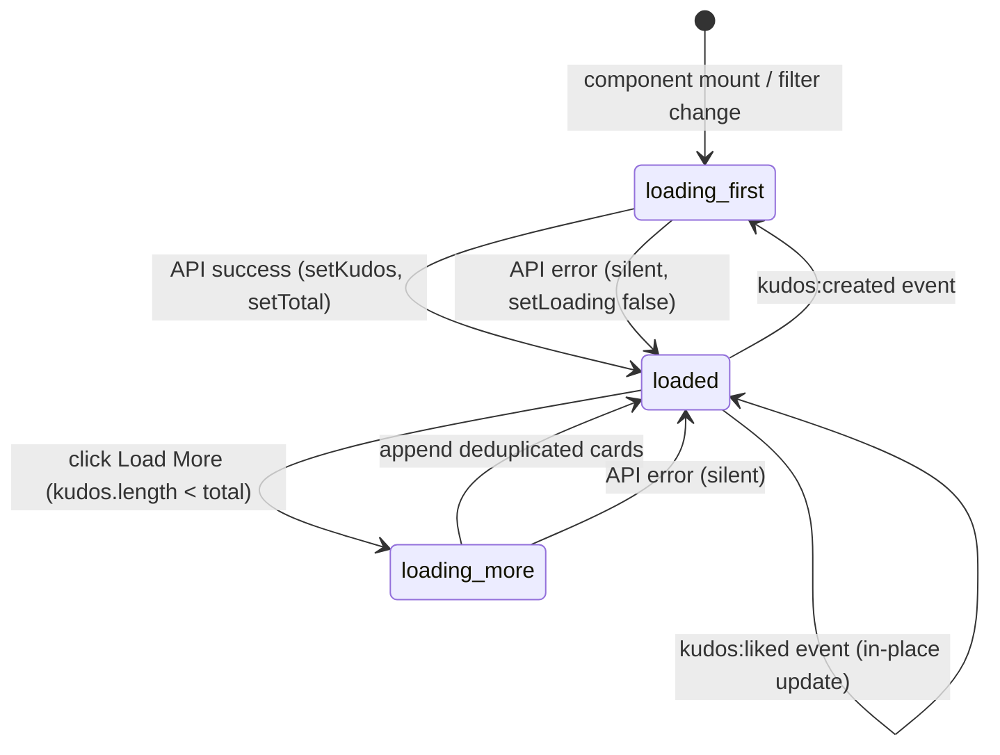

# Feature Specification: F007_KudosFeed

**Priority**: P0
**Type**: ui
**Generated**: 2026-06-01

## Overview

Displays a paginated, reverse-chronological list of all kudos in `REG003_AllKudosFeed` on the Kudos page. Initial load fetches `GET /kudos?page=1&limit=3`; each "Load More" click appends the next page. Cards show sender (masked if anonymous), receiver, title, message, hashtags, images (S3 presigned URLs), and like count/toggle. Duplicate cards across page boundaries are deduplicated by id. The feed refreshes on `kudos:created` and applies in-place `kudos:liked` event updates.

## Why This Exists

The all-kudos feed is the chronological record of peer recognition; it gives every employee visibility into team kudos and drives the like/engagement loop that feeds the highlight ranking.

## Who Uses It

- **Authenticated employee** — browses kudos feed, loads more, likes cards (PERM001_BackendJwtRouteGuard, PERM005_AnonymousSenderMasking)

## Business Workflow

```
1. User navigates to /kudos → AllKudosSection mounts → KudosFeed component calls GET /kudos?page=1&limit=3 with optional hashtag/department params.
2. KudosController.findAll → KudosService.findAll: builds TypeORM query with ORDER BY createdAt DESC, id DESC; applies sender/receiver/hashtag/department filters; paginates with OFFSET.
3. Service fetches hashtag names (fetchHashtags) and liked-set (fetchLikedSet) for returned kudos ids, then calls toCard() for each kudos (generates S3 presigned URLs, applies PERM005 masking for isAnonymous).
4. Response: { data: KudosCardDto[], total, page, limit }.
5. KudosFeed renders cards; shows "Load More" button if kudos.length < total.
6. User clicks "Load More" → handleLoadMore: increments page, fetches GET /kudos?page=N&limit=3, deduplicates by id, appends to list.
7. On window event kudos:created → reload page 1 (new kudos appears at top).
8. On window event kudos:liked → map over current cards updating matching id in-place (no refetch).
```

## Screen Flow

**See:** ScreenFlow § F007_KudosFeed

| Screen | Route | Purpose |
|--------|-------|---------|
| SCR007_KudosPage/REG003_AllKudosFeed | `/kudos` | Paginated kudos list with load more |

## Cross-Cutting Logic

### Requirements

| Code | Description | Endpoint/Handler | Verifiable |
|------|-------------|------------------|------------|
| FR-001 | Fetch paginated kudos list ordered by createdAt DESC with id tiebreaker | GET /kudos via `KudosController@findAll` | yes |
| FR-002 | Append next page on Load More; deduplicate by id | GET /kudos?page=N via `KudosController@findAll` | yes |
| FR-003 | Apply anonymous sender masking on all returned cards | GET /kudos via `KudosService.toCard` | yes |
| FR-004 | Refresh feed on `kudos:created` window event | client-side event listener in `KudosFeed` | yes |
| FR-005 | Apply `kudos:liked` event in-place without refetch | client-side event listener in `KudosFeed` | yes |

### Business Rules

### BR-001_PaginationBounds
**Source:** `backend/src/kudos/kudos.service.ts:142-143`
**Applies to:** GET /kudos
**Linked FR:** FR-001
**Rule:** Page is clamped to `Math.max(1, Number(query.page) || 1)`; limit is clamped to `Math.min(50, Math.max(1, Number(query.limit) || 20))`. Requesting page 0 or negative returns page 1. Limit above 50 is capped.

**Pseudocode:**
```ts
const page = Math.max(1, Number(query.page) || 1);
const limit = Math.min(50, Math.max(1, Number(query.limit) || 20));
// OFFSET = (page-1) * limit
```

### BR-002_AnonymousMaskOnRead
**Source:** `backend/src/kudos/kudos.service.ts:74-82`
**Applies to:** GET /kudos (all kudos read endpoints)
**Linked FR:** FR-003
**Rule:** If `kudos.isAnonymous === true`, toCard replaces sender.name with `kudos.senderAlias ?? 'Ẩn danh'`, sender.email with `''`, sender.picture with `''`. Applied before any DTO is serialized to client.

**Pseudocode:**
```ts
const senderDto = kudos.isAnonymous
  ? { ...toUserDto(kudos.sender), name: kudos.senderAlias ?? 'Ẩn danh', email: '', picture: '' }
  : toUserDto(kudos.sender);
```

### BR-003_DeterministicPagination
**Source:** `backend/src/kudos/kudos.service.ts:148-153`
**Applies to:** GET /kudos
**Linked FR:** FR-001, FR-002
**Rule:** Primary ORDER BY `createdAt DESC`, secondary `id DESC`. The id tiebreaker prevents duplicate/skipped rows when multiple kudos share the same createdAt timestamp during Load More.

**Pseudocode:**
```ts
qb.orderBy('k.createdAt', 'DESC').addOrderBy('k.id', 'DESC')
  .skip((page-1) * limit).take(limit);
```

### State Machines

### SM-001_FeedLoadState
**Source:** `frontend/components/kudos/kudos-feed.tsx:23-26`
**Linked FR:** FR-001, FR-002
**States:** idle, loading-first, loaded, loading-more, error



**Transition rules:**
- `loading_first → loaded`: side effects = setKudos(res.data), setTotal(res.total), setPage(1), setLoading(false)
- `loaded → loading_more`: guard = !loadingMore && kudos.length < total
- `loading_more → loaded`: side effects = dedupe by id, setPage(nextPage)
- `loaded → loading_first` (kudos:created): side effects = re-fetch page 1, reset page/total

### Algorithms

### ALG-001_DeduplicationByIdOnAppend
**Source:** `frontend/components/kudos/kudos-feed.tsx:92-96`
**Input:** `prev: KudosCard[]`, `res.data: KudosCard[]`
**Output:** `KudosCard[]` with no duplicate ids
**Complexity:** O(n) where n = prev.length
**Description:** When appending a new page, builds a Set of existing ids from `prev`, then filters `res.data` to exclude any id already in the Set. Prevents a card from appearing twice if it shifted position between the first and second page fetch.

**Pseudocode:**
```ts
setKudos(prev => {
  const seen = new Set(prev.map(k => k.id));
  return [...prev, ...res.data.filter(k => !seen.has(k.id))];
});
```

### External Integrations

None.

### Verification

- **SC-001** GET /kudos?page=1&limit=3 returns 3 cards ordered by createdAt DESC (covers FR-001, BR-003)
- **SC-002** GET /kudos?page=2&limit=3 returns next 3; no id overlap with page 1 response (covers FR-002, ALG-001)
- **SC-003** Anonymous kudos in feed show masked sender name, empty email/picture (covers FR-003, BR-002)
- **SC-004** Load More button hidden when kudos.length >= total (covers FR-002)
- **SC-005** Feed re-renders top-of-list after kudos:created event fires (covers FR-004)

## User Stories

### US028_LoadMoreKudosFeed — Load More Kudos in All Kudos Feed (Priority: P0)

**What happens:** User scrolls down the all-kudos feed and clicks "Load More". The next 3 kudos are appended below the existing list. The button shows a loading indicator (`...`) during the request and disappears once all kudos are loaded (`kudos.length >= total`).
**Why this priority:** Pagination is essential for a feed with any meaningful volume; without it only 3 kudos would ever be visible.
**Independent Test:** Navigate to /kudos, ensure more than 3 kudos exist, click "Load More" → 3 more cards appended, page counter increments.

**Acceptance Scenarios:**

1. **Given** 10 kudos exist, 3 shown on initial load, **When** user clicks "Load More", **Then** next 3 appended, total shown = 6, button still visible.
2. **Given** all kudos loaded (kudos.length >= total), **When** — , **Then** "Load More" button not rendered.
3. **Given** page fetch returns a card with id already in list, **When** appended, **Then** duplicate suppressed — list length does not double-count.
4. **Given** network error during Load More, **When** catch fires, **Then** loading indicator clears, existing cards preserved.

**Requirements fulfilled:**
- **FR-001** Initial load of paginated kudos feed — `GET /kudos?page=1&limit=3` via `KudosController@findAll`
- **FR-002** Append next page on Load More with deduplication — `GET /kudos?page=N&limit=3` via `KudosController@findAll`
- **FR-003** Anonymous sender masking applied to all cards — `GET /kudos` via `KudosService.toCard`
- **FR-004** Refresh feed on `kudos:created` event — client `KudosFeed` event listener
- **FR-005** In-place like count update on `kudos:liked` event — client `KudosFeed` event listener

**Rules enforced:**

### BR-004_LoadMoreGuard
**Source:** `frontend/components/kudos/kudos-feed.tsx:86-88`
**Applies to:** Load More button click
**Linked FR:** FR-002
**Rule:** Guard prevents double-trigger: `if (loadingMore || kudos.length >= total) return;`. Both a concurrent in-flight request and a fully-loaded feed short-circuit the handler.

**Pseudocode:**
```ts
const handleLoadMore = async () => {
  if (loadingMore || kudos.length >= total) return;
  // proceed with fetch
};
```

**State transitions:** SM-001_FeedLoadState (see Cross-Cutting Logic)

**Verification:**
- **SC-006** Load More button shows `...` text while loading; returns to `t.loadMore` on completion (covers FR-002)
- **SC-007** Clicking Load More twice rapidly does not double-fetch (covers BR-004)

---

### Edge Cases

| Scenario | Behavior |
|----------|----------|
| Empty feed (0 kudos in DB) | `kudos.length === 0` after load → renders `t.kudosEmptyFeed` text; no Load More button |
| Total drops between page 1 and page 2 (kudos deleted concurrently) | `kudos.length >= total` re-evaluated after append; button hides if condition now met |
| GET /kudos returns HTTP 401 (expired JWT) | apiFetch rejects; catch block silences error; feed stays empty; user must re-auth |
| `kudos.limit` query param > 50 | Service clamps to 50; client receives max 50 cards per page |
| Filter applied (hashtag/dept) with no matching kudos | Response `data: []`, `total: 0`; empty-state text shown; Load More hidden |

## Key Entities

| Entity | Table | Key Columns | Purpose |
|--------|-------|-------------|---------|
| Kudos | `kudos` | `id`, `senderEmail`, `receiverEmail`, `title`, `message`, `likeCount`, `isAnonymous`, `senderAlias`, `imageKeys`, `createdAt` | Primary feed data; ordered by createdAt DESC |
| User | `user` | `email`, `firstName`, `lastName`, `picture`, `department` | Joined as sender and receiver for each kudos card |
| Like | `like` | `kudosId`, `userEmail` | Used to build likedSet per request; determines likedByMe per card |
| Hashtag | `hashtag` | `id`, `name` | Joined via KudosHashtag to populate hashtag names on cards |
| KudosHashtag | `kudos_hashtag` | `kudosId`, `hashtagId` | M2M join; batch-fetched via fetchHashtags for all returned ids |

## Related Artifacts

- **Screens** (from ScreenList): SCR007_KudosPage/REG003_AllKudosFeed
- **User Stories** (from UserStories): US028_LoadMoreKudosFeed
- **Routes** (from RouteList): GET /kudos
- **Data Models** (from DataModel): MODEL001, MODEL002, MODEL003, MODEL004
- **Background Logic** (from BackgroundLogic): none
- **Permissions** (from Permissions): PERM001_BackendJwtRouteGuard, PERM005_AnonymousSenderMasking

## Spec Documents

- [x] [System Overview](../../system-overview.md) — offset-based pagination, denormalized likeCount, synchronize:false
- [x] [Feature List](../../feature-list.md) — F007_KudosFeed
- [x] [User Stories](../../user-stories.md) — US028_LoadMoreKudosFeed
- [x] [Route List](../../route-list.md) — GET /kudos
- [x] [Data Model](../../data-model.md) — MODEL001, MODEL002, MODEL003, MODEL004
- [x] [Permissions](../../permissions.md) — PERM001, PERM005
- [ ] [Screen List](../../screen-list.md) — SCR007/REG003
- [ ] [Screen Flow](../../screen-flow.md)
- [ ] [Background Logic](../../background-logic.md) — none applicable

## Assumptions

- Page size is hardcoded to `LIMIT = 3` in the frontend (`kudos-feed.tsx:16`). The backend supports up to 50. This discrepancy is intentional — 3 cards per page is a deliberate UX choice keeping the initial load fast.
- `kudos:created` event is dispatched by `KudosInputTrigger.onSuccess` (`kudos-input-trigger.tsx:215`) after a successful POST /kudos. The feed component registers and removes this listener correctly on mount/unmount.
- No cursor-based pagination — offset-based pagination can produce duplicate/skipped rows if items are inserted/deleted between pages. The deduplication in ALG-001 handles only inserts (new kudos shifting old ones down); deletions between pages would cause skips silently.

## Source Code References

| Symbol | Path | Purpose |
|--------|------|---------|
| `KudosFeed` | `frontend/components/kudos/kudos-feed.tsx:1-147` | Feed component: state, pagination, event listeners |
| `KudosService.findAll` | `backend/src/kudos/kudos.service.ts:133-194` | Paginated query with filters, hashtag/like batch fetch |
| `KudosController.findAll` | `backend/src/kudos/kudos.controller.ts:40-44` | GET /kudos handler with JwtAuthGuard |
| `KudosService.toCard` | `backend/src/kudos/kudos.service.ts:62-98` | DTO assembly with anonymous masking and S3 presign |
| `KudosPostCard` | `frontend/components/kudos/kudos-post-card.tsx:1-180` | Individual feed card rendering and like action |
| `AllKudosSection` | `frontend/components/kudos/all-kudos-section.tsx:1-82` | Container: JWT decode for currentUserEmail, passes to KudosFeed |

## Unresolved Questions

1. **S3 presigned URL expiry**: `toCard` calls `s3.getPresignedUrl(key)` for each imageKey on every read request. If URLs expire before the user views them (default S3 presigned expiry is 1 hour, configurable), images will 403. No caching or refresh mechanism exists in the current codebase.
2. **Stale total on Load More**: `total` is fetched per request but not re-fetched between page loads. If many kudos are added between page 1 and page 2 clicks, the Load More button may disappear prematurely or show incorrect "all loaded" state.
