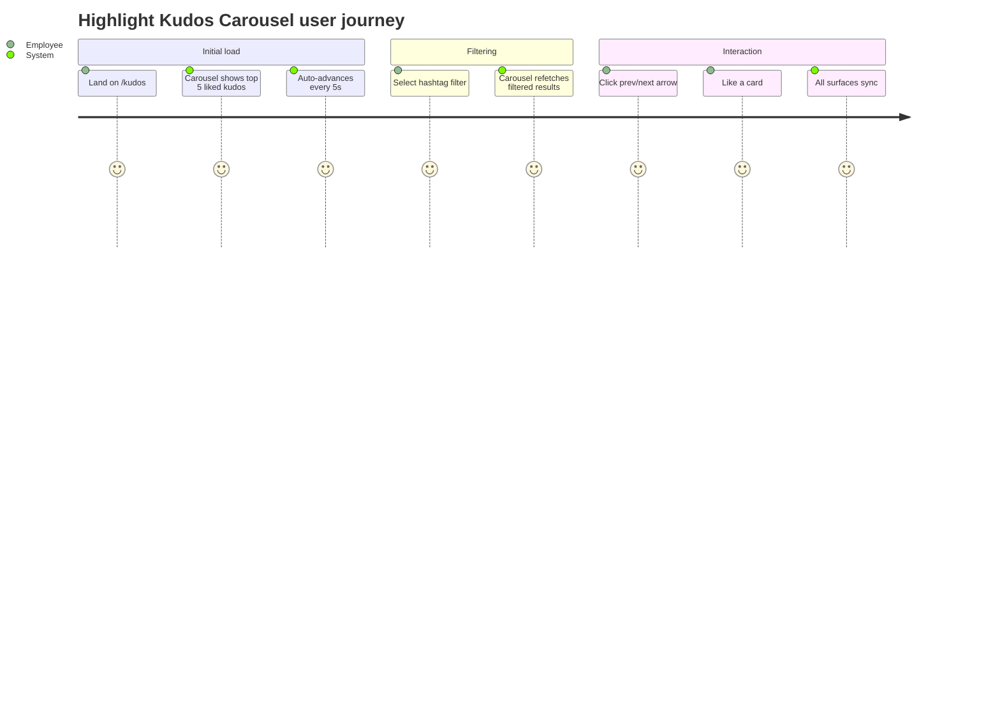

# Feature Specification: F008_KudosHighlight

**Priority**: P1
**Type**: ui
**Generated**: 2026-06-01

## Overview

Renders an infinite-loop auto-advancing carousel of the top-5 liked kudos in `REG001_HighlightSection` on the Kudos page. Data is fetched from `GET /kudos/highlight` (supports `?hashtag=` and `?department=` query params). The carousel auto-advances every 5 seconds with a seamless clone-based wrap. Filter changes (F036/F037) refetch the carousel independently of the all-kudos feed. Like/unlike on highlight cards dispatches `kudos:liked` and syncs state with other surfaces.

## Why This Exists

The highlight section surfaces the most-loved kudos as social proof, amplifying recognition and driving further engagement. It is the first visual anchor on the Kudos page and directly exposes the `likeCount`-based ranking.

## Who Uses It

- **Authenticated employee** — views highlight carousel, applies hashtag/department filters, likes/unlikes cards (PERM001_BackendJwtRouteGuard, PERM005_AnonymousSenderMasking, PERM006_LikeUniquenessConstraint)

## Business Workflow

```
1. HighlightSection mounts on /kudos → parallel fetch: GET /hashtags (populate filter dropdown) + GET /departments (populate filter dropdown).
2. fetchHighlight() called (via useCallback dep on activeHashtag/activeDept) → GET /kudos/highlight?hashtag=X&department=Y.
3. KudosController.findHighlight → KudosService.findHighlight: query kudos ORDER BY likeCount DESC LIMIT 5; apply hashtag inner-join filter and/or receiver.department filter.
4. Service batch-fetches hashtags + likedSet for returned ids; calls toCard() per kudos (presigns S3 URLs, applies anonymous masking).
5. Response: KudosCardDto[] (up to 5).
6. HighlightCarousel receives items; renders cloned track [last, ...items, first, second] for seamless infinite forward loop; auto-advances every AUTO_ADVANCE_MS (5000ms).
7. User changes hashtag or department filter → setActiveHashtag/setActiveDept → fetchHighlight() re-runs with new params; carousel resets.
8. window event kudos:created → fetchHighlight() re-runs (refetch, not in-place).
9. window event kudos:liked → in-place state update (no refetch); carousel card count/state updates.
```

## Screen Flow

**See:** ScreenFlow § F008_KudosHighlight

| Screen | Route | Purpose |
|--------|-------|---------|
| SCR007_KudosPage/REG001_HighlightSection | `/kudos` | Highlight carousel + filter controls |



## Cross-Cutting Logic

### Requirements

| Code | Description | Endpoint/Handler | Verifiable |
|------|-------------|------------------|------------|
| FR-001 | Fetch top-5 kudos by likeCount DESC with optional hashtag/dept filters | GET /kudos/highlight via `KudosController@findHighlight` | yes |
| FR-002 | Populate hashtag filter dropdown from GET /hashtags | GET /hashtags via `HashtagsController@findAll` | yes |
| FR-003 | Populate department filter dropdown from GET /departments | GET /departments via `DepartmentsController@findAll` | yes |
| FR-004 | Refetch highlight on filter change; independent of all-kudos feed | GET /kudos/highlight?hashtag=X&department=Y | yes |
| FR-005 | Apply in-place kudos:liked event update without refetch | client-side event listener in `HighlightSection` | yes |
| FR-006 | Refetch on kudos:created event | client-side event listener in `HighlightSection` | yes |

### Business Rules

### BR-001_HighlightTopFiveByLikes
**Source:** `backend/src/kudos/kudos.service.ts:218-248`
**Applies to:** GET /kudos/highlight
**Linked FR:** FR-001
**Rule:** Result set is always LIMIT 5, ORDER BY `likeCount DESC`. No pagination; always the absolute top 5 (or fewer if fewer kudos exist). Hashtag filter requires inner join on `kudos_hashtag` + `hashtag`; department filter applies `WHERE receiver.department = :dept`.

**Pseudocode:**
```ts
let qb = kudosRepo.createQueryBuilder('k')
  .innerJoinAndSelect('k.sender', 'sender')
  .innerJoinAndSelect('k.receiver', 'receiver')
  .orderBy('k.likeCount', 'DESC').take(5);
if (hashtag) qb = qb.innerJoin('k.hashtags','kh').innerJoin('kh.hashtag','ht')
                    .andWhere('ht.name = :ht', { ht: hashtag });
if (department) qb = qb.andWhere('receiver.department = :dept', { dept: department });
```

### BR-002_FiltersAreIndependent
**Source:** `frontend/components/kudos/highlight-section.tsx:37-49`
**Applies to:** GET /kudos/highlight
**Linked FR:** FR-004
**Rule:** Both `activeHashtag` and `activeDept` are independent state variables. fetchHighlight is a useCallback dependent on both; changing either triggers a refetch with both params applied simultaneously (`?hashtag=X&department=Y`).

**Pseudocode:**
```ts
const fetchHighlight = useCallback(async () => {
  const params = new URLSearchParams();
  if (activeHashtag) params.set('hashtag', activeHashtag);
  if (activeDept) params.set('department', activeDept);
  const data = await apiFetch(`/kudos/highlight?${params}`);
  setKudos(data);
}, [activeHashtag, activeDept]);
```

### BR-003_AnonymousMaskOnHighlight
**Source:** `backend/src/kudos/kudos.service.ts:74-82`
**Applies to:** GET /kudos/highlight
**Linked FR:** FR-001
**Rule:** Same anonymous masking as all-kudos feed (PERM005). isAnonymous kudos in highlight carousel show masked sender.

**Pseudocode:**
```ts
// same toCard() masking logic — see F007 BR-002
```

### State Machines

### SM-001_CarouselAutoAdvance
**Source:** `frontend/components/kudos/highlight-carousel.tsx:43-86`
**Linked FR:** FR-001
**States:** idle, auto-advancing, user-navigating, snap-wrapping

```mermaid
stateDiagram-v2
    [*] --> idle: items loaded (activeIndex = firstReal=1)
    idle --> auto_advancing: useInterval fires (every 5000ms, items.length > 1)
    auto_advancing --> snap_wrapping: activeIndex reaches cloneSlot (items.length+1)
    snap_wrapping --> idle: animate=false; snap to firstReal; animate=true (rAF)
    idle --> user_navigating: prev/next button click
    user_navigating --> idle: setActiveIndex complete
    user_navigating --> snap_wrapping: backward wrap at firstReal (instant snap to items.length)
```



**Transition rules:**
- `idle → auto_advancing`: guard = wrapEnabled (items.length > 1); side effects = setActiveIndex(i+1) every 5s
- `auto_advancing → snap_wrapping`: guard = activeIndex === cloneSlot; side effects = setTimeout(TRANSITION_MS+20) then setAnimate(false), setActiveIndex(firstReal)
- `snap_wrapping → idle`: side effects = requestAnimationFrame(setAnimate(true))
- `user_navigating → snap_wrapping` (backward at firstReal): setAnimate(false), jump to items.length slot instantly

### Algorithms

### ALG-001_CarouselCloneTrack
**Source:** `frontend/components/kudos/highlight-carousel.tsx:92-95`
**Input:** `items: KudosCard[]` (up to 5)
**Output:** `renderItems: KudosCard[]` (items.length + 3 with clone bookends)
**Complexity:** O(n) where n = items.length
**Description:** Constructs `[items[last], ...items, items[0], items[1]]`. The leading clone (items[last]) and trailing clones (items[0], items[1]) ensure seamless infinite forward loop — when the track transitions to the trailing clone of items[0], the neighboring cards (items[last-1] and items[1]) are identical to those at the real items[0] position, so the silent snap back to firstReal is invisible.

**Pseudocode:**
```ts
const renderItems = wrapEnabled
  ? [items[items.length - 1], ...items, items[0], items[1]]
  : items;
// wrapEnabled = items.length > 1
// firstReal = 1 (index of first real item in renderItems)
// cloneSlot = items.length + 1 (index of trailing clone of items[0])
```

### External Integrations

None.

### Verification

- **SC-001** GET /kudos/highlight returns ≤5 kudos ordered by likeCount DESC (covers FR-001, BR-001)
- **SC-002** GET /kudos/highlight?hashtag=X returns only kudos tagged with hashtag X (covers BR-001)
- **SC-003** GET /kudos/highlight?department=Y returns only kudos with receiver in department Y (covers BR-001)
- **SC-004** Hashtag and department filters applied simultaneously: ?hashtag=X&department=Y (covers BR-002)
- **SC-005** Carousel auto-advances after 5s with no user interaction (covers SM-001)
- **SC-006** kudos:liked event updates highlight card count in-place without refetch (covers FR-005)

## User Stories

### US015_FilterHighlightByHashtag — Filter Highlight Feed by Hashtag (Priority: P1)

**What happens:** User selects a hashtag from the FilterDropdown in the HighlightSection header. `activeHashtag` state updates, triggering fetchHighlight to refetch `GET /kudos/highlight?hashtag=<name>`. Carousel re-renders with filtered results. Selecting "All" / clearing resets `activeHashtag` to null.
**Why this priority:** Hashtag filtering is a key discovery mechanism — users searching for specific recognition themes need it.
**Independent Test:** Select a hashtag → verify carousel only shows cards tagged with that hashtag. Select "All" → verify full list returns.

**Acceptance Scenarios:**

1. **Given** user on /kudos, hashtags loaded in dropdown, **When** selects a hashtag, **Then** GET /kudos/highlight?hashtag=<name> called; carousel updates with filtered kudos.
2. **Given** hashtag filter active, **When** selects "All" (null), **Then** GET /kudos/highlight (no params) called; full carousel restored.
3. **Given** no kudos with selected hashtag, **When** filter applied, **Then** carousel shows empty state text.

**Requirements fulfilled:**
- **FR-001** Fetch filtered highlight — `GET /kudos/highlight?hashtag=X` via `KudosController@findHighlight`
- **FR-002** Hashtag options from GET /hashtags — via `HashtagsController@findAll`
- **FR-004** Filter change triggers refetch — via `HighlightSection::fetchHighlight` useCallback

**Rules enforced:**

BR-001_HighlightTopFiveByLikes (see Cross-Cutting Logic)
BR-002_FiltersAreIndependent (see Cross-Cutting Logic)

**State transitions:** SM-001_CarouselAutoAdvance (see Cross-Cutting Logic)

**Verification:**
- **SC-007** FilterDropdown value bound to activeHashtag; cleared on "All" selection (covers FR-004)

---

### US016_FilterHighlightByDepartment — Filter Highlight Feed by Department (Priority: P1)

**What happens:** User selects a department from the second FilterDropdown. `activeDept` updates; fetchHighlight refetches with `?department=<name>`. Both filters can be active simultaneously — if hashtag is also active, the query becomes `?hashtag=X&department=Y`.
**Why this priority:** Department filtering enables team-scoped recognition views — essential for multi-team organizations.
**Independent Test:** Select a department → carousel shows only kudos where receiver.department matches. Select another department → updates.

**Acceptance Scenarios:**

1. **Given** department filter inactive, **When** user selects a department, **Then** GET /kudos/highlight?department=<name> called; carousel updates.
2. **Given** hashtag filter already active (`activeHashtag=X`), **When** user also selects department Y, **Then** GET /kudos/highlight?hashtag=X&department=Y called.

**Requirements fulfilled:**
- **FR-001** Fetch filtered highlight — `GET /kudos/highlight?department=Y` via `KudosController@findHighlight`
- **FR-003** Department options from GET /departments — via `DepartmentsController@findAll`
- **FR-004** Filter change triggers refetch — via `HighlightSection::fetchHighlight` useCallback

**Rules enforced:** BR-001_HighlightTopFiveByLikes (see Cross-Cutting Logic), BR-002_FiltersAreIndependent (see Cross-Cutting Logic)

**Verification:**
- **SC-008** Both hashtag and department filters active simultaneously produce combined query string (covers BR-002)

---

### US017_LikeKudosFromHighlight — Like or Unlike a Kudos from Highlight (Priority: P0)

**What happens:** User clicks the heart on a highlight card. Optimistic update fires immediately via `emitLikeChange` (dispatches `kudos:liked` event). POST or DELETE called; error triggers rollback via second `emitLikeChange` call. See F006 for full like/unlike spec.
**Why this priority:** Core engagement action; highlight section is the most visible surface.
**Independent Test:** Like a highlight card → count +1; unlike → count -1; all other surfaces with same kudos update.

**Acceptance Scenarios:**

1. **Given** authenticated user, `likedByMe=false` on highlight card, **When** clicks heart, **Then** count +1, POST /kudos/:id/like called, `kudos:liked` dispatched.
2. **Given** API returns error, **When** toggle fires, **Then** count reverts; second `emitLikeChange` dispatched with original values.

**Requirements fulfilled:**
- **FR-005** In-place like update on kudos:liked event — `HighlightSection` event listener at highlight-section.tsx:75-93

**Rules enforced:** BR-001_LikeUniquenessGuard (see F006), BR-003_AuthRequiredForLike (see F006)

**State transitions:** SM-001_LikeToggleLifecycle (see F006)

**Verification:**
- **SC-009** HighlightKudosCard dispatches kudos:liked event; HighlightSection listener applies update (covers FR-005)

---

### Edge Cases

| Scenario | Behavior |
|----------|----------|
| Only 1 kudos in highlight result | Carousel renders single card; wrap disabled (`wrapEnabled=false`); auto-advance paused (`delay=null`) |
| 0 kudos returned (empty filter result) | Carousel renders `t.kudosEmptyFeed` text |
| Filter changed before prior refetch completes | React state update queues next fetchHighlight; stale result silently discarded (no abort controller — see Unresolved) |
| GET /hashtags or /departments fails | catch swallows error; filter dropdowns stay empty; highlight still loads without filters |
| Carousel at clone slot N+1 when items list shrinks (filter change) | useEffect detects `activeIndex >= cloneSlot`; immediate snap to 0 (non-wrap mode) or firstReal |

## Key Entities

| Entity | Table | Key Columns | Purpose |
|--------|-------|-------------|---------|
| Kudos | `kudos` | `id`, `likeCount`, `senderEmail`, `receiverEmail`, `title`, `message`, `isAnonymous`, `imageKeys` | Primary highlight data; ranked by likeCount DESC LIMIT 5 |
| User | `user` | `email`, `firstName`, `lastName`, `picture`, `department` | Joined as sender/receiver; department used for filter |
| Hashtag | `hashtag` | `id`, `name` | Filter input and display on cards |
| KudosHashtag | `kudos_hashtag` | `kudosId`, `hashtagId` | Inner-joined for hashtag filter in findHighlight query |

## Related Artifacts

- **Screens** (from ScreenList): SCR007_KudosPage/REG001_HighlightSection
- **User Stories** (from UserStories): US015_FilterHighlightByHashtag, US016_FilterHighlightByDepartment, US017_LikeKudosFromHighlight
- **Routes** (from RouteList): GET /kudos/highlight, GET /hashtags, GET /departments
- **Data Models** (from DataModel): MODEL002, MODEL004
- **Background Logic** (from BackgroundLogic): none
- **Permissions** (from Permissions): PERM001_BackendJwtRouteGuard, PERM005_AnonymousSenderMasking, PERM006_LikeUniquenessConstraint

## Spec Documents

- [x] [System Overview](../../system-overview.md) — architecture, likeCount denormalization
- [x] [Feature List](../../feature-list.md) — F008_KudosHighlight
- [x] [User Stories](../../user-stories.md) — US015, US016, US017
- [x] [Route List](../../route-list.md) — GET /kudos/highlight, GET /hashtags, GET /departments
- [x] [Data Model](../../data-model.md) — MODEL002, MODEL004
- [x] [Permissions](../../permissions.md) — PERM001, PERM005, PERM006
- [ ] [Screen List](../../screen-list.md) — SCR007/REG001
- [ ] [Screen Flow](../../screen-flow.md)
- [ ] [Background Logic](../../background-logic.md) — none applicable

## Assumptions

- `GET /hashtags` and `GET /departments` have no `JwtAuthGuard` — they are public endpoints per route-list.md. HighlightSection fetches them without an auth token, which works in practice because the page itself is auth-gated by PERM003.
- The carousel ALG-001 clone track assumes `items.length >= 2` for wrap to be enabled. With exactly 1 item, `wrapEnabled=false` and a simple non-clone array is used.
- Carousel position resets to 0/firstReal on every filter change because `fetchHighlight` sets a new `kudos` state that triggers a `useEffect` guard via `items.length` change.

## Source Code References

| Symbol | Path | Purpose |
|--------|------|---------|
| `HighlightSection` | `frontend/components/kudos/highlight-section.tsx:1-145` | Container: state, filter handlers, event listeners |
| `HighlightCarousel` | `frontend/components/kudos/highlight-carousel.tsx:1-211` | Clone-based infinite carousel with auto-advance |
| `HighlightKudosCard` | `frontend/components/kudos/highlight-kudos-card.tsx:1-191` | Card with like toggle and link overlay |
| `KudosService.findHighlight` | `backend/src/kudos/kudos.service.ts:214-248` | Top-5 query with filter support |
| `KudosController.findHighlight` | `backend/src/kudos/kudos.controller.ts:47-55` | GET /kudos/highlight handler |
| `FilterDropdown` | `frontend/components/kudos/filter-dropdown.tsx` | Reusable dropdown used for hashtag and department filters |

## Unresolved Questions

1. **No AbortController on fetchHighlight**: rapid filter changes can produce out-of-order responses. The last `setKudos(data)` call wins regardless of request order. A stale slower response could overwrite a newer faster one. No race protection exists currently.
2. **Carousel `items[1]` clone**: `renderItems` appends `items[1]` as the final clone (`highlight-carousel.tsx:94`). If `items.length === 1`, `items[1]` is `undefined`. However `wrapEnabled` is false when `items.length <= 1` so the clone branch is never reached — confirm this guard holds in all edge cases.
