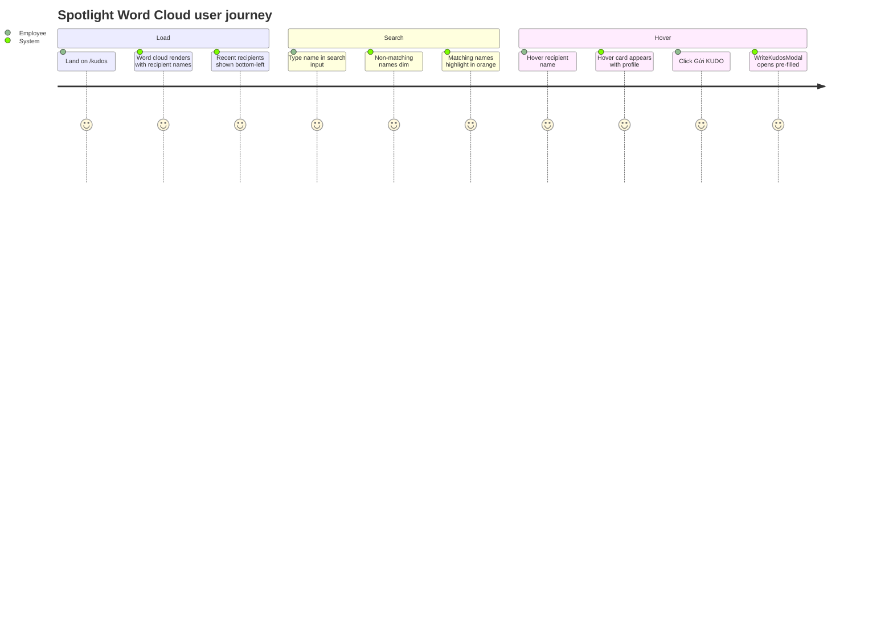

# Feature Specification: F009_KudosSpotlight

**Priority**: P1
**Type**: ui
**Generated**: 2026-06-01

## Overview

Renders a d3-inspired SVG word cloud of kudos recipients in `REG002_SpotlightSection` on the Kudos page. Recipient names are sized uniformly (14px) and scattered across a deterministic grid layout. Data comes from two public endpoints: `GET /kudos/spotlight` (recipient name + kudos count) and `GET /kudos/spotlight/recent` (7 most-recent receivers). A client-side search input filters the cloud. Hovering a name triggers a profile fetch (`GET /kudos/recipient/:email/profile`) and renders a floating hover card with a "Gửi KUDO" CTA. Both data endpoints require no JWT — intentionally public per PERM007.

## Why This Exists

The spotlight section gives immediate visual recognition to the most-appreciated colleagues and drives kudos virality — seeing a name in the word cloud motivates others to send kudos to them.

## Who Uses It

- **Authenticated employee** — views spotlight, searches recipients, views hover cards, sends kudos from hover card (PERM007_PublicSpotlightAccess — API is public; frontend still auth-gated by PERM003)
- **Unauthenticated user** — can access the API endpoints directly but cannot reach the UI page (PERM003 blocks /kudos)

## Business Workflow

```
1. SpotlightSection mounts → parallel fetch: GET /kudos/spotlight + GET /kudos/spotlight/recent.
2. KudosService.findSpotlight: GROUP BY receiver (u.email, u.firstName, u.lastName), COUNT(k.id) ORDER BY count DESC → returns {email, name, count}[].
3. KudosService.findSpotlightRecent: ORDER BY k.createdAt DESC LIMIT 7 → returns {email, name, createdAt}[].
4. SpotlightWordCloud receives words + recent; ALG-001 (grid scatter) lays names in deterministic cells seeded by SCATTER_SEED=20260529.
5. User types in SpotlightSearch input → onSearchChange(term) → lowerSearch used to dim non-matching names (opacity 0.08) and highlight matches (HIGHLIGHT_COLOR #FF7A59).
6. User hovers a name → showCard(email, clientX, clientY): sets hovered state; fetches GET /kudos/recipient/:email/profile (cached in profileCache by email).
7. RecipientHoverCard rendered at cursor position; shows skeleton until profileCache[email] resolves.
8. User moves mouse away → scheduleHide (220ms grace period); re-entering name or card cancels hide.
9. User clicks "Gửi KUDO" on hover card → setWriteTarget(profile); WriteKudosModal opens with initialRecipient pre-filled.
```

## Screen Flow

**See:** ScreenFlow § F009_KudosSpotlight

| Screen | Route | Purpose |
|--------|-------|---------|
| SCR007_KudosPage/REG002_SpotlightSection | `/kudos` | Word cloud + search + hover cards |



## Cross-Cutting Logic

### Requirements

| Code | Description | Endpoint/Handler | Verifiable |
|------|-------------|------------------|------------|
| FR-001 | Fetch recipient word cloud data (name + kudos count) | GET /kudos/spotlight via `KudosController@findSpotlight` | yes |
| FR-002 | Fetch 7 most-recent kudos receivers with timestamps | GET /kudos/spotlight/recent via `KudosController@findSpotlightRecent` | yes |
| FR-003 | Client-side name search filters word cloud without API call | client-side filter in `SpotlightWordCloud` on `lowerSearch` | yes |
| FR-004 | Hover a name → fetch recipient profile and show hover card | GET /kudos/recipient/:email/profile via `KudosController@getRecipientProfile` | yes |
| FR-005 | Profile results cached per email to avoid re-fetch on re-hover | `profileCache` state in `SpotlightWordCloud` | yes |
| FR-006 | "Gửi KUDO" CTA on hover card opens WriteKudosModal with pre-filled recipient | client-side modal trigger in `SpotlightWordCloud` | yes |

### Business Rules

### BR-001_SpotlightPublicAccess
**Source:** `backend/src/kudos/kudos.controller.ts:57-73`
**Applies to:** GET /kudos/spotlight, GET /kudos/spotlight/recent, GET /kudos/recipient/:email/profile
**Linked FR:** FR-001, FR-002, FR-004
**Rule:** These three handlers carry no `@UseGuards(JwtAuthGuard)` decorator. Requests without a Bearer token are accepted. This is intentional per PERM007 to support future public display boards.

**Pseudocode:**
```ts
@Get('spotlight')        // no @UseGuards
findSpotlight() { return this.kudosService.findSpotlight(); }
@Get('spotlight/recent') // no @UseGuards
findSpotlightRecent() { ... }
@Get('recipient/:email/profile') // no @UseGuards
getRecipientProfile(@Param('email') email) { ... }
```

### BR-002_SpotlightCountAggregation
**Source:** `backend/src/kudos/kudos.service.ts:251-277`
**Applies to:** GET /kudos/spotlight
**Linked FR:** FR-001
**Rule:** Groups kudos by receiver (email + firstName + lastName), counts kudos received per receiver, orders by count DESC. Returns all receivers (no limit) — the full leaderboard.

**Pseudocode:**
```ts
kudosRepo.createQueryBuilder('k')
  .select('u.email','email').addSelect('u.firstName','firstName')
  .addSelect('u.lastName','lastName').addSelect('COUNT(k.id)','count')
  .innerJoin('k.receiver','u').groupBy('u.email')
  .addGroupBy('u.firstName').addGroupBy('u.lastName')
  .orderBy('count','DESC').getRawMany();
// returns { email, name: `${firstName} ${lastName}`, count: parseInt(count) }[]
```

### BR-003_RecentReceiverLimit
**Source:** `backend/src/kudos/kudos.service.ts:279-306`
**Applies to:** GET /kudos/spotlight/recent
**Linked FR:** FR-002
**Rule:** Returns the 7 most-recently-received kudos (not unique receivers — same person can appear multiple times if they received multiple recent kudos). Ordered by kudos.createdAt DESC LIMIT 7.

**Pseudocode:**
```ts
kudosRepo.createQueryBuilder('k')
  .innerJoin('k.receiver','u')
  .select(['u.email','u.firstName','u.lastName','k.createdAt'])
  .orderBy('k.createdAt','DESC').limit(7).getRawMany();
```

### BR-004_RecipientProfileNotFound
**Source:** `backend/src/kudos/kudos.service.ts:309-325`
**Applies to:** GET /kudos/recipient/:email/profile
**Linked FR:** FR-004
**Rule:** If no User row found for the email → NotFoundException('User not found') → HTTP 404. The hover card stays in skeleton state when 404 occurs (catch swallows error in `showCard`).

**Pseudocode:**
```ts
const user = await userRepo.findOne({ where: { email } });
if (!user) throw new NotFoundException('User not found');
return { email, name, picture, department, kudosReceived, kudosSent, badge: deriveBadge(kudosReceived) };
```

### BR-005_BadgeTierDerivation
**Source:** `backend/src/kudos/kudos.service.ts:29-35`
**Applies to:** GET /kudos/recipient/:email/profile (badge field)
**Linked FR:** FR-004
**Rule:** Badge label derived from kudosReceived: ≥20 → 'Legend Hero'; ≥10 → 'Super Hero'; ≥5 → 'Rising Hero'; ≥1 → 'New Hero'; 0 → '' (empty).

**Pseudocode:**
```ts
function deriveBadge(kudosReceived) {
  if (kudosReceived >= 20) return 'Legend Hero';
  if (kudosReceived >= 10) return 'Super Hero';
  if (kudosReceived >= 5)  return 'Rising Hero';
  if (kudosReceived >= 1)  return 'New Hero';
  return '';
}
```

### State Machines

### SM-001_HoverCardVisibility
**Source:** `frontend/components/kudos/spotlight-word-cloud.tsx:84-228`
**Linked FR:** FR-004, FR-005
**States:** hidden, showing-skeleton, showing-loaded, grace-hiding

```mermaid
stateDiagram-v2
    [*] --> hidden: initial
    hidden --> showing_skeleton: mouseenter name → setHovered; profile not cached
    hidden --> showing_loaded: mouseenter name → setHovered; profile cached
    showing_skeleton --> showing_loaded: profileCache[email] resolved
    showing_skeleton --> grace_hiding: mouseLeave name/card → scheduleHide (220ms)
    showing_loaded --> grace_hiding: mouseLeave name/card → scheduleHide (220ms)
    grace_hiding --> showing_loaded: mouseEnter card (cancelHide)
    grace_hiding --> showing_skeleton: mouseEnter another name (new email)
    grace_hiding --> hidden: 220ms elapsed → setHovered(null)
```



**Transition rules:**
- `hidden → showing_skeleton`: guard = !profileCache[email]; side effects = apiFetch profile, store in cache
- `hidden → showing_loaded`: guard = profileCache[email] exists; side effects = none (instant)
- `grace_hiding → hidden`: side effects = hideTimer fires → setHovered(null)
- `grace_hiding → showing_*` (cancel): side effects = clearTimeout(hideTimer)

### Algorithms

### ALG-001_DeterministicGridScatter
**Source:** `frontend/components/kudos/spotlight-word-cloud.tsx:101-182`
**Input:** `words: SpotlightWord[]`, `SCATTER_SEED=20260529`
**Output:** `WordDatum[]` with (x, y) coordinates for each name instance
**Complexity:** O(N log N) dominated by Fisher-Yates shuffle; N = total instances (bounded by `MAX_INSTANCES_PER_NAME=8` per recipient)
**Description:** (1) Each recipient is repeated `max(3, min(8, ceil(count/2)))` times; instances shuffled (mulberry32 PRNG). (2) Grid cols×rows computed to tile WIDTH×HEIGHT (1157×548 minus TOP_RESERVE=56, BOTTOM_RESERVE=100) with cells fitting the longest name. (3) Cells assigned via full permutation shuffle — each slot gets a unique cell, preventing clustering. (4) Jitter within `±(cellW/2 - halfNameWidth - SCATTER_PADDING)` keeps names inside their cells.

**Pseudocode:**
```ts
// 1. Build instance list; shuffle
const slots = words.flatMap(w => repeat(w, max(3, min(8, ceil(w.count/2)))));
shuffle(slots, rand);
// 2. Compute grid dimensions
const cols = min(maxCols, ceil(sqrt(N * (WIDTH/usableH))));
const rows = min(maxRows, ceil(N/cols));
// 3. Assign cells (full permutation)
const cellOrder = shuffle(range(cols*rows), rand);
// 4. Place with jitter
slots.map((slot,i) => placeInCell(slot, cellOrder[i], cols, rows, rand));
```

### External Integrations

None.

### Verification

- **SC-001** GET /kudos/spotlight returns array with name, email, count; ordered by count DESC (covers FR-001, BR-002)
- **SC-002** GET /kudos/spotlight/recent returns ≤7 items with email, name, createdAt (covers FR-002, BR-003)
- **SC-003** Typing in search input dims non-matching names; matching names turn HIGHLIGHT_COLOR (covers FR-003)
- **SC-004** Clearing search restores all names to full opacity (covers FR-003)
- **SC-005** Hovering a name shows skeleton card then loaded profile card (covers FR-004, SM-001)
- **SC-006** Re-hovering same name shows card immediately (no second fetch) (covers FR-005)
- **SC-007** GET /kudos/recipient/:email/profile for non-existent email returns 404 (covers BR-004)
- **SC-008** Badge field correct for given kudosReceived thresholds (covers BR-005)

## User Stories

### US018_SearchRecipientInSpotlight — Search Recipient in Spotlight Word Cloud (Priority: P1)

**What happens:** User types in the SpotlightSearch input overlaid on the word cloud. `onSearchChange` updates `searchTerm` in SpotlightSection, passed down to SpotlightWordCloud as `lowerSearch`. Names not matching the query dim to opacity 0.08; matching names render in HIGHLIGHT_COLOR (`#FF7A59`) with bold weight. Clearing the input restores the full cloud.
**Why this priority:** The word cloud can display many names; search is the only way to find a specific person quickly.
**Independent Test:** Type a partial name → only that name(s) visible at full opacity, highlighted. Clear → all names restored.

**Acceptance Scenarios:**

1. **Given** word cloud loaded with names, **When** user types "Nguyen", **Then** all names not matching "nguyen" dim to opacity 0.08; matching names show in `#FF7A59`.
2. **Given** search term active, **When** user clears input, **Then** all names return to full opacity and original colors.
3. **Given** search term has no match, **When** typed, **Then** all names dim; cloud appears near-empty.

**Requirements fulfilled:**
- **FR-003** Client-side name search — `SpotlightWordCloud` lowerSearch filter on laid word positions (spotlight-word-cloud.tsx:235-236, 303-308)

**Rules enforced:** None (pure client-side filter, no backend call).

**State transitions:** None (no async state; opacity is a derived render value from `lowerSearch`).

**Verification:**
- **SC-009** lowerSearch comparison is case-insensitive (`.toLowerCase()`) (covers FR-003)

---

### US019_ViewRecipientHoverCard — View Recipient Hover Card in Spotlight (Priority: P1)

**What happens:** User hovers over a recipient name in the SVG word cloud. `showCard` fires: hovered state set to `{email, x, y}`; if profile not cached, `apiFetch` is called for `GET /kudos/recipient/:email/profile` and result stored in `profileCache`. RecipientHoverCard renders at cursor position showing skeleton until data arrives. Mouse leaving both the name and the card (with 220ms grace) hides the card.
**Why this priority:** Hover card provides context for sending kudos — without it, users must navigate to the profile page to learn about the recipient.
**Independent Test:** Hover a name → skeleton appears; wait → profile card shows avatar, name, department, stats, badge, "Gửi KUDO" button.

**Acceptance Scenarios:**

1. **Given** word cloud loaded, **When** user hovers a name, **Then** hover card appears with skeleton; profile data loaded; card shows avatar, name, department, kudosReceived, kudosSent, badge.
2. **Given** profile already in cache, **When** user re-hovers same name, **Then** card appears immediately with data (no fetch).
3. **Given** user moves mouse off name and card, **When** 220ms elapses, **Then** card disappears (setHovered(null)).
4. **Given** user moves from name toward card, **When** cursor enters card area, **Then** card stays visible (cancelHide).

**Requirements fulfilled:**
- **FR-004** Hover triggers profile fetch and card render — `SpotlightWordCloud::showCard` (spotlight-word-cloud.tsx:211-218)
- **FR-005** Profile cache avoids re-fetch — `profileCache` state (spotlight-word-cloud.tsx:86)

**Rules enforced:**

BR-001_SpotlightPublicAccess (see Cross-Cutting Logic)
BR-004_RecipientProfileNotFound (see Cross-Cutting Logic)
BR-005_BadgeTierDerivation (see Cross-Cutting Logic)

**State transitions:** SM-001_HoverCardVisibility (see Cross-Cutting Logic)

**Verification:**
- **SC-010** RecipientHoverCard receives `loading=true` when profileCache[email] not yet resolved (covers FR-004)
- **SC-011** 220ms grace period: moving from name to card does not hide the card (covers SM-001)

---

### US020_SendKudosFromSpotlightHoverCard — Send Kudos from Spotlight Hover Card (Priority: P1)

**What happens:** User clicks "Gửi KUDO" button on the RecipientHoverCard. `onSendKudo` callback fires: `setHovered(null)` (hides card), `setWriteTarget(profile)`. WriteKudosModal mounts with `initialRecipient` pre-filled from the cached profile. The recipient field in the modal is pre-populated and cannot be cleared (pre-filled context per F010).
**Why this priority:** Converting a spotlight view into a kudos send is the primary conversion goal of the spotlight section.
**Independent Test:** Hover a name, click "Gửi KUDO" → WriteKudosModal opens with recipient chip showing that person's name and avatar.

**Acceptance Scenarios:**

1. **Given** hover card open with loaded profile, **When** clicks "Gửi KUDO", **Then** hover card closes; WriteKudosModal opens with recipient pre-filled.
2. **Given** WriteKudosModal open from spotlight, **When** user completes and submits kudos, **Then** modal closes; `kudos:created` event fires (handled by onSuccess); writeTarget cleared.

**Requirements fulfilled:**
- **FR-006** "Gửi KUDO" opens WriteKudosModal with pre-filled recipient — `SpotlightWordCloud::onSendKudo` (spotlight-word-cloud.tsx:418-425)

**Rules enforced:** None (modal open trigger only; submit is F005).

**Verification:**
- **SC-012** writeTarget set to profileCache[email] on click; WriteKudosModal receives initialRecipient with email/name/picture/department (covers FR-006)

---

### Edge Cases

| Scenario | Behavior |
|----------|----------|
| GET /kudos/spotlight returns empty array | SpotlightSection renders `t.kudosEmptyLeaderboard` text; no word cloud mounted |
| GET /kudos/recipient/:email/profile returns 404 | apiFetch throws; catch swallows; hover card stays in skeleton state permanently for that email |
| Hovering multiple names rapidly | Each hover calls showCard with new email; hovered state updates; only latest profile fetched (earlier requests may complete and populate cache regardless) |
| Very long recipient name | `widthOf(name)` calculation constrains cell width; name may overflow cell if `CHAR_WIDTH_RATIO=0.62` underestimates actual render width (Vietnamese diacritics) |
| GET /kudos/spotlight/recent request fails | catch in Promise.all returns `[]`; recent feed simply not shown; cloud still renders |

## Key Entities

| Entity | Table | Key Columns | Purpose |
|--------|-------|-------------|---------|
| Kudos | `kudos` | `id`, `receiverEmail`, `senderEmail`, `createdAt` | Aggregated for spotlight count; recent receivers query |
| User | `user` | `email`, `firstName`, `lastName`, `picture`, `department`, `stars` | Joined for recipient names; profile fetch for hover card |

## Related Artifacts

- **Screens** (from ScreenList): SCR007_KudosPage/REG002_SpotlightSection
- **User Stories** (from UserStories): US018_SearchRecipientInSpotlight, US019_ViewRecipientHoverCard, US020_SendKudosFromSpotlightHoverCard
- **Routes** (from RouteList): GET /kudos/spotlight, GET /kudos/spotlight/recent, GET /kudos/recipient/:email/profile
- **Data Models** (from DataModel): MODEL001, MODEL002
- **Background Logic** (from BackgroundLogic): none
- **Permissions** (from Permissions): PERM007_PublicSpotlightAccess

## Spec Documents

- [x] [System Overview](../../system-overview.md) — architecture, public endpoint decision, email PK
- [x] [Feature List](../../feature-list.md) — F009_KudosSpotlight
- [x] [User Stories](../../user-stories.md) — US018, US019, US020
- [x] [Route List](../../route-list.md) — GET /kudos/spotlight, GET /kudos/spotlight/recent, GET /kudos/recipient/:email/profile
- [x] [Data Model](../../data-model.md) — MODEL001, MODEL002
- [x] [Permissions](../../permissions.md) — PERM007
- [ ] [Screen List](../../screen-list.md) — SCR007/REG002
- [ ] [Screen Flow](../../screen-flow.md)
- [ ] [Background Logic](../../background-logic.md) — none applicable

## Assumptions

- The word cloud uses a custom grid-based layout (ALG-001) rather than the d3-cloud force-directed layout, despite the feature-list description referencing "d3-cloud". The actual implementation in `spotlight-word-cloud.tsx` uses a deterministic mulberry32 PRNG scatter into a grid — no d3-cloud library calls are present.
- `SCATTER_SEED=20260529` is hardcoded (`spotlight-word-cloud.tsx:38`). The layout is fully deterministic for the same input data. Word positions change only when the `words` array changes.
- The spotlight section renders inside `/kudos` which requires auth (PERM003). The public API endpoints are accessible without auth at the API layer but practically unreachable from the UI without a valid session.
- `findSpotlightRecent` returns 7 entries which may not be unique recipients — the same person can appear multiple times in the recent feed if they received multiple kudos recently.

## Source Code References

| Symbol | Path | Purpose |
|--------|------|---------|
| `SpotlightSection` | `frontend/components/kudos/spotlight-section.tsx:1-66` | Container: fetch spotlight + recent, pass to cloud |
| `SpotlightWordCloud` | `frontend/components/kudos/spotlight-word-cloud.tsx:1-454` | SVG cloud, grid scatter, hover card, modal trigger |
| `KudosService.findSpotlight` | `backend/src/kudos/kudos.service.ts:251-277` | GROUP BY receiver COUNT query |
| `KudosService.findSpotlightRecent` | `backend/src/kudos/kudos.service.ts:279-306` | ORDER BY createdAt DESC LIMIT 7 |
| `KudosService.getRecipientProfile` | `backend/src/kudos/kudos.service.ts:308-325` | Hover card profile with badge derivation |
| `KudosController` (spotlight handlers) | `backend/src/kudos/kudos.controller.ts:57-73` | 3 public handlers (no JwtAuthGuard) |
| `RecipientHoverCard` | `frontend/components/kudos/recipient-hover-card.tsx` | Floating card component |

## Unresolved Questions

1. **No profile fetch abort on rapid hover**: if user hovers 5 names in quick succession, 5 parallel fetches fire. All 5 results are stored in `profileCache`. No cancellation mechanism — could cause a brief flicker if a slow response resolves after the user has moved on. Confirm acceptable.
2. **`findSpotlightRecent` non-unique receivers**: the recent feed at the bottom of the cloud shows up to 7 kudos receive events, not 7 unique recipients. If one person received 3 recent kudos, they appear 3 times. Confirm this is the intended behavior or whether DISTINCT should be applied.
3. **Char width estimation for Vietnamese**: `CHAR_WIDTH_RATIO=0.62` is noted as "conservative" but Vietnamese names with diacritics (ụ, ỹ, ậ) can be wider. Names may visually overflow their cells. No runtime text measurement (e.g., `SVGTextElement.getComputedTextLength`) is performed.
