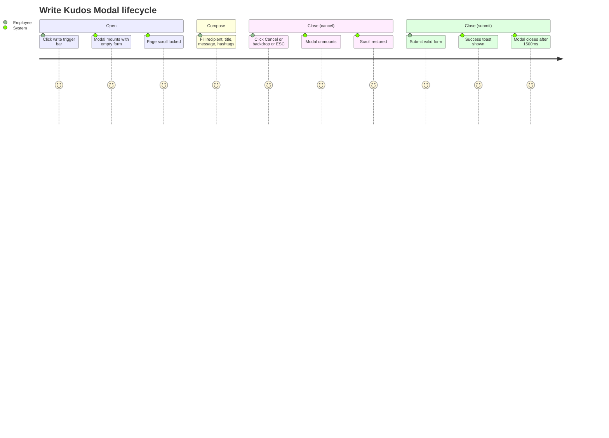
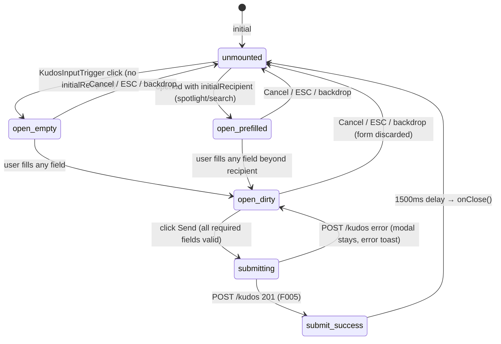

# Feature Specification: F010_WriteKudosModal

**Priority**: P1
**Type**: ui
**Generated**: 2026-06-01

## Overview

Modal dialog for composing a kudos, mounted on demand from the left half of `KudosInputTrigger` in `REG003_AllKudosFeed`. Opens with no pre-filled recipient when triggered from the write trigger bar; opens with `initialRecipient` pre-filled when launched from spotlight hover card (F039) or kudos bar search (F018). Supports three close gestures: Cancel button, Escape key, backdrop click. Houses the full compose form (recipient search, title input, Tiptap rich-text editor, hashtag selector, image upload, anonymous toggle) but this feature spec covers only the **modal open/close lifecycle** — form submission is owned by F005, image upload by F011, anonymous toggle by F012, recipient search in modal by F035.

## Why This Exists

The modal is the compose entrypoint for all kudos creation flows. It decouples the trigger (where a user starts) from the form (what they fill in), allowing the same form to be pre-filled from multiple surfaces.

## Who Uses It

- **Authenticated employee** — opens modal from kudos input trigger bar to compose a new kudos (no PERM codes required for open/close; PERM001 enforced on submit by F005)

## Business Workflow

```
1. User clicks left half of KudosInputTrigger (write trigger bar) on /kudos → setShowWriteModal(true) in KudosInputTrigger; WriteKudosModal mounts with initialRecipient=null.
2. Modal mounts: document.body.style.overflow='hidden' (scroll lock); ESC keydown listener registered.
3. User fills form (recipient, title, message, hashtags — handled by F005/F011/F012/F035).
4. Close paths:
   a. Cancel button click → onClose()
   b. Backdrop click (e.target === e.currentTarget) → onClose()
   c. Escape key → keydown handler → onClose()
5. onClose(): parent sets showWriteModal=false; modal unmounts; body scroll restored.
6. On successful submit (F005): onSuccess() fires first → window.dispatchEvent(kudos:created); then 1500ms delay → onClose().
```

## Screen Flow

**See:** ScreenFlow § F010_WriteKudosModal

| Screen | Route | Purpose |
|--------|-------|---------|
| SCR007_KudosPage/REG003_AllKudosFeed | `/kudos` | Modal trigger bar; modal rendered as overlay |



## Cross-Cutting Logic

### Requirements

| Code | Description | Endpoint/Handler | Verifiable |
|------|-------------|------------------|------------|
| FR-001 | Mount modal with no pre-filled recipient when opened from write trigger bar | N/A (client state) via `KudosInputTrigger` | yes |
| FR-002 | Mount modal with pre-filled recipient when opened from spotlight/search | N/A (client state) via `initialRecipient` prop | yes |
| FR-003 | Close modal via Cancel button, Escape key, or backdrop click | N/A (client event handlers) | yes |
| FR-004 | Lock page scroll on mount; restore on unmount | N/A (document.body.style.overflow) | yes |
| FR-005 | Dispatch `kudos:created` window event on successful submit; close after 1500ms delay | client-side via `KudosInputTrigger::onSuccess` | yes |

### Business Rules

### BR-001_ModalScrollLock
**Source:** `frontend/components/kudos/write-kudos-modal.tsx:68-71`
**Applies to:** WriteKudosModal mount/unmount
**Linked FR:** FR-004
**Rule:** On mount, sets `document.body.style.overflow = 'hidden'` to prevent background scroll while modal is open. Cleanup function restores `overflow = ''` on unmount — guarantees restoration even if modal is closed abruptly.

**Pseudocode:**
```ts
useEffect(() => {
  document.body.style.overflow = 'hidden';
  return () => { document.body.style.overflow = ''; };
}, []);
```

### BR-002_EscapeKeyClose
**Source:** `frontend/components/kudos/write-kudos-modal.tsx:61-65`
**Applies to:** WriteKudosModal while mounted
**Linked FR:** FR-003
**Rule:** Registers a `keydown` listener on `document` (not `window`) for `e.key === 'Escape'`; calls `onClose()`. Listener removed on unmount. Works from any focused element inside the modal.

**Pseudocode:**
```ts
useEffect(() => {
  const handler = (e: KeyboardEvent) => { if (e.key === 'Escape') onClose(); };
  document.addEventListener('keydown', handler);
  return () => document.removeEventListener('keydown', handler);
}, [onClose]);
```

### BR-003_BackdropClickClose
**Source:** `frontend/components/kudos/write-kudos-modal.tsx:159`
**Applies to:** WriteKudosModal backdrop div
**Linked FR:** FR-003
**Rule:** The outermost backdrop div has `onClick={(e) => { if (e.target === e.currentTarget) onClose(); }}`. Only direct clicks on the backdrop (not on the modal card) trigger close — prevents accidental close when clicking inside the modal.

**Pseudocode:**
```ts
<div className="fixed inset-0 z-50 ..." onClick={(e) => {
  if (e.target === e.currentTarget) onClose();
}}>
  <div className="modal-card" onClick={/* stops here, e.currentTarget !== backdrop */}>
```

### BR-004_SubmitCloseDelay
**Source:** `frontend/components/kudos/write-kudos-modal.tsx:133-135`
**Applies to:** WriteKudosModal post-submit
**Linked FR:** FR-005
**Rule:** After successful POST /kudos, toast is shown for 3000ms (`showMessage`) and modal closes after 1500ms (`setTimeout(() => { onSuccess?.(); onClose(); }, 1500)`). The 1500ms delay lets the user read the success toast before the modal disappears. `onSuccess` fires before `onClose` in the same callback.

**Pseudocode:**
```ts
showMessage(t.writeKudosSuccessToast);
setTimeout(() => { onSuccess?.(); onClose(); }, 1500);
```

### BR-005_SendButtonDisabledState
**Source:** `frontend/components/kudos/write-kudos-modal.tsx:148-149`
**Applies to:** Send button in WriteKudosModal
**Linked FR:** FR-001 (form readiness gate)
**Rule:** Send button is disabled (`cursor-not-allowed`, muted colors) when any of: `submitting`, `!recipient`, `!title.trim()`, `!getContentText()`, `hashtags.length === 0`. All four required fields must be non-empty AND the form must not be mid-submission.

**Pseudocode:**
```ts
const isSubmitDisabled =
  submitting || !recipient || !title.trim() || !getContentText() || hashtags.length === 0;
```

### State Machines

### SM-001_ModalLifecycle
**Source:** `frontend/components/kudos/write-kudos-modal.tsx:32-369`
**Linked FR:** FR-001, FR-002, FR-003, FR-004
**States:** unmounted, open-empty, open-prefilled, open-dirty, submitting, submit-success, closed



**Transition rules:**
- `unmounted → open_*`: side effects = mount component, lock scroll, register ESC listener
- `open_* → unmounted`: side effects = unlock scroll, remove ESC listener, destroy Tiptap editor
- `open_dirty → submitting`: guard = !isSubmitDisabled; side effects = setSubmitting(true), call POST
- `submitting → submit_success`: side effects = showMessage(successToast), setTimeout(1500, onSuccess+onClose)
- `submitting → open_dirty`: side effects = showMessage(errorToast), setSubmitting(false)

### Algorithms

None.

### External Integrations

None.

## User Stories

### US021_OpenWriteKudosModal — Open Write Kudos Modal (Priority: P0)

**What happens:** User clicks the left half of the `KudosInputTrigger` bar (the write kudos trigger) on the Kudos page. `setShowWriteModal(true)` in `KudosInputTrigger` mounts `WriteKudosModal` with `initialRecipient=null`. The modal renders with all fields empty. It is scrollable on small screens (overflow-y-auto on backdrop). It can be closed via Cancel button, Escape key, or backdrop click without any API call.
**Why this priority:** Modal open is the prerequisite for any kudos creation; it is the gateway to F005.
**Independent Test:** Click write trigger → modal opens with empty form; press Escape → modal closes; click backdrop → modal closes; click Cancel → modal closes.

**Acceptance Scenarios:**

1. **Given** authenticated user on /kudos, **When** clicks write kudos trigger (left half of KudosInputTrigger), **Then** WriteKudosModal mounts with all fields empty; page scroll locked.
2. **Given** modal is open, **When** user presses Escape key, **Then** modal unmounts; page scroll restored; feed unchanged.
3. **Given** modal is open, **When** user clicks backdrop area (outside modal card), **Then** modal unmounts.
4. **Given** modal is open, **When** user clicks Cancel button, **Then** modal unmounts.
5. **Given** modal is open on small screen, **When** content exceeds viewport height, **Then** modal content is scrollable (overflow-y-auto on backdrop container).

**Requirements fulfilled:**
- **FR-001** Modal mounts with empty form from trigger bar — `KudosInputTrigger::onClick` (kudos-input-trigger.tsx:107-112) sets showWriteModal=true; initialRecipient=null
- **FR-003** Close via Cancel / ESC / backdrop — write-kudos-modal.tsx:61-65 (ESC), 159 (backdrop), 328-336 (Cancel button)
- **FR-004** Scroll lock on mount / restore on unmount — write-kudos-modal.tsx:68-71

**Rules enforced:**

### BR-006_TiptapEditorCleanup
**Source:** `frontend/components/kudos/write-kudos-modal.tsx:73-74`
**Applies to:** WriteKudosModal unmount
**Linked FR:** FR-003
**Rule:** Tiptap editor instance is explicitly destroyed on unmount via `useEffect(() => () => { editor?.destroy(); }, [editor])`. Without this, the editor's ProseMirror DOM nodes and event listeners would leak. Critical because the modal is conditionally rendered — it mounts/unmounts on each open/close cycle.

**Pseudocode:**
```ts
useEffect(() => () => { editor?.destroy(); }, [editor]);
```

**State transitions:** SM-001_ModalLifecycle (see Cross-Cutting Logic)

**Verification:**
- **SC-001** Modal renders with `role="dialog"` and `aria-modal="true"` (write-kudos-modal.tsx:161-162) (covers FR-001)
- **SC-002** document.body.style.overflow is 'hidden' while modal is open; '' after close (covers FR-004)
- **SC-003** Cancel button, Escape key, and backdrop all invoke onClose; modal unmounts (covers FR-003)
- **SC-004** Opening modal from trigger bar shows all fields empty; recipient field shows placeholder (covers FR-001)

---

### Edge Cases

| Scenario | Behavior |
|----------|----------|
| Modal opened then immediately closed (no fields filled) | form state discarded on unmount; no API call made |
| User opens modal, partially fills form, presses Escape | modal closes without confirmation prompt; all form state lost |
| Modal opened with `initialRecipient` set (from F018/F039) | recipient chip pre-populated from `useState(initialRecipient)` (write-kudos-modal.tsx:36); other fields empty |
| Two modal triggers fired rapidly (double-click) | `KudosInputTrigger` renders single modal via `{showWriteModal && <WriteKudosModal .../>}` — second render replaces first; effectively only one modal at a time |
| Submit succeeds but `onSuccess` callback throws | `setTimeout` callback executes both `onSuccess?.()` (optional chain) and `onClose()` — onClose fires regardless; error in onSuccess is uncaught |

## Key Entities

No database entities are read or written by this feature's open/close scope. Form submit (F005) writes to `kudos` and `kudos_hashtag` tables.

| Entity | Table | Key Columns | Purpose |
|--------|-------|-------------|---------|
| N/A — modal lifecycle only | — | — | Open/close does not interact with the DB |

## Related Artifacts

- **Screens** (from ScreenList): SCR007_KudosPage/REG003_AllKudosFeed
- **User Stories** (from UserStories): US021_OpenWriteKudosModal
- **Routes** (from RouteList): none (modal open/close is client-side only)
- **Data Models** (from DataModel): none
- **Background Logic** (from BackgroundLogic): none
- **Permissions** (from Permissions): none (open/close; PERM001 enforced on submit by F005)

## Spec Documents

- [x] [System Overview](../../system-overview.md) — stateless frontend, Next.js App Router, client components
- [x] [Feature List](../../feature-list.md) — F010_WriteKudosModal
- [x] [User Stories](../../user-stories.md) — US021_OpenWriteKudosModal
- [ ] [Route List](../../route-list.md) — no routes owned by this feature
- [ ] [Data Model](../../data-model.md) — no models owned by this feature
- [ ] [Permissions](../../permissions.md) — no permissions owned by this feature
- [ ] [Screen List](../../screen-list.md) — SCR007/REG003
- [ ] [Screen Flow](../../screen-flow.md)
- [ ] [Background Logic](../../background-logic.md) — none applicable

## Assumptions

- F010 owns only the modal open/close lifecycle. The form fields and submit are owned by:
  - F005_SubmitKudos — Send button, POST /kudos, success/error toasts
  - F011_KudosImageUpload — image picker, POST /kudos/images, thumbnail previews
  - F012_KudosAnonymous — anonymous checkbox, alias input
  - F035_RecipientSearchModal — recipient search field, GET /users, chip display
- `WriteKudosModal` is a 'use client' component rendered conditionally by `KudosInputTrigger` (`kudos-input-trigger.tsx:207-219`). It is not a Next.js parallel route or intercepting route — it is a plain React conditional render. Contrast with `SCR008_KudosDetailModal` which uses Next.js parallel routes.
- The `isSubmitDisabled` check (BR-005) runs synchronously on every render because it references `editor?.getText().trim()` via `getContentText()`. Tiptap's `editor.getText()` is a synchronous in-memory operation — no async IO involved.

## Source Code References

| Symbol | Path | Purpose |
|--------|------|---------|
| `WriteKudosModal` | `frontend/components/kudos/write-kudos-modal.tsx:32-369` | Full modal component: state, lifecycle, form shell |
| `WriteKudosModal` (ESC handler) | `frontend/components/kudos/write-kudos-modal.tsx:61-65` | Escape key close |
| `WriteKudosModal` (scroll lock) | `frontend/components/kudos/write-kudos-modal.tsx:68-71` | Body overflow management |
| `WriteKudosModal` (editor cleanup) | `frontend/components/kudos/write-kudos-modal.tsx:73-74` | Tiptap destroy on unmount |
| `WriteKudosModal` (backdrop) | `frontend/components/kudos/write-kudos-modal.tsx:157-162` | Backdrop click close |
| `WriteKudosModal` (submit delay) | `frontend/components/kudos/write-kudos-modal.tsx:133-135` | 1500ms close-after-success |
| `KudosInputTrigger` | `frontend/components/kudos/kudos-input-trigger.tsx:100-222` | Trigger bar host; mounts WriteKudosModal |

## Unresolved Questions

1. **No close confirmation on dirty form**: if the user has partially filled the form (e.g., typed a message) and presses Escape, all data is silently lost. No "are you sure?" guard exists. Confirm this is intentional UX.
2. **`onSuccess` dispatch location**: `kudos:created` is dispatched in `KudosInputTrigger::onSuccess` (`kudos-input-trigger.tsx:215`) — not inside `WriteKudosModal` itself. This means if `WriteKudosModal` is mounted from a different parent (e.g., spotlight's `SpotlightWordCloud`), `kudos:created` is NOT dispatched on success (the spotlight parent passes `onSuccess={() => setWriteTarget(null)}`). Feed and highlight sections will not auto-refresh after submitting from spotlight. Confirm expected behavior.
