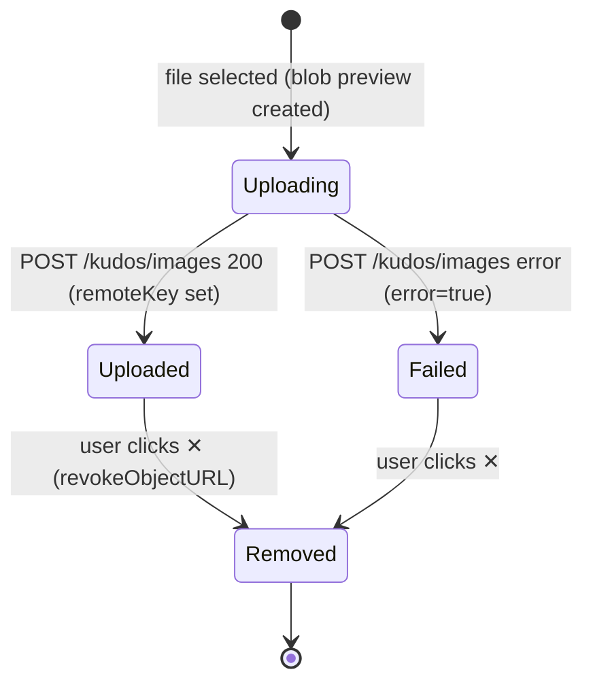

# Feature Specification: F011_KudosImageUpload

**Priority**: P1
**Type**: ui
**Generated**: 2026-06-01

## Overview

Kudos Image Upload lets an authenticated user attach up to 5 images to a kudos while composing in WriteKudosModal. Each file is immediately previewed as a thumbnail; uploads are fired concurrently to `POST /kudos/images` (multipart). The returned S3 key is held in form state and submitted with `POST /kudos`. Failed uploads show a red overlay; removing an image is client-side only — no S3 DELETE is issued. This feature touches the `ImageUploadPreview` React component (frontend) and `KudosController.uploadImage` + `S3Service.upload` (backend).

## Why This Exists

Rich peer-recognition benefits from visual context (team photos, screenshots of achievements). Allowing image attachments increases the expressiveness and engagement value of a kudos post.

## Who Uses It

- **Authenticated employee** — attaches visual content to a kudos they are composing (PERM001_BackendJwtRouteGuard, PERM004_S3ImageKeyOwnership)

## Business Workflow

```
1. User opens WriteKudosModal and clicks the image "add" button (addLabel) →
   native file picker opens (accept="image/*", multiple).
2. User selects ≤5 files → ImageUploadPreview.handleFiles() creates blob preview
   URLs and appends UploadedImage entries with uploading=true to parent state.
3. Each file is concurrently POSTed to POST /kudos/images (multipart/form-data,
   Bearer token in Authorization header; no Content-Type override to preserve
   multipart boundary).
4. On success, backend KudosController.uploadImage scopes key to
   kudos-images/<user.email>/<uuid>.<ext> via S3Service.upload, returns { key, url }.
5. Frontend updates UploadedImage entry: remoteKey=key, remoteUrl=url, uploading=false.
6. On upload error (non-2xx), entry is marked error=true; red overlay rendered.
7. User may click ✕ on any thumbnail → removeImage() revokes blob URL, splices
   UploadedImage from state. No HTTP DELETE call is made to S3.
8. When WriteKudosModal submits, only entries with remoteKey !== null && !error
   are included in CreateKudosDto.imageKeys[].
9. KudosService.create() validates each key starts with kudos-images/<user.email>/;
   violation → 400 BadRequestException.
```

## Screen Flow

**See:** ScreenFlow § F011_KudosImageUpload

| Screen | Route | Purpose |
|--------|-------|---------|
| SCR007_KudosPage/REG003_AllKudosFeed | `/kudos` | WriteKudosModal housing the image upload UI |

## Cross-Cutting Logic

### Requirements

| Code | Description | Endpoint/Handler | Verifiable |
|------|-------------|------------------|------------|
| FR-001 | Upload endpoint accepts multipart file, scopes key to user email, returns `{ key, url }` | `POST /kudos/images` via `KudosController::uploadImage` | yes |
| FR-002 | Frontend sends no Content-Type header so browser sets multipart boundary automatically | client `ImageUploadPreview::uploadImageFile` | yes |

### Business Rules

None.

### State Machines

None.

### Algorithms

None.

### External Integrations

None.

### Verification

- **SC-001** — Upload returns HTTP 200 with `{ key, url }` fields (covers FR-001)
- **SC-002** — Network tab shows `Content-Type: multipart/form-data; boundary=…` set by browser (covers FR-002)

## User Stories

### US024_UploadImageInModal — Upload Image in Write Kudos Modal (Priority: P1)

**What happens:** An employee composing a kudos clicks the add-image button, selects image files, and sees each file immediately previewed with a spinner; files upload concurrently to S3; successful keys are held for kudos submission; add button disappears at 5 images.
**Why this priority:** Image attachments are a P1 enrichment feature; without upload mechanics the attachment slot is non-functional.
**Independent Test:** Open WriteKudosModal → click add image → select a JPEG → confirm thumbnail visible with spinner → spinner disappears and no error overlay visible → submit kudos → verify `imageUrls` is non-empty in response.

**Acceptance Scenarios:**

1. **Given** modal is open with 0 images, **When** user selects 3 files, **Then** 3 thumbnails render with spinners; spinners clear on upload success; add button still visible (5-3=2 slots remain).
2. **Given** 5 images attached, **When** user inspects UI, **Then** add button is absent (hidden; `canAdd = images.length < MAX_IMAGES` is false).
3. **Given** backend returns 500 for one upload, **When** upload resolves, **Then** that thumbnail shows red error overlay (`error=true`); other thumbnails unaffected.

**Requirements fulfilled:**
- **FR-003** File picker accepts `image/*`, supports multiple selection — `input[type=file accept="image/*" multiple]` via `ImageUploadPreview`
- **FR-004** Concurrent upload — each file fired via `Promise.all(toProcess.map(...))` in `ImageUploadPreview::handleFiles`
- **FR-005** Add button hidden when `images.length >= 5` — `canAdd` flag in `ImageUploadPreview`

**Rules enforced:**

### BR-001_MaxFiveImagesPerKudos
**Source:** `frontend/components/kudos/image-upload-preview.tsx:5`
**Linked FR:** FR-003
**Applies to:** `ImageUploadPreview` component / `POST /kudos/images` form state
**Rule:** At most 5 images may be attached per kudos. The add button is hidden once `images.length >= MAX_IMAGES` (5). `handleFiles` slices incoming `FileList` to `remaining = MAX_IMAGES - images.length` to silently ignore excess files.

**Pseudocode:**
```ts
const MAX_IMAGES = 5
const remaining = MAX_IMAGES - images.length
const toProcess = Array.from(files).slice(0, remaining)
if (toProcess.length === 0) return
```

### BR-002_MimeTypeAllowlist
**Source:** `backend/src/kudos/kudos.controller.ts:30,114-121`
**Linked FR:** FR-003
**Applies to:** `POST /kudos/images` — Multer `fileFilter`
**Rule:** Only `image/jpeg`, `image/png`, `image/gif`, `image/webp` are accepted. Other MIME types → `BadRequestException('Only image files are allowed (jpg, png, gif, webp)')` → HTTP 400.

**Pseudocode:**
```ts
const ALLOWED_MIME = /^image\/(jpeg|png|gif|webp)$/
fileFilter: (_, file, cb) => {
  if (!ALLOWED_MIME.test(file.mimetype))
    return cb(new BadRequestException('Only image files are allowed...'), false)
  cb(null, true)
}
```

### BR-003_FileSizeLimit
**Source:** `backend/src/kudos/kudos.controller.ts:28,112`
**Linked FR:** FR-001
**Applies to:** `POST /kudos/images` — Multer `limits`
**Rule:** File size must not exceed 5 MB (`MAX_IMAGE_SIZE = 5 * 1024 * 1024`). Multer rejects oversized files before the handler runs; results in a 413-class Multer error.

**Pseudocode:**
```ts
const MAX_IMAGE_SIZE = 5 * 1024 * 1024  // 5 MB
FileInterceptor('file', { limits: { fileSize: MAX_IMAGE_SIZE } })
```

### BR-004_KeyScopedToUploader
**Source:** `backend/src/kudos/kudos.controller.ts:132-134`
**Linked FR:** FR-001
**Applies to:** `POST /kudos/images` → `S3Service.upload`
**Rule:** The S3 key is always scoped to `kudos-images/<req.user.email>/<uuid>.<ext>`, binding ownership to the uploading user. This prefix is later validated on `POST /kudos` (PERM004).

**Pseudocode:**
```ts
const folder = `kudos-images/${req.user.email}`
const key = await this.s3.upload(file, folder)
// key = kudos-images/<email>/<uuid>.<ext>
```

**State transitions:**

### SM-001_UploadedImageLifecycle
**Source:** `frontend/components/kudos/image-upload-preview.tsx:62-94`
**Linked FR:** FR-001
**States:** Pending, Uploading, Uploaded, Failed, Removed



**Transition rules:**
- `Uploading → Uploaded`: guard = HTTP 200 from `/kudos/images`; side effects = `remoteKey` and `remoteUrl` set, spinner hidden
- `Uploading → Failed`: guard = non-2xx or network error; side effects = `error=true`, red overlay shown
- `Uploaded/Failed → Removed`: guard = user clicks ✕; side effects = `URL.revokeObjectURL(previewUrl)`, entry spliced from state

**External integrations:**

### INT-001_S3ImageUpload
**Source:** `backend/src/s3/s3.service.ts:32-46`
**Linked FR:** FR-001
**Type:** api-call
**Target:** AWS S3 (`PutObjectCommand`)
**Trigger:** `KudosController.uploadImage` receives a valid multipart file
**Payload:** `{ Bucket, Key: kudos-images/<email>/<uuid>.<ext>, Body: file.buffer, ContentType: file.mimetype }`
**Failure handling:** S3 SDK throws; Multer/NestJS propagates as 500 Internal Server Error; no retry logic in service.

**Pseudocode:**
```ts
const key = `${folder}/${randomUUID()}.${ext}`
await s3Client.send(new PutObjectCommand({
  Bucket: bucket, Key: key,
  Body: file.buffer, ContentType: file.mimetype
}))
return key
```

**Verification:**
- **SC-003** POST `/kudos/images` with a valid JPEG returns `{ key: "kudos-images/<email>/...", url: "https://..." }` (covers FR-001, BR-004)
- **SC-004** POST `/kudos/images` with `image/bmp` returns HTTP 400 with message containing "Only image files are allowed" (covers BR-002)
- **SC-005** Thumbnail shows spinner while upload in flight, clears on success (covers SM-001 Uploading→Uploaded)

---

### US025_RemoveImageFromModal — Remove Uploaded Image from Modal (Priority: P2)

**What happens:** After attaching images, the user clicks ✕ on a thumbnail to discard it from the form without contacting S3. The slot is freed so another image can be added (up to the 5-image cap).
**Why this priority:** Correctability before submit. Low risk / low effort; image count rarely exceeds 5.
**Independent Test:** Attach 2 images → click ✕ on image 1 → confirm only 1 thumbnail remains → confirm add button reappears.

**Acceptance Scenarios:**

1. **Given** 5 images attached (add button hidden), **When** user removes one, **Then** add button reappears and thumbnail count is 4.
2. **Given** 1 image in Failed state, **When** user clicks ✕, **Then** image removed from list; no DELETE request observed in network tab.

**Requirements fulfilled:**
- **FR-006** Remove button visible on every thumbnail — `button[aria-label="Remove image N"]` rendered per entry
- **FR-007** Removal is client-side only — `removeImage()` splices state and revokes blob URL; no S3 DELETE call

**Rules enforced:** BR-001 (see US024) — after removal the slot count decreases, making add button reappear.

**Verification:**
- **SC-006** After removing an image, `images.length` decreases by 1 and no HTTP request is sent (covers FR-007, BR-001)

---

### Edge Cases

| Scenario | Behavior |
|----------|----------|
| Non-image file type uploaded | HTTP 400: "Only image files are allowed (jpg, png, gif, webp)" |
| File > 5 MB | Multer rejects before handler; HTTP 413 / Multer payload error |
| User selects 10 files at once with 2 slots remaining | `handleFiles` silently slices to 2; only first 2 are processed |
| Upload network error (offline) | Thumbnail transitions to Failed state; red overlay shown; no crash |
| All 5 images in Failed state at submit time | `imageKeys` array is empty (all filtered out); kudos submitted without images |
| S3 key from another user's upload in `imageKeys` | `POST /kudos` returns HTTP 400: "One or more image keys do not belong to the current user" |

## Key Entities

| Entity | Table | Key Columns | Purpose |
|--------|-------|-------------|---------|
| Kudos | `kudos` | `id`, `imageKeys` (text/simple-array), `senderEmail` | Stores comma-separated S3 keys submitted with the post |
| User | `user` | `email` | Scopes S3 upload prefix; ownership validation |
| S3 Object | _(AWS S3 bucket)_ | key = `kudos-images/<email>/<uuid>.<ext>` | Stores actual image bytes; presigned GET URL generated per read |

## Related Artifacts

- **Screens**: SCR007_KudosPage/REG003_AllKudosFeed
- **User Stories**: US024_UploadImageInModal, US025_RemoveImageFromModal
- **Routes**: (POST) /kudos/images, (POST) /kudos
- **Data Models**: MODEL002 — Kudos
- **Background Logic**: _(none)_
- **Permissions**: PERM001_BackendJwtRouteGuard, PERM004_S3ImageKeyOwnership

## Spec Documents

- [x] [System Overview](../../system-overview.md) — architecture, S3 integration pattern
- [x] [Feature List](../../feature-list.md) — F011_KudosImageUpload, US024, US025, MODEL002, PERM001, PERM004
- [x] [User Stories](../../user-stories.md) — US024_UploadImageInModal, US025_RemoveImageFromModal
- [x] [Data Model](../../data-model.md) — MODEL002 (imageKeys column), MODEL002-V07
- [x] [Permissions](../../permissions.md) — PERM001_BackendJwtRouteGuard, PERM004_S3ImageKeyOwnership
- [ ] [Route List](../../route-list.md) — POST /kudos/images, POST /kudos
- [ ] [Screen List](../../screen-list.md) — SCR007_KudosPage/REG003_AllKudosFeed
- [ ] [Screen Flow](../../screen-flow.md)
- [ ] [Background Logic](../../background-logic.md) — none

## Assumptions

- S3 presigned GET URLs (1-hour TTL) are sufficient; no CDN caching layer exists, so images will re-request after expiry.
- The frontend does not issue a DELETE to S3 on image removal; orphaned S3 objects are accepted as a trade-off (no cleanup job exists per system-overview.md).
- `imageKeys` stored as TypeORM `simple-array` means commas in keys would corrupt the array; UUIDs used as key identifiers avoid this.
- Multer memory storage (not disk) is used; large files exhaust Node.js heap if many concurrent uploads hit the same instance.

## Source Code References

| Symbol | Path | Purpose |
|--------|------|---------|
| `KudosController::uploadImage` | `backend/src/kudos/kudos.controller.ts:108-137` | POST /kudos/images handler; Multer filter + S3 upload + presign |
| `S3Service::upload` | `backend/src/s3/s3.service.ts:32-46` | PutObjectCommand to S3; returns scoped key |
| `S3Service::getPresignedUrl` | `backend/src/s3/s3.service.ts:48-52` | GetObjectCommand presigned URL (1-hour TTL) |
| `ImageUploadPreview` | `frontend/components/kudos/image-upload-preview.tsx:1-177` | Full upload UI — file picker, concurrent upload, spinner/error states, remove |
| `WriteKudosModal` (image section) | `frontend/components/kudos/write-kudos-modal.tsx:289-299` | Hosts `ImageUploadPreview`; collects `remoteKey` values for DTO |

## Unresolved Questions

1. **Orphaned S3 objects**: No cleanup for uploaded but never-submitted images (user uploads then closes modal without submitting). Is this acceptable long-term storage cost?
2. **Presigned URL expiry in feed**: Cards loaded just before the 1-hour window closes may show broken images on slow connections. Should TTL be extended or CDN added?
3. **Multiple files on mobile**: `input[multiple]` behavior varies across iOS Safari versions — has this been tested on mobile Safari?
