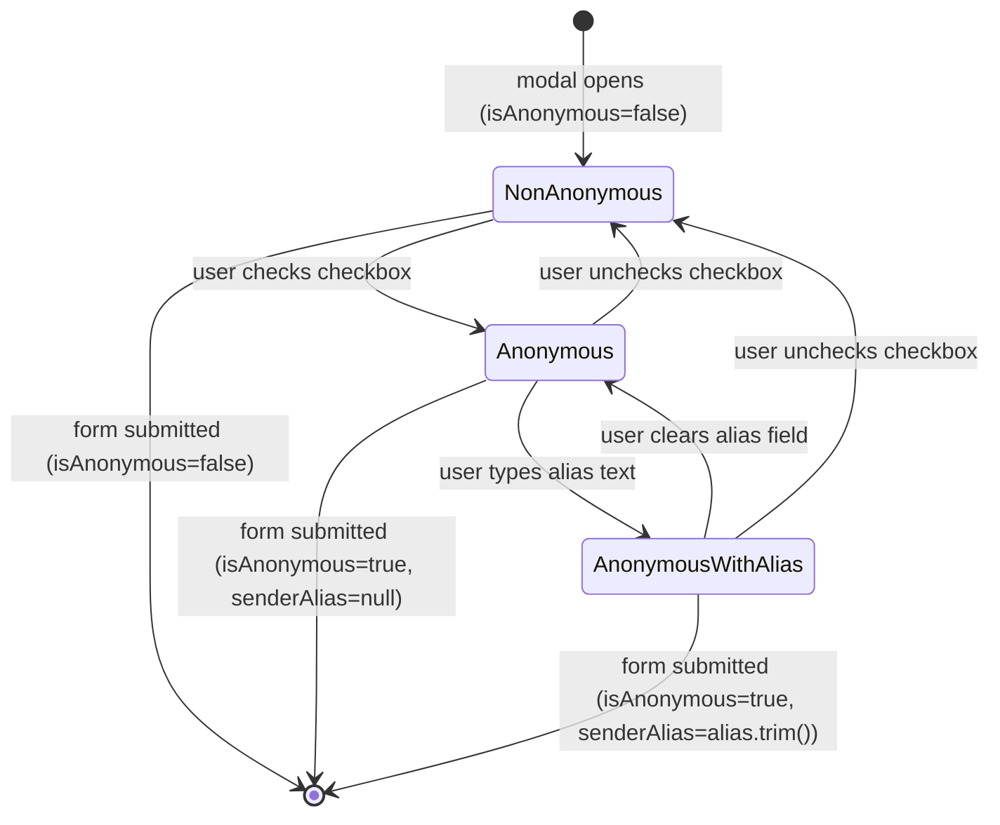

# Feature Specification: F012_KudosAnonymous

**Priority**: P1
**Type**: ui
**Generated**: 2026-06-01

## Overview

Anonymous Kudos Toggle lets a composing user mark their kudos as anonymous by checking a checkbox in WriteKudosModal. When checked, an optional alias input appears. On submission, `isAnonymous=true` (and optional `senderAlias`) is sent to `POST /kudos`. The backend's `KudosService.toCard()` permanently masks sender `name`, `email`, and `picture` in every read response for that kudos. This feature spans the anonymous checkbox + alias input in the frontend modal and the server-side masking logic in `kudos.service.ts`.

## Why This Exists

Some employees want to recognize a colleague without disclosing their own identity — e.g., to avoid social pressure or maintain impartiality. Anonymous mode satisfies this while still persisting the sender identity server-side for moderation purposes.

## Who Uses It

- **Authenticated employee (sender)** — opts into anonymity when composing a kudos (PERM005_AnonymousSenderMasking)
- **Any authenticated user (reader)** — receives masked sender data when viewing an anonymous kudos (PERM005_AnonymousSenderMasking)

## Business Workflow

```
1. User checks "anonymous" checkbox in WriteKudosModal → isAnonymous state = true →
   alias input field renders (optional free-text, max 100 chars per CreateKudosDto).
2. User optionally enters a senderAlias (e.g., "Night Owl"); unchecking hides alias input
   and senderAlias is not submitted.
3. WriteKudosModal.handleSubmit() builds CreateKudosDto:
   { isAnonymous: true, senderAlias: alias.trim() || undefined }.
4. POST /kudos received by KudosController.create() → KudosService.create():
   kudos.isAnonymous = true, kudos.senderAlias = dto.senderAlias ?? null saved to
   kudos table.
5. On any subsequent read (GET /kudos, GET /kudos/:id, GET /kudos/highlight,
   GET /kudos/profile/:email), KudosService.toCard() checks kudos.isAnonymous:
   if true → senderDto.name = senderAlias ?? 'Ẩn danh', email = '', picture = ''.
6. Masked KudosCardDto is returned to all callers — including the original sender.
   No privilege escalation exists to reveal real identity.
```

## Screen Flow

**See:** ScreenFlow § F012_KudosAnonymous

| Screen | Route | Purpose |
|--------|-------|---------|
| SCR007_KudosPage/REG003_AllKudosFeed | `/kudos` | WriteKudosModal housing the anonymous toggle and alias input |

## Cross-Cutting Logic

### Requirements

| Code | Description | Endpoint/Handler | Verifiable |
|------|-------------|------------------|------------|
| FR-001 | Sender masking applied on ALL kudos read endpoints when `isAnonymous=true` | `GET /kudos`, `GET /kudos/highlight`, `GET /kudos/:id`, `GET /kudos/profile/:email` via `KudosService::toCard` | yes |

### Business Rules

### BR-001_AnonymousMaskingInToCard
**Source:** `backend/src/kudos/kudos.service.ts:74-82`
**Linked FR:** FR-001
**Applies to:** All kudos read endpoints — `findAll`, `findOne`, `findHighlight`, `getProfile`
**Rule:** When `kudos.isAnonymous === true`, the sender DTO fields are replaced: `name → senderAlias ?? 'Ẩn danh'`, `email → ''`, `picture → ''`. All other fields (receiver, message, hashtags, likeCount, imageUrls) are returned unmasked. Even the original sender receives the masked view.

**Pseudocode:**
```ts
const senderDto = kudos.isAnonymous
  ? { ...toUserDto(kudos.sender),
      name: kudos.senderAlias ?? 'Ẩn danh',
      email: '',
      picture: '' }
  : toUserDto(kudos.sender)
```

### State Machines

None.

### Algorithms

None.

### External Integrations

None.

### Verification

- **SC-001** — Anonymous kudos returned by any read endpoint has `sender.email === ''` and `sender.picture === ''` (covers FR-001, BR-001)
- **SC-002** — Anonymous kudos with alias "Night Owl" shows `sender.name === 'Night Owl'`; without alias shows `sender.name === 'Ẩn danh'` (covers BR-001)

## User Stories

### US026_ToggleAnonymousInModal — Toggle Anonymous Mode in Write Kudos Modal (Priority: P1)

**What happens:** A composing user checks the anonymous checkbox; an alias input appears. On submit, `isAnonymous: true` is POSTed; the backend stores the flag and alias, then permanently masks sender identity fields in all read responses for that kudos.
**Why this priority:** Privacy is a meaningful social feature for peer recognition; without it, some employees won't send kudos. Maps to a core product value promise.
**Independent Test:** Check anonymous toggle → type alias "Owl" → submit → retrieve kudos via `GET /kudos` → assert `sender.name === "Owl"`, `sender.email === ""`, `sender.picture === ""`.

**Acceptance Scenarios:**

1. **Given** modal is open, **When** user checks the anonymous checkbox, **Then** alias input field becomes visible below the checkbox.
2. **Given** anonymous checked with alias "Night Owl", **When** form is submitted, **Then** kudos created with `isAnonymous=true`, `senderAlias="Night Owl"`; feed cards display "Night Owl" as sender name with empty avatar.
3. **Given** anonymous checked but alias left blank, **When** form is submitted, **Then** kudos created with `isAnonymous=true`, `senderAlias=null`; feed cards display "Ẩn danh" as sender name.
4. **Given** anonymous checked, **When** user unchecks it, **Then** alias input disappears; `isAnonymous=false` on submit; real sender name shown on card.

**Requirements fulfilled:**
- **FR-002** Checkbox renders in WriteKudosModal anonymous section — `input[type=checkbox]` bound to `isAnonymous` state (`write-kudos-modal.tsx:302-311`)
- **FR-003** Alias input conditional on `isAnonymous === true` — `{isAnonymous && <input ... senderAlias />}` (`write-kudos-modal.tsx:313-321`)
- **FR-004** `senderAlias` only included in DTO when `isAnonymous && alias.trim()` — `write-kudos-modal.tsx:128`

**Rules enforced:**

### BR-002_SenderAliasStoredNullWhenNotAnonymous
**Source:** `backend/src/kudos/kudos.service.ts:427`
**Linked FR:** FR-004
**Applies to:** `POST /kudos` → `KudosService.create()`
**Rule:** `senderAlias` is stored as `null` when `isAnonymous` is false, even if the DTO contains a value: `senderAlias: dto.isAnonymous ? (dto.senderAlias ?? null) : null`.

**Pseudocode:**
```ts
senderAlias: dto.isAnonymous ? (dto.senderAlias ?? null) : null
```

### BR-003_AliasMaxLength
**Source:** `backend/src/kudos/dto/create-kudos.dto.ts:37-40`
**Linked FR:** FR-003
**Applies to:** `POST /kudos` DTO validation
**Rule:** `senderAlias` is optional (`@IsOptional`), string (`@IsString`), max 100 chars (`@MaxLength(100)`). Violation → 400 from global `ValidationPipe`.

**Pseudocode:**
```ts
@IsOptional() @IsString() @MaxLength(100)
senderAlias?: string
```

**State transitions:**

### SM-001_AnonymousToggleLifecycle
**Source:** `frontend/components/kudos/write-kudos-modal.tsx:37,302-323`
**Linked FR:** FR-001
**States:** NonAnonymous, Anonymous, AnonymousWithAlias



**Transition rules:**
- `NonAnonymous → Anonymous`: guard = checkbox checked; side effects = alias input rendered
- `Anonymous → NonAnonymous`: guard = checkbox unchecked; side effects = alias input unmounted, `senderAlias` state cleared on next render
- `Anonymous/AnonymousWithAlias → [*]`: on submit, `isAnonymous=true` included in DTO; `senderAlias` included only if `alias.trim()` is non-empty

**Verification:**
- **SC-003** Checking checkbox renders alias `<input>` with placeholder text (covers FR-003, SM-001 NonAnonymous→Anonymous)
- **SC-004** `POST /kudos` payload contains `isAnonymous: true` when checkbox is checked (covers FR-002)
- **SC-005** `senderAlias` is absent from DTO payload when checkbox is unchecked (covers BR-002)

---

### Edge Cases

| Scenario | Behavior |
|----------|----------|
| `senderAlias` exceeds 100 chars | HTTP 400: class-validator `@MaxLength(100)` violation message |
| `isAnonymous=true` with `senderAlias=null` in DB | Read endpoints return `sender.name = 'Ẩn danh'` (null-coalescing fallback in `toCard`) |
| Sender queries their own anonymous kudos via `GET /kudos?sender=<email>` | Returned card still shows masked sender (no privilege escalation; `toCard` has no caller-identity check) |
| `isAnonymous` submitted as string `"true"` (e.g., from form data) | `@Transform` in DTO coerces `"true"` → `true`; treated as anonymous |
| Hashtag filter on highlight returns anonymous kudos | Masking applied equally; no leak via filter path |

## Key Entities

| Entity | Table | Key Columns | Purpose |
|--------|-------|-------------|---------|
| Kudos | `kudos` | `id`, `isAnonymous` (boolean), `senderAlias` (varchar, nullable), `senderEmail` | Stores anonymity flag and display alias; real sender email retained for moderation |
| User | `user` | `email`, `firstName`, `lastName`, `picture` | Real identity held server-side; masked in read DTOs when anonymous |

## Related Artifacts

- **Screens**: SCR007_KudosPage/REG003_AllKudosFeed
- **User Stories**: US026_ToggleAnonymousInModal
- **Routes**: (POST) /kudos
- **Data Models**: MODEL002 — Kudos
- **Background Logic**: _(none)_
- **Permissions**: PERM005_AnonymousSenderMasking

## Spec Documents

- [x] [System Overview](../../system-overview.md) — Decision 5: Anonymous Kudos via Alias
- [x] [Feature List](../../feature-list.md) — F012_KudosAnonymous, US026, MODEL002, PERM005
- [x] [User Stories](../../user-stories.md) — US026_ToggleAnonymousInModal
- [x] [Data Model](../../data-model.md) — MODEL002 (isAnonymous, senderAlias columns), MODEL002-V05, MODEL002-V06
- [x] [Permissions](../../permissions.md) — PERM005_AnonymousSenderMasking
- [ ] [Route List](../../route-list.md) — POST /kudos
- [ ] [Screen List](../../screen-list.md) — SCR007_KudosPage/REG003_AllKudosFeed
- [ ] [Screen Flow](../../screen-flow.md)
- [ ] [Background Logic](../../background-logic.md) — none

## Assumptions

- Sender identity is retained in the `kudos.senderEmail` column server-side; there is no mechanism currently to surface this to admins or the sender themselves — it exists solely for future moderation capability.
- No privacy deletion flow exists: if a sender later wants their anonymous kudos removed, there is no self-service delete endpoint.
- `isAnonymous=false` kudos with a non-null `senderAlias` in DB (edge case from manual data migration) will show the real name, not the alias, because `toCard` only applies the alias when `isAnonymous === true`.

## Source Code References

| Symbol | Path | Purpose |
|--------|------|---------|
| `KudosService::toCard` (masking block) | `backend/src/kudos/kudos.service.ts:74-82` | Replaces sender fields when `isAnonymous=true` |
| `KudosService::create` (alias storage) | `backend/src/kudos/kudos.service.ts:420-429` | Saves `isAnonymous` and conditional `senderAlias` to kudos row |
| `CreateKudosDto` (isAnonymous + senderAlias) | `backend/src/kudos/dto/create-kudos.dto.ts:29-40` | DTO validation: optional boolean + max-100 alias |
| `WriteKudosModal` (anonymous section) | `frontend/components/kudos/write-kudos-modal.tsx:302-323` | Checkbox and conditional alias input |
| `WriteKudosModal::handleSubmit` | `frontend/components/kudos/write-kudos-modal.tsx:109-139` | Builds DTO with `isAnonymous` and conditional `senderAlias` |

## Unresolved Questions

1. **Moderation access**: No admin UI or endpoint exposes the real sender of an anonymous kudos. Is there a planned escalation path for abuse reporting?
2. **Edit/delete**: Can a sender delete their own anonymous kudos? No delete endpoint exists — is this intentional or a gap?
