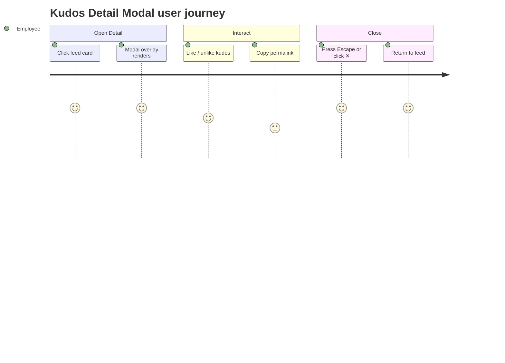
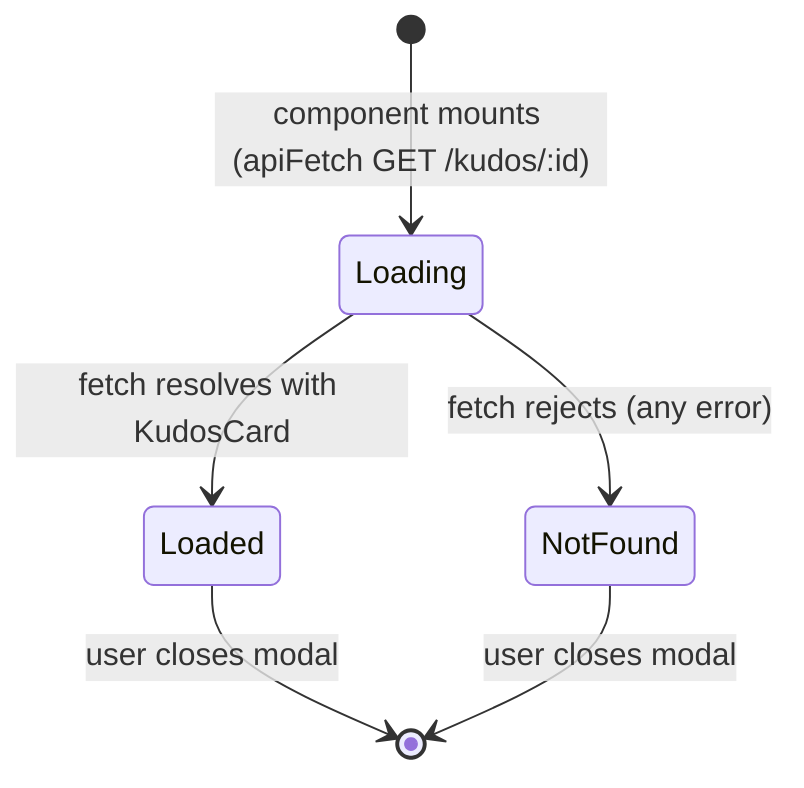
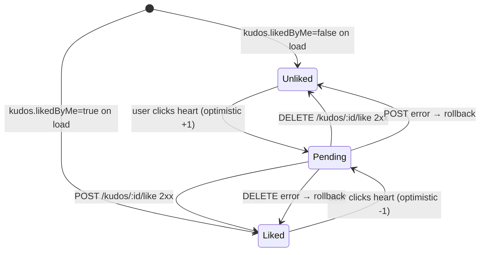

# Feature Specification: F013_KudosDetailModal

**Priority**: P1
**Type**: ui
**Generated**: 2026-06-01

## Overview

Kudos Detail Modal renders the full content of a single kudos in an overlay. It is triggered via Next.js parallel-route interception (`@modal/(.)kudos/[id]`) when navigating from the kudos feed, and falls back to a direct-URL page (`/kudos/[id]`) when accessed by permalink. The component fetches `GET /kudos/:id`, renders sender → receiver, sanitized HTML message, all attached images (no slice), full hashtag list, like count, and copy-link action. Close is supported via ✕ button, Escape key, or backdrop click. Like/unlike dispatches `kudos:liked` window event for cross-surface sync.

## Why This Exists

Kudos cards in feeds truncate the message for layout density. The detail modal exposes the full content and images without navigating away from the feed, preserving scroll position and improving shareability via permalink.

## Who Uses It

- **Authenticated employee** — opens a kudos detail from the feed or via a shared link to read full content, like, or copy the permalink (PERM001_BackendJwtRouteGuard, PERM005_AnonymousSenderMasking, PERM006_LikeUniquenessConstraint)

## Business Workflow

```
1. User clicks a kudos card in any feed surface → Next.js router navigates to
   /kudos/<id>; @modal parallel route intercepts and renders KudosDetailModal
   as an overlay on top of the feed.
2. KudosDetailModal mounts → apiFetch GET /kudos/:id with JWT Bearer token.
3. Backend KudosController.findOne → KudosService.findOne: loads kudos with
   sender/receiver relations, fetches hashtags from kudos_hashtag, checks
   likedByMe from like table for req.user.email → returns KudosCardDto
   (sender masked if isAnonymous=true per PERM005).
4. Component renders: loading spinner → DetailContent once data arrives.
5. DetailContent derives currentUserEmail from JWT payload in localStorage
   (client-side decode, no API call).
6. User clicks heart icon → optimistic toggle (likeCount ±1, liked state flipped)
   → POST or DELETE /kudos/:id/like → on error: rollback state + re-dispatch event.
7. kudos:liked CustomEvent dispatched on every toggle (optimistic and rollback)
   so feed cards and highlight carousel update their local state.
8. User clicks "Copy Link" → navigator.clipboard.writeText(<origin>/kudos/<id>)
   → toast shown for 2.5 s.
9. User closes via ✕ / Escape / backdrop → router.back() if history.length > 1,
   else router.push('/kudos', { scroll: false }).
```

## Screen Flow

**See:** ScreenFlow § F013_KudosDetailModal

| Screen | Route | Purpose |
|--------|-------|---------|
| SCR008_KudosDetailModal | `/kudos/:id` | Full kudos detail — modal overlay (intercepted) or standalone page (direct URL) |



## Cross-Cutting Logic

### Requirements

| Code | Description | Endpoint/Handler | Verifiable |
|------|-------------|------------------|------------|
| FR-001 | Fetch single kudos with full content including presigned image URLs | `GET /kudos/:id` via `KudosController::findOne` | yes |
| FR-002 | Sanitize rich HTML message before `dangerouslySetInnerHTML` render | `sanitizeHtml()` in `kudos-detail-modal.tsx:160` | yes |

### Business Rules

### BR-001_HtmlSanitizationBeforeRender
**Source:** `frontend/components/kudos/kudos-detail-modal.tsx:160`
**Linked FR:** FR-002
**Applies to:** `DetailContent` — message rendering
**Rule:** `kudos.message` (raw HTML from Tiptap) is passed through `sanitizeHtml()` from `lib/sanitize-html.ts` before being set via `dangerouslySetInnerHTML`. This prevents XSS from malicious anchor `href` or script injection stored in the message field.

**Pseudocode:**
```ts
const safeMessageHtml = useMemo(
  () => sanitizeHtml(kudos.message ?? ''),
  [kudos.message]
)
// <div dangerouslySetInnerHTML={{ __html: safeMessageHtml }} />
```

### BR-002_CloseNavigationStrategy
**Source:** `frontend/components/kudos/kudos-detail-modal.tsx:53-59`
**Linked FR:** FR-001
**Applies to:** Close handlers (✕ button, Escape key, backdrop click)
**Rule:** `handleClose` checks `window.history.length <= 1`; if true (direct permalink access with no prior history), navigates to `/kudos` via `router.push`. Otherwise calls `router.back()`. This ensures the modal always has a sensible dismiss target.

**Pseudocode:**
```ts
const handleClose = () => {
  if (window.history.length <= 1)
    router.push('/kudos', { scroll: false })
  else
    router.back()
}
```

### State Machines

### SM-001_ModalLoadState
**Source:** `frontend/components/kudos/kudos-detail-modal.tsx:30-51,85-104`
**Linked FR:** FR-001
**States:** Loading, Loaded, NotFound



**Transition rules:**
- `Loading → Loaded`: guard = `apiFetch` resolves; side effects = `kudos` state set, `loading=false`
- `Loading → NotFound`: guard = `apiFetch` rejects (404 or network); side effects = `kudos` remains null, `loading=false`, "Not found." text rendered

### SM-002_LikeToggleLifecycle
**Source:** `frontend/components/kudos/kudos-detail-modal.tsx:119-151`
**Linked FR:** FR-003
**States:** Unliked, Liked, Pending



**Transition rules:**
- `Unliked → Pending`: optimistic `liked=true`, `likeCount+1`; dispatches `kudos:liked` event; fires `POST /kudos/:id/like`
- `Liked → Pending`: optimistic `liked=false`, `likeCount-1`; dispatches `kudos:liked` event; fires `DELETE /kudos/:id/like`
- `Pending → Liked/Unliked` (success): no further state change needed (already optimistic)
- `Pending → rollback`: on API error, restore prior `liked`/`likeCount`; re-dispatch `kudos:liked` with original values

### Algorithms

None.

### External Integrations

None.

### Verification

- **SC-001** `GET /kudos/:id` returns full `KudosCardDto` including `imageUrls` presigned array (covers FR-001)
- **SC-002** Message HTML rendered in DOM matches output of `sanitizeHtml()` — no `<script>` tags present even if stored in message (covers FR-002, BR-001)
- **SC-003** Direct URL `/kudos/<id>` with no prior history → close → navigates to `/kudos` (covers BR-002)

## User Stories

### US033_LikeKudosFromDetailModal — Like or Unlike a Kudos from Detail Modal (Priority: P1)

**What happens:** An authenticated employee viewing the kudos detail modal clicks the heart icon to like or unlike the kudos. State updates optimistically; a `kudos:liked` event syncs the count on all other visible surfaces (feed, highlight).
**Why this priority:** Like parity across all surfaces is a core social interaction. Broken like state in the detail view creates confusing divergence.
**Independent Test:** Open detail modal for a kudos with `likedByMe=false` → click heart → assert count increments by 1 and heart is filled → check feed card for same kudos updates count via `kudos:liked` event.

**Acceptance Scenarios:**

1. **Given** detail modal open with `likedByMe=false`, **When** user clicks heart, **Then** count increments optimistically; `POST /kudos/:id/like` called; heart renders filled.
2. **Given** detail modal open with `likedByMe=true`, **When** user clicks heart, **Then** count decrements optimistically; `DELETE /kudos/:id/like` called; heart renders unfilled.
3. **Given** API returns error on like, **When** POST fails, **Then** count and heart state rolled back to pre-click values; `kudos:liked` re-dispatched with original values.
4. **Given** `currentUserEmail` is undefined (direct URL access without valid token), **When** user clicks heart, **Then** "Login required" toast shown (`t.loginRequired`); no API call made.

**Requirements fulfilled:**
- **FR-003** Like count + heart icon rendered in action row — `DetailContent` action row (`kudos-detail-modal.tsx:218-231`)
- **FR-004** Optimistic update with rollback on error — `handleLike` in `kudos-detail-modal.tsx:138-151`
- **FR-005** `kudos:liked` CustomEvent dispatched on every state change — `emitLikeChange` in `kudos-detail-modal.tsx:130-136`

**Rules enforced:**

### BR-003_LikeUniquenessEnforced
**Source:** `backend/src/kudos/kudos.service.ts:453-466`
**Linked FR:** FR-004
**Applies to:** `POST /kudos/:id/like`
**Rule:** Backend checks for existing `Like` row with `{kudosId, userEmail}`; duplicate → `ConflictException('Already liked')` → HTTP 409. Frontend optimistic state means the user will rarely see this; if encountered, the catch block rolls back UI state.

**Pseudocode:**
```ts
const existing = await likeRepo.findOne({ where: { kudosId, userEmail } })
if (existing) throw new ConflictException('Already liked')
// else save Like + increment likeCount
```

**Verification:**
- **SC-004** Like button click fires `POST /kudos/:id/like` and `kudos:liked` event with incremented count (covers FR-003, FR-004, FR-005)
- **SC-005** Double-click like (race) — second request gets HTTP 409; UI rolls back to single-liked state (covers BR-003)

---

### US034_CopyKudosLinkFromDetailModal — Copy Kudos Link from Detail Modal (Priority: P3)

**What happens:** Employee clicks "Copy Link" in the detail modal action row; `<origin>/kudos/<id>` is written to clipboard; a 2.5-second toast confirms success.
**Why this priority:** Sharing via permalink is a low-effort enhancement; no API dependency.
**Independent Test:** Open detail modal → click "Copy Link" → read clipboard → assert value equals `window.location.origin + '/kudos/' + kudos.id`.

**Acceptance Scenarios:**

1. **Given** detail modal open, **When** user clicks "Copy Link", **Then** clipboard contains `<origin>/kudos/<id>` and toast "Đã copy link" appears.

**Requirements fulfilled:**
- **FR-006** Copy permalink to clipboard — `handleCopyLink` via `navigator.clipboard.writeText` (`kudos-detail-modal.tsx:154-157`)
- **FR-007** Toast confirmation shown for 2.5 s — `showToast` / `t.copyLinkToast` (`kudos-detail-modal.tsx:156-157`)

**Rules enforced:** None.

**Verification:**
- **SC-006** After clicking "Copy Link", clipboard value matches `origin + '/kudos/' + id` (covers FR-006, FR-007)

---

### US035_CloseKudosDetailModal — Close Kudos Detail Modal (Priority: P1)

**What happens:** Employee dismisses the detail modal via ✕ button, Escape key, or backdrop click. Navigation uses `router.back()` when history exists, else `router.push('/kudos')`.
**Why this priority:** Modal closure is table-stakes; broken close traps users.
**Independent Test:** Open modal via feed card click → press Escape → assert modal unmounts and feed is visible with prior scroll position.

**Acceptance Scenarios:**

1. **Given** modal open via feed navigation, **When** user presses Escape, **Then** `handleClose` fires → `router.back()` → feed visible.
2. **Given** modal open via direct URL (history length ≤ 1), **When** user clicks ✕, **Then** `router.push('/kudos')` navigates to feed.
3. **Given** modal open, **When** user clicks the dark backdrop (outside card), **Then** modal closes (backdrop `onClick` with `e.target === e.currentTarget` guard).

**Requirements fulfilled:**
- **FR-008** ESC key handler registered in `useEffect` → `document.addEventListener('keydown', ...)` (`kudos-detail-modal.tsx:63-66`)
- **FR-009** Backdrop click close — `onClick` with `e.target === e.currentTarget` guard (`kudos-detail-modal.tsx:70-73`)
- **FR-010** Smart navigation on close — `handleClose` checks `window.history.length` (`kudos-detail-modal.tsx:53-59`)

**Rules enforced:** BR-002 (see Cross-Cutting Logic)

**Verification:**
- **SC-007** ESC keydown event triggers `handleClose` (covers FR-008)
- **SC-008** Clicking backdrop outside card triggers `handleClose` (covers FR-009)
- **SC-009** Direct-URL close navigates to `/kudos`; feed-click close goes back (covers FR-010, BR-002)

---

### Edge Cases

| Scenario | Behavior |
|----------|----------|
| `GET /kudos/:id` returns 404 | Loading spinner clears; "Not found." text rendered inside modal overlay |
| `GET /kudos/:id` times out / network error | Same as 404 path — `catch(() => {})` silently sets `loading=false`, `kudos=null` |
| Anonymous kudos in detail | Sender block shows masked name/empty email/empty avatar per PERM005 |
| `navigator.clipboard` unavailable (non-HTTPS) | `handleCopyLink` throws; toast does not show; no crash guard currently present |
| Parallel route not available (non-interceptable navigation) | Falls back to `app/kudos/[id]/page.tsx` which renders `KudosPage` + `KudosDetailModal` side-by-side |
| `kudos.imageUrls` is empty array | Image grid section not rendered (conditional `kudos.imageUrls.length > 0`) |

## Key Entities

| Entity | Table | Key Columns | Purpose |
|--------|-------|-------------|---------|
| Kudos | `kudos` | `id`, `message`, `title`, `isAnonymous`, `senderAlias`, `imageKeys`, `likeCount`, `createdAt` | Primary data fetched and rendered in modal |
| User | `user` | `email`, `firstName`, `lastName`, `picture`, `department`, `stars` | Sender and receiver display info |
| Like | `like` | `kudosId`, `userEmail` | Determines `likedByMe` for current user; toggled by like/unlike actions |
| Hashtag + KudosHashtag | `hashtag`, `kudos_hashtag` | `name`, `kudosId`, `hashtagId` | Full hashtag list rendered (no slice) |

## Related Artifacts

- **Screens**: SCR008_KudosDetailModal
- **User Stories**: US033_LikeKudosFromDetailModal, US034_CopyKudosLinkFromDetailModal, US035_CloseKudosDetailModal
- **Routes**: (GET) /kudos/:id, (POST) /kudos/:id/like, (DELETE) /kudos/:id/like
- **Data Models**: MODEL001 — User, MODEL002 — Kudos, MODEL003 — Like, MODEL004 — Hashtag
- **Background Logic**: _(none)_
- **Permissions**: PERM001_BackendJwtRouteGuard, PERM005_AnonymousSenderMasking, PERM006_LikeUniquenessConstraint

## Spec Documents

- [x] [System Overview](../../system-overview.md) — Decision 2: denormalized likeCount; Decision 5: anonymous masking
- [x] [Feature List](../../feature-list.md) — F013_KudosDetailModal, US033–US035, MODEL001–MODEL004, PERM001, PERM005, PERM006
- [x] [User Stories](../../user-stories.md) — US033_LikeKudosFromDetailModal, US034_CopyKudosLinkFromDetailModal, US035_CloseKudosDetailModal
- [x] [Data Model](../../data-model.md) — MODEL001, MODEL002, MODEL003, MODEL004
- [x] [Permissions](../../permissions.md) — PERM001_BackendJwtRouteGuard, PERM005_AnonymousSenderMasking, PERM006_LikeUniquenessConstraint
- [ ] [Route List](../../route-list.md) — GET /kudos/:id, POST /kudos/:id/like, DELETE /kudos/:id/like
- [ ] [Screen List](../../screen-list.md) — SCR008_KudosDetailModal
- [ ] [Screen Flow](../../screen-flow.md)
- [ ] [Background Logic](../../background-logic.md) — none

## Assumptions

- The JWT decode in `KudosDetailModal` (`atob(token.split('.')[1])`) is client-side only and not cryptographically verified; it relies on PERM001 (backend) for actual auth enforcement.
- `sanitizeHtml` in `lib/sanitize-html.ts` is assumed to strip `<script>` and unsafe attributes; its exact allowlist is not verified in this spec.
- `navigator.clipboard.writeText` requires a secure context (HTTPS or localhost); copy-link silently fails on HTTP deployments with no error handling currently present.
- Parallel-route interception (`@modal/(.)kudos/[id]`) only works when navigating client-side from within `/kudos`; server-side or cross-origin navigation lands on the full-page fallback.

## Source Code References

| Symbol | Path | Purpose |
|--------|------|---------|
| `KudosDetailModal` | `frontend/components/kudos/kudos-detail-modal.tsx:27-105` | Outer shell — fetch, loading/not-found states, close handlers |
| `DetailContent` | `frontend/components/kudos/kudos-detail-modal.tsx:118-244` | Like/copy-link logic, sanitized HTML render, image grid |
| `KudosController::findOne` | `backend/src/kudos/kudos.controller.ts:92-95` | GET /kudos/:id handler with JWT guard |
| `KudosService::findOne` | `backend/src/kudos/kudos.service.ts:196-211` | Loads kudos + relations + likedByMe + hashtags → toCard |
| `app/kudos/@modal/(.)kudos/[id]/page.tsx` | `frontend/app/kudos/@modal/(.)kudos/[id]/page.tsx:1-13` | Parallel-route intercept — renders modal over feed |
| `app/kudos/[id]/page.tsx` | `frontend/app/kudos/[id]/page.tsx:1-19` | Direct-URL fallback — renders KudosPage + modal together |

## Unresolved Questions

1. **`sanitizeHtml` allowlist**: The exact tags/attributes permitted by `lib/sanitize-html.ts` are not read in this spec. A strict allowlist mismatch with Tiptap's output (e.g., stripping `<blockquote>` or `<a>`) would silently degrade rendered content.
2. **Copy link on non-HTTPS**: No fallback (e.g., `document.execCommand('copy')`) exists if `navigator.clipboard` is unavailable. Should a graceful fallback be added?
3. **Like count drift**: `likeCount` is denormalized; if concurrent likes race without atomic DB increment, the displayed count may diverge from the true Like row count.
