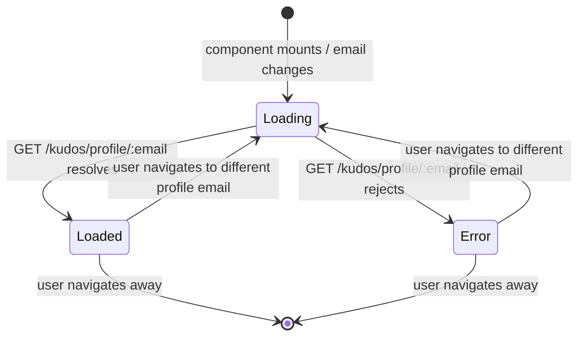

# Feature Specification: F014_UserProfilePage

**Priority**: P1
**Type**: ui
**Generated**: 2026-06-01

## Overview

User Profile Page renders a profile for any platform user at `/profile/:email`. On mount it fetches `GET /kudos/profile/:email`, which returns the user record plus aggregate stats (`kudosReceived`, `kudosSent`, `heartsReceived`). The page assembles four sections: `ProfileHero` (full-bleed banner, avatar, name, department, star rank badge), `ProfileIconCollection` (static decorative icons), `ProfileStatsBox` (stats rows + Secret Box button), and `ProfileKudosSection` (paginated kudos list — owned by F015). Auth is required on both frontend (`PERM003`) and backend (`PERM001`). The page email parameter is URL-decoded before use to handle the `@` and `.` characters in email addresses.

## Why This Exists

Users need a personal summary page to view their recognition history and stats. It also serves as a destination for navigating from the site header dropdown ("Profile" link) or from sidebar recipient links.

## Who Uses It

- **Authenticated employee (profile owner)** — views own stats and kudos history (PERM001_BackendJwtRouteGuard, PERM003_FrontendAuthGuard)
- **Authenticated employee (any user)** — views any colleague's profile page at `/profile/:email`

## Business Workflow

```
1. User navigates to /profile/<encodedEmail> (e.g., from header dropdown or sidebar link).
2. Next.js 16 App Router: params is a Promise — ProfilePage unwraps with use(params),
   then decodes the email segment via decodeURIComponent().
3. authUser derived via useSyncExternalStore(subscribeAuthUser, getAuthUserSnapshot,
   getAuthUserServerSnapshot) from lib/jwt.ts — used to pass currentUserEmail to
   ProfileKudosSection for like-ownership display.
4. apiFetch GET /kudos/profile/<encodeURIComponent(email)> fires with JWT Bearer token.
5. Backend KudosController.getProfile → KudosService.getProfile runs 4 parallel queries:
   a. userRepo.findOne({ where: { email } }) → user record
   b. kudosRepo.count({ where: { receiverEmail: email } }) → kudosReceived
   c. kudosRepo.count({ where: { senderEmail: email } }) → kudosSent
   d. likeRepo JOIN kudos WHERE k.receiverEmail = email → getCount() → heartsReceived
6. If user not found → NotFoundException → 404 → frontend renders error message.
7. On success: ProfileHero receives user.name, user.picture, user.department, user.stars.
   ProfileStatsBox receives kudosReceived, kudosSent, heartsReceived.
8. ProfileStatsBox shows "Mở Secret Box" button — enabled only if kudosReceived >= 5;
   clicking shows a "coming soon" toast (no backend unlock endpoint).
9. ProfileKudosSection (F015) renders below, receiving profile email + currentUserEmail.
```

## Screen Flow

**See:** ScreenFlow § F014_UserProfilePage

| Screen | Route | Purpose |
|--------|-------|---------|
| SCR009_ProfilePage | `/profile/:email` | Full profile page shell |
| SCR009_ProfilePage/REG001_ProfileHero | `/profile/:email` | Avatar, name, department, star rank badge |
| SCR009_ProfilePage/REG002_ProfileStats | `/profile/:email` | Stats box: kudosReceived, kudosSent, heartsReceived, Secret Box button |

## Cross-Cutting Logic

### Requirements

| Code | Description | Endpoint/Handler | Verifiable |
|------|-------------|------------------|------------|
| FR-001 | Fetch aggregate profile stats (kudosReceived, kudosSent, heartsReceived) for any user email | `GET /kudos/profile/:email` via `KudosController::getProfile` | yes |
| FR-002 | URL-decode email param before use (emails contain `@` and `.` which may be encoded) | `ProfilePage` — `decodeURIComponent(rawEmail)` (`profile/[email]/page.tsx:31`) | yes |

### Business Rules

### BR-001_ProfileNotFound
**Source:** `backend/src/kudos/kudos.service.ts:339`
**Linked FR:** FR-001
**Applies to:** `GET /kudos/profile/:email`
**Rule:** If no `User` row exists for the requested email, `KudosService.getProfile` throws `NotFoundException('User not found')` → HTTP 404. Frontend renders an inline error message (`setError`).

**Pseudocode:**
```ts
const user = await userRepo.findOne({ where: { email } })
if (!user) throw new NotFoundException('User not found')
```

### BR-002_SecretBoxThreshold
**Source:** `frontend/components/profile/profile-stats-box.tsx:8,28`
**Linked FR:** FR-001
**Applies to:** `ProfileStatsBox` — "Mở Secret Box" button
**Rule:** Button enabled only when `kudosReceived >= SECRET_BOX_THRESHOLD` (5). Disabled state shows a hover tooltip (`t.secretBoxLockedHint`). Clicking the enabled button shows a "coming soon" toast — no backend endpoint exists yet.

**Pseudocode:**
```ts
const SECRET_BOX_THRESHOLD = 5
const canOpenBox = kudosReceived >= SECRET_BOX_THRESHOLD
// button disabled={!canOpenBox}
```

### BR-003_HeartsReceivedCountQuery
**Source:** `backend/src/kudos/kudos.service.ts:334-338`
**Linked FR:** FR-001
**Applies to:** `KudosService.getProfile` — `heartsReceived` computation
**Rule:** `heartsReceived` counts `Like` rows where the liked kudos was received by the profile user: `likeRepo JOIN kudos ON l.kudosId = k.id WHERE k.receiverEmail = email`. This measures social appreciation directed at the user's kudos, not likes the user gave.

**Pseudocode:**
```ts
heartsReceived = await likeRepo
  .createQueryBuilder('l')
  .innerJoin('l.kudos', 'k')
  .where('k.receiverEmail = :email', { email })
  .getCount()
```

### State Machines

### SM-001_ProfilePageLoadState
**Source:** `frontend/app/profile/[email]/page.tsx:41-65`
**Linked FR:** FR-001
**States:** Loading, Loaded, Error



**Transition rules:**
- `[*] → Loading`: `setLoading(true)`, `setError(null)`, `setProfile(null)` on each email change
- `Loading → Loaded`: `setProfile(data)`, `setLoading(false)`; ignore response if `ignore=true` (effect cleanup)
- `Loading → Error`: `setError(message)`, `setLoading(false)`
- `Loaded → Loading`: effect re-runs when `email` dep changes (e.g., navigating from one profile to another)

### Algorithms

### ALG-001_StarRankDerivation
**Source:** `frontend/components/kudos/user-info-block.tsx:5-9`
**Linked FR:** FR-001
**Input:** `stars: number` from `User` entity
**Output:** rank label string or `null`
**Complexity:** O(1) — constant threshold comparisons
**Description:** `rankLabel(stars)` maps the `user.stars` integer to a tier badge string displayed in `ProfileHero`. Three tiers keyed on integer star thresholds (3, 2, 1). Returns `null` at 0 stars so the badge is conditionally hidden.

**Pseudocode:**
```ts
function rankLabel(stars: number): string | null {
  if (stars >= 3) return 'Legend Hero'
  if (stars >= 2) return 'Rising Hero'
  if (stars >= 1) return 'Warm Spreader'
  return null
}
```

### External Integrations

None.

### Verification

- **SC-001** `GET /kudos/profile/<email>` returns `{ user, kudosReceived, kudosSent, heartsReceived }` (covers FR-001)
- **SC-002** Navigating to `/profile/foo%40bar.com` correctly decodes to `foo@bar.com` before API call (covers FR-002)
- **SC-003** Profile of unknown email returns HTTP 404; frontend shows error text (covers BR-001)

## User Stories

### US007_NavigateToProfileFromHeader — Navigate to Own Profile from Header (Priority: P1)

**What happens:** An authenticated employee opens the site header dropdown and clicks "Profile"; the app navigates to `/profile/<currentUserEmail>`. The profile page then fetches and renders the user's own stats and kudos history.
**Why this priority:** Self-profile access is the primary entry point for the profile feature; navigation from the header is the main UX affordance.
**Independent Test:** Log in → open header dropdown → click "Profile" → assert URL is `/profile/<email>` and `ProfileHero` shows the authenticated user's name.

**Acceptance Scenarios:**

1. **Given** authenticated user on any auth-required page, **When** user opens header dropdown and clicks "Profile", **Then** browser navigates to `/profile/<user.email>`; `ProfileHero` renders user's name, avatar, department.
2. **Given** profile page at `/profile/<email>`, **When** `GET /kudos/profile/:email` resolves, **Then** `ProfileStatsBox` shows correct `kudosReceived`, `kudosSent`, `heartsReceived` values.
3. **Given** `kudosReceived < 5`, **When** user hovers "Mở Secret Box" button, **Then** tooltip explains the threshold condition; button is non-interactive.
4. **Given** `kudosReceived >= 5`, **When** user clicks "Mở Secret Box", **Then** "coming soon" toast shown for 2.5 s.

**Requirements fulfilled:**
- **FR-003** Profile page fetches via `apiFetch('/kudos/profile/<email>')` — `profile/[email]/page.tsx:50`
- **FR-004** `ProfileHero` renders name, picture, department, stars rank — `profile-hero.tsx:17-118`
- **FR-005** `ProfileStatsBox` renders kudosReceived, kudosSent, heartsReceived rows — `profile-stats-box.tsx:36-44`
- **FR-006** Secret Box button disabled with tooltip when `kudosReceived < 5` — `profile-stats-box.tsx:28,63-98`
- **FR-007** Secret Box button click shows "coming soon" toast — `profile-stats-box.tsx:30-33`

**Rules enforced:**

BR-001 (see Cross-Cutting Logic), BR-002 (see Cross-Cutting Logic), BR-003 (see Cross-Cutting Logic)

**Verification:**
- **SC-004** `ProfileHero` displays user name derived from `user.firstName + ' ' + user.lastName` (covers FR-004)
- **SC-005** `ProfileStatsBox` `kudosReceived` matches backend count for that email (covers FR-005, BR-003)
- **SC-006** Secret Box disabled state + tooltip visible when `kudosReceived = 0` (covers BR-002, FR-006)
- **SC-007** "Coming soon" toast fires when `kudosReceived >= 5` and button clicked (covers FR-007)

---

### Edge Cases

| Scenario | Behavior |
|----------|----------|
| Email not in `user` table | HTTP 404 from `KudosService.getProfile`; frontend renders `<p>{error}</p>` below spinner |
| User has `picture = null` | `ProfileHero` renders initial letter avatar fallback (`name.charAt(0).toUpperCase()`) |
| User has `department = ''` | Department span not rendered (`{department && <span>...`)  |
| `stars = 0` (no rank tier) | `rankLabel(0)` returns `null`; rank badge not rendered (conditional `{rank && ...}`) |
| Email contains `+` (e.g., `foo+bar@...`) | `decodeURIComponent` handles encoded `%2B`; API call uses re-encoded form via `encodeURIComponent(email)` |
| Profile page accessed without auth token | `PERM003_FrontendAuthGuard` redirects to `/login`; API never called |
| `heartsReceived` large number | Displayed as plain integer in `ProfileStatsBox`; no formatter applied (unlike `KudosDetailModal` which uses `Intl.NumberFormat`) |

## Key Entities

| Entity | Table | Key Columns | Purpose |
|--------|-------|-------------|---------|
| User | `user` | `email`, `firstName`, `lastName`, `picture`, `department`, `stars` | Profile identity and display fields |
| Kudos | `kudos` | `senderEmail`, `receiverEmail` | Counted for `kudosReceived` and `kudosSent` stats |
| Like | `like` | `kudosId`, `userEmail` | Joined with kudos to count `heartsReceived` (likes on kudos received by this user) |

## Related Artifacts

- **Screens**: SCR009_ProfilePage, SCR009_ProfilePage/REG001_ProfileHero, SCR009_ProfilePage/REG002_ProfileStats
- **User Stories**: US007_NavigateToProfileFromHeader
- **Routes**: (GET) /kudos/profile/:email
- **Data Models**: MODEL001 — User, MODEL002 — Kudos
- **Background Logic**: _(none)_
- **Permissions**: PERM001_BackendJwtRouteGuard, PERM003_FrontendAuthGuard

## Spec Documents

- [x] [System Overview](../../system-overview.md) — Decision 1: email as PK; architecture overview
- [x] [Feature List](../../feature-list.md) — F014_UserProfilePage, US007, MODEL001, MODEL002, PERM001, PERM003
- [x] [User Stories](../../user-stories.md) — US007_NavigateToProfileFromHeader
- [x] [Data Model](../../data-model.md) — MODEL001 (User), MODEL002 (Kudos senderEmail/receiverEmail)
- [x] [Permissions](../../permissions.md) — PERM001_BackendJwtRouteGuard, PERM003_FrontendAuthGuard
- [ ] [Route List](../../route-list.md) — GET /kudos/profile/:email
- [ ] [Screen List](../../screen-list.md) — SCR009_ProfilePage, SCR009/REG001_ProfileHero, SCR009/REG002_ProfileStats
- [ ] [Screen Flow](../../screen-flow.md)
- [ ] [Background Logic](../../background-logic.md) — none

## Assumptions

- `user.stars` is a stored integer column seeded at 0; there is no service logic that increments it (no star-award endpoint visible in the codebase). The rank badge in `ProfileHero` reflects whatever value is in the DB — likely always 0 for most users unless set via migration or future feature.
- `heartsReceived` counts all likes on kudos received by the user, including likes placed after the kudos was viewed — it is a live aggregate, not a snapshot.
- The profile page is accessible for any valid email, not just the logged-in user's own profile. There is no ownership restriction on viewing another user's profile.
- `ProfileIconCollection` is purely decorative (static icons); its content is not data-driven and not covered here.

## Source Code References

| Symbol | Path | Purpose |
|--------|------|---------|
| `ProfilePage` | `frontend/app/profile/[email]/page.tsx:1-119` | Page shell — param decode, fetch, loading/error states, section assembly |
| `KudosController::getProfile` | `backend/src/kudos/kudos.controller.ts:84-88` | GET /kudos/profile/:email handler with JWT guard |
| `KudosService::getProfile` | `backend/src/kudos/kudos.service.ts:328-346` | Parallel queries for user + 3 aggregate stats |
| `ProfileHero` | `frontend/components/profile/profile-hero.tsx:17-118` | Full-bleed banner, avatar, name, department, rank badge |
| `ProfileStatsBox` | `frontend/components/profile/profile-stats-box.tsx:20-103` | Stats rows, Secret Box button with threshold guard and coming-soon toast |

## Unresolved Questions

1. **`rankLabel` thresholds**: Confirmed from `user-info-block.tsx:5-9` — thresholds are `stars >= 3 → 'Legend Hero'`, `stars >= 2 → 'Rising Hero'`, `stars >= 1 → 'Warm Spreader'`, `else → null`.
2. **`user.stars` increment**: No service method updates `stars` in the current codebase. Is the rank badge intentionally dormant, or is there a planned star-award feature?
3. **Own-profile vs. other-profile UX**: The page renders identically for own and other profiles. Is there a planned differentiation (e.g., edit button, private stats) for viewing one's own profile?
