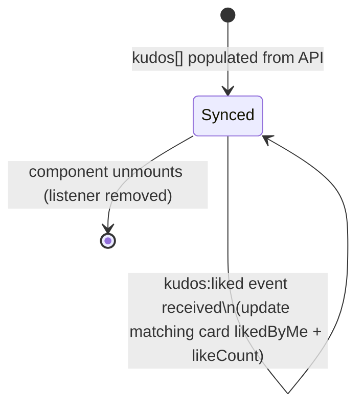

# Feature Specification: F015_ProfileKudosList

**Priority**: P1
**Type**: ui
**Generated**: 2026-06-01

## Overview

Profile Kudos List renders a paginated kudos feed inside `ProfileKudosSection` (REG003 on SCR009). It supports a sent/received filter dropdown (resets to page 1 on switch), a "Load More" button that appends subsequent pages, per-card like/unlike (optimistic with `kudos:liked` cross-surface sync), and copy-link. It queries `GET /kudos?sender=<email>&page=N&limit=3` or `?receiver=<email>&page=N&limit=3`. A request-ID guard (`reqIdRef`) prevents stale responses from overwriting fresher data during rapid filter switches. Anonymous sender masking (PERM005) is applied transparently by the backend.

## Why This Exists

The profile page must show a user's recognition history segmented by direction (sent vs. received) so visitors can understand their contribution to and from the team. Without this list the profile page has no actionable content beyond the stats box.

## Who Uses It

- **Authenticated employee (any)** — browses sent or received kudos on any user's profile (PERM001_BackendJwtRouteGuard, PERM005_AnonymousSenderMasking, PERM006_LikeUniquenessConstraint)

## Business Workflow

```
1. ProfileKudosSection mounts with props: email (profile owner), currentUserEmail
   (logged-in viewer, for like-ownership display).
2. Initial filter = "sent"; buildUrl(1) constructs /kudos?page=1&limit=3&sender=<email>.
3. apiFetch fires; reqIdRef tracks request generation to discard stale responses.
4. Response KudosListResponse { data, total, page, limit } populates kudos[] and total.
5. Filter dropdown displays label "Sent (N)" or "Received (N)" where N = total when
   that filter is active, else "…" for the inactive tab.
6. User switches filter → setFilter() → useEffect re-runs: setKudos([]), setPage(1),
   setTotal(0), setLoading(true); new request fired with updated sender/receiver param.
7. User clicks "Load More" (visible when kudos.length < total) → handleLoadMore fires
   GET /kudos?...&page=nextPage → appends deduplicated results (Set-based dedup on id).
8. Like/unlike on any card → KudosPostCard dispatches kudos:liked window event →
   ProfileKudosSection handler updates matching card in kudos[] state.
9. Copy-link on any card → KudosPostCard copies <origin>/kudos/<id> to clipboard
   → toast shown (F033 behavior, reused via KudosPostCard).
```

## Screen Flow

**See:** ScreenFlow § F015_ProfileKudosList

| Screen | Route | Purpose |
|--------|-------|---------|
| SCR009_ProfilePage/REG003_ProfileKudosList | `/profile/:email` | Paginated sent/received kudos list with filter, load-more, like, copy-link |

## Cross-Cutting Logic

### Requirements

| Code | Description | Endpoint/Handler | Verifiable |
|------|-------------|------------------|------------|
| FR-001 | Filter kudos by sender or receiver email via query params | `GET /kudos?sender=<email>` or `GET /kudos?receiver=<email>` via `KudosController::findAll` | yes |
| FR-002 | Stale-request guard: ignore responses from superseded requests on rapid filter changes | `ProfileKudosSection` — `reqIdRef` pattern (`profile-kudos-section.tsx:56-82`) | yes |

### Business Rules

### BR-001_DeduplicateLoadMoreResults
**Source:** `frontend/components/profile/profile-kudos-section.tsx:114-117`
**Linked FR:** FR-001
**Applies to:** `handleLoadMore` — append phase
**Rule:** Newly fetched page results are filtered against a `Set` of existing kudos IDs before appending. This prevents duplicate cards if the feed shifts (new kudos inserted) between page fetches.

**Pseudocode:**
```ts
const seen = new Set(prev.map(k => k.id))
return [...prev, ...res.data.filter(k => !seen.has(k.id))]
```

### BR-002_FilterResetsPagination
**Source:** `frontend/components/profile/profile-kudos-section.tsx:55-82`
**Linked FR:** FR-001
**Applies to:** `useEffect` triggered by `buildUrl` (which depends on `filter` and `email`)
**Rule:** Switching filter clears `kudos[]`, resets `page` to 1 and `total` to 0 before fetching. This prevents showing stale sent kudos while received kudos are loading.

**Pseudocode:**
```ts
// on filter change:
setLoading(true); setError(false)
setKudos([]); setPage(1); setTotal(0)
apiFetch(buildUrl(1)).then(res => { setKudos(res.data); setTotal(res.total) })
```

### BR-003_StaleRequestGuard
**Source:** `frontend/components/profile/profile-kudos-section.tsx:56-58,66-68`
**Linked FR:** FR-002
**Applies to:** `useEffect` for initial/filter-change fetch
**Rule:** `reqIdRef.current` is incremented on each effect run. Response handler checks `reqId !== reqIdRef.current`; if stale (a newer request was already fired), the result is discarded. Combined with the `ignore` cleanup flag, this prevents both out-of-order responses and post-unmount state updates.

**Pseudocode:**
```ts
const reqId = ++reqIdRef.current
let ignore = false
apiFetch(url).then(res => {
  if (ignore || reqId !== reqIdRef.current) return
  setKudos(res.data); setTotal(res.total)
})
return () => { ignore = true }
```

### State Machines

### SM-001_ProfileKudosListState
**Source:** `frontend/components/profile/profile-kudos-section.tsx:28-125`
**Linked FR:** FR-001
**States:** Loading, Loaded, Error, LoadingMore

```mermaid
stateDiagram-v2
    [*] --> Loading: component mounts or filter changes
    Loading --> Loaded: fetch resolves with data
    Loading --> Error: fetch rejects
    Loaded --> LoadingMore: user clicks Load More
    LoadingMore --> Loaded: Load More fetch resolves (data appended)
    LoadingMore --> Loaded: Load More fetch rejects (silent; user can retry)
    Loaded --> Loading: filter switches (BR-002 reset)
    Error --> Loading: filter switches
    Loaded --> [*]: user navigates away
    Error --> [*]: user navigates away
```



**Transition rules:**
- `[*] → Loading`: `setLoading(true)`, `setKudos([])`, `setPage(1)`, `setTotal(0)`
- `Loading → Loaded`: `setKudos(res.data)`, `setTotal(res.total)`, `setLoading(false)`
- `Loading → Error`: `setError(true)`, `setLoading(false)`
- `Loaded → LoadingMore`: `setLoadingMore(true)`; page guard `kudos.length >= total` prevents extra calls
- `LoadingMore → Loaded`: append deduped data (BR-001), `setPage(nextPage)`, `setLoadingMore(false)`
- `LoadingMore → Loaded` (error): silent catch; `setLoadingMore(false)` only — user retries via button

### SM-002_LikeStateInProfileList
**Source:** `frontend/components/profile/profile-kudos-section.tsx:85-106`
**Linked FR:** FR-001
**States:** Synced (per card id)



**Transition rules:**
- `Synced → Synced`: `kudos:liked` CustomEvent fires from `KudosPostCard`; `setKudos(prev => prev.map(...))` updates the matching card by `id`

### Algorithms

None.

### External Integrations

None.

### Verification

- **SC-001** `GET /kudos?sender=<email>&page=1&limit=3` returns only kudos where `senderEmail = email` (covers FR-001)
- **SC-002** Switching filter from "sent" to "received" clears list and fetches `?receiver=<email>&page=1` (covers BR-002)
- **SC-003** Rapid double filter-switch shows only the last requested filter's data (covers BR-003, FR-002)

## User Stories

### US036_FilterProfileKudosBySentReceived — Filter Profile Kudos by Sent or Received (Priority: P1)

**What happens:** An employee on a profile page uses the dropdown to switch between sent and received kudos. The list clears, resets to page 1, and refetches with the appropriate `sender=` or `receiver=` query param. The dropdown label shows the total count for the active filter.
**Why this priority:** The filter is the primary UX affordance on the profile kudos section; without it only one direction of kudos is accessible.
**Independent Test:** Load profile → assert dropdown shows "Sent (N)" with N = total sent count → switch to "Received" → assert list clears, new cards appear, dropdown shows "Received (M)".

**Acceptance Scenarios:**

1. **Given** profile page loaded with filter "sent", **When** user selects "received" from dropdown, **Then** kudos list clears, loading spinner appears, received kudos fetch fires (`?receiver=<email>&page=1&limit=3`), results render.
2. **Given** filter is "sent" with 9 kudos total, **When** dropdown label inspected, **Then** shows "Sent (9)"; inactive "received" tab shows "Received (…)".
3. **Given** filter "sent" active, **When** user rapidly toggles sent→received→sent, **Then** only the final "sent" response renders (stale responses discarded via BR-003).

**Requirements fulfilled:**
- **FR-003** Filter dropdown bound to `filter` state — `<select value={filter} onChange={...}>` (`profile-kudos-section.tsx:162-179`)
- **FR-004** Label shows total for active filter, "…" for inactive — `sentLabel`/`receivedLabel` strings (`profile-kudos-section.tsx:135-136`)
- **FR-005** `buildUrl` injects `sender=` or `receiver=` param based on filter — `profile-kudos-section.tsx:38-50`

**Rules enforced:** BR-002 (see Cross-Cutting Logic), BR-003 (see Cross-Cutting Logic)

**Verification:**
- **SC-004** Dropdown change triggers fetch with correct query param (covers FR-003, FR-005)
- **SC-005** Label reflects live total from API response (covers FR-004)

---

### US037_LoadMoreProfileKudos — Load More Kudos on Profile Page (Priority: P1)

**What happens:** When `kudos.length < total` a "Load More" button is shown. Clicking it fetches the next page with the active filter and appends deduplicated results. The button shows "..." while loading and disappears once all kudos are loaded.
**Why this priority:** Pagination is necessary for users with large kudos histories; without it only 3 cards are ever visible.
**Independent Test:** Load profile with 9 kudos (sent) → 3 cards rendered + "Load More" visible → click → 3 more appended → total 6 shown → click again → 3 more → "Load More" gone.

**Acceptance Scenarios:**

1. **Given** 9 sent kudos total, page 1 showing 3, **When** user clicks "Load More", **Then** 3 more cards appended; button still visible (6 < 9).
2. **Given** all 9 kudos loaded, **When** inspecting DOM, **Then** "Load More" button is absent (`kudos.length >= total`).
3. **Given** Load More fetch fails, **When** error occurs, **Then** existing cards remain; button re-enabled (silent catch, `setLoadingMore(false)`); no error message shown.

**Requirements fulfilled:**
- **FR-006** "Load More" visible when `kudos.length < total` — conditional render (`profile-kudos-section.tsx:205-213`)
- **FR-007** Page increments and new data appended with dedup — `handleLoadMore` (`profile-kudos-section.tsx:108-125`)

**Rules enforced:** BR-001 (see Cross-Cutting Logic)

**Verification:**
- **SC-006** After Load More, `kudos.length` increases by ≤3 (limit), duplicates excluded (covers FR-007, BR-001)
- **SC-007** Button label shows "..." while `loadingMore=true` (covers FR-006)

---

### US038_LikeKudosFromProfileFeed — Like or Unlike a Kudos from Profile Feed (Priority: P1)

**What happens:** Each kudos card in the profile list shows a like count and heart. Clicking toggles like state optimistically via `KudosPostCard`; the `kudos:liked` window event syncs the count in `ProfileKudosSection` state and propagates to other surfaces (feed, highlight, detail modal).
**Why this priority:** Like parity across all surfaces is required for consistent social interaction.
**Independent Test:** Open profile → click heart on a card with `likedByMe=false` → count increments → open same kudos in detail modal → assert modal shows incremented count.

**Acceptance Scenarios:**

1. **Given** a card in profile list with `likedByMe=false`, **When** user clicks heart, **Then** count increments, heart fills; `POST /kudos/:id/like` fires; `kudos:liked` event dispatched.
2. **Given** a card with `likedByMe=true`, **When** user clicks heart, **Then** count decrements, heart unfills; `DELETE /kudos/:id/like` fires.
3. **Given** API returns error on like, **When** request fails, **Then** count and liked state roll back; `kudos:liked` re-dispatched with original values.

**Requirements fulfilled:**
- **FR-008** `kudos:liked` event listener in `ProfileKudosSection` updates matching card — `profile-kudos-section.tsx:85-106`
- **FR-009** `KudosPostCard` receives `onLikeChange` callback to update parent state directly — `profile-kudos-section.tsx:127-134`

**Rules enforced:**

### BR-004_LikeUniquenessInProfileFeed
**Source:** `backend/src/kudos/kudos.service.ts:453-466`
**Linked FR:** FR-008
**Applies to:** `POST /kudos/:id/like`
**Rule:** Same uniqueness constraint as all other like surfaces. Duplicate like → HTTP 409 `ConflictException('Already liked')`; `KudosPostCard` rolls back optimistic state on any error.

**Pseudocode:**
```ts
const existing = await likeRepo.findOne({ where: { kudosId, userEmail } })
if (existing) throw new ConflictException('Already liked')
```

**Verification:**
- **SC-008** Clicking heart fires correct HTTP method (POST or DELETE) based on `likedByMe` state (covers FR-008, BR-004)
- **SC-009** `kudos:liked` event causes matching card in list to update count without re-fetch (covers FR-009)

---

### US039_CopyKudosLinkFromProfileFeed — Copy Kudos Link from Profile Feed Card (Priority: P3)

**What happens:** Each card in the profile kudos list has a "Copy Link" button. Clicking it copies `<origin>/kudos/<id>` to clipboard and shows a toast.
**Why this priority:** Sharing convenience; purely client-side with no API dependency.
**Independent Test:** Open profile → click "Copy Link" on any card → read clipboard → assert value = `window.location.origin + '/kudos/' + card.id`.

**Acceptance Scenarios:**

1. **Given** profile kudos list loaded, **When** user clicks "Copy Link" on a card, **Then** clipboard contains the full permalink and a toast confirmation appears.

**Requirements fulfilled:**
- **FR-010** Copy permalink via `navigator.clipboard.writeText` — handled inside `KudosPostCard` (reuses F033 pattern)

**Rules enforced:** None.

**Verification:**
- **SC-010** Clipboard value matches `<origin>/kudos/<id>` after button click (covers FR-010)

---

### Edge Cases

| Scenario | Behavior |
|----------|----------|
| Profile user has 0 sent kudos | `GET /kudos?sender=<email>` returns `{ data: [], total: 0 }`; "empty feed" text rendered (`t.kudosEmptyFeed`) |
| Profile user has 0 received kudos | Same as above with `receiver=` param |
| `GET /kudos` returns error on initial load | `setError(true)`; `t.profileKudosLoadError` message rendered; "Load More" not shown |
| Anonymous kudos in profile received list | Sender fields masked per PERM005 — `sender.name` = alias or "Ẩn danh", `email` = "", `picture` = "" |
| Filter switch while Load More in flight | `loadingMore` state is separate from `loading`; filter switch sets `loading=true` and clears list regardless — Load More result is discarded by `reqIdRef` guard |
| `navigator.clipboard` unavailable | Copy link silently fails (no fallback in `KudosPostCard`); toast not shown |
| Profile email contains special chars | `buildUrl` uses raw `email` prop (already decoded by `ProfilePage`); `apiFetch` encodes the URL |

## Key Entities

| Entity | Table | Key Columns | Purpose |
|--------|-------|-------------|---------|
| Kudos | `kudos` | `id`, `senderEmail`, `receiverEmail`, `message`, `title`, `isAnonymous`, `senderAlias`, `imageKeys`, `likeCount`, `createdAt` | Primary data source for each card in the list |
| User | `user` | `email`, `firstName`, `lastName`, `picture`, `department`, `stars` | Sender and receiver display info on each card |
| Like | `like` | `kudosId`, `userEmail` | `likedByMe` flag per card; toggled by like/unlike actions |

## Related Artifacts

- **Screens**: SCR009_ProfilePage/REG003_ProfileKudosList
- **User Stories**: US036_FilterProfileKudosBySentReceived, US037_LoadMoreProfileKudos, US038_LikeKudosFromProfileFeed, US039_CopyKudosLinkFromProfileFeed
- **Routes**: (GET) /kudos
- **Data Models**: MODEL001 — User, MODEL002 — Kudos, MODEL003 — Like
- **Background Logic**: _(none)_
- **Permissions**: PERM001_BackendJwtRouteGuard, PERM005_AnonymousSenderMasking, PERM006_LikeUniquenessConstraint

## Spec Documents

- [x] [System Overview](../../system-overview.md) — pagination pattern, denormalized likeCount, anonymous masking
- [x] [Feature List](../../feature-list.md) — F015_ProfileKudosList, US036–US039, MODEL001–MODEL003, PERM001, PERM005, PERM006
- [x] [User Stories](../../user-stories.md) — US036–US039
- [x] [Data Model](../../data-model.md) — MODEL001, MODEL002 (senderEmail/receiverEmail filter columns), MODEL003
- [x] [Permissions](../../permissions.md) — PERM001_BackendJwtRouteGuard, PERM005_AnonymousSenderMasking, PERM006_LikeUniquenessConstraint
- [ ] [Route List](../../route-list.md) — GET /kudos (sender/receiver query params)
- [ ] [Screen List](../../screen-list.md) — SCR009_ProfilePage/REG003_ProfileKudosList
- [ ] [Screen Flow](../../screen-flow.md)
- [ ] [Background Logic](../../background-logic.md) — none

## Assumptions

- `LIMIT = 3` is hardcoded in `ProfileKudosSection`; it is not configurable via props or env var.
- The `KudosService.findAll` `sender` and `receiver` query params are additive filters; sending both simultaneously is not prevented by the DTO but would return kudos where the same person is both sender and receiver (edge case only possible for self-kudos, which the UI does not prevent).
- Offset-based pagination (`skip/take`) means that new kudos inserted between Load More calls may cause the last item of page N to reappear as the first item of page N+1. The Set-based dedup in `handleLoadMore` (BR-001) mitigates this.
- `ProfileKudosSection` does not manage the like toggle itself — it delegates fully to `KudosPostCard` and syncs via the `kudos:liked` window event + `onLikeChange` callback. The component has no direct knowledge of POST/DELETE endpoints.

## Source Code References

| Symbol | Path | Purpose |
|--------|------|---------|
| `ProfileKudosSection` | `frontend/components/profile/profile-kudos-section.tsx:1-220` | Full list component — filter, pagination, like sync, Load More |
| `KudosController::findAll` | `backend/src/kudos/kudos.controller.ts:40-44` | GET /kudos handler; passes `sender`/`receiver` query params to service |
| `KudosService::findAll` | `backend/src/kudos/kudos.service.ts:133-193` | Builds query with optional `sender`/`receiver` WHERE clauses; returns paginated result |
| `KudosQueryDto` | `backend/src/kudos/dto/kudos-query.dto.ts` | DTO with `sender`, `receiver`, `page`, `limit` optional fields |
| `ProfilePage` (consumer) | `frontend/app/profile/[email]/page.tsx:107-112` | Passes `email` + `currentUserEmail` props to `ProfileKudosSection` |

## Unresolved Questions

1. **Load More on filter switch race**: If a Load More is in flight when the user switches filter, `setLoadingMore` is not reset by the filter-change effect. The load-more result will be discarded by `reqIdRef` but `loadingMore` may stay `true` until the in-flight request settles. Is this a visible UX bug?
2. **Self-kudos**: The API does not prevent a user from sending kudos to themselves. Would such a kudos appear in both "Sent" and "Received" tabs on the sender's own profile?
3. **`KudosQueryDto` sender+receiver simultaneous**: Is there an intended behavior or should the DTO enforce mutual exclusivity of `sender` and `receiver` params?
