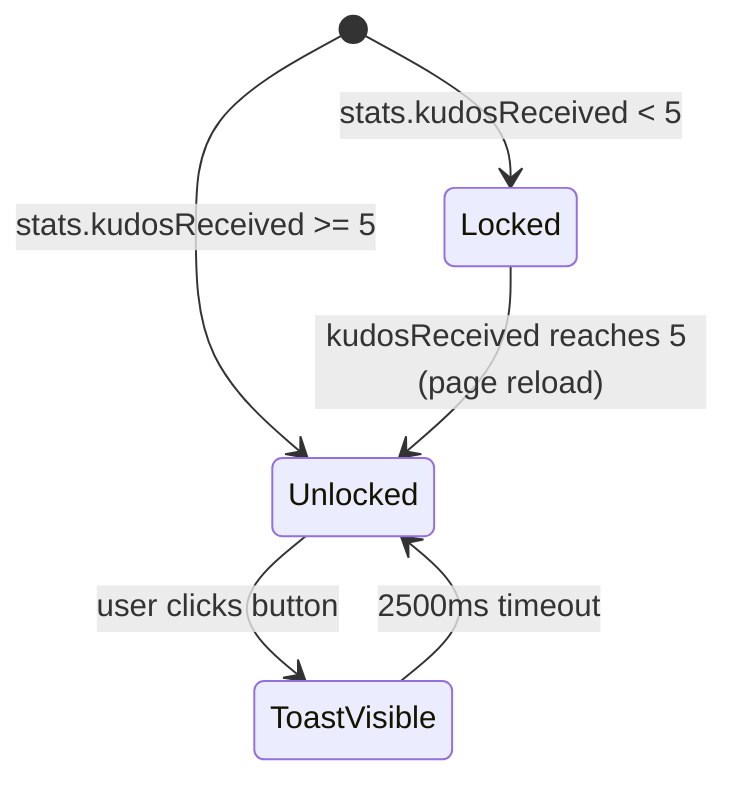

# Feature Specification: F016_KudosSidebar

**Priority**: P2
**Type**: ui
**Generated**: 2026-06-01

## Overview

Sticky sidebar widget in `REG004_KudosSidebar` on the Kudos page. Composed of two sub-components: `SidebarStats` (fetches `GET /kudos/stats` to display kudosReceived, kudosSent, heartsReceived, secret-box counts, and the unlock button) and `SidebarRecipients` (fetches `GET /kudos?limit=10` to derive recent unique recipients as clickable profile links). The sidebar renders in a fixed-position `aside` that stays visible as the user scrolls the main feed.

## Why This Exists

Gives users ambient visibility of their own recognition metrics and quick access to colleagues they've recently appreciated, encouraging repeat engagement without navigating away from the kudos feed.

## Who Uses It

- **Authenticated User** — views personal stats and navigates to recipient profiles (PERM001_BackendJwtRouteGuard)

## Business Workflow

```
1. Authenticated user loads /kudos page → KudosSidebar mounts, renders <aside> shell
2. SidebarStats calls apiFetch('/kudos/stats') → backend KudosService.getStats(userEmail)
   returns { kudosReceived, kudosSent, heartsReceived, recentRecipients[] }
3. SidebarRecipients calls apiFetch('/kudos?limit=10') → KudosService.findAll()
   returns latest 10 kudos; client deduplicates receivers by email → unique list ≤10
4. Both sub-components render: stats rows displayed; recipient list displayed as Link elements
5. User clicks a recipient name → Next.js router navigates to /profile/:email (encodeURIComponent)
```

## Screen Flow

**See:** ScreenFlow § F016_KudosSidebar

| Screen | Route | Purpose |
|--------|-------|---------|
| SCR007_KudosPage/REG004_KudosSidebar | `/kudos` | Persistent sidebar: stats + recipient links |
| SCR009_ProfilePage | `/profile/:email` | Destination when recipient link is clicked |

## Cross-Cutting Logic

### Requirements

| Code | Description | Endpoint/Handler | Verifiable |
|------|-------------|------------------|------------|
| FR-001 | Display current user's kudos stats (kudosReceived, kudosSent, heartsReceived) | `GET /kudos/stats` via `KudosController::getStats` | yes |

### Business Rules

None.

### State Machines

None.

### Algorithms

None.

### External Integrations

None.

### Verification

- **SC-001** — Stats box renders rows for kudosReceived, kudosSent, heartsReceived with numeric values (covers FR-001)
- **SC-002** — Recipients list contains ≤10 unique entries; each is a clickable link to `/profile/:email` (covers FR-002, FR-003)

## User Stories

### US031_UnlockSecretBox — Unlock Secret Box (Priority: P2)

**What happens:** Authenticated user sees "Open Secret Box" button in the sidebar stats area. Button is enabled only when `kudosReceived >= 5`. Clicking the enabled button shows a "coming soon" toast for 2.5 s; no backend call is made. When disabled, hovering the button wrapper reveals a tooltip explaining the threshold requirement.
**Why this priority:** Feature is gated on a threshold that hasn't launched yet; pure UI placeholder — not blocking core functionality.
**Independent Test:** Log in as a user with ≥5 kudosReceived; verify button is enabled and clicking it shows the toast. Log in as user with <5; verify button is disabled and tooltip appears on hover.

**Acceptance Scenarios:**

1. **Given** user has `kudosReceived >= 5`, **When** they click "Open Secret Box", **Then** a toast "coming soon" (t.kudosComingSoon) appears for 2.5 s.
2. **Given** user has `kudosReceived < 5`, **When** they hover the button wrapper, **Then** tooltip `t.secretBoxLockedHint` is visible; button click is no-op.
3. **Given** stats API returns `kudosReceived = 0`, **When** sidebar renders, **Then** button has `disabled` and `aria-disabled="true"` attributes.

**Requirements fulfilled:**
- **FR-004** Secret box button enabled iff `kudosReceived >= SECRET_BOX_THRESHOLD (5)` — `GET /kudos/stats` via `KudosController::getStats`; threshold check in `SidebarStats::handleOpenGift`
- **FR-005** Disabled button shows hover tooltip with unlock condition — client-only, no API
- **FR-006** Enabled button click shows "coming soon" toast — client-only

**Rules enforced:**

### BR-001_SecretBoxThresholdGate
**Source:** `frontend/components/kudos/sidebar-stats.tsx:27-31`
**Applies to:** "Open Secret Box" button click handler
**Rule:** Button click is rejected (early return) if `stats.kudosReceived < SECRET_BOX_THRESHOLD (5)`. Enabled state is also reflected in `disabled` / `aria-disabled` attributes for accessibility.

**Pseudocode:**
```ts
const SECRET_BOX_THRESHOLD = 5
const canOpenBox = (stats.kudosReceived ?? 0) >= SECRET_BOX_THRESHOLD
// button: disabled={!canOpenBox}
function handleOpenGift() {
  if (!canOpenBox) return          // guard — also blocked by disabled attr
  setShowToast(true)
  setTimeout(() => setShowToast(false), 2500)
}
```

**Linked FR:** FR-004

**State transitions:**

### SM-001_SecretBoxButtonState
**Source:** `frontend/components/kudos/sidebar-stats.tsx:59-117`
**Linked FR:** FR-001
**States:** Locked, Unlocked, ToastVisible



**Transition rules:**
- `[*] → Locked`: guard = `stats.kudosReceived < 5`; side effects = button disabled, tooltip shown on hover
- `[*] → Unlocked`: guard = `stats.kudosReceived >= 5`; side effects = button enabled (gold, hover effect)
- `Unlocked → ToastVisible`: guard = button click; side effects = `setShowToast(true)`
- `ToastVisible → Unlocked`: guard = 2500ms elapsed; side effects = `setShowToast(false)`

**Verification:**
- **SC-003** — Button click with `kudosReceived >= 5` shows toast; toast disappears after 2.5 s (covers FR-004, FR-006, SM-001)
- **SC-004** — Button is `disabled` + `aria-disabled="true"` when `kudosReceived < 5`; tooltip appears on hover (covers FR-004, FR-005, BR-001)

---

### US032_NavigateToRecipientProfileFromSidebar — Navigate to Recipient Profile from Sidebar (Priority: P2)

**What happens:** Authenticated user sees a list of recent kudos recipients in the sidebar. Each entry is a `<Link>` rendered with the recipient's avatar (or initials fallback) and name. Clicking navigates the browser to `/profile/:email`.
**Why this priority:** Navigation convenience; profile page is reachable by other means.
**Independent Test:** Load /kudos with existing kudos in DB; verify recipient list renders; click a recipient; verify URL changes to `/profile/<email>`.

**Acceptance Scenarios:**

1. **Given** kudos exist with distinct receivers, **When** sidebar loads, **Then** up to 10 unique recipients are displayed in order of most-recent kudos.
2. **Given** multiple kudos share the same receiver, **When** `SidebarRecipients` processes results, **Then** that receiver appears only once (deduplication by email).
3. **Given** no kudos exist, **When** sidebar loads recipients, **Then** empty-state message `t.kudosEmptyLeaderboard` is rendered.

**Requirements fulfilled:**
- **FR-002** Derive recent unique recipients from `GET /kudos?limit=10` — `KudosController::findAll`
- **FR-003** Clicking recipient navigates to `/profile/:email` — `SidebarRecipients` Link href

**Rules enforced:**

### BR-002_RecipientDeduplication
**Source:** `frontend/components/kudos/sidebar-recipients.tsx:20-30`
**Applies to:** `SidebarRecipients` effect on kudos response
**Rule:** Iterates response `data` array; maintains a `Set<string>` of seen emails; pushes unique recipients only; caps result at 10. Anonymous sender masking on `receiver` field does not apply (receiver is never masked).

**Pseudocode:**
```ts
const seen = new Set<string>()
const unique: Recipient[] = []
for (const item of res.data) {
  if (!seen.has(item.receiver.email)) {
    seen.add(item.receiver.email)
    unique.push(item.receiver)
  }
}
setRecipients(unique.slice(0, 10))
```

**Linked FR:** FR-002

**Verification:**
- **SC-005** — Recipient list contains no duplicate emails (covers FR-002, BR-002)
- **SC-006** — Clicking a recipient link navigates to `/profile/<encodedEmail>` (covers FR-003)

---

### Edge Cases

| Scenario | Behavior |
|----------|----------|
| `GET /kudos/stats` returns 401 (expired JWT) | `SidebarStats` catch block swallows error; component stays in loading spinner state indefinitely (no retry) |
| `GET /kudos?limit=10` returns empty `data` array | `SidebarRecipients` renders empty-state paragraph with `t.kudosEmptyLeaderboard` |
| Recipient `picture` field is empty string | Fallback initial-letter avatar rendered (div with first char of name) |
| Stats not yet loaded (null state) | Loading spinner shown; button not rendered until stats resolve |
| `kudosReceived` is exactly 5 | Button is enabled (`>= 5`); toast fires on click |

## Key Entities

| Entity | Table | Key Columns | Purpose |
|--------|-------|-------------|---------|
| Kudos | `kudos` | `id`, `receiverEmail`, `senderEmail`, `createdAt`, `likeCount` | Source for both stats counts and recent-recipients list |
| User | `users` | `email`, `firstName`, `lastName`, `picture` | Recipient display info (name, avatar) |
| Like | `likes` | `kudosId`, `userEmail` | Counted in `heartsReceived` stat via join on kudos.receiverEmail |

## Related Artifacts

- **Screens**: `SCR007_KudosPage/REG004_KudosSidebar`
- **User Stories**: `US031_UnlockSecretBox`, `US032_NavigateToRecipientProfileFromSidebar`
- **Routes**: `GET /kudos/stats`, `GET /kudos`
- **Data Models**: MODEL001 — User, MODEL002 — Kudos
- **Background Logic**: _(none)_
- **Permissions**: PERM001_BackendJwtRouteGuard

## Spec Documents

- [x] [System Overview](../../system-overview.md)
- [x] [Feature List](../../feature-list.md) — F016_KudosSidebar
- [x] [User Stories](../../user-stories.md) — US031_UnlockSecretBox, US032_NavigateToRecipientProfileFromSidebar
- [ ] [Route List](../../route-list.md) — GET /kudos/stats, GET /kudos
- [ ] [Data Model](../../data-model.md) — MODEL001, MODEL002
- [ ] [Screen List](../../screen-list.md) — SCR007_KudosPage/REG004_KudosSidebar
- [ ] [Permissions](../../permissions.md) — PERM001_BackendJwtRouteGuard

## Assumptions

- `SidebarRecipients` uses `GET /kudos?limit=10` (not `GET /kudos/stats`) to derive recipients; the `recentRecipients` array on the stats response exists but `SidebarRecipients` does not consume it — this is a deliberate separation confirmed by source.
- Secret box opened/unopened counts are hardcoded `0` in the current implementation (no backend tracking); the UI rows exist as placeholders.
- Stats fetch silently ignores API errors (empty catch `() => {}`); there is no retry or error UI for a failed stats call.

## Source Code References

| Symbol | Path | Purpose |
|--------|------|---------|
| `KudosSidebar` | `frontend/components/kudos/kudos-sidebar.tsx:1-12` | Sidebar shell — composes SidebarStats + SidebarRecipients |
| `SidebarStats` | `frontend/components/kudos/sidebar-stats.tsx:1-155` | Stats display + secret box button + threshold gate |
| `SidebarRecipients` | `frontend/components/kudos/sidebar-recipients.tsx:1-77` | Recent recipients list with profile links |
| `KudosController::getStats` | `backend/src/kudos/kudos.controller.ts:76-80` | `GET /kudos/stats` handler |
| `KudosService::getStats` | `backend/src/kudos/kudos.service.ts:348-376` | Returns kudosReceived, kudosSent, heartsReceived, recentRecipients |

## Unresolved Questions

1. **Stats error state**: When `GET /kudos/stats` fails after auth check (e.g. 500), `SidebarStats` stays in spinner state with no user-visible error. Is a fallback/error UI intended?
2. **Secret box opened/unopened counts**: Both are hardcoded `0`. Is there a future backend tracking plan, or are these display-only placeholders to be removed?
