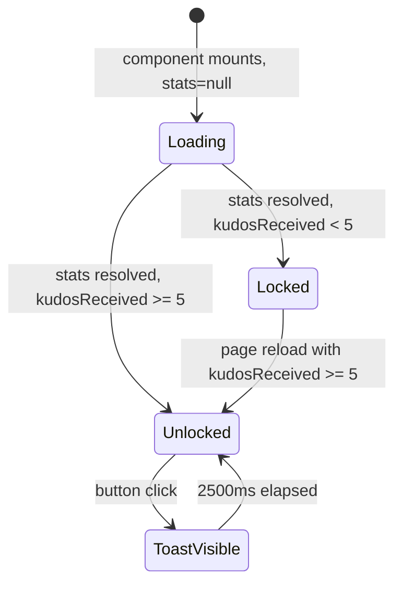

# Feature Specification: F017_SecretBoxUnlock

**Priority**: P2
**Type**: ui
**Generated**: 2026-06-01

## Overview

A threshold-gated UI affordance within `REG004_KudosSidebar` on the Kudos page. The "Open Secret Box" button reads `kudosReceived` from `GET /kudos/stats`; it is enabled only when that value reaches `SECRET_BOX_THRESHOLD = 5`. When enabled and clicked, a "coming soon" toast appears for 2.5 s. No backend unlock endpoint exists. When disabled, hovering the button wrapper reveals a tooltip explaining the threshold requirement.

## Why This Exists

Incentivises users to receive more kudos by teasing a future reward mechanism. The locked/unlocked visual state creates a tangible progress signal without requiring backend infrastructure for the reward itself — a lightweight engagement hook before the full feature ships.

## Who Uses It

- **Authenticated User** — views lock status and attempts to open secret box once threshold is met (PERM001_BackendJwtRouteGuard)

## Business Workflow

```
1. SidebarStats mounts → calls apiFetch('/kudos/stats') → KudosService.getStats(userEmail)
   returns { kudosReceived, kudosSent, heartsReceived, recentRecipients }
2. Component evaluates: canOpenBox = stats.kudosReceived >= 5
3. If canOpenBox=false: button rendered disabled (opacity-50, cursor-not-allowed);
   parent div carries `group` class so tooltip opacity transitions on hover
4. If canOpenBox=true: button rendered enabled (gold hover, active:scale-[0.98])
5. User clicks enabled button → handleOpenGift() → setShowToast(true)
6. KudosToast renders with t.kudosComingSoon message
7. After 2500ms → setShowToast(false) → toast disappears
```

## Screen Flow

**See:** ScreenFlow § F017_SecretBoxUnlock

| Screen | Route | Purpose |
|--------|-------|---------|
| SCR007_KudosPage/REG004_KudosSidebar | `/kudos` | Secret box button lives in sidebar stats area |

## Cross-Cutting Logic

### Requirements

None.

### Business Rules

None.

### State Machines

None.

### Algorithms

None.

### External Integrations

None.

### Verification

- **SC-001** — `kudosReceived >= 5`: button clickable; toast appears and auto-dismisses after 2.5 s (covers FR-001, FR-003)
- **SC-002** — `kudosReceived < 5`: button `disabled`+`aria-disabled`; tooltip visible on hover; click is no-op (covers FR-001, FR-002)

## User Stories

### US031_UnlockSecretBox — Unlock Secret Box (Priority: P2)

**What happens:** Authenticated user views the "Open Secret Box" button in the sidebar. The button's enabled state is derived from `kudosReceived` returned by `GET /kudos/stats`. A locked button shows a hover tooltip. An unlocked button fires a "coming soon" toast on click. No API call is made on button click — the feature is a UI placeholder for a future backend capability.
**Why this priority:** Placeholder feature; low user-impact until backend unlock logic is implemented; no data mutation.
**Independent Test:** Seed a user with ≥5 received kudos in DB; load `/kudos`; observe button enabled and clickable; click; verify `KudosToast` renders with correct message and disappears after ~2.5 s.

**Acceptance Scenarios:**

1. **Given** `kudosReceived >= 5`, **When** user clicks button, **Then** toast with `t.kudosComingSoon` appears; button returns to enabled state after 2.5 s.
2. **Given** `kudosReceived < 5`, **When** user hovers parent wrapper, **Then** tooltip `t.secretBoxLockedHint` becomes visible; button click is no-op.
3. **Given** stats API call is in-flight, **When** `SidebarStats` is loading, **Then** button is not rendered (spinner shown instead).
4. **Given** `kudosReceived = 5` (boundary), **When** sidebar renders, **Then** `canOpenBox` evaluates `true`; button is enabled.

**Requirements fulfilled:**
- **FR-001** Threshold check gate — `GET /kudos/stats` via `KudosController::getStats`
- **FR-002** Disabled tooltip — client CSS only
- **FR-003** Coming-soon toast on click — `KudosToast` component

**Rules enforced:**

### BR-001_SecretBoxThresholdGate
**Source:** `frontend/components/kudos/sidebar-stats.tsx:9-31`
**Applies to:** Button render + click handler
**Rule:** `SECRET_BOX_THRESHOLD = 5`. `canOpenBox = (stats.kudosReceived ?? 0) >= SECRET_BOX_THRESHOLD`. `handleOpenGift()` returns early if `!canOpenBox`. Button receives `disabled={!canOpenBox}` and `aria-disabled={!canOpenBox}`. Parent `<div className="relative group">` holds `group-hover:opacity-100` on the tooltip span, which requires the button itself to be `pointer-events-none` under disabled to allow the parent to receive hover events — this is achieved via `cursor-not-allowed` CSS (pointer events remain on wrapper).

**Pseudocode:**
```ts
const SECRET_BOX_THRESHOLD = 5
const canOpenBox = (stats?.kudosReceived ?? 0) >= SECRET_BOX_THRESHOLD

function handleOpenGift() {
  if (!canOpenBox) return           // early return — defence in depth
  setShowToast(true)
  setTimeout(() => setShowToast(false), 2500)
}

// JSX:
// <div className="relative group">
//   <button disabled={!canOpenBox} aria-disabled={!canOpenBox} onClick={handleOpenGift}>
//     {t.openGiftButton}
//   </button>
//   {!canOpenBox && <span role="tooltip" className="... group-hover:opacity-100">
//     {t.secretBoxLockedHint}
//   </span>}
// </div>
// <KudosToast message={t.kudosComingSoon} visible={showToast} />
```

**Linked FR:** FR-001

**State transitions:**

### SM-001_SecretBoxButtonLifecycle
**Source:** `frontend/components/kudos/sidebar-stats.tsx:9-119`
**Linked FR:** FR-001
**States:** Loading, Locked, Unlocked, ToastVisible



**Transition rules:**
- `[*] → Loading`: guard = component mount with no stats; side effects = spinner rendered
- `Loading → Locked`: guard = `stats.kudosReceived < 5`; side effects = disabled button + tooltip group
- `Loading → Unlocked`: guard = `stats.kudosReceived >= 5`; side effects = enabled button (gold hover)
- `Unlocked → ToastVisible`: guard = button click; side effects = `setShowToast(true)`, `KudosToast` renders
- `ToastVisible → Unlocked`: guard = 2500ms `setTimeout`; side effects = `setShowToast(false)`

**Verification:**
- **SC-003** — Spinner visible before stats resolve; button absent during Loading state (covers SM-001)
- **SC-004** — State machine transitions correctly at boundary `kudosReceived = 5` (covers BR-001, SM-001)

---

### Edge Cases

| Scenario | Behavior |
|----------|----------|
| Stats API returns 401 | Catch block swallows error; spinner persists; button never renders |
| Stats API returns 500 | Same as 401 — catch block absorbs; no error UI shown |
| User receives 5th kudos while page is open | Button remains locked (no real-time update); requires page reload to reflect new state |
| Click enabled button twice rapidly | Second click re-enters `handleOpenGift`; `setShowToast(true)` again is idempotent; timer resets each call (two independent 2.5 s timers accumulate) |
| `stats.kudosReceived` is undefined | `?? 0` default — evaluates as `0 < 5`; button stays disabled |

## Key Entities

| Entity | Table | Key Columns | Purpose |
|--------|-------|-------------|---------|
| Kudos | `kudos` | `receiverEmail`, `id` | `COUNT(*)` WHERE `receiverEmail = userEmail` → `kudosReceived` stat |
| Like | `likes` | `kudosId`, `userEmail` | `getCount()` join on receiver → `heartsReceived` stat (same API call) |
| User | `users` | `email` | Identifies current user for stats query |

## Related Artifacts

- **Screens**: `SCR007_KudosPage/REG004_KudosSidebar`
- **User Stories**: `US031_UnlockSecretBox`
- **Routes**: `GET /kudos/stats`
- **Data Models**: MODEL002 — Kudos
- **Background Logic**: _(none)_
- **Permissions**: PERM001_BackendJwtRouteGuard

## Spec Documents

- [x] [System Overview](../../system-overview.md)
- [x] [Feature List](../../feature-list.md) — F017_SecretBoxUnlock
- [x] [User Stories](../../user-stories.md) — US031_UnlockSecretBox
- [ ] [Route List](../../route-list.md) — GET /kudos/stats
- [ ] [Data Model](../../data-model.md) — MODEL002
- [ ] [Screen List](../../screen-list.md) — SCR007_KudosPage/REG004_KudosSidebar
- [ ] [Permissions](../../permissions.md) — PERM001_BackendJwtRouteGuard

## Assumptions

- No backend unlock endpoint exists or is planned for the current release; the button is purely a UI placeholder. Clicking the enabled button never mutates any server-side state.
- The double-click race condition (two concurrent timers from rapid clicks) is an accepted known edge case — no debounce guard exists in the current implementation.
- Tooltip visibility relies on CSS `group-hover` trick: the disabled button keeps pointer events on the wrapper div via `cursor-not-allowed` (not `pointer-events-none`), allowing the parent `group` to receive hover and expose the tooltip span.

## Source Code References

| Symbol | Path | Purpose |
|--------|------|---------|
| `SidebarStats` | `frontend/components/kudos/sidebar-stats.tsx:1-155` | Full secret box UI: threshold check, button, tooltip, toast |
| `KudosToast` | `frontend/components/kudos/kudos-toast.tsx` | Toast component rendered with `visible` prop |
| `KudosController::getStats` | `backend/src/kudos/kudos.controller.ts:76-80` | `GET /kudos/stats` — returns kudosReceived |
| `KudosService::getStats` | `backend/src/kudos/kudos.service.ts:348-376` | Queries kudos count for current user |

## Unresolved Questions

1. **Toast accumulation**: Rapid double-click creates two independent 2.5 s timers — last one wins, but the toast may blink. Is a debounce guard required before launch?
2. **Future unlock endpoint**: When the secret box backend ships, will it be a `POST /kudos/secret-box/unlock` or similar? Spec must be updated to add the INT block at that time.
