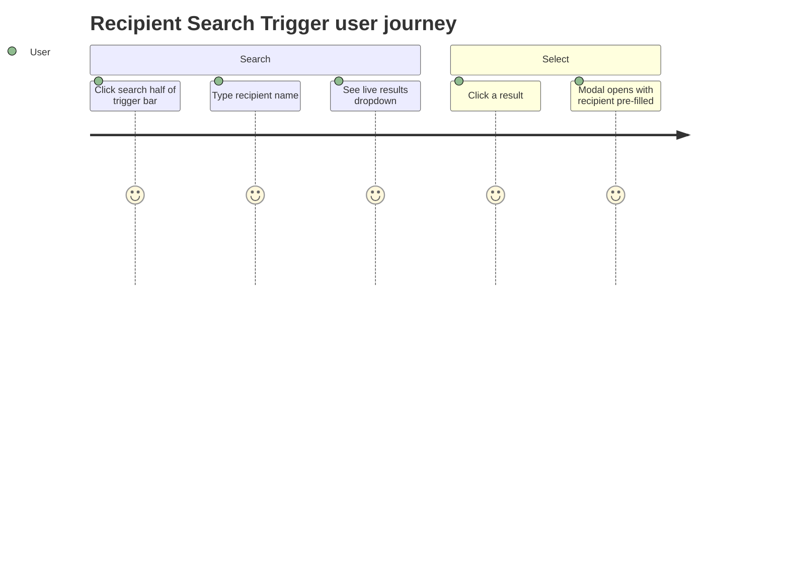
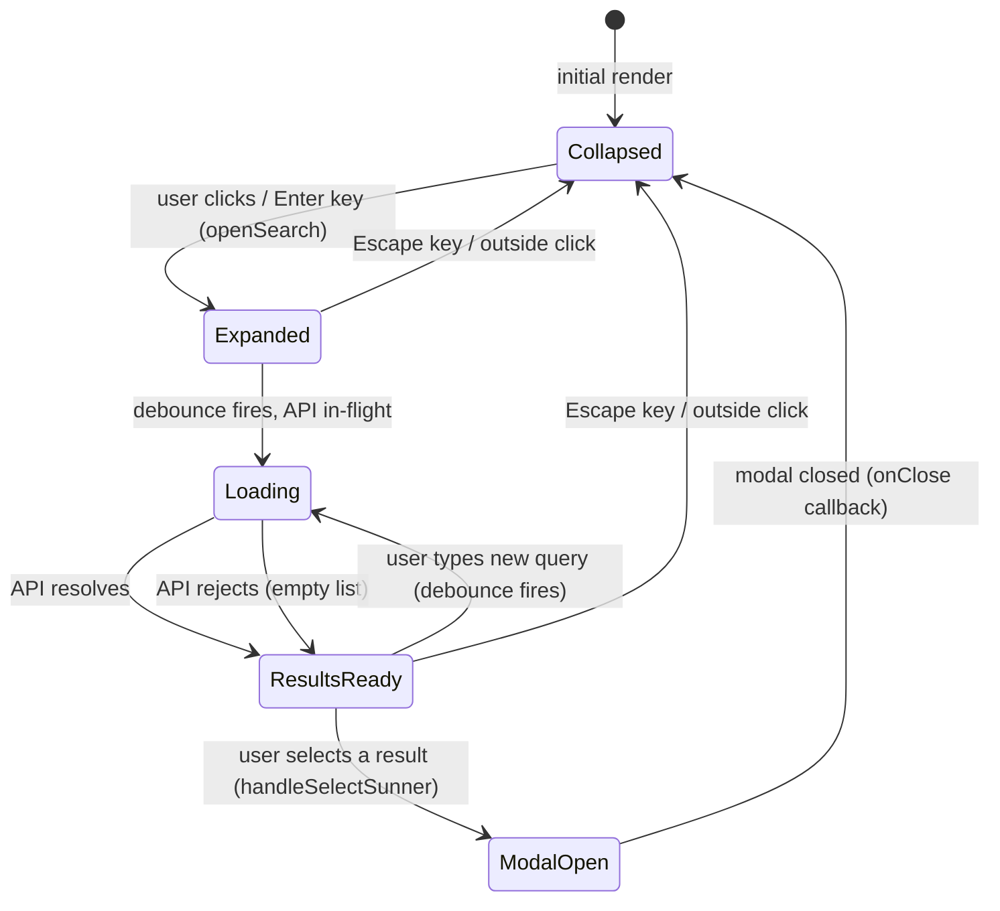

# Feature Specification: F018_RecipientSearchTrigger

**Priority**: P2
**Type**: ui
**Generated**: 2026-06-01

## Overview

The right half of the `KudosInputTrigger` bar in `REG003_AllKudosFeed` on the Kudos page. Clicking the "Search Sunner" button expands it into a live debounced (300 ms) search input that queries `GET /users?search=<term>`. Results render in a floating dropdown; selecting a user sets them as the pre-filled recipient and opens `WriteKudosModal`. Pressing Escape or clicking outside collapses the search bar back to its button state.

## Why This Exists

Allows a user to begin composing kudos from a named recipient context rather than opening a blank modal — reducing friction for targeted recognition. The trigger bar is the primary entry point to writing kudos on the Kudos page.

## Who Uses It

- **Authenticated User** — searches for a colleague to send kudos to (PERM001_BackendJwtRouteGuard)

## Business Workflow

```
1. User sees KudosInputTrigger bar; right half shows "Search Sunner" collapsed button
2. User clicks collapsed button (or presses Enter/Space) → searchOpen=true
   → requestAnimationFrame focuses the search input automatically
3. User types search term → 300ms debounce fires → apiFetch('/users?search=<term>')
   → UsersController::search → UsersService::search(term, limit=10)
   → returns UserSearchResult[] ordered by firstName ASC
4. Results rendered in dropdown; each row shows avatar + name + department
5. User clicks a result row → handleSelectSunner(user)
   → searchOpen=false, searchQuery='', searchResults=[]
   → presetRecipient=user, showWriteModal=true
6. WriteKudosModal opens with initialRecipient pre-filled
7. User presses Escape → searchOpen=false (search collapses, no modal)
8. User clicks outside searchContainerRef → mousedown handler → searchOpen=false
```

## Screen Flow

**See:** ScreenFlow § F018_RecipientSearchTrigger

| Screen | Route | Purpose |
|--------|-------|---------|
| SCR007_KudosPage/REG003_AllKudosFeed | `/kudos` | Trigger bar — search half lives here |



## Cross-Cutting Logic

### Requirements

None.

### Business Rules

None.

### State Machines

None.

### Algorithms

None.

### External Integrations

None.

### Verification

- **SC-001** — Typing in search bar triggers API call after 300 ms; results appear in dropdown (covers FR-002)
- **SC-002** — Selecting a result closes dropdown and opens WriteKudosModal with recipient chip pre-filled (covers FR-004)
- **SC-003** — Pressing Escape collapses search bar to button state (covers FR-005)

## User Stories

### US022_SearchRecipientInKudosTrigger — Search Recipient via Kudos Bar Search (Priority: P2)

**What happens:** Authenticated user clicks the right half of the kudos trigger bar, types a colleague's name or email, and sees a live dropdown of matching users. Selecting a user dismisses the dropdown and opens the Write Kudos modal with that user pre-filled as recipient. Empty input on open loads all users. Escape or outside click collapses back to button without opening modal.
**Why this priority:** Convenience shortcut — users can still open WriteKudosModal blank from the left half of the trigger bar (F010); this feature adds targeted pre-fill.
**Independent Test:** Click search half; type "Nguyen"; verify API call to `/users?search=Nguyen`; click a result; verify `WriteKudosModal` renders with correct recipient chip.

**Acceptance Scenarios:**

1. **Given** user is on `/kudos`, **When** they click the "Search Sunner" button, **Then** the input field expands and receives focus immediately.
2. **Given** search is open with empty input, **When** 300 ms elapses, **Then** `GET /users` is called (no `search` param) and up to 10 users are shown.
3. **Given** user types "Linh", **When** 300 ms elapses, **Then** `GET /users?search=Linh` is called; results show matching users.
4. **Given** dropdown has results, **When** user clicks one, **Then** `WriteKudosModal` opens with that user as pre-filled recipient; search collapses.
5. **Given** search is open, **When** user presses Escape, **Then** search collapses to button state; modal does NOT open.
6. **Given** search is open, **When** user clicks outside `searchContainerRef`, **Then** search collapses.

**Requirements fulfilled:**
- **FR-001** Expand search on click — `KudosInputTrigger::openSearch`
- **FR-002** Debounced search — `KudosInputTrigger` effect with 300 ms debounce
- **FR-003** Empty query loads all users — `apiFetch('/users')` when `term` is empty
- **FR-004** Pre-fill recipient on select — `handleSelectSunner` sets `presetRecipient` + `showWriteModal=true`
- **FR-005** Collapse on Escape/outside — `onKeyDown` handler + `mousedown` document listener

**Rules enforced:**

### BR-001_SearchDebounce
**Source:** `frontend/components/kudos/kudos-input-trigger.tsx:64-84`
**Applies to:** Search input onChange → API fetch
**Rule:** A `setTimeout` of `SEARCH_DEBOUNCE_MS = 300` ms is set on each `searchQuery` change. Any prior pending timer is cleared via `clearTimeout(debounceRef.current)` before setting a new one. The effect also cleans up on unmount. Empty `term` sends `/users` (no param); non-empty sends `/users?search=<encodeURIComponent(term)>`.

**Pseudocode:**
```ts
const SEARCH_DEBOUNCE_MS = 300
useEffect(() => {
  if (!searchOpen) return
  if (debounceRef.current) clearTimeout(debounceRef.current)
  const term = searchQuery.trim()
  debounceRef.current = setTimeout(async () => {
    setSearchLoading(true)
    try {
      const url = term ? `/users?search=${encodeURIComponent(term)}` : '/users'
      const data = await apiFetch<UserSearchResult[]>(url)
      setSearchResults(data)
    } catch {
      setSearchResults([])
    } finally {
      setSearchLoading(false)
    }
  }, SEARCH_DEBOUNCE_MS)
  return () => { if (debounceRef.current) clearTimeout(debounceRef.current) }
}, [searchQuery, searchOpen])
```

**Linked FR:** FR-002

### BR-002_OutsideClickCollapse
**Source:** `frontend/components/kudos/kudos-input-trigger.tsx:49-61`
**Applies to:** Search open state — collapse trigger
**Rule:** While `searchOpen=true`, a `mousedown` listener is attached to `document`. If the event target is outside `searchContainerRef.current`, `setSearchOpen(false)` is called. Listener is cleaned up when `searchOpen` becomes false or on unmount.

**Pseudocode:**
```ts
useEffect(() => {
  if (!searchOpen) return
  const handler = (e: MouseEvent) => {
    if (searchContainerRef.current &&
        !searchContainerRef.current.contains(e.target as Node)) {
      setSearchOpen(false)
    }
  }
  document.addEventListener('mousedown', handler)
  return () => document.removeEventListener('mousedown', handler)
}, [searchOpen])
```

**Linked FR:** FR-005

**State transitions:**

### SM-001_SearchBarLifecycle
**Source:** `frontend/components/kudos/kudos-input-trigger.tsx:34-221`
**Linked FR:** FR-001
**States:** Collapsed, Expanded, Loading, ResultsReady, ModalOpen



**Transition rules:**
- `Collapsed → Expanded`: guard = click or Enter/Space keydown; side effects = `searchOpen=true`, input focused via `requestAnimationFrame`
- `Expanded → Loading`: guard = debounce 300 ms elapsed; side effects = `searchLoading=true`, API call fired
- `Loading → ResultsReady`: guard = API resolves/rejects; side effects = `searchLoading=false`, `searchResults` set
- `ResultsReady → ModalOpen`: guard = row click `handleSelectSunner`; side effects = `searchOpen=false`, `presetRecipient=user`, `showWriteModal=true`
- `Expanded/ResultsReady → Collapsed`: guard = Escape key or outside click; side effects = `searchOpen=false`
- `ModalOpen → Collapsed`: guard = modal `onClose` callback; side effects = `showWriteModal=false`, `presetRecipient=null`

**Verification:**
- **SC-004** — State machine passes through Loading → ResultsReady on type; covers BR-001, SM-001
- **SC-005** — Outside click fires Collapsed transition while in ResultsReady state; covers BR-002, SM-001

---

### Edge Cases

| Scenario | Behavior |
|----------|----------|
| API returns 401 (expired JWT) | Catch block sets `searchResults=[]`; dropdown shows empty-state `t.kudosSearchEmpty` |
| No users match search term | API returns `[]`; dropdown shows `t.kudosSearchEmpty` paragraph |
| User types rapidly (faster than 300 ms) | Debounce resets on each keystroke; only final pause triggers API call |
| User selects a result, modal opens, closes without sending | `onClose` resets `showWriteModal=false` and `presetRecipient=null`; search bar returns to Collapsed |
| `GET /users` returns more than 10 users | Backend `UsersService::search` applies `.take(limit=10)`; client renders all returned rows |

## Key Entities

| Entity | Table | Key Columns | Purpose |
|--------|-------|-------------|---------|
| User | `users` | `email`, `firstName`, `lastName`, `picture`, `department` | Source for search results list |

## Related Artifacts

- **Screens**: `SCR007_KudosPage/REG003_AllKudosFeed`
- **User Stories**: `US022_SearchRecipientInKudosTrigger`
- **Routes**: `GET /users`
- **Data Models**: MODEL001 — User
- **Background Logic**: _(none)_
- **Permissions**: PERM001_BackendJwtRouteGuard

## Spec Documents

- [x] [System Overview](../../system-overview.md)
- [x] [Feature List](../../feature-list.md) — F018_RecipientSearchTrigger
- [x] [User Stories](../../user-stories.md) — US022_SearchRecipientInKudosTrigger
- [ ] [Route List](../../route-list.md) — GET /users
- [ ] [Data Model](../../data-model.md) — MODEL001
- [ ] [Screen List](../../screen-list.md) — SCR007_KudosPage/REG003_AllKudosFeed
- [ ] [Permissions](../../permissions.md) — PERM001_BackendJwtRouteGuard

## Assumptions

- `UsersService::search` has a hardcoded `limit = 10`; the trigger search and the modal's `RecipientSearch` both share the same endpoint but independently render results — no result sharing between components.
- The `kudos:created` custom window event is dispatched by `WriteKudosModal`'s `onSuccess` callback (defined in `KudosInputTrigger:213-215`), which triggers feed/highlight refetch — this is the submit flow owned by F005, not this feature.
- `requestAnimationFrame(() => searchInputRef.current?.focus())` is used because the input mounts on the next render after `setSearchOpen(true)`; a direct `.focus()` call without rAF would run before the DOM update.

## Source Code References

| Symbol | Path | Purpose |
|--------|------|---------|
| `KudosInputTrigger` | `frontend/components/kudos/kudos-input-trigger.tsx:34-246` | Full trigger bar: write left half + search right half |
| `openSearch` | `frontend/components/kudos/kudos-input-trigger.tsx:86-89` | Sets `searchOpen=true` + focuses input via rAF |
| `handleSelectSunner` | `frontend/components/kudos/kudos-input-trigger.tsx:92-98` | Collapses search, sets presetRecipient, opens modal |
| `UsersController::search` | `backend/src/users/users.controller.ts:9-15` | `GET /users?search=q` handler |
| `UsersService::search` | `backend/src/users/users.service.ts:21-44` | ILIKE query on firstName+lastName concat and email, limit 10 |

## Unresolved Questions

1. **Search limit**: `UsersService::search` defaults to `limit=10` and the controller does not expose a `limit` query param. If the user base grows large, the trigger bar may not surface relevant results. Is a higher limit or pagination intended?
2. **Pre-filled recipient in modal**: When `initialRecipient` is set via trigger bar, can the user clear it inside `WriteKudosModal`? The `RecipientSearch` component's `handleClear` calls `onChange(null)` — so yes, the chip can be cleared. This differs from F039 (spotlight pre-fill cannot be cleared). Confirm this asymmetry is intentional.
