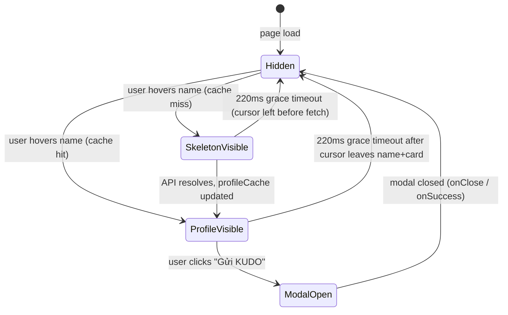

# Feature Specification: F019_SpotlightHoverCard

**Priority**: P2
**Type**: ui
**Generated**: 2026-06-01

## Overview

A floating hover card rendered inside `REG002_SpotlightSection` on the Kudos page. When the user hovers any name in the spotlight word cloud SVG, the component fetches `GET /kudos/recipient/:email/profile` and displays a fixed-position card with the recipient's avatar, name, department, badge tier, kudosReceived, kudosSent, and a "Gửi KUDO" CTA button. A skeleton loading state is shown during fetch. The card disappears 220 ms after the cursor leaves both the hovered name and the card itself. Profile data is cached in-memory per session to avoid redundant API calls on re-hover.

## Why This Exists

Reduces navigation cost for users curious about a recipient in the spotlight — they can see key stats and launch a kudos compose flow without leaving the page, increasing the likelihood of spontaneous recognition.

## Who Uses It

- **Any visitor (API-level)** — `GET /kudos/recipient/:email/profile` is public (PERM007_PublicSpotlightAccess)
- **Authenticated User (UI-level)** — frontend `AuthGuard` blocks unauthenticated users from reaching `/kudos`; "Gửi KUDO" button opens `WriteKudosModal` which requires auth

## Business Workflow

```
1. SpotlightWordCloud renders laid-out name SVG <g> elements
2. User mouses over a name → onMouseEnter fires → showCard(email, clientX, clientY)
3. showCard: clears any pending hideTimer; sets hovered={email, x, y}
4. If profileCache[email] exists → card renders immediately with cached data
5. If not cached → apiFetch('/kudos/recipient/<encodeURIComponent(email)>/profile')
   → KudosService.getRecipientProfile(email):
     a. userRepo.findOne({email}) → 404 if missing
     b. kudosRepo.count({receiverEmail}) → kudosReceived
     c. kudosRepo.count({senderEmail}) → kudosSent
     d. deriveBadge(kudosReceived) → badge tier string
6. On fetch success → profileCache updated; card switches from skeleton to ProfileBody
7. User mouses off name → scheduleHide() → 220ms timer → setHovered(null)
8. User mouses onto card → cancelHide() clears timer → card stays visible
9. User mouses off card → scheduleHide() → 220ms timer → setHovered(null)
10. User clicks "Gửi KUDO" → setWriteTarget(profile); setHovered(null)
    → WriteKudosModal opens with recipient pre-filled from profile
```

## Screen Flow

**See:** ScreenFlow § F019_SpotlightHoverCard

| Screen | Route | Purpose |
|--------|-------|---------|
| SCR007_KudosPage/REG002_SpotlightSection | `/kudos` | Spotlight word cloud — hover card anchors here |

## Cross-Cutting Logic

### Requirements

None.

### Business Rules

None.

### State Machines

None.

### Algorithms

None.

### External Integrations

None.

### Verification

- **SC-001** — First hover on a name: skeleton visible, then ProfileBody renders after fetch (covers FR-001, FR-002)
- **SC-002** — Re-hover on same name: card appears immediately (no loading state) (covers FR-004)
- **SC-003** — Moving cursor from name to card within 220 ms keeps card visible (covers FR-003)
- **SC-004** — Clicking "Gửi KUDO" opens WriteKudosModal with recipient chip pre-filled (covers FR-005)

## User Stories

### US019_ViewRecipientHoverCard — View Recipient Hover Card in Spotlight (Priority: P2)

**What happens:** Authenticated user hovers a name in the spotlight word cloud. A fixed-position card appears near the cursor showing the recipient's avatar (or initial fallback), name, department, badge tier, kudosReceived count, kudosSent count, and a "Gửi KUDO" button. A skeleton loading state is visible during the API fetch. Card dismisses 220 ms after the cursor leaves the name or the card. Profile data is cached; re-hovering the same name skips re-fetching.
**Why this priority:** Enhances spotlight discoverability; not on critical path for core kudos send flow.
**Independent Test:** Hover a name in spotlight; verify API call to `GET /kudos/recipient/<email>/profile`; verify card renders with correct name, badge, stat counts; move cursor off; verify card disappears after ~220 ms.

**Acceptance Scenarios:**

1. **Given** spotlight word cloud is rendered, **When** user hovers a name, **Then** `RecipientHoverCard` appears near cursor with skeleton; transitions to `ProfileBody` when fetch resolves.
2. **Given** profile is in `profileCache`, **When** user hovers that name again, **Then** card renders immediately without skeleton.
3. **Given** card is visible, **When** user moves cursor from name onto card, **Then** `cancelHide` fires; card remains visible.
4. **Given** card is visible, **When** user moves cursor off card, **Then** 220 ms later card disappears.
5. **Given** `GET /kudos/recipient/:email/profile` returns 404 (user not in DB), **When** fetch rejects, **Then** error is swallowed; card stays in skeleton state.

**Requirements fulfilled:**
- **FR-001** Hover triggers profile fetch — `showCard` in `SpotlightWordCloud`
- **FR-002** Skeleton during fetch — `RecipientHoverCard` `loading` prop
- **FR-003** Grace-delay hide — `scheduleHide` / `cancelHide` timer pair
- **FR-004** Profile cache — `profileCache` Record state in `SpotlightWordCloud`
- **FR-005** CTA pre-fills modal — `onSendKudo` callback chain

**Rules enforced:**

### BR-001_HoverCardGraceDelay
**Source:** `frontend/components/kudos/spotlight-word-cloud.tsx:221-228`
**Applies to:** Card visibility when cursor transitions between name and card
**Rule:** `scheduleHide()` sets a 220 ms timeout to `setHovered(null)`. If cursor enters the card before timeout fires, `cancelHide()` clears the timer. Same `scheduleHide` is called on card's `onMouseLeave`. This creates a 220 ms grace window for cursor travel between adjacent elements.

**Pseudocode:**
```ts
const hideTimer = useRef<ReturnType<typeof setTimeout> | null>(null)

function scheduleHide() {
  if (hideTimer.current) clearTimeout(hideTimer.current)
  hideTimer.current = setTimeout(() => setHovered(null), 220)
}

function cancelHide() {
  if (hideTimer.current) { clearTimeout(hideTimer.current); hideTimer.current = null }
}

// name <g> element:
// onMouseEnter={(e) => showCard(w.email, e.clientX, e.clientY)}
// onMouseLeave={scheduleHide}

// RecipientHoverCard:
// onMouseEnter={cancelHide}
// onMouseLeave={scheduleHide}
```

**Linked FR:** FR-003

### BR-002_ProfileCache
**Source:** `frontend/components/kudos/spotlight-word-cloud.tsx:211-218`
**Applies to:** `showCard` — profile fetch decision
**Rule:** `showCard(email, x, y)` first checks `profileCache[email]`. If present, only `setHovered` is called (no fetch). If absent, `apiFetch` is called and on success `setProfileCache(c => ({ ...c, [email]: p }))`. Fetch errors are swallowed — card remains in skeleton state indefinitely for that email.

**Pseudocode:**
```ts
function showCard(email: string, clientX: number, clientY: number) {
  if (hideTimer.current) { clearTimeout(hideTimer.current); hideTimer.current = null }
  setHovered({ email, x: clientX, y: clientY })
  if (profileCache[email]) return        // cache hit — skip fetch
  apiFetch<RecipientProfile>(
    `/kudos/recipient/${encodeURIComponent(email)}/profile`
  )
    .then(p => setProfileCache(c => ({ ...c, [email]: p })))
    .catch(() => { /* skeleton persists */ })
}
```

**Linked FR:** FR-004

**State transitions:**

### SM-001_HoverCardLifecycle
**Source:** `frontend/components/kudos/spotlight-word-cloud.tsx:83-426`
**Linked FR:** FR-001
**States:** Hidden, SkeletonVisible, ProfileVisible, ModalOpen



**Transition rules:**
- `Hidden → SkeletonVisible`: guard = mouseenter on name + cache miss; side effects = `hovered` set, fetch initiated
- `Hidden → ProfileVisible`: guard = mouseenter on name + cache hit; side effects = `hovered` set, no fetch
- `SkeletonVisible → ProfileVisible`: guard = fetch resolves; side effects = `profileCache[email]` populated
- `ProfileVisible → Hidden`: guard = `scheduleHide` 220 ms elapsed (neither name nor card re-entered); side effects = `setHovered(null)`
- `ProfileVisible → ModalOpen`: guard = "Gửi KUDO" click; side effects = `setWriteTarget(profile)`, `setHovered(null)`
- `ModalOpen → Hidden`: guard = modal `onClose`/`onSuccess`; side effects = `setWriteTarget(null)`

**Algorithms:**

### ALG-001_CardHorizontalClamp
**Source:** `frontend/components/kudos/recipient-hover-card.tsx:38-39`
**Input:** `x: number` (cursor clientX), `CARD_WIDTH = 344`
**Output:** `left: number` (clamped CSS left value in px)
**Complexity:** O(1)
**Description:** Prevents the card from overflowing the right or left viewport edge. Subtracts half card width to centre card on cursor, then clamps between `padding=12` and `window.innerWidth - CARD_WIDTH - 12`.

**Pseudocode:**
```ts
function clampInViewport(left: number, width: number): number {
  if (typeof window === 'undefined') return left
  const padding = 12
  const max = window.innerWidth - width - padding
  return Math.max(padding, Math.min(left, max))
}
const clampedX = clampInViewport(x - CARD_WIDTH / 2, CARD_WIDTH)
const top = y + CARD_OFFSET_Y   // CARD_OFFSET_Y = 16
```

**Linked FR:** FR-001

**Verification:**
- **SC-005** — Card does not overflow viewport right edge when hovering a name near right side of screen (covers ALG-001)
- **SC-006** — SM-001 state transitions validated: hover→skeleton→profile→hidden sequence (covers SM-001, BR-001, BR-002)

---

### Edge Cases

| Scenario | Behavior |
|----------|----------|
| `GET /kudos/recipient/:email/profile` returns 404 | Catch swallows; `profileCache[email]` never set; card stays in skeleton indefinitely until cursor leaves |
| User hovers name, cursor moves off before fetch completes | `scheduleHide` fires 220 ms after mouseLeave; `setHovered(null)` dismisses card; fetch result still stored in `profileCache` for next hover |
| Hover two different names rapidly | Each call to `showCard` cancels pending hide timer and sets new `hovered`; only the last hovered name's card is visible at once |
| `profile.picture` is empty string | `Avatar` component falls back to initial-letter div (`profile.name.charAt(0).toUpperCase()`) |
| `deriveBadge(kudosReceived)` returns `''` (0 kudos) | `BadgeChip` renders with empty label — label div still renders; no conditional null guard visible in source |
| Viewport resize while card is open | Card position is fixed at time of mouseEnter; `clampInViewport` uses `window.innerWidth` at render time only; resize may cause overflow until next hover |

## Key Entities

| Entity | Table | Key Columns | Purpose |
|--------|-------|-------------|---------|
| User | `users` | `email`, `firstName`, `lastName`, `picture`, `department` | Profile display in hover card |
| Kudos | `kudos` | `receiverEmail`, `senderEmail`, `id` | COUNT queries for kudosReceived and kudosSent |

## Related Artifacts

- **Screens**: `SCR007_KudosPage/REG002_SpotlightSection`
- **User Stories**: `US019_ViewRecipientHoverCard`
- **Routes**: `GET /kudos/recipient/:email/profile`
- **Data Models**: MODEL001 — User, MODEL002 — Kudos
- **Background Logic**: _(none)_
- **Permissions**: PERM007_PublicSpotlightAccess

## Spec Documents

- [x] [System Overview](../../system-overview.md)
- [x] [Feature List](../../feature-list.md) — F019_SpotlightHoverCard
- [x] [User Stories](../../user-stories.md) — US019_ViewRecipientHoverCard
- [ ] [Route List](../../route-list.md) — GET /kudos/recipient/:email/profile
- [ ] [Data Model](../../data-model.md) — MODEL001, MODEL002
- [ ] [Screen List](../../screen-list.md) — SCR007_KudosPage/REG002_SpotlightSection
- [ ] [Permissions](../../permissions.md) — PERM007_PublicSpotlightAccess

## Assumptions

- `deriveBadge` thresholds are: ≥20 → "Legend Hero", ≥10 → "Super Hero", ≥5 → "Rising Hero", ≥1 → "New Hero", 0 → `''`. These are hardcoded in `KudosService` and not configurable via env/DB.
- The `BadgeChip` component does not guard against empty `label` — it renders the pill with no text if `deriveBadge` returns `''`. This is visible at 0 kudos received.
- `profileCache` is component-level state (lost on `SpotlightWordCloud` unmount/remount); there is no persistent or cross-session cache.
- The card uses `position: fixed` CSS, anchored via `clientX/Y` from the mouse event, which correctly escapes the SVG transform matrix applied to the word cloud (`translate + scale` group).

## Source Code References

| Symbol | Path | Purpose |
|--------|------|---------|
| `SpotlightWordCloud` (hover logic) | `frontend/components/kudos/spotlight-word-cloud.tsx:83-228` | showCard, scheduleHide, cancelHide, profileCache state |
| `RecipientHoverCard` | `frontend/components/kudos/recipient-hover-card.tsx:1-179` | Card layout: skeleton, ProfileBody, BadgeChip, clampInViewport |
| `KudosController::getRecipientProfile` | `backend/src/kudos/kudos.controller.ts:69-73` | `GET /kudos/recipient/:email/profile` — no auth guard |
| `KudosService::getRecipientProfile` | `backend/src/kudos/kudos.service.ts:309-325` | Parallel User lookup + kudos counts + badge derivation |
| `deriveBadge` | `backend/src/kudos/kudos.service.ts:29-35` | Badge tier label from kudosReceived count |

## Unresolved Questions

1. **Empty badge rendering**: `deriveBadge` returns `''` for a user with 0 kudosReceived. `BadgeChip` renders an empty pill in this state — is that intentional or should the chip be hidden when label is empty?
2. **Cache invalidation**: `profileCache` is never invalidated during the page session. If a user receives kudos while the spotlight page is open, their cached stats will be stale. Is a max-age or invalidation-on-kudos-created strategy required?
3. **SVG hover on mobile**: `onMouseEnter`/`onMouseLeave` are mouse events; on touch devices the hover card will never appear. Is touch support planned?
