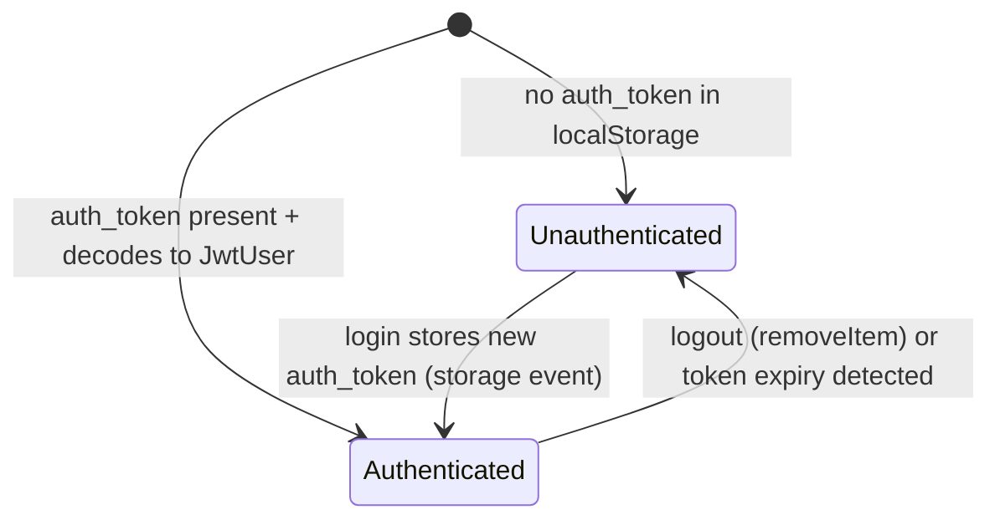

# Feature Specification: F020_GlobalHeader

**Priority**: P2
**Type**: ui
**Generated**: 2026-06-01

## Overview

`SiteHeader` is a fixed-position layout component rendered on all auth-required pages (Home, Awards, Community Standards, Kudos, Profile). It contains: a logo link (→ `/`), three nav links (About SAA `/`, Awards `/awards`, Kudos `/kudos`) with active-state underline, a notification bell (`NotificationPanel`), a language selector (`LanguageSelector`), and a user avatar dropdown (`UserProfileDropdown`). No API call is made; user identity is read from the JWT payload in `localStorage` via `useSyncExternalStore` + `getAuthUserSnapshot`. Right-side elements (bell and avatar) are conditionally rendered only when `authUser !== null`.

## Why This Exists

Provides consistent site-wide navigation, identity display, and quick access to logout and profile — the foundational chrome required on every authenticated page. Centralising it as a single `SiteHeader` component ensures nav state and user info are always in sync.

## Who Uses It

- **Authenticated User** — navigates between pages, accesses profile, logs out, toggles language, opens notification panel (PERM003_FrontendAuthGuard)

## Business Workflow

```
1. Any auth-required page renders <SiteHeader currentPath="/current-route" />
2. SiteHeader mounts HeaderInner; useSyncExternalStore subscribes to localStorage
   'auth_token' changes via subscribeAuthUser (storage + auth-token-changed events)
3. getAuthUserSnapshot() reads localStorage['auth_token'] → decodeJwt(token) →
   returns JwtUser { sub, email, firstName, lastName, picture, exp }
4. If authUser !== null: NotificationPanel + UserProfileDropdown rendered
5. Nav link matching currentPath receives active styles (gold text + border-bottom)
6. User opens UserProfileDropdown → clicks "Profile" → handleProfile()
   → router.push('/profile/<encodeURIComponent(user.email)>')
7. User clicks "Logout" → handleLogout()
   → localStorage.removeItem('auth_token') → router.replace('/login')
8. User opens NotificationPanel → static empty-state shown (no API)
9. User changes language via LanguageSelector → i18n context updated (no API)
```

## Screen Flow

**See:** ScreenFlow § F020_GlobalHeader

| Screen | Route | Purpose |
|--------|-------|---------|
| SCR001_HomePage | `/` | Header present; About SAA nav link active |
| SCR005_AwardsPage | `/awards` | Header present; Awards nav link active |
| SCR006_CommunityStandardsPage | `/community-standards` | Header present; no nav link active |
| SCR007_KudosPage | `/kudos` | Header present; Kudos nav link active |
| SCR009_ProfilePage | `/profile/:email` | Header present; no nav link active |

## Cross-Cutting Logic

### Requirements

| Code | Description | Endpoint/Handler | Verifiable |
|------|-------------|------------------|------------|
| FR-001 | Header fixed at top of all auth-required pages; reads JWT user from localStorage | client: `useSyncExternalStore` + `getAuthUserSnapshot` | yes |
| FR-002 | Nav links highlight active route via `currentPath` prop comparison | client: `isActive = currentPath === item.href` | yes |
| FR-003 | NotificationPanel and UserProfileDropdown conditionally rendered when `authUser !== null` | client: `isAuth` boolean | yes |

### Business Rules

None.

### State Machines

None.

### Algorithms

None.

### External Integrations

None.

### Verification

- **SC-001** — Header renders on `/kudos`; Kudos nav link has gold text and border-bottom; other links do not (covers FR-001, FR-002)
- **SC-002** — After logout (`auth_token` removed), `useSyncExternalStore` re-renders; bell and avatar hidden (covers FR-003)

## User Stories

### US007_NavigateToProfileFromHeader — Navigate to Own Profile from Header (Priority: P2)

**What happens:** Authenticated user clicks their avatar in the header to open the `UserProfileDropdown`. Clicking "Profile" navigates to `/profile/<currentUserEmail>`. Email is extracted from the JWT payload (`JwtUser.email`) decoded from `auth_token` in `localStorage`. Navigation preserves auth state.
**Why this priority:** Common navigation path; profile is also reachable by direct URL — not blocking.
**Independent Test:** Load any auth-required page; click avatar; click "Profile"; verify URL changes to `/profile/<encoded-email>`.

**Acceptance Scenarios:**

1. **Given** user is authenticated, **When** they click their avatar, **Then** `UserProfileDropdown` opens showing "Profile" and "Logout" menu items.
2. **Given** dropdown is open, **When** user clicks "Profile", **Then** `router.push('/profile/<encodeURIComponent(user.email)>')` is called; dropdown closes.
3. **Given** `user.email` is undefined (malformed JWT), **When** user clicks "Profile", **Then** `router.push` is NOT called (guarded by `if (user?.email)`).

**Requirements fulfilled:**
- **FR-004** User avatar opens profile dropdown — `UserProfileDropdown` click handler
- **FR-005** "Profile" item navigates to `/profile/:email` — `handleProfile` in `UserProfileDropdown`

**Rules enforced:**

### BR-001_ProfileNavEmailGuard
**Source:** `frontend/components/homepage/user-profile-dropdown.tsx:29-33`
**Applies to:** "Profile" menu item click
**Rule:** `handleProfile` checks `user?.email` before calling `router.push`. If `email` is absent or `user` is null, navigation is silently skipped. This prevents a navigation to `/profile/undefined`.

**Pseudocode:**
```ts
function handleProfile() {
  setOpen(false)
  if (user?.email) {
    router.push(`/profile/${encodeURIComponent(user.email)}`)
  }
  // no-op if email missing
}
```

**Linked FR:** FR-005

**Verification:**
- **SC-003** — Clicking "Profile" with valid JWT navigates to correct profile URL (covers FR-005, BR-001)

---

### US008_LogOut — Log Out (Priority: P2)

**What happens:** Authenticated user opens `UserProfileDropdown` and clicks "Logout". `auth_token` is removed from `localStorage` and the user is immediately redirected to `/login` via `router.replace`. No API call is made. Any subsequent navigation to a protected route is blocked by `PERM003_FrontendAuthGuard`.
**Why this priority:** Required for session security; simple client-side clear — no server-side session to invalidate.
**Independent Test:** Log in; click logout; verify `localStorage.getItem('auth_token')` is null; verify URL is `/login`.

**Acceptance Scenarios:**

1. **Given** user is authenticated, **When** they click "Logout", **Then** `localStorage.removeItem('auth_token')` is called; user is redirected to `/login`.
2. **Given** logout redirect lands on `/login`, **When** user navigates back, **Then** `AuthGuard` blocks protected routes (no token present).
3. **Given** `auth_token` is removed, **When** `useSyncExternalStore` re-evaluates, **Then** `authUser` becomes `null`; bell and avatar disappear from header.

**Requirements fulfilled:**
- **FR-006** Logout removes token and redirects — `handleLogout` in `UserProfileDropdown`

**Rules enforced:**

### BR-002_LogoutTokenClear
**Source:** `frontend/components/homepage/user-profile-dropdown.tsx:36-40`
**Applies to:** "Logout" menu item click
**Rule:** `handleLogout` calls `localStorage.removeItem('auth_token')`, closes dropdown, then `router.replace('/login')`. `router.replace` (not `push`) ensures the current page is not in history — back-button after logout goes to the page before the protected page, not back to it.

**Pseudocode:**
```ts
function handleLogout() {
  localStorage.removeItem('auth_token')
  setOpen(false)
  router.replace('/login')
}
```

**Linked FR:** FR-006

**State transitions:**

### SM-001_AuthUserHeaderState
**Source:** `frontend/components/homepage/site-header.tsx:16-66` + `frontend/lib/jwt.ts:33-58`
**Linked FR:** FR-001
**States:** Authenticated, Unauthenticated



**Transition rules:**
- `[*] → Authenticated`: guard = `localStorage['auth_token']` exists and `decodeJwt` returns non-null; side effects = bell + avatar rendered
- `[*] → Unauthenticated`: guard = no token; side effects = bell + avatar hidden
- `Authenticated → Unauthenticated`: guard = `localStorage.removeItem('auth_token')` fires `auth-token-changed` event OR `storage` event from another tab; side effects = `authUser=null`, bell/avatar unmounted
- `Unauthenticated → Authenticated`: guard = `localStorage.setItem('auth_token', ...)` fires storage event; side effects = `authUser` populated, bell/avatar mounted

**Verification:**
- **SC-004** — After logout, `authUser` is null; bell and avatar are not in DOM (covers SM-001, BR-002)

---

### US009_ToggleLanguage — Toggle UI Language (Priority: P2)

**What happens:** Language selector in the header allows switching between VN (Vietnamese) and EN (English). State persists for the session via `LanguageContext`. All i18n strings in the header and across auth-required pages update immediately. No API call; no `localStorage` persistence across sessions.
**Why this priority:** UX nicety; core content is in Vietnamese; English toggle is secondary.
**Independent Test:** Load `/kudos`; verify default language labels; click EN toggle; verify nav labels and header strings change to English equivalents.

**Acceptance Scenarios:**

1. **Given** app is in VN mode, **When** user selects EN, **Then** all `useTranslations()` consumers re-render with English strings.
2. **Given** app is in EN mode, **When** user refreshes, **Then** language resets to default (no persistence — session-only).

**Requirements fulfilled:**
- **FR-007** Language toggle updates i18n context — `LanguageSelector` + `LanguageContext`

**Rules enforced:** None specific to this US.

**Verification:**
- **SC-005** — Clicking EN/VN updates header nav labels immediately (covers FR-007)

---

### US010_ViewNotificationPanel — View Notification Panel (Priority: P2)

**What happens:** Authenticated user clicks the bell icon. A dropdown panel opens showing a static empty-state message (`t.notificationEmpty`). No API call is made. Clicking outside the panel closes it.
**Why this priority:** Placeholder feature; no notification data exists in the current backend.
**Independent Test:** Click bell; verify dropdown opens with empty-state text; click outside; verify dropdown closes.

**Acceptance Scenarios:**

1. **Given** user clicks bell, **When** panel opens, **Then** `t.notificationTitle` header and `t.notificationEmpty` body are visible.
2. **Given** panel is open, **When** user clicks outside `ref.current`, **Then** `setOpen(false)` fires; panel closes.
3. **Given** panel is open, **When** user clicks bell again, **Then** panel toggles closed.

**Requirements fulfilled:**
- **FR-008** Bell opens notification panel — `NotificationPanel` toggle state
- **FR-009** Panel shows empty-state; outside click closes — `mousedown` listener on `document`

**Rules enforced:**

### BR-003_NotificationOutsideClickClose
**Source:** `frontend/components/homepage/notification-panel.tsx:12-18`
**Applies to:** Notification panel open state
**Rule:** While panel is open, a `mousedown` listener on `document` checks if event target is outside `ref.current`; if so, `setOpen(false)`. Same pattern as `UserProfileDropdown` and spotlight hover card.

**Pseudocode:**
```ts
useEffect(() => {
  const handler = (e: MouseEvent) => {
    if (ref.current && !ref.current.contains(e.target as Node)) {
      setOpen(false)
    }
  }
  document.addEventListener('mousedown', handler)
  return () => document.removeEventListener('mousedown', handler)
}, [])
```

**Linked FR:** FR-009

**Verification:**
- **SC-006** — Panel opens on bell click; closes on outside click; displays empty-state message (covers FR-008, FR-009, BR-003)

---

### Edge Cases

| Scenario | Behavior |
|----------|----------|
| JWT token in localStorage is expired (`exp` in past) | `decodeJwt` still returns `JwtUser` (no expiry validation client-side); header renders as authenticated; next API call returns 401 from backend |
| JWT token is malformed (not 3 base64 parts) | `decodeJwt` returns `null`; `authUser = null`; bell and avatar hidden; user effectively unauthenticated in UI |
| `user.picture` is null/empty | `UserProfileDropdown` falls back to `FALLBACK_AVATAR = '/icons/icon-user.svg'` |
| `currentPath` does not match any navItem.href | No nav link is active; all rendered with `border-transparent` |
| `useSyncExternalStore` storage event from another tab (logout elsewhere) | `subscribeAuthUser` fires `callback`; `getAuthUserSnapshot` re-evaluates; header updates to unauthenticated state across tabs |

## Key Entities

| Entity | Table | Key Columns | Purpose |
|--------|-------|-------------|---------|
| User | `users` | `email`, `firstName`, `lastName`, `picture` | User identity fields read from JWT payload (not DB — decoded from token) |

## Related Artifacts

- **Screens**: `SCR001_HomePage`, `SCR005_AwardsPage`, `SCR006_CommunityStandardsPage`, `SCR007_KudosPage`, `SCR009_ProfilePage`
- **User Stories**: `US007_NavigateToProfileFromHeader`, `US008_LogOut`, `US009_ToggleLanguage`, `US010_ViewNotificationPanel`
- **Routes**: _(none — client-only component)_
- **Data Models**: MODEL001 — User (JWT payload fields only; no DB read)
- **Background Logic**: _(none)_
- **Permissions**: PERM003_FrontendAuthGuard

## Spec Documents

- [x] [System Overview](../../system-overview.md)
- [x] [Feature List](../../feature-list.md) — F020_GlobalHeader
- [x] [User Stories](../../user-stories.md) — US007_NavigateToProfileFromHeader, US008_LogOut, US009_ToggleLanguage, US010_ViewNotificationPanel
- [ ] [Screen List](../../screen-list.md) — SCR001_HomePage, SCR005_AwardsPage, SCR006_CommunityStandardsPage, SCR007_KudosPage, SCR009_ProfilePage
- [ ] [Permissions](../../permissions.md) — PERM003_FrontendAuthGuard

## Assumptions

- `SiteHeader` does not validate JWT expiry client-side; it trusts the presence of `auth_token` in `localStorage`. Expired tokens only fail when the next API call returns 401. No proactive expiry check or auto-logout timer exists.
- `subscribeAuthUser` listens to both `storage` (cross-tab) and `auth-token-changed` (same-tab custom event dispatched by `notifyAuthChanged`). `notifyAuthChanged` is defined in `lib/jwt.ts:60-64` but is NOT called in `handleLogout` — `router.replace` triggers a full navigation, so the re-render is moot. Cross-tab logout works correctly via the `storage` event.
- Language selection state lives in `LanguageContext` (session-only, no `localStorage` persistence). Default language is Vietnamese.
- The header uses `position: fixed` (`z-40`), so page content must account for the 72 px header height via padding/margin.

## Source Code References

| Symbol | Path | Purpose |
|--------|------|---------|
| `SiteHeader` / `HeaderInner` | `frontend/components/homepage/site-header.tsx:1-71` | Header shell; JWT subscription; nav + right-side rendering |
| `UserProfileDropdown` | `frontend/components/homepage/user-profile-dropdown.tsx:1-120` | Avatar toggle; Profile nav; Logout action |
| `NotificationPanel` | `frontend/components/homepage/notification-panel.tsx:1-68` | Bell toggle; static empty-state panel |
| `getAuthUserSnapshot` / `subscribeAuthUser` | `frontend/lib/jwt.ts:33-58` | JWT decode + external store subscription |
| `decodeJwt` | `frontend/lib/jwt.ts:10-21` | Base64url decode of JWT payload to `JwtUser` |

## Unresolved Questions

1. **JWT expiry UX**: No client-side expiry detection exists. A user can stay on the page with an expired token until they trigger an API call. Is a proactive expiry check (e.g. polling `exp` field) or session-timeout banner required?
2. **`notifyAuthChanged` not called on logout**: `handleLogout` calls `localStorage.removeItem` directly without `notifyAuthChanged()`. Same-tab re-render works because `router.replace('/login')` causes full navigation — but any component that reads `authUser` via `useSyncExternalStore` in the same render cycle before navigation may briefly see stale state. Is this a known acceptable gap?
3. **`currentPath` prop**: `SiteHeader` receives `currentPath` as a prop from each page. If a page forgets to pass it (defaults to `'/'`), the About SAA link will be incorrectly highlighted. Is a hook-based auto-detection of the current path preferred?
