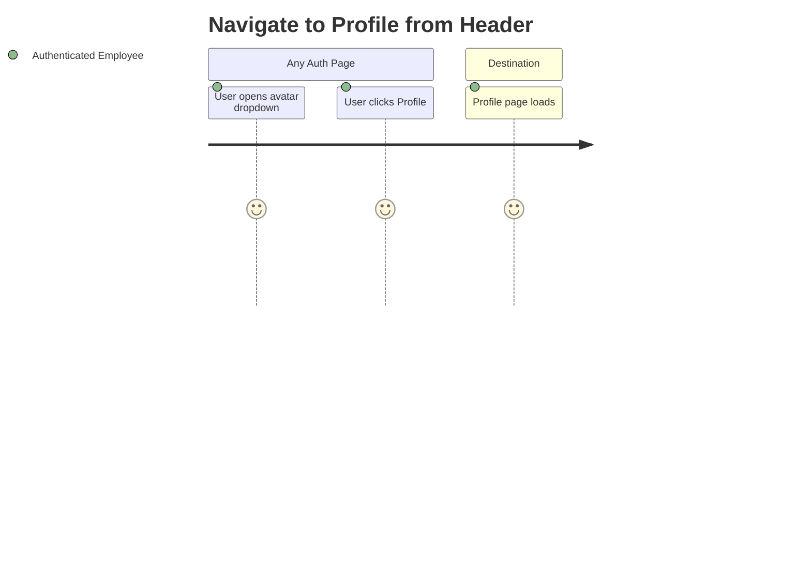
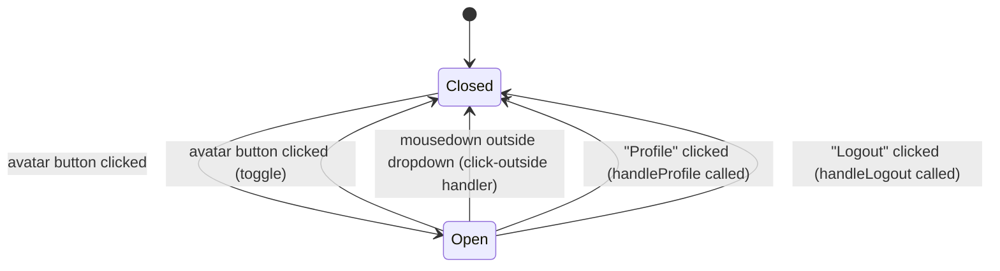

# Feature Specification: F021_NavigateToProfile

**Priority**: P2
**Type**: ui
**Generated**: 2026-06-01

## Overview

Authenticated users can navigate to their own profile page by opening the user avatar dropdown in the site header and clicking "Profile". The route `/profile/<currentUserEmail>` is constructed client-side from the JWT payload stored in `localStorage`. The header is present on all auth-required pages (SCR001, SCR005, SCR006, SCR007, SCR009), so navigation is universally available. No API call is made during navigation itself; `GET /kudos/profile/:email` is triggered by the destination ProfilePage on mount.

## Why This Exists

Employees need a direct shortcut to their own profile without knowing their email-based route. The header dropdown provides a persistent one-click entry point to personal kudos stats and icon collection from any authenticated page.

## Who Uses It

- **Authenticated employee (any role)** — clicks "Profile" in the header dropdown to view own kudos stats and sent/received history (PERM003_FrontendAuthGuard)

## Business Workflow

```
1. User (authenticated, JWT in localStorage) is on any auth-required page
   → SiteHeader renders UserProfileDropdown with authUser from useSyncExternalStore(subscribeAuthUser, …)
2. User clicks avatar button → dropdown opens (open state = true)
   → role="menu" div renders with "Profile" and "Logout" items
3. User clicks "Profile" menuitem → handleProfile() fires
   → encodeURIComponent(user.email) used to build route; router.push(`/profile/${encodeURIComponent(user.email)}`)
4. Next.js App Router navigates to /profile/<email>
   → PERM003 AuthGuard passes (auth_token present); ProfilePage mounts and calls GET /kudos/profile/:email
5. Profile page renders with user's kudos stats, hero badges, and kudos feed
```

## Screen Flow

**See:** ScreenFlow § F021_NavigateToProfile

| Screen | Route | Purpose |
|--------|-------|---------|
| SCR001_HomePage | `/` | Source: header profile nav available |
| SCR005_AwardsPage | `/awards` | Source: header profile nav available |
| SCR006_CommunityStandardsPage | `/community-standards` | Source: header profile nav available |
| SCR007_KudosPage | `/kudos` | Source: header profile nav available |
| SCR009_ProfilePage | `/profile/:email` | Destination: own profile page |



## Cross-Cutting Logic

### Requirements

| Code | Description | Endpoint/Handler | Verifiable |
|------|-------------|------------------|------------|
| FR-001 | Header renders UserProfileDropdown only when authUser is non-null | client-side conditional render | yes |
| FR-002 | Profile navigation uses email from decoded JWT payload | client-side `router.push` | yes |

### Business Rules

None.

### State Machines

None.

### Algorithms

None.

### External Integrations

None.

### Verification

- **SC-001** — Clicking "Profile" navigates to `/profile/<email>` where `<email>` matches the signed-in user's email (covers FR-001, FR-002)

## User Stories

### US007_NavigateToProfileFromHeader — Navigate to Own Profile from Header (Priority: P2)

**What happens:** An authenticated employee on any auth-required page opens the header dropdown by clicking their avatar, then clicks "Profile"; the app navigates to `/profile/<currentUserEmail>`, which loads the profile page with that user's data.
**Why this priority:** P2 — convenience feature; users can also manually type the URL. Not blocking core kudos functionality.
**Independent Test:** Log in, click avatar in header on `/` page, click "Profile" → URL changes to `/profile/<email>` and profile page renders with current user's name.

**Acceptance Scenarios:**

1. **Given** authenticated user is on the homepage (`/`), **When** they click their avatar then click "Profile", **Then** URL becomes `/profile/<email>` and the profile page renders without re-authentication.
2. **Given** user's JWT payload has `email = "alice@sun-asterisk.com"`, **When** "Profile" is clicked, **Then** navigation target is `/profile/alice%40sun-asterisk.com` (URL-encoded).
3. **Given** user is on SCR007_KudosPage, **When** they click avatar then "Profile", **Then** kudos page state is discarded and profile page renders at `/profile/<email>`.

**Requirements fulfilled:**
- **FR-001** Header renders `UserProfileDropdown` only when `authUser !== null` — client-side conditional in `SiteHeader` via `useSyncExternalStore`
- **FR-002** Profile route uses `encodeURIComponent(user.email)` — `UserProfileDropdown::handleProfile`

**Rules enforced:**

### BR-001_ProfileNavEmailRequired
**Source:** `frontend/components/homepage/user-profile-dropdown.tsx:29-34`
**Applies to:** `handleProfile` click handler
**Rule:** Navigation to profile only fires if `user?.email` is truthy. If `user` is null or has no email field, `router.push` is not called — the dropdown silently closes. This guards against a malformed JWT with no email claim.

**Pseudocode:**
```ts
function handleProfile() {
  setOpen(false);
  if (user?.email) {
    router.push(`/profile/${encodeURIComponent(user.email)}`);
  }
  // no-op if user or user.email is falsy
}
```

**Linked FR:** FR-002

**State transitions:**

### SM-001_HeaderDropdownLifecycle
**Source:** `frontend/components/homepage/user-profile-dropdown.tsx:14-27`
**States:** Closed, Open



**Transition rules:**
- `Closed → Open`: guard = avatar button click; side effects = `open` state set to `true`; dropdown menu rendered
- `Open → Closed (click outside)`: guard = `mousedown` event target not inside `ref.current`; side effects = `setOpen(false)`
- `Open → Closed (Profile)`: guard = `user?.email` truthy; side effects = `router.push('/profile/<email>')`
- `Open → Closed (Logout)`: guard = always; side effects = `localStorage.removeItem('auth_token')` + `router.replace('/login')`

**Linked FR:** FR-001

**Algorithms:** None.

**External integrations:** None.

**Verification:**
- **SC-001** Clicking "Profile" navigates to `/profile/<email>` (covers FR-001, FR-002, BR-001, SM-001)
- **SC-002** With no valid JWT email, clicking avatar then "Profile" closes dropdown without navigating (covers BR-001)

---

### Edge Cases

| Scenario | Behavior |
|----------|----------|
| JWT present but `email` field absent (malformed payload) | `handleProfile` fires, `user?.email` is falsy, `router.push` not called; dropdown closes silently |
| `auth_token` removed from localStorage mid-session | `subscribeAuthUser` fires on `storage` event → `authUser` becomes `null` → `UserProfileDropdown` unmounts; header no longer shows dropdown |
| Email contains special chars (e.g. `+`) | `encodeURIComponent` encodes safely; Next.js dynamic route `[email]` receives decoded value |
| User is on SCR009_ProfilePage (own profile) and clicks "Profile" | Navigation to same URL — Next.js re-renders profile page (no error) |

## Key Entities

| Entity | Table | Key Columns | Purpose |
|--------|-------|-------------|---------|
| User | `users` | `email`, `firstName`, `lastName`, `picture` | JWT payload source for dropdown display name, avatar, and profile route construction |
| JwtUser (client type) | localStorage `auth_token` | `email`, `firstName`, `lastName`, `picture`, `sub`, `exp` | Decoded from JWT in `lib/jwt.ts`; feeds `UserProfileDropdown` props |
| AuthGuard | N/A (client component) | N/A | Enforces `auth_token` presence before destination page renders |

## Related Artifacts

- **Screens** (from ScreenList): SCR001_HomePage, SCR005_AwardsPage, SCR006_CommunityStandardsPage, SCR007_KudosPage, SCR009_ProfilePage
- **User Stories** (from UserStories): US007_NavigateToProfileFromHeader
- **Routes** (from RouteList): N/A — client-side navigation; destination served by Next.js dynamic route `/profile/[email]`
- **Data Models** (from DataModel): MODEL001 (User)
- **Background Logic** (from BackgroundLogic): none
- **Permissions** (from Permissions): PERM003_FrontendAuthGuard

## Spec Documents

- [x] [System Overview](../../system-overview.md) — architecture, JWT auth pattern
- [x] [Feature List](../../feature-list.md) — F021_NavigateToProfile
- [ ] [Route List](../../route-list.md) — destination: `/profile/:email`
- [x] [Screen List](../../screen-list.md) — SCR001, SCR005, SCR006, SCR007, SCR009
- [x] [Screen Flow](../../screen-flow.md) — profile navigation entries
- [ ] [Background Logic](../../background-logic.md) — none applicable
- [x] [Permissions](../../permissions.md) — PERM003_FrontendAuthGuard
- [x] [User Stories](../../user-stories.md) — US007_NavigateToProfileFromHeader
- [ ] [Data Model](../../data-model.md) — MODEL001 (User)

## Assumptions

- `user.email` in the JWT payload is always a valid email string when the token is well-formed; no additional validation beyond truthy check is performed client-side.
- `encodeURIComponent` is sufficient for all Sun* email addresses (standard format `name@sun-asterisk.com`); no custom domain edge cases with exotic characters expected.
- The profile page at `/profile/[email]` correctly URL-decodes the parameter; no mismatch between encoded navigation target and decoded route param.

## Source Code References

| Symbol | Path | Purpose |
|--------|------|---------|
| `UserProfileDropdown` | `frontend/components/homepage/user-profile-dropdown.tsx:1-120` | Dropdown component with avatar toggle, Profile click handler, Logout handler |
| `SiteHeader / HeaderInner` | `frontend/components/homepage/site-header.tsx:1-71` | Mounts `UserProfileDropdown` conditionally when `isAuth = true`; passes `authUser` prop |
| `AuthGuard` | `frontend/components/auth/auth-guard.tsx:1-24` | Client-side route guard; redirects to `/login` if `auth_token` absent on non-public paths |
| `getAuthUserSnapshot / subscribeAuthUser` | `frontend/lib/jwt.ts:33-58` | `useSyncExternalStore` snapshot/subscribe pair; triggers re-render on `auth_token` change |
| `decodeJwt` | `frontend/lib/jwt.ts:10-21` | Decodes JWT payload without signature verification; extracts `JwtUser` fields |

## Unresolved Questions

1. **JWT expiry client-side**: `AuthGuard` checks only key presence in `localStorage`, not token expiry (`exp` claim). If an expired token remains in storage, `UserProfileDropdown` renders and profile navigation proceeds — the backend `GET /kudos/profile/:email` will then return 401. Is a client-side expiry check intended for a future iteration?
2. **Profile route encoding**: `encodeURIComponent` is used in navigation, but the `[email]` dynamic route in Next.js App Router automatically decodes it. Need to confirm no double-encoding occurs if the backend also expects the raw email as a path segment (not URL-encoded).
