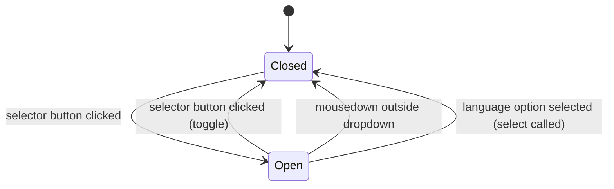

# Feature Specification: F022_LanguageToggle

**Priority**: P2
**Type**: ui
**Generated**: 2026-06-01

## Overview

A language selector widget renders in the site header on all auth-required pages and on the login page, allowing users to switch the UI between Vietnamese (VN) and English (EN). Language state is managed by `LanguageContext` (React context + `localStorage` persistence) and consumed via `useTranslations()` which returns the appropriate translation map from `lib/i18n.ts`. No API call is made; all translation strings are bundled client-side. The preference is persisted to `localStorage` key `lang` across page navigations within the browser session.

## Why This Exists

Sun* is a bilingual workplace (Vietnamese and English). Employees who prefer English need the full UI to be readable in their language. The toggle provides immediate in-session language switching without a page reload.

## Who Uses It

- **Any user (authenticated or unauthenticated)** — toggles UI language on login page or any auth-required page; no permission required

## Business Workflow

```
1. App loads → LanguageProvider (in app/layout.tsx) initializes lang state to 'VN' (default)
   → useEffect reads localStorage 'lang' key; if 'VN' or 'EN' found, restores that value
2. LanguageSelector renders in SiteHeader (all auth pages) and on LoginPage
   → current lang displayed as flag + code (e.g., 🇻🇳 VN)
3. User clicks selector button → isOpen state toggles to true
   → listbox dropdown renders with 'Tiếng Việt' and 'English' options
4. User selects a language option → select(code) fires
   → LanguageContext.setLang(code): updates React state + writes localStorage.setItem('lang', code)
   → isOpen set to false (dropdown closes)
5. useTranslations() re-evaluates in all consuming components
   → all visible text re-renders in the selected language without page reload
6. User navigates to another page
   → LanguageProvider reads 'lang' from localStorage on mount; selected language restored
```

## Screen Flow

**See:** ScreenFlow § F022_LanguageToggle

| Screen | Route | Purpose |
|--------|-------|---------|
| SCR001_HomePage | `/` | Language selector in header |
| SCR002_LoginPage | `/login` | Language selector on login page (pre-auth) |
| SCR005_AwardsPage | `/awards` | Language selector in header |
| SCR006_CommunityStandardsPage | `/community-standards` | Language selector in header |
| SCR007_KudosPage | `/kudos` | Language selector in header |
| SCR009_ProfilePage | `/profile/:email` | Language selector in header |

## Cross-Cutting Logic

### Requirements

| Code | Description | Endpoint/Handler | Verifiable |
|------|-------------|------------------|------------|
| FR-001 | LanguageSelector renders on all auth-required pages via SiteHeader and on LoginPage | client-side render (unconditional in SiteHeader) | yes |
| FR-002 | Selecting a language immediately updates all UI text via LanguageContext re-render | `LanguageContext.setLang` → `useTranslations()` consumers | yes |
| FR-003 | Language preference persists across navigations via localStorage `lang` key | `localStorage.setItem('lang', code)` + `useEffect` restore on mount | yes |

### Business Rules

### BR-001_ValidLangValues
**Source:** `frontend/components/login/language-context.tsx:17-18`
**Applies to:** `LanguageProvider` mount (localStorage restore)
**Rule:** Only `'VN'` and `'EN'` are accepted as valid stored values. Any other value in `localStorage['lang']` is ignored and the default `'VN'` is used.

**Pseudocode:**
```ts
const stored = localStorage.getItem('lang') as LangCode | null;
if (stored === 'VN' || stored === 'EN') setLangState(stored);
// otherwise: remain at default 'VN'
```

**Linked FR:** FR-003

### State Machines

### SM-001_LanguageSelectorDropdown
**Source:** `frontend/components/login/language-selector.tsx:12-76`
**States:** Closed, Open



**Transition rules:**
- `Closed → Open`: guard = button click; side effects = `setIsOpen(true)`
- `Open → Closed (button toggle)`: guard = button click while open; side effects = `setIsOpen(false)`
- `Open → Closed (outside click)`: guard = `mousedown` target not in `ref.current`; side effects = `setIsOpen(false)`
- `Open → Closed (selection)`: guard = any option click; side effects = `setLang(code)` → `localStorage.setItem('lang', code)` + React state update; dropdown closes

**Linked FR:** FR-001

### Algorithms

None.

### External Integrations

None.

### Verification

- **SC-001** — After selecting EN, all translation keys render English strings across every page (covers FR-001, FR-002)
- **SC-002** — After selecting a language and navigating to another route, the same language is still active (covers FR-003)
- **SC-003** — With `localStorage.lang = 'XX'` (invalid), page loads with Vietnamese (covers BR-001)

## User Stories

### US009_ToggleLanguage — Toggle UI Language (Priority: P2)

**What happens:** Any user (authenticated or on login page) clicks the language selector in the header or login page, picks a language from the two-item listbox (VN / EN), and all UI strings immediately update to the selected language. The choice is remembered for the browser session via `localStorage`.
**Why this priority:** P2 / low — UI polish; the app is usable in Vietnamese without this toggle. English-preferring users benefit but not a blocker.
**Independent Test:** On `/login`, click the language selector, choose "English" → all visible text on the page switches to English strings from `translations.EN`.

**Acceptance Scenarios:**

1. **Given** UI is in Vietnamese (`lang = 'VN'`), **When** user selects English from the dropdown, **Then** all labels (nav, buttons, placeholders) immediately show English text without page reload.
2. **Given** UI is in English, **When** user selects "Tiếng Việt", **Then** all text reverts to Vietnamese.
3. **Given** user selected English and navigated from `/` to `/kudos`, **When** kudos page loads, **Then** UI is still in English.
4. **Given** `localStorage.lang` is absent (first visit), **When** any page loads, **Then** default language is Vietnamese.

**Requirements fulfilled:**
- **FR-001** `LanguageSelector` renders unconditionally in `SiteHeader` right section and on `LoginPage` — `frontend/components/homepage/site-header.tsx:62`
- **FR-002** `setLang(code)` triggers React context re-render propagated to all `useTranslations()` consumers — `frontend/components/login/language-context.tsx:21-24`
- **FR-003** `localStorage.setItem('lang', code)` on every language change; `useEffect` restores on mount — `frontend/components/login/language-context.tsx:16-19`

**Rules enforced:** BR-001_ValidLangValues (see Cross-Cutting Logic)

**State transitions:** SM-001_LanguageSelectorDropdown (see Cross-Cutting Logic)

**Algorithms:** None.

**External integrations:** None.

**Verification:**
- **SC-001** Selecting EN updates all visible text immediately (covers FR-001, FR-002)
- **SC-002** Language preference survives same-session navigation (covers FR-003, BR-001)
- **SC-003** Invalid localStorage value defaults to VN (covers BR-001)

---

### Edge Cases

| Scenario | Behavior |
|----------|----------|
| `localStorage` unavailable (private browsing / quota exceeded) | `setItem` throws; React state still updates (lang works in-session but not persisted); error is unhandled — silent degradation |
| User opens selector and clicks outside without selecting | Dropdown closes; language unchanged; `setOpen(false)` via click-outside handler |
| Same language option selected as currently active | `setLang` called with same value; localStorage re-written with same value; no visible change (idempotent) |
| Two browser tabs open; user changes language in one tab | `localStorage` updated but no `storage` event fired for same-origin same-tab writes; other tab only picks up change on its next mount/reload |

## Key Entities

| Entity | Table | Key Columns | Purpose |
|--------|-------|-------------|---------|
| LanguageContext (client state) | `localStorage` key `lang` | value: `'VN'` \| `'EN'` | Single source of truth for active language; persisted between navigations |
| `translations` object | `frontend/lib/i18n.ts` | keys: VN, EN sub-objects with 100+ string keys | Static bundle containing all UI strings for both languages |
| `LanguageProvider` | N/A (React context) | `lang`, `setLang` | Context provider wrapping entire app in `app/layout.tsx` |

## Related Artifacts

- **Screens** (from ScreenList): SCR001_HomePage, SCR002_LoginPage, SCR005_AwardsPage, SCR006_CommunityStandardsPage, SCR007_KudosPage, SCR009_ProfilePage
- **User Stories** (from UserStories): US009_ToggleLanguage
- **Routes** (from RouteList): none — client-side i18n, no API routes
- **Data Models** (from DataModel): none
- **Background Logic** (from BackgroundLogic): none
- **Permissions** (from Permissions): none

## Spec Documents

- [x] [System Overview](../../system-overview.md) — frontend stack, stateless API context
- [x] [Feature List](../../feature-list.md) — F022_LanguageToggle
- [ ] [Route List](../../route-list.md) — no routes applicable
- [ ] [Data Model](../../data-model.md) — no models applicable
- [x] [Screen List](../../screen-list.md) — SCR001, SCR002, SCR005, SCR006, SCR007, SCR009
- [x] [Screen Flow](../../screen-flow.md) — language selector present on all auth pages + login
- [ ] [Background Logic](../../background-logic.md) — none applicable
- [ ] [Permissions](../../permissions.md) — none applicable
- [x] [User Stories](../../user-stories.md) — US009_ToggleLanguage

## Assumptions

- `LanguageProvider` wraps the entire app in `app/layout.tsx`; all pages are guaranteed to have access to `LanguageContext` — no page-level provider needed.
- `localStorage` is always available (app requires JavaScript; no SSR token check for language). The `useEffect` guard (`typeof window === 'undefined'`) is not needed here since the component is a Client Component — but the restore only runs client-side anyway.
- No server-side language negotiation (no `Accept-Language` header, no i18n routing). The language is purely client-managed.
- Only two languages (VN, EN) are supported; the `LANGUAGES` array in `language-selector.tsx:7-10` is the canonical list and must be kept in sync with `translations` keys in `lib/i18n.ts`.

## Source Code References

| Symbol | Path | Purpose |
|--------|------|---------|
| `LanguageProvider / useLang` | `frontend/components/login/language-context.tsx:1-35` | Context provider; lang state + localStorage sync; `useLang` hook |
| `LanguageSelector` | `frontend/components/login/language-selector.tsx:1-76` | Dropdown UI; renders flag + code; calls `setLang` on selection |
| `useTranslations` | `frontend/lib/i18n.ts:346-349` | Hook returning full translation map for current `lang` from `useLang()` |
| `translations` | `frontend/lib/i18n.ts:5-342` | Static object with `VN` and `EN` sub-objects; 100+ string keys each |
| `SiteHeader` (renders LanguageSelector) | `frontend/components/homepage/site-header.tsx:62` | `<LanguageSelector />` unconditionally in right-action group |
| `RootLayout` (mounts LanguageProvider) | `frontend/app/layout.tsx:55-57` | `<LanguageProvider>` wraps entire app |

## Unresolved Questions

1. **localStorage error handling**: No try/catch around `localStorage.setItem('lang', code)` in `language-context.tsx:23`. In storage-quota or private-browsing edge cases this throws silently. Is graceful degradation (in-memory only) acceptable or should this be handled explicitly?
2. **SSR hydration**: `LanguageProvider` initializes to `'VN'` on server/first render, then reads localStorage in `useEffect`. This means a one-render flash where the server-initial `'VN'` strings render before the stored `'EN'` is applied. Is this flicker acceptable, or is a `suppressHydrationWarning` / cookie-based approach planned?
