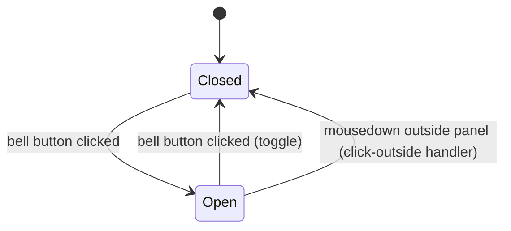

# Feature Specification: F023_NotificationPanel

**Priority**: P2
**Type**: ui
**Generated**: 2026-06-01

## Overview

A bell icon button in the site header opens a notification dropdown panel. The panel currently renders a static empty-state message ("Không có thông báo" / "No notifications") — no notification API exists. Clicking outside the open panel closes it. The feature is UI-only: open/close state is local React state with a click-outside handler; no data fetching, no polling, no WebSocket. Rendered only when the user is authenticated (`isAuth` check in `SiteHeader`).

## Why This Exists

The notification bell is a standard SaaS UI convention providing a future anchor point for in-app notifications (e.g., "Someone liked your kudos"). The empty-state shell establishes the UI surface and interaction pattern ahead of a notification API being built.

## Who Uses It

- **Authenticated employee** — clicks the bell icon to check for notifications; currently always sees empty state (PERM003_FrontendAuthGuard enforces auth before `SiteHeader` renders the bell)

## Business Workflow

```
1. Authenticated user is on any auth-required page
   → SiteHeader renders NotificationPanel (gated by isAuth check at site-header.tsx:61)
2. User clicks the bell icon button
   → open state toggles to true; role="dialog" panel renders below the bell
3. Panel displays header ("Thông báo" / "Notification") and empty-state body ("Không có thông báo" / "No notifications")
   → i18n strings from useTranslations(): t.notificationTitle, t.notificationEmpty
4. User clicks anywhere outside the panel
   → mousedown event handler fires; ref.current.contains check fails
   → setOpen(false); panel unmounts
5. No API call is made at any point in this flow
```

## Screen Flow

**See:** ScreenFlow § F023_NotificationPanel

| Screen | Route | Purpose |
|--------|-------|---------|
| SCR001_HomePage | `/` | Notification bell available in header |
| SCR005_AwardsPage | `/awards` | Notification bell available in header |
| SCR007_KudosPage | `/kudos` | Notification bell available in header |
| SCR009_ProfilePage | `/profile/:email` | Notification bell available in header |

## Cross-Cutting Logic

### Requirements

| Code | Description | Endpoint/Handler | Verifiable |
|------|-------------|------------------|------------|
| FR-001 | Bell icon renders only when user is authenticated | `SiteHeader` conditional `{isAuth && <NotificationPanel />}` | yes |
| FR-002 | Clicking bell toggles panel open/closed | `onClick={() => setOpen((o) => !o)}` | yes |
| FR-003 | Panel shows empty-state message (no notification data) | static `t.notificationEmpty` string; no fetch | yes |
| FR-004 | Clicking outside open panel closes it | `mousedown` click-outside handler on `document` | yes |

### Business Rules

### BR-001_StaticEmptyState
**Source:** `frontend/components/homepage/notification-panel.tsx:7-68`
**Applies to:** Panel content area
**Rule:** No API call is made when the panel opens or while it is open. The body always renders `t.notificationEmpty`. Any future notification data integration must add fetch logic here; no polling interval or WebSocket subscription exists.

**Pseudocode:**
```ts
// On panel open — no side effects beyond rendering:
if (open) {
  render(<div>{t.notificationEmpty}</div>);
  // no fetch, no useEffect data load
}
```

**Linked FR:** FR-003

### State Machines

### SM-001_NotificationPanelLifecycle
**Source:** `frontend/components/homepage/notification-panel.tsx:9-20`
**States:** Closed, Open



**Transition rules:**
- `Closed → Open`: guard = bell button click; side effects = `setOpen(true)`; panel `role="dialog"` mounts
- `Open → Closed (toggle)`: guard = bell button click while open; side effects = `setOpen(false)`; panel unmounts
- `Open → Closed (outside click)`: guard = `mousedown` where `!ref.current.contains(e.target)`; side effects = `setOpen(false)`

**Linked FR:** FR-002

### Algorithms

None.

### External Integrations

None.

### Verification

- **SC-001** — Clicking bell opens panel showing "Thông báo" header and empty-state text (covers FR-001, FR-002, FR-003)
- **SC-002** — Clicking outside open panel closes it; clicking bell again re-opens (covers FR-004, SM-001)

## User Stories

### US010_ViewNotificationPanel — View Notification Panel (Priority: P2)

**What happens:** An authenticated employee on any auth-required page clicks the bell icon in the site header. A dropdown panel opens below the bell showing a "Notification" header and an empty-state message. Clicking anywhere outside the panel closes it. No notifications are ever loaded (no API exists).
**Why this priority:** P2 / low — placeholder UI; no functional value until a notification API is built. Provides visual completeness only.
**Independent Test:** On any auth page, click the bell icon → panel opens with "Thông báo" (VN) or "Notification" (EN) header and empty body; click outside → panel closes.

**Acceptance Scenarios:**

1. **Given** authenticated user is on SCR001_HomePage, **When** they click the bell icon, **Then** a panel opens with title matching `t.notificationTitle` and body text matching `t.notificationEmpty`.
2. **Given** the notification panel is open, **When** user clicks anywhere outside the panel boundary, **Then** the panel closes and the bell returns to its default (non-highlighted) state.
3. **Given** the notification panel is open, **When** user clicks the bell icon again, **Then** the panel closes (toggle behavior).
4. **Given** UI language is English, **When** bell is clicked, **Then** panel header reads "Notification" and body reads "No notifications".

**Requirements fulfilled:**
- **FR-001** Bell renders only when `isAuth = true` — `frontend/components/homepage/site-header.tsx:61`
- **FR-002** Bell click toggles `open` state — `frontend/components/homepage/notification-panel.tsx:29`
- **FR-003** Panel body renders `t.notificationEmpty` only; no fetch — `frontend/components/homepage/notification-panel.tsx:62`
- **FR-004** Click-outside `mousedown` handler closes panel — `frontend/components/homepage/notification-panel.tsx:12-19`

**Rules enforced:** BR-001_StaticEmptyState (see Cross-Cutting Logic)

**State transitions:** SM-001_NotificationPanelLifecycle (see Cross-Cutting Logic)

**Algorithms:** None.

**External integrations:** None.

**Verification:**
- **SC-001** Panel opens with correct i18n strings (covers FR-001, FR-002, FR-003)
- **SC-002** Outside click closes panel (covers FR-004, SM-001)

---

### Edge Cases

| Scenario | Behavior |
|----------|----------|
| User is not authenticated | `SiteHeader` does not render `<NotificationPanel />` (`{isAuth && <NotificationPanel />}` evaluates to `false`) — bell icon is absent |
| Panel open while page navigation occurs (e.g., clicking a nav link) | Next.js navigation unmounts component; `useEffect` cleanup removes `mousedown` listener; panel closes naturally |
| Language switched while panel is open | Panel re-renders with new `t.notificationTitle` / `t.notificationEmpty` strings via `useTranslations()` re-evaluation; panel stays open |
| Rapid double-click on bell | Toggle fires twice: `open → false → true` or `true → false → true`; effectively a no-op; panel ends in same state |

## Key Entities

| Entity | Table | Key Columns | Purpose |
|--------|-------|-------------|---------|
| NotificationPanel (client component) | N/A | `open: boolean` (local state) | Manages panel visibility; all state is ephemeral React state |
| `t.notificationTitle` / `t.notificationEmpty` | `frontend/lib/i18n.ts` | VN: `'Thông báo'` / `'Không có thông báo'`; EN: `'Notification'` / `'No notifications'` | Display strings for panel header and empty state body |

## Related Artifacts

- **Screens** (from ScreenList): SCR001_HomePage, SCR005_AwardsPage, SCR007_KudosPage, SCR009_ProfilePage
- **User Stories** (from UserStories): US010_ViewNotificationPanel
- **Routes** (from RouteList): none — no API routes; static panel
- **Data Models** (from DataModel): none
- **Background Logic** (from BackgroundLogic): none
- **Permissions** (from Permissions): PERM003_FrontendAuthGuard (controls whether bell renders via `isAuth`)

## Spec Documents

- [x] [System Overview](../../system-overview.md) — stateless API, no notification system documented
- [x] [Feature List](../../feature-list.md) — F023_NotificationPanel
- [ ] [Route List](../../route-list.md) — none applicable
- [ ] [Data Model](../../data-model.md) — none applicable
- [x] [Screen List](../../screen-list.md) — SCR001, SCR005, SCR007, SCR009
- [x] [Screen Flow](../../screen-flow.md) — header present on all auth pages
- [ ] [Background Logic](../../background-logic.md) — none applicable
- [x] [Permissions](../../permissions.md) — PERM003_FrontendAuthGuard
- [x] [User Stories](../../user-stories.md) — US010_ViewNotificationPanel

## Assumptions

- The notification panel is intentionally a placeholder — no notification data model, API endpoint, or background job exists. This spec documents the shell only.
- `aria-haspopup="dialog"` and `aria-expanded` attributes on the bell button are present in source; screen reader behavior is considered acceptable for the empty-state panel.
- SCR006_CommunityStandardsPage is not listed in `F023` related screens (per feature-list.md); the bell icon does not render there (however `SiteHeader` is used on that page — this is an inconsistency worth verifying).

## Source Code References

| Symbol | Path | Purpose |
|--------|------|---------|
| `NotificationPanel` | `frontend/components/homepage/notification-panel.tsx:1-68` | Full component: bell button, open state, click-outside handler, panel dialog |
| `SiteHeader / HeaderInner` | `frontend/components/homepage/site-header.tsx:61` | `{isAuth && <NotificationPanel />}` — auth-gated render |
| `useTranslations` | `frontend/lib/i18n.ts:346-349` | Provides `t.notificationTitle` and `t.notificationEmpty` strings |
| `translations.VN/EN` | `frontend/lib/i18n.ts:162-163` (VN), `frontend/lib/i18n.ts:330-331` (EN) | Notification string keys: `notificationTitle`, `notificationEmpty` |

## Unresolved Questions

1. **SCR006 omission**: Feature-list shows SCR006_CommunityStandardsPage uses `SiteHeader` (all auth pages do), yet `F023` related screens list does not include SCR006. Is the bell intentionally hidden on the Community Standards page, or is this a spec artifact omission?
2. **Future notifications**: When a real notification API is added, will the panel poll on open, subscribe via WebSocket, or receive push? The current architecture (stateless, no queue, no WebSocket) does not support real-time delivery — a decision is needed before implementing.
