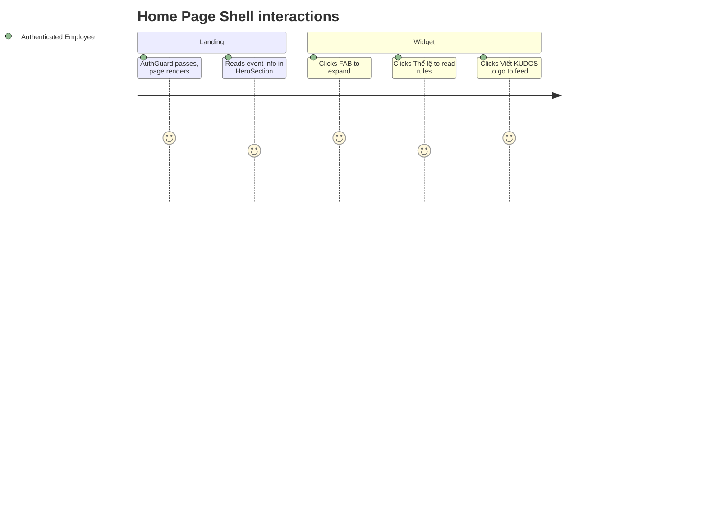
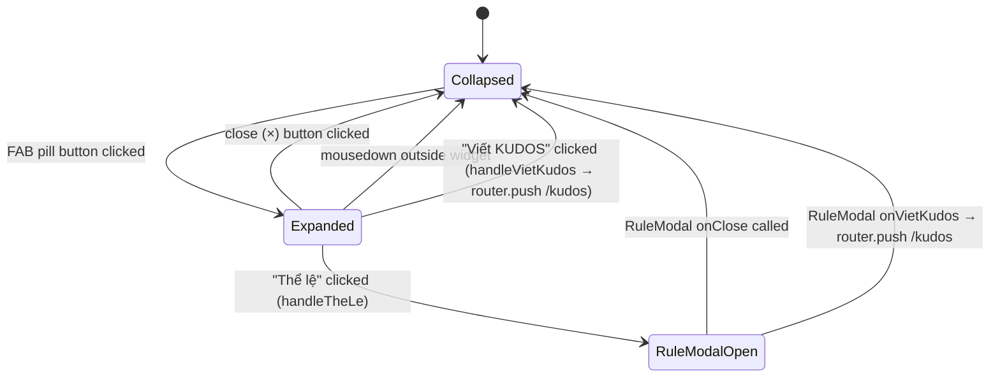

# Feature Specification: F024_HomePage

**Priority**: P2
**Type**: ui
**Generated**: 2026-06-01

## Overview

The Home Page (`/`) is a composite page shell that assembles six components: `SiteHeader`, `HeroSection` (REG001), `AwardsSection` (REG002), `KudosSection` (REG003), `SiteFooter`, and `WidgetButton`. The page is a Server Component (`app/page.tsx`) with no server-side data fetching — all content is static i18n strings rendered by client components beneath. `AuthGuard` in `app/layout.tsx` enforces authentication before the page renders. Two widget interactions are owned by this shell: opening the `RuleModal` ("Thể lệ") and navigating to `/kudos` ("Viết KUDOS") via the `WidgetButton` FAB.

## Why This Exists

The home page is the post-login landing screen. It orients employees to the Sun* Annual Awards 2025 event (hero, awards info, kudos movement overview) and provides the primary entry points to the rest of the app via header nav, hero CTAs, and the floating widget.

## Who Uses It

- **Authenticated employee** — lands here after login; reads event info; uses CTAs/widget to navigate or review community rules (PERM003_FrontendAuthGuard)

## Business Workflow

```
1. Authenticated user navigates to `/`
   → AuthGuard (app/layout.tsx:56) checks localStorage 'auth_token';
     if absent → router.replace('/login'); if present → setChecked(true) and render
2. app/page.tsx (Server Component) renders the page shell synchronously
   → No await/fetch; page renders immediately with static layout
3. SiteHeader mounts as Client Component
   → useSyncExternalStore reads auth_token → constructs authUser; renders nav + NotificationPanel + LanguageSelector + UserProfileDropdown
4. HeroSection (REG001) mounts
   → useTranslations() provides i18n strings; CountdownTimer starts client-side interval
5. AwardsSection (REG002) and KudosSection (REG003) mount
   → static i18n content rendered; no API calls
6. WidgetButton mounts (fixed bottom-right, z-50)
   → closed state (pill button); user may click to expand
7. User clicks WidgetButton FAB
   → isOpen → true; "Thể lệ" and "Viết KUDOS" buttons appear
8a. User clicks "Thể lệ"
   → handleTheLe(): setIsOpen(false); setShowTheLe(true)
   → RuleModal renders as overlay
8b. User clicks "Viết KUDOS"
   → handleVietKudos(): setIsOpen(false); router.push('/kudos')
```

## Screen Flow

**See:** ScreenFlow § F024_HomePage

| Screen | Route | Purpose |
|--------|-------|---------|
| SCR001_HomePage | `/` | Full page shell — entry point post-login |
| SCR001_HomePage/REG001_HeroBand | `/` | Hero band with event info + CTA buttons + countdown |
| SCR001_HomePage/REG002_AwardsGrid | `/` | Awards section — static award category cards |
| SCR001_HomePage/REG003_KudosCTA | `/` | Kudos section — kudos movement description + CTA |



## Cross-Cutting Logic

### Requirements

| Code | Description | Endpoint/Handler | Verifiable |
|------|-------------|------------------|------------|
| FR-001 | Page shell renders all 6 layout components without API calls | `app/page.tsx` Server Component | yes |
| FR-002 | AuthGuard blocks unauthenticated access and redirects to `/login` | `AuthGuard` useEffect in `app/layout.tsx` | yes |
| FR-003 | WidgetButton FAB expands to show "Thể lệ" and "Viết KUDOS" on click | `WidgetButton::isOpen` state | yes |
| FR-004 | "Thể lệ" opens RuleModal inline without navigation | `WidgetButton::handleTheLe` → `RuleModal isOpen` | yes |
| FR-005 | "Viết KUDOS" navigates to `/kudos` | `WidgetButton::handleVietKudos` → `router.push('/kudos')` | yes |

### Business Rules

### BR-001_AuthGuardRedirect
**Source:** `frontend/components/auth/auth-guard.tsx:13-19`
**Applies to:** All non-public routes including `/`
**Rule:** On every pathname change, `AuthGuard` checks `localStorage.getItem('auth_token')`. If the path is not in `PUBLIC_PATHS` (`['/login', '/countdown', '/auth/callback']`) and token is absent, `router.replace('/login')` fires. Component renders `null` until check completes, preventing flash of protected content.

**Pseudocode:**
```ts
useEffect(() => {
  const isPublic = PUBLIC_PATHS.some(p => pathname === p || pathname.startsWith(p + '/'));
  if (!isPublic && !localStorage.getItem('auth_token')) {
    router.replace('/login');
  } else {
    setChecked(true);
  }
}, [pathname]);

if (!checked) return null;
return <>{children}</>;
```

**Linked FR:** FR-002

### BR-002_WidgetClickOutsideCollapse
**Source:** `frontend/components/homepage/widget-button.tsx:14-24`
**Applies to:** WidgetButton expanded state
**Rule:** When `isOpen` is `true`, a `mousedown` listener is attached to `document`. Any click whose target is outside `containerRef.current` sets `isOpen` to `false`, collapsing the FAB menu. Listener is removed when `isOpen` returns to `false`.

**Pseudocode:**
```ts
useEffect(() => {
  if (!isOpen) return;
  const handler = (e: MouseEvent) => {
    if (!containerRef.current?.contains(e.target as Node)) setIsOpen(false);
  };
  document.addEventListener('mousedown', handler);
  return () => document.removeEventListener('mousedown', handler);
}, [isOpen]);
```

**Linked FR:** FR-003

### State Machines

### SM-001_WidgetButtonLifecycle
**Source:** `frontend/components/homepage/widget-button.tsx:8-130`
**States:** Collapsed, Expanded, RuleModalOpen



**Transition rules:**
- `Collapsed → Expanded`: guard = FAB click; side effects = `setIsOpen(true)`
- `Expanded → Collapsed (×)`: guard = close button click; side effects = `setIsOpen(false)`
- `Expanded → Collapsed (outside)`: guard = mousedown outside `containerRef`; side effects = `setIsOpen(false)`
- `Expanded → RuleModalOpen`: guard = "Thể lệ" click; side effects = `setIsOpen(false)` + `setShowTheLe(true)`
- `Expanded → Collapsed (navigate)`: guard = "Viết KUDOS" click; side effects = `setIsOpen(false)` + `router.push('/kudos')`
- `RuleModalOpen → Collapsed (close)`: guard = `RuleModal.onClose`; side effects = `setShowTheLe(false)`
- `RuleModalOpen → Collapsed (navigate)`: guard = `RuleModal.onVietKudos`; side effects = `setShowTheLe(false)` + `router.push('/kudos')`

### Algorithms

None.

### External Integrations

None.

### Verification

- **SC-001** — Unauthenticated visit to `/` redirects to `/login` (covers FR-002, BR-001)
- **SC-002** — Authenticated visit renders SiteHeader + HeroSection + AwardsSection + KudosSection + SiteFooter + WidgetButton (covers FR-001)
- **SC-003** — FAB click expands menu; "Thể lệ" opens RuleModal; "Viết KUDOS" navigates to `/kudos` (covers FR-003, FR-004, FR-005, SM-001)

## User Stories

### US005_OpenRuleModalFromWidget — Open Community Rules Modal from Widget (Priority: P2)

**What happens:** Authenticated user on the home page clicks the floating WidgetButton FAB, expanding a menu. Clicking "Thể lệ" closes the menu and opens the `RuleModal` dialog inline. The modal displays community rules content. User can close the modal; the underlying page remains unchanged.
**Why this priority:** P2 — convenience; rules are also readable via `/community-standards`. Not on the critical path.
**Independent Test:** On `/`, click the FAB → expanded menu visible; click "Thể lệ" → RuleModal overlays the page with rules content; click close → modal disappears, page state unchanged.

**Acceptance Scenarios:**

1. **Given** authenticated user is on `/` with WidgetButton visible, **When** they click the FAB, **Then** "Thể lệ" and "Viết KUDOS" buttons appear in an expanded column.
2. **Given** WidgetButton is expanded, **When** user clicks "Thể lệ", **Then** FAB menu collapses and RuleModal opens over the page.
3. **Given** RuleModal is open, **When** user clicks the close action (`onClose`), **Then** modal closes and page is in its prior state (no navigation).
4. **Given** WidgetButton is expanded, **When** user clicks outside the widget, **Then** menu collapses without opening the modal.

**Requirements fulfilled:**
- **FR-003** WidgetButton FAB expands on click — `frontend/components/homepage/widget-button.tsx:99-110`
- **FR-004** "Thể lệ" opens RuleModal — `frontend/components/homepage/widget-button.tsx:26-29`

**Rules enforced:** BR-002_WidgetClickOutsideCollapse

**State transitions:** SM-001_WidgetButtonLifecycle

**Algorithms:** None.

**External integrations:** None.

**Verification:**
- **SC-001** FAB expands and "Thể lệ" opens RuleModal (covers FR-003, FR-004, SM-001)
- **SC-002** Outside click collapses FAB without opening modal (covers BR-002)

---

### US006_NavigateToKudosFromWidget — Navigate to Kudos from Widget (Priority: P2)

**What happens:** Authenticated user on the home page expands the WidgetButton FAB and clicks "Viết KUDOS". The app navigates to `/kudos` via `router.push`. Authentication state is preserved (JWT remains in localStorage).
**Why this priority:** P2 — secondary entry point to kudos; header nav also provides the route.
**Independent Test:** On `/`, expand FAB, click "Viết KUDOS" → URL changes to `/kudos`.

**Acceptance Scenarios:**

1. **Given** authenticated user is on `/`, **When** they expand FAB and click "Viết KUDOS", **Then** browser navigates to `/kudos`.
2. **Given** RuleModal is open with "Viết KUDOS" button inside, **When** user clicks it, **Then** modal closes and browser navigates to `/kudos`.

**Requirements fulfilled:**
- **FR-005** "Viết KUDOS" navigates to `/kudos` — `frontend/components/homepage/widget-button.tsx:31-34`

**Rules enforced:** BR-001_AuthGuardRedirect (destination `/kudos` also auth-gated)

**State transitions:** SM-001_WidgetButtonLifecycle — `Expanded → Collapsed` via navigate path

**Algorithms:** None.

**External integrations:** None.

**Verification:**
- **SC-003** Clicking "Viết KUDOS" in FAB navigates to `/kudos` (covers FR-005, SM-001)

---

### Edge Cases

| Scenario | Behavior |
|----------|----------|
| Unauthenticated direct visit to `/` | `AuthGuard` fires `router.replace('/login')` before page content renders; renders `null` during check |
| User opens FAB then clicks a header nav link | Next.js navigation unmounts `WidgetButton`; `useEffect` cleanup removes mousedown listener; FAB state discarded |
| RuleModal open + user clicks browser back | Next.js handles back navigation; `WidgetButton` unmounts; no crash (modal state is local, not URL-based) |
| `auth_token` expires mid-session while on `/` | AuthGuard only re-checks on pathname change; token expiry alone does not trigger redirect. Next backend API call (if any) would return 401 — but home page has no API calls, so user stays on page |

## Key Entities

| Entity | Table | Key Columns | Purpose |
|--------|-------|-------------|---------|
| `auth_token` (localStorage) | N/A | string (JWT) | AuthGuard reads to decide render vs. redirect |
| `translations` | `frontend/lib/i18n.ts` | VN/EN sub-objects | All static text rendered by HeroSection, AwardsSection, KudosSection |
| WidgetButton state | N/A (local React state) | `isOpen`, `showTheLe` | Controls FAB expansion and RuleModal visibility |

## Related Artifacts

- **Screens** (from ScreenList): SCR001_HomePage
- **User Stories** (from UserStories): US005_OpenRuleModalFromWidget, US006_NavigateToKudosFromWidget
- **Routes** (from RouteList): none — static page; no API routes
- **Data Models** (from DataModel): none
- **Background Logic** (from BackgroundLogic): none
- **Permissions** (from Permissions): PERM003_FrontendAuthGuard

## Spec Documents

- [x] [System Overview](../../system-overview.md) — architecture; stateless frontend; auth pattern
- [x] [Feature List](../../feature-list.md) — F024_HomePage
- [ ] [Route List](../../route-list.md) — no API routes
- [ ] [Data Model](../../data-model.md) — no models
- [x] [Screen List](../../screen-list.md) — SCR001_HomePage, REG001_HeroBand, REG002_AwardsGrid, REG003_KudosCTA
- [x] [Screen Flow](../../screen-flow.md) — homepage navigation map
- [ ] [Background Logic](../../background-logic.md) — none applicable
- [x] [Permissions](../../permissions.md) — PERM003_FrontendAuthGuard
- [x] [User Stories](../../user-stories.md) — US005_OpenRuleModalFromWidget, US006_NavigateToKudosFromWidget

## Assumptions

- `app/page.tsx` is a pure Server Component (no `'use client'` directive); it simply assembles layout components and passes no server-fetched data. Client components within it manage their own state.
- `WidgetButton` is rendered at the page level (not inside `<main>`), positioned `fixed bottom-right z-50`; it persists across all scroll positions on the home page.
- `RuleModal` content is entirely static i18n strings — no API call to fetch community rules. Rules text is hardcoded in `translations` object (`lib/i18n.ts:145-160` VN, `lib/i18n.ts:313-328` EN).
- `AuthGuard` renders `null` (blank screen) while the auth check is pending; this is intentional to prevent flash of protected content. No loading spinner is shown during this check.

## Source Code References

| Symbol | Path | Purpose |
|--------|------|---------|
| `HomePage` (default export) | `frontend/app/page.tsx:1-21` | Server Component page shell; assembles all 6 layout components |
| `WidgetButton` | `frontend/components/homepage/widget-button.tsx:1-130` | FAB component; manages `isOpen` + `showTheLe` state; `handleTheLe`, `handleVietKudos` |
| `HeroSection` | `frontend/components/homepage/hero-section.tsx:1-126` | REG001_HeroBand: hero image, countdown timer, event info, CTA buttons |
| `AuthGuard` | `frontend/components/auth/auth-guard.tsx:1-24` | Route guard wrapping entire app; redirects unauthenticated users |
| `SiteHeader` | `frontend/components/homepage/site-header.tsx:1-71` | Top nav with logo, nav links, notification/language/profile controls |
| `RuleModal` | `frontend/components/homepage/rule-modal.tsx` | Modal dialog with community rules content; opened from WidgetButton |

## Unresolved Questions

1. **F024 vs F026 ownership overlap**: Both F024_HomePage and F026_HomeWidgetButton reference US005 and US006. The spec for F024 owns the page shell context; F026 owns the FAB interaction surface. This spec documents the FAB interactions (US005, US006) under F024 per the feature-list assignment — F026 spec should not duplicate BR/SM blocks but reference them.
2. **CountdownTimer hardcoded date**: `HeroSection` renders a `CountdownTimer` counting to a hardcoded event date (26/12/2025 visible in source). There is no configuration mechanism. This timer will display negative values post-event — is a post-event fallback state planned?
