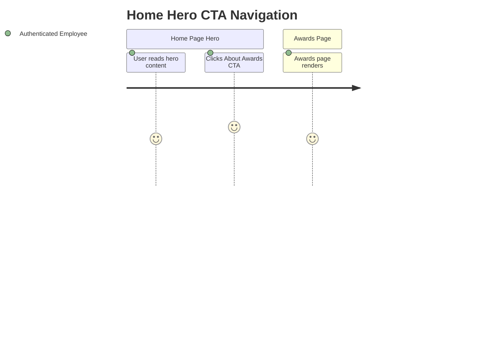
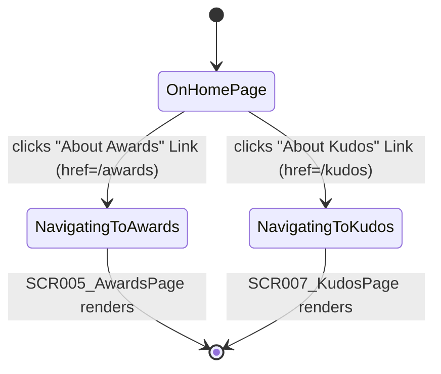

# Feature Specification: F025_HomeHeroCTA

**Priority**: P2
**Type**: ui
**Generated**: 2026-06-01

## Overview

The Hero Band (REG001_HeroBand) on the home page contains two CTA link buttons: "VỀ GIẢI THƯỞNG" / "ABOUT AWARDS" linking to `/awards`, and "VỀ KUDOS" / "ABOUT KUDOS" linking to `/kudos`. Both are Next.js `<Link>` components — fully client-side navigation with no API call. Authentication state is preserved on navigation (JWT remains in `localStorage`; `AuthGuard` passes through for both destinations). The `HeroSection` component owns this rendering; no separate state management is needed for navigation.

## Why This Exists

The hero band is the first content users see post-login. The two CTAs provide direct entry points to the two main informational destinations of the app (awards system and kudos feed), reducing navigation friction from the primary landing surface.

## Who Uses It

- **Authenticated employee** — clicks either CTA to navigate from the home page hero to `/awards` or `/kudos` (PERM003_FrontendAuthGuard applies to both destinations)

## Business Workflow

```
1. Authenticated user is on SCR001_HomePage (`/`)
   → HeroSection renders within the page shell (app/page.tsx)
   → useTranslations() provides t.aboutAwards and t.aboutKudos strings
2. Two <Link> elements render in the CTA button group (hero-section.tsx:69-83)
   → Link href="/awards": gold-filled button with arrow icon (t.aboutAwards)
   → Link href="/kudos": outlined button with arrow icon (t.aboutKudos)
3a. User clicks "VỀ GIẢI THƯỞNG" / "ABOUT AWARDS"
   → Next.js client-side navigation to /awards
   → AuthGuard passes (auth_token present); SCR005_AwardsPage renders
3b. User clicks "VỀ KUDOS" / "ABOUT KUDOS"
   → Next.js client-side navigation to /kudos
   → AuthGuard passes (auth_token present); SCR007_KudosPage renders
4. No API call made during navigation; destination pages fetch their own data on mount
```

## Screen Flow

**See:** ScreenFlow § F025_HomeHeroCTA

| Screen | Route | Purpose |
|--------|-------|---------|
| SCR001_HomePage/REG001_HeroBand | `/` | Source: both CTA buttons live in this region |
| SCR005_AwardsPage | `/awards` | Destination of "About Awards" CTA |
| SCR007_KudosPage | `/kudos` | Destination of "About Kudos" CTA |



## Cross-Cutting Logic

### Requirements

| Code | Description | Endpoint/Handler | Verifiable |
|------|-------------|------------------|------------|
| FR-001 | "About Awards" CTA navigates to `/awards` | `<Link href="/awards">` in `HeroSection` | yes |
| FR-002 | "About Kudos" CTA navigates to `/kudos` | `<Link href="/kudos">` in `HeroSection` | yes |
| FR-003 | CTA labels are i18n-aware (VN/EN) | `t.aboutAwards` / `t.aboutKudos` from `useTranslations()` | yes |

### Business Rules

None.

### State Machines

### SM-001_HeroCTANavigation
**Source:** `frontend/components/homepage/hero-section.tsx:69-83`
**States:** OnHomePage, NavigatingToAwards, NavigatingToKudos



**Transition rules:**
- `OnHomePage → NavigatingToAwards`: guard = authenticated (PERM003 passes); side effects = Next.js router navigates to `/awards`; HeroSection unmounts
- `OnHomePage → NavigatingToKudos`: guard = authenticated (PERM003 passes); side effects = Next.js router navigates to `/kudos`; HeroSection unmounts

### Algorithms

None.

### External Integrations

None.

### Verification

- **SC-001** — Clicking "About Awards" CTA navigates to `/awards` and Awards page renders (covers FR-001, FR-003)
- **SC-002** — Clicking "About Kudos" CTA navigates to `/kudos` and Kudos page renders (covers FR-002, FR-003)

## User Stories

### US003_NavigateToAwardsFromHero — Navigate to Awards from Hero (Priority: P2)

**What happens:** An authenticated employee on the home page clicks the gold "VỀ GIẢI THƯỞNG" / "ABOUT AWARDS" button in the HeroSection. Next.js navigates client-side to `/awards`. The Awards Info page renders with event awards content. Authentication state is preserved.
**Why this priority:** P2 — informational navigation; not on the kudos creation critical path.
**Independent Test:** On `/`, click the gold "ABOUT AWARDS" button → URL becomes `/awards` and Awards page content renders without re-login.

**Acceptance Scenarios:**

1. **Given** authenticated user is on `/`, **When** they click the gold "VỀ GIẢI THƯỞNG" button, **Then** URL changes to `/awards` and `SCR005_AwardsPage` renders.
2. **Given** UI language is English, **When** user clicks the button, **Then** button label reads "ABOUT AWARDS" (from `t.aboutAwards`).
3. **Given** navigation to `/awards` completes, **When** user checks localStorage, **Then** `auth_token` is still present (authentication preserved).

**Requirements fulfilled:**
- **FR-001** `<Link href="/awards">` renders the awards CTA — `frontend/components/homepage/hero-section.tsx:69-75`
- **FR-003** Label uses `{t.aboutAwards}` — `frontend/components/homepage/hero-section.tsx:73`

**Rules enforced:** None — `<Link>` navigation has no guards beyond destination page's `AuthGuard`.

**State transitions:** SM-001_HeroCTANavigation — `OnHomePage → NavigatingToAwards`

**Algorithms:** None.

**External integrations:** None.

**Verification:**
- **SC-001** Clicking gold CTA navigates to `/awards` (covers FR-001, FR-003, SM-001)

---

### US004_NavigateToKudosFromHero — Navigate to Kudos from Hero (Priority: P2)

**What happens:** An authenticated employee on the home page clicks the outlined "VỀ KUDOS" / "ABOUT KUDOS" button in the HeroSection. Next.js navigates client-side to `/kudos`. The Kudos Feed page renders. Authentication state is preserved.
**Why this priority:** P2 — secondary entry point; header nav and WidgetButton also link to `/kudos`.
**Independent Test:** On `/`, click the outlined "ABOUT KUDOS" button → URL becomes `/kudos` and Kudos page renders.

**Acceptance Scenarios:**

1. **Given** authenticated user is on `/`, **When** they click the outlined "VỀ KUDOS" button, **Then** URL changes to `/kudos` and `SCR007_KudosPage` renders.
2. **Given** UI language is English, **When** user views the hero, **Then** button label reads "ABOUT KUDOS" (from `t.aboutKudos`).
3. **Given** navigation to `/kudos` completes, **When** user checks localStorage, **Then** `auth_token` is still present.

**Requirements fulfilled:**
- **FR-002** `<Link href="/kudos">` renders the kudos CTA — `frontend/components/homepage/hero-section.tsx:76-82`
- **FR-003** Label uses `{t.aboutKudos}` — `frontend/components/homepage/hero-section.tsx:79`

**Rules enforced:** None — `<Link>` navigation defers auth check to destination `AuthGuard`.

**State transitions:** SM-001_HeroCTANavigation — `OnHomePage → NavigatingToKudos`

**Algorithms:** None.

**External integrations:** None.

**Verification:**
- **SC-002** Clicking outlined CTA navigates to `/kudos` (covers FR-002, FR-003, SM-001)

---

### Edge Cases

| Scenario | Behavior |
|----------|----------|
| `auth_token` removed from localStorage just before clicking CTA | `<Link>` navigation proceeds; destination page's `AuthGuard` fires on mount → `router.replace('/login')` |
| User clicks CTA while page is still mounting (unlikely — SSR static) | `<Link>` is a standard anchor; click is captured by Next.js router as soon as component mounts; no race condition |
| User is already on `/awards` and clicks "About Awards" CTA (via back navigation) | Next.js re-navigates to `/awards` — effectively a no-op; page re-renders if params differ, otherwise stays |
| Language switched while on hero — button labels update | `useTranslations()` re-evaluates via `LanguageContext`; link labels update in place; `href` values are static and unaffected |

## Key Entities

| Entity | Table | Key Columns | Purpose |
|--------|-------|-------------|---------|
| `auth_token` (localStorage) | N/A | string (JWT) | AuthGuard at destinations reads this to allow or redirect |
| `translations.VN/EN` | `frontend/lib/i18n.ts` | `aboutAwards`, `aboutKudos` | CTA button label strings in both languages |

## Related Artifacts

- **Screens** (from ScreenList): SCR001_HomePage/REG001_HeroBand, SCR005_AwardsPage, SCR007_KudosPage
- **User Stories** (from UserStories): US003_NavigateToAwardsFromHero, US004_NavigateToKudosFromHero
- **Routes** (from RouteList): none — client-side `<Link>` navigation; no API routes
- **Data Models** (from DataModel): none
- **Background Logic** (from BackgroundLogic): none
- **Permissions** (from Permissions): PERM003_FrontendAuthGuard (enforced at destinations `/awards` and `/kudos`)

## Spec Documents

- [x] [System Overview](../../system-overview.md) — client-side nav pattern, auth flow
- [x] [Feature List](../../feature-list.md) — F025_HomeHeroCTA
- [ ] [Route List](../../route-list.md) — no API routes applicable
- [ ] [Data Model](../../data-model.md) — no models
- [x] [Screen List](../../screen-list.md) — SCR001/REG001_HeroBand, SCR005, SCR007
- [x] [Screen Flow](../../screen-flow.md) — SCR001→SCR005 and SCR001→SCR007 transitions
- [ ] [Background Logic](../../background-logic.md) — none applicable
- [x] [Permissions](../../permissions.md) — PERM003_FrontendAuthGuard
- [x] [User Stories](../../user-stories.md) — US003_NavigateToAwardsFromHero, US004_NavigateToKudosFromHero

## Assumptions

- Both CTA `<Link>` elements use `href` props with hard-coded string literals (`"/awards"`, `"/kudos"`); no dynamic route construction is involved.
- Next.js `<Link>` prefetches the destination route in production, so navigation is near-instant; no loading state is shown.
- The gold button style (filled `bg-saa-gold`) vs. outlined button style (`border border-[#998C5F] bg-[rgba(255,234,158,0.10)]`) is purely presentational; both have identical navigation behavior.
- Arrow icon (`/icons/icon-arrow-up-right.svg`) is decorative (`alt=""`); no functional impact on navigation.

## Source Code References

| Symbol | Path | Purpose |
|--------|------|---------|
| `HeroSection` | `frontend/components/homepage/hero-section.tsx:1-126` | Renders REG001_HeroBand; contains both CTA `<Link>` elements |
| Awards CTA `<Link>` | `frontend/components/homepage/hero-section.tsx:69-75` | `href="/awards"`, gold button, label `{t.aboutAwards}` |
| Kudos CTA `<Link>` | `frontend/components/homepage/hero-section.tsx:76-82` | `href="/kudos"`, outlined button, label `{t.aboutKudos}` |
| `useTranslations` | `frontend/lib/i18n.ts:346-349` | Returns translation map; provides `aboutAwards` and `aboutKudos` keys |
| `AuthGuard` | `frontend/components/auth/auth-guard.tsx:1-24` | Enforced at destination pages; not at the CTA link level |

## Unresolved Questions

1. **Prefetch behavior**: Next.js `<Link>` prefetches destinations in production. If `/awards` or `/kudos` includes server-side data fetching in a future iteration, the prefetch may trigger those fetches before the user clicks. No current impact (both are static/client-rendered), but worth noting for future page additions.
2. **Relationship with F024_HomePage**: F025 owns the CTA navigation interaction (US003, US004) scoped to REG001_HeroBand, while F024 owns the page shell. If `HeroSection` is ever extracted or moved, both spec ownership boundaries would need revisiting.
