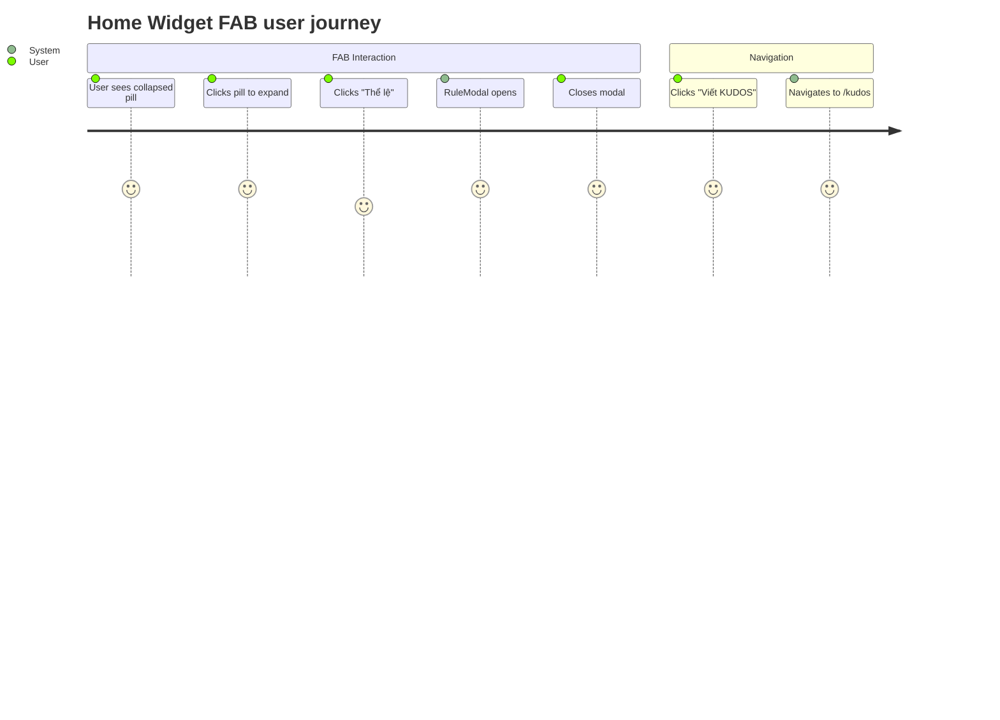
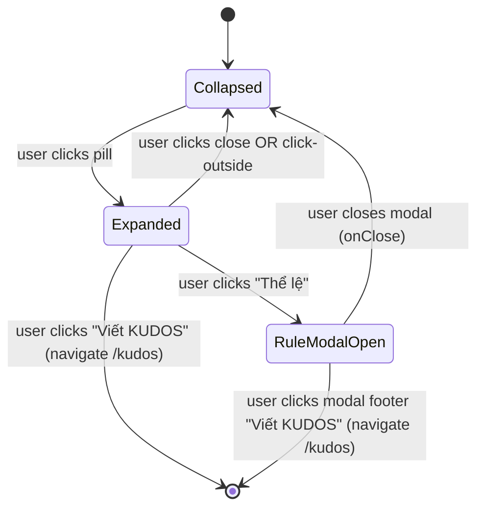

# Feature Specification: F026_HomeWidgetButton

**Priority**: P2
**Type**: ui
**Generated**: 2026-06-01

## Overview

Floating action button (FAB) fixed at the bottom-right corner of the home page. In its collapsed pill state it shows pen + "/" + kudos-logo icons. Clicking expands it to reveal two action items: "Thể lệ" (opens RuleModal inline) and "Viết KUDOS" (navigates to `/kudos`). A close button collapses the menu. No API calls; all logic is client-side state within `WidgetButton` and `RuleModal` components.

## Why This Exists

Provides a persistent, low-friction shortcut on the home page for the two highest-frequency actions: reviewing participation rules and writing kudos. Eliminates the need to navigate away or locate the actions in the header nav.

## Who Uses It

- **Authenticated employee** — expands the FAB to open community rules or navigate to kudos writing (PERM003_FrontendAuthGuard implicitly gates the host page)

## Business Workflow

```
1. User lands on / (HomePage) → WidgetButton renders in fixed bottom-right position (collapsed pill state).
2. User clicks the pill → setIsOpen(true) → menu expands to show "Thể lệ" and "Viết KUDOS" buttons.
3a. User clicks "Thể lệ" → setIsOpen(false); setShowTheLe(true) → RuleModal renders with isOpen=true (slide-up on mobile / right-drawer on desktop).
3b. User clicks "Viết KUDOS" → setIsOpen(false); router.push('/kudos') → navigates to kudos feed.
4. If RuleModal open: user clicks × or backdrop → onClose() → setShowTheLe(false) → RuleModal animates out, page state unchanged.
5. RuleModal footer "Viết KUDOS" button → onVietKudos() → setShowTheLe(false); router.push('/kudos').
6. Clicking outside the expanded menu (mousedown outside containerRef) → setIsOpen(false).
```

## Screen Flow

**See:** ScreenFlow § F026_HomeWidgetButton

| Screen | Route | Purpose |
|--------|-------|---------|
| SCR001_HomePage | `/` | Host page; WidgetButton is a fixed overlay on this screen |



## Cross-Cutting Logic

### Requirements

| Code | Description | Endpoint/Handler | Verifiable |
|------|-------------|------------------|------------|
| FR-001 | FAB renders as fixed overlay on home page | N/A — rendered in `app/page.tsx` | yes |

### Business Rules

None.

### State Machines

None.

### Algorithms

None.

### External Integrations

None.

### Verification

- **SC-001** — FR-001: WidgetButton is present in DOM at fixed position when home page renders

## User Stories

### US005_OpenRuleModalFromWidget — Open Community Rules Modal from Widget (Priority: P2)

**What happens:** Authenticated user on the home page clicks the floating pill FAB, expands the menu, then clicks "Thể lệ". The `RuleModal` dialog opens in a slide-up panel (mobile) or right-side drawer (desktop) showing community standards content (hero levels, sender badges, national kudos info). The user can close via ×, backdrop click, or the "Đóng" footer button. The page remains in its prior state after close.
**Why this priority:** Secondary action — useful for first-time users but not blocking for core kudos flow.
**Independent Test:** On home page, click FAB pill → click "Thể lệ" → RuleModal opens with rule content visible.

**Acceptance Scenarios:**

1. **Given** user is on `/` with WidgetButton visible, **When** user clicks the pill FAB, **Then** two buttons ("Thể lệ", "Viết KUDOS") and a close button appear.
2. **Given** menu is expanded, **When** user clicks "Thể lệ", **Then** menu collapses and RuleModal opens showing community rules content.
3. **Given** RuleModal is open, **When** user clicks the × button or backdrop, **Then** modal closes with slide animation; home page is unchanged.
4. **Given** RuleModal is open, **When** user clicks "Viết KUDOS" in modal footer, **Then** modal closes and browser navigates to `/kudos`.

**Requirements fulfilled:**
- **FR-002** WidgetButton expands to reveal "Thể lệ" and "Viết KUDOS" options on click — `N/A (client-side toggle)` via `WidgetButton::handleTheLe`
- **FR-003** RuleModal renders rules content (hero levels, sender badges, national kudos) — `N/A (static content)` via `RuleModal` component
- **FR-004** RuleModal closeable without page state change — `N/A` via `onClose` prop

**Rules enforced:**

### BR-001_WidgetMenuClickOutsideCollapse
**Source:** `frontend/components/homepage/widget-button.tsx:15-24`
**Applies to:** WidgetButton expanded state
**Rule:** When the FAB menu is open, any mousedown event outside `containerRef` collapses the menu (`setIsOpen(false)`). Prevents stale open-menu blocking page interaction.

**Pseudocode:**
```ts
useEffect(() => {
  if (!isOpen) return;
  const handler = (e: MouseEvent) => {
    if (containerRef.current && !containerRef.current.contains(e.target)) {
      setIsOpen(false);
    }
  };
  document.addEventListener('mousedown', handler);
  return () => document.removeEventListener('mousedown', handler);
}, [isOpen]);
```

**Linked FR:** FR-002

**State transitions:**

### SM-001_WidgetButtonLifecycle
**Source:** `frontend/components/homepage/widget-button.tsx:8-130`
**States:** Collapsed, Expanded, RuleModalOpen



**Transition rules:**
- `Collapsed → Expanded`: guard = pill button clicked; side effects = `setIsOpen(true)`
- `Expanded → RuleModalOpen`: guard = "Thể lệ" button clicked; side effects = `setIsOpen(false)`, `setShowTheLe(true)`
- `RuleModalOpen → Collapsed`: guard = modal `onClose` callback; side effects = `setShowTheLe(false)`

**Linked FR:** FR-002

**Verification:**
- **SC-002** FAB expands on click and collapses on click-outside (covers FR-002, SM-001)
- **SC-003** RuleModal opens with community rules content when "Thể lệ" is clicked; closes without page state change (covers FR-003, FR-004, SM-001)

---

### US006_NavigateToKudosFromWidget — Navigate to Kudos from Widget (Priority: P2)

**What happens:** Authenticated user expands the FAB and clicks "Viết KUDOS". `router.push('/kudos')` is called, navigating to the kudos feed page. Authentication state (JWT in localStorage) is preserved across navigation.
**Why this priority:** Convenience shortcut — core navigation is also available via header; this is a secondary path.
**Independent Test:** On home page, expand FAB → click "Viết KUDOS" → browser URL becomes `/kudos`.

**Acceptance Scenarios:**

1. **Given** user is on `/` and has expanded the FAB, **When** user clicks "Viết KUDOS", **Then** browser navigates to `/kudos` with auth state preserved.

**Requirements fulfilled:**
- **FR-005** "Viết KUDOS" button in expanded FAB triggers `router.push('/kudos')` — `N/A (client navigation)` via `WidgetButton::handleVietKudos`

**Rules enforced:** None beyond SM-001 (see US005_OpenRuleModalFromWidget)

**Verification:**
- **SC-004** Clicking "Viết KUDOS" in expanded FAB navigates to `/kudos` (covers FR-005)

---

### Edge Cases

| Scenario | Behavior |
|----------|----------|
| Click "Thể lệ" then rapidly click "Viết KUDOS" in modal footer | Modal close + navigation both fire; `setShowTheLe(false)` then `router.push('/kudos')` — navigation wins; no race condition since both run synchronously |
| Unauthenticated user accesses `/` | PERM003_FrontendAuthGuard redirects to `/login` before WidgetButton renders |
| RuleModal open + user scrolls home page | Modal is `fixed` overlay (z-[61]); underlying page scroll is not prevented (no body lock) — minor UX gap |

## Key Entities

No database entities — this is a purely client-side presentational feature.

| Entity | Table | Key Columns | Purpose |
|--------|-------|-------------|---------|
| N/A — client-side only | — | — | WidgetButton holds only local React state; no data fetching |

## Related Artifacts

- **Screens** (from ScreenList): SCR001_HomePage
- **User Stories** (from UserStories): US005_OpenRuleModalFromWidget, US006_NavigateToKudosFromWidget
- **Routes** (from RouteList): _(none — client navigation only)_
- **Data Models** (from DataModel): _(none)_
- **Background Logic** (from BackgroundLogic): _(none)_
- **Permissions** (from Permissions): PERM003_FrontendAuthGuard

## Spec Documents

- [x] [System Overview](../../system-overview.md)
- [x] [Feature List](../../feature-list.md) — F026_HomeWidgetButton
- [x] [Screen List](../../screen-list.md) — SCR001_HomePage
- [x] [User Stories](../../user-stories.md) — US005_OpenRuleModalFromWidget, US006_NavigateToKudosFromWidget
- [ ] [Route List](../../route-list.md) — none referenced
- [ ] [Data Model](../../data-model.md) — none referenced
- [ ] [Background Logic](../../background-logic.md) — none referenced
- [x] [Permissions](../../permissions.md) — PERM003_FrontendAuthGuard

## Assumptions

- RuleModal content is purely static i18n — no API fetch. Content keys (`ruleModalTitle`, `ruleRecipientSectionTitle`, hero level keys, badge list) are resolved via `useTranslations()` from `lib/i18n.ts`.
- No body scroll lock is applied when RuleModal is open. The `fixed` overlay does not prevent background scrolling, which may be intentional (mobile slide-up panel partially obscures page but doesn't lock it).
- `WidgetButton` is rendered unconditionally inside the host pages (`app/page.tsx`, `app/awards/page.tsx`, `app/community-standards/page.tsx`) — authentication gating happens at the page level via PERM003, not within the component itself.

## Source Code References

| Symbol | Path | Purpose |
|--------|------|---------|
| `WidgetButton` | `frontend/components/homepage/widget-button.tsx:8-130` | FAB component: expand/collapse state, "Thể lệ" handler, "Viết KUDOS" navigation, click-outside listener |
| `RuleModal` | `frontend/components/homepage/rule-modal.tsx:35-207` | Rules modal: mount/unmount animation, hero level rows, badge grid, close + navigate footer |
| `HomePage` | `frontend/app/page.tsx:1-21` | Renders `<WidgetButton />` at root of home page output |
| `AwardsPage` | `frontend/app/awards/page.tsx:1-21` | Also renders `<WidgetButton />` — FAB appears on awards page too |
| `CommunityStandardsPage` | `frontend/app/community-standards/page.tsx:1-19` | Also renders `<WidgetButton />` — FAB present on community standards page |

## Unresolved Questions

1. **Scroll-lock omission**: RuleModal does not apply `document.body.style.overflow = 'hidden'` when open. Is this intentional (mobile slide-up intentionally leaves background scrollable) or a gap?
2. **WidgetButton on awards/community-standards pages**: `WidgetButton` is also rendered on SCR005 and SCR006 — but F026 is only mapped to SCR001. Should US005/US006 be mapped to all three pages where WidgetButton appears, or is the current single-screen mapping intentional to keep F026 scoped?
