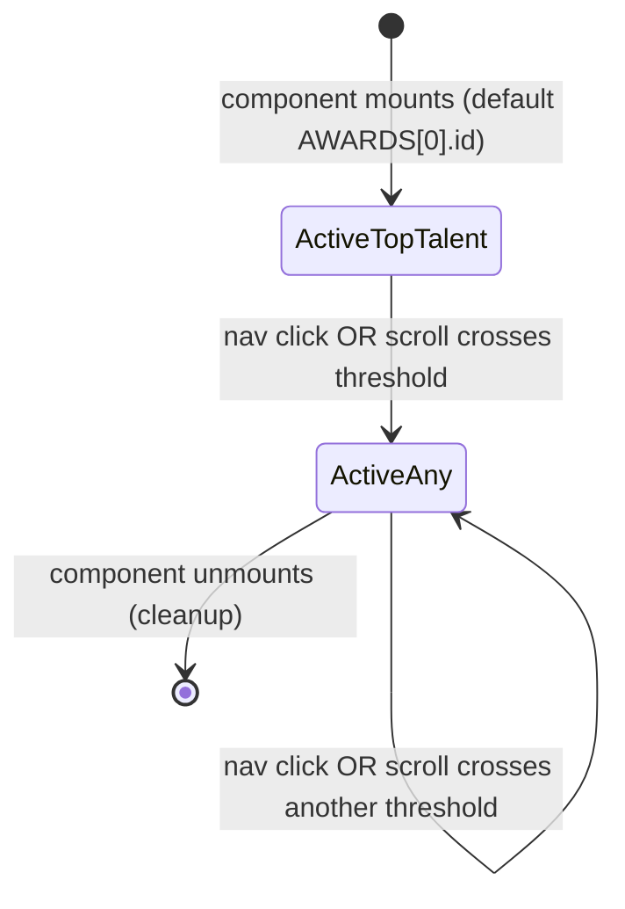

# Feature Specification: F027_AwardsPage

**Priority**: P2
**Type**: ui
**Generated**: 2026-06-01

## Overview

Composite page shell at `/awards` that assembles `SiteHeader`, `AwardInfoHero` (hero banner), `AwardInfoSection` (6 award detail cards with sticky/mobile nav), `KudosSection` (CTA band), `SiteFooter`, and `WidgetButton`. All content is static i18n — no API calls at the page level. Owns the bare `SCR005_AwardsPage` reference in the feature registry.

## Why This Exists

Provides employees with a single informational destination for Sun* Annual Awards 2025: prize categories, counts, monetary values, and eligibility units. Drives awareness before/during the kudos campaign period.

## Who Uses It

- **Authenticated employee** — reads award details and navigates to kudos from the CTA (PERM003_FrontendAuthGuard gates the route)

## Business Workflow

```
1. Authenticated user navigates to /awards (via header nav link, hero CTA, or direct URL).
2. PERM003_FrontendAuthGuard checks auth_token in localStorage → present → renders page.
3. AwardsPage server component renders: SiteHeader (currentPath="/awards"), AwardInfoHero, AwardInfoSection, KudosSection, SiteFooter, WidgetButton.
4. AwardInfoSection mounts → initializes activeId = AWARDS[0].id ("top-talent") → scroll listener attached via requestAnimationFrame.
5. User scrolls down → scroll listener updates activeId based on which award card's getBoundingClientRect().top ≤ SCROLL_OFFSET (100px).
6. AwardInfoSection unmounts → scroll listener and rAF cancelled (cleanup).
```

## Screen Flow

**See:** ScreenFlow § F027_AwardsPage

| Screen | Route | Purpose |
|--------|-------|---------|
| SCR005_AwardsPage | `/awards` | Full page: hero + 6 award detail cards + kudos CTA |
| SCR005_AwardsPage/REG001_AwardInfoHero | (section within `/awards`) | Hero banner — event name + "ROOT FURTHER" logo + key visual |
| SCR005_AwardsPage/REG002_AwardDetailSection | (section within `/awards`) | 6 award cards with sticky desktop nav + mobile horizontal nav |
| SCR005_AwardsPage/REG003_KudosCTA | (section within `/awards`) | Kudos CTA band with link to `/kudos` |

## Cross-Cutting Logic

### Requirements

| Code | Description | Endpoint/Handler | Verifiable |
|------|-------------|------------------|------------|
| FR-001 | Page at `/awards` is auth-gated and renders without API calls | `GET /awards` — Next.js page route | yes |
| FR-002 | Page assembles all five required sections (Hero, AwardDetailSection, KudosSection) + layout shells | N/A — server component composition | yes |

### Business Rules

None.

### State Machines

None.

### Algorithms

None.

### External Integrations

None.

### Verification

- **SC-001** — FR-001: unauthenticated request to `/awards` redirects to `/login` via PERM003
- **SC-002** — FR-002: authenticated user at `/awards` sees hero, 6 award cards, kudos CTA, and WidgetButton FAB

## User Stories

### US012_NavigateAwardDetails — Navigate to Award Detail Section (Priority: P2)

**What happens:** Authenticated user on the Awards page clicks an award name in the sticky desktop sidebar nav or the mobile horizontal nav. The page smoothly scrolls to that award's card. The active nav item updates its visual state (yellow border-left, text glow on desktop; yellow border-bottom on mobile). As the user scrolls manually, the active item tracks the card currently in viewport.
**Why this priority:** Secondary navigational aid for a static page — useful UX enhancement but page is readable without it.
**Independent Test:** At `/awards` on desktop, click "Best Manager" in sidebar → page scrolls to Best Manager card and that nav item shows yellow left border.

**Acceptance Scenarios:**

1. **Given** user is on `/awards` desktop viewport, **When** user clicks any award name in sidebar, **Then** page smoothly scrolls to that card (offset 100px from top) and clicked item gains active styles.
2. **Given** user is on `/awards` mobile viewport, **When** user taps award name in horizontal nav, **Then** page smoothly scrolls to that card (offset 140px from header+nav bar) and tapped item gains active styles.
3. **Given** user scrolls page manually, **When** an award card's top edge passes 100px from viewport top, **Then** corresponding nav item becomes active automatically.
4. **Given** mobile nav is active, **When** active item changes, **Then** mobile nav auto-scrolls to center the active button in view.

**Requirements fulfilled:**
- **FR-003** Desktop sticky nav shows 6 award items; clicking scrolls to card with 100px offset — `N/A (scroll)` via `AwardInfoNav::handleClick`
- **FR-004** Mobile horizontal nav shows 6 award items (MVP truncated to "MVP"); clicking scrolls to card with 140px offset — `N/A (scroll)` via `AwardInfoSection::handleMobileNavClick`
- **FR-005** Active nav item is visually highlighted; scroll listener updates active item on scroll — `N/A (scroll event)` via `AwardInfoSection` scroll effect

**Rules enforced:**

### BR-001_ScrollOffsetDesktopVsMobile
**Source:** `frontend/components/award-info/award-info-section.tsx:103-104`
**Applies to:** Nav click scroll calculations
**Rule:** Desktop nav uses `SCROLL_OFFSET_PX = 100` offset (accounts for sticky header only); mobile nav uses `MOBILE_NAV_SCROLL_OFFSET = 140` (accounts for sticky header 72px + mobile nav bar ~68px). Incorrect offset would put the card behind a sticky element.

**Pseudocode:**
```ts
const SCROLL_OFFSET = 100;          // desktop
const MOBILE_NAV_SCROLL_OFFSET = 140; // mobile

// Desktop nav click (award-info-nav.tsx:26-28):
const top = el.getBoundingClientRect().top + window.scrollY - SCROLL_OFFSET_PX;
window.scrollTo({ top, behavior: 'smooth' });

// Mobile nav click (award-info-section.tsx:148-151):
const top = el.getBoundingClientRect().top + window.scrollY - MOBILE_NAV_SCROLL_OFFSET;
window.scrollTo({ top, behavior: 'smooth' });
```

**Linked FR:** FR-003

**State transitions:**

### SM-001_AwardNavActiveState
**Source:** `frontend/components/award-info/award-info-section.tsx:108-136`
**States:** Initial (top-talent active), AwardActive(id)



**Transition rules:**
- `[*] → ActiveTopTalent`: guard = component mount; side effects = `setActiveId("top-talent")`, scroll listener registered
- `ActiveAny → ActiveAny`: guard = `el.getBoundingClientRect().top <= SCROLL_OFFSET` for any award; side effects = `setActiveId(id)`; rAF debounced

**Linked FR:** FR-005

**Algorithms:**

### ALG-001_ScrollActiveTracking
**Source:** `frontend/components/award-info/award-info-section.tsx:113-135`
**Input:** Window scroll events; 6 award card DOM elements by id
**Output:** `activeId` string (current most-visible award)
**Complexity:** O(6) per scroll event — constant, 6 fixed items
**Description:** On each scroll event (debounced via `requestAnimationFrame`), iterates all 6 award ids, reads `getBoundingClientRect().top`, and sets `activeId` to the last id whose top ≤ 100px. This means the lowest card that has scrolled past the 100px threshold wins. Initial value is "top-talent".

**Pseudocode:**
```ts
function updateActive() {
  let currentId = AWARDS[0].id; // fallback
  for (const { id } of AWARDS) {
    const el = document.getElementById(id);
    if (!el) continue;
    if (el.getBoundingClientRect().top <= SCROLL_OFFSET) currentId = id;
  }
  setActiveId(currentId);
}
// Attached as rAF-debounced scroll listener; passive: true
```

**Linked FR:** FR-005

**Verification:**
- **SC-003** Desktop nav click scrolls to correct card with 100px offset; active item highlighted (covers FR-003, BR-001, SM-001)
- **SC-004** Mobile nav click scrolls to correct card with 140px offset; active item highlighted; auto-centers in mobile nav (covers FR-004, BR-001)
- **SC-005** Manual scroll updates active nav item correctly (covers FR-005, ALG-001)

---

### US013_NavigateToKudosFromAwardsCTA — Navigate to Kudos from Awards CTA (Priority: P2)

**What happens:** Authenticated user on the Awards page scrolls to the KudosSection CTA band at the bottom and clicks the "Go to Kudos" / kudos details link. Browser navigates to `/kudos` preserving auth state.
**Why this priority:** Secondary navigation path; kudos link also available in header nav.
**Independent Test:** At `/awards`, scroll to bottom CTA band → click kudos link → URL changes to `/kudos`.

**Acceptance Scenarios:**

1. **Given** authenticated user is on `/awards`, **When** user clicks the kudos CTA link in the bottom band, **Then** browser navigates to `/kudos`.

**Requirements fulfilled:**
- **FR-006** KudosSection renders at bottom of awards page with `<Link href="/kudos">` — `N/A (client nav)` via `KudosSection` component

**Rules enforced:** None

**Verification:**
- **SC-006** Kudos CTA link at bottom of `/awards` navigates to `/kudos` (covers FR-006)

---

### Edge Cases

| Scenario | Behavior |
|----------|----------|
| Unauthenticated user navigates to `/awards` | PERM003_FrontendAuthGuard redirects to `/login` before page renders |
| Award card DOM element missing (id not found) | `AwardInfoNav::handleClick` and scroll tracker both guard with `if (!el) return` / `if (!el) continue` — silently skips |
| User navigates to `/awards` with a URL hash (e.g., `/awards#top-talent`) | No hash-based scroll logic in component; page loads at top; active defaults to "top-talent" |

## Key Entities

No database entities — page is fully static/i18n.

| Entity | Table | Key Columns | Purpose |
|--------|-------|-------------|---------|
| N/A — static content | — | — | All award data hardcoded in `AWARDS` array in `award-info-section.tsx` |

## Related Artifacts

- **Screens** (from ScreenList): SCR005_AwardsPage, SCR005_AwardsPage/REG001_AwardInfoHero, SCR005_AwardsPage/REG002_AwardDetailSection, SCR005_AwardsPage/REG003_KudosCTA
- **User Stories** (from UserStories): US012_NavigateAwardDetails, US013_NavigateToKudosFromAwardsCTA
- **Routes** (from RouteList): _(none — static page; no backend routes)_
- **Data Models** (from DataModel): _(none)_
- **Background Logic** (from BackgroundLogic): _(none)_
- **Permissions** (from Permissions): PERM003_FrontendAuthGuard

## Spec Documents

- [x] [System Overview](../../system-overview.md)
- [x] [Feature List](../../feature-list.md) — F027_AwardsPage
- [x] [Screen List](../../screen-list.md) — SCR005_AwardsPage, SCR005_AwardsPage/REG001_AwardInfoHero, SCR005_AwardsPage/REG002_AwardDetailSection, SCR005_AwardsPage/REG003_KudosCTA
- [x] [User Stories](../../user-stories.md) — US012_NavigateAwardDetails, US013_NavigateToKudosFromAwardsCTA
- [x] [Permissions](../../permissions.md) — PERM003_FrontendAuthGuard
- [ ] [Route List](../../route-list.md) — none referenced
- [ ] [Data Model](../../data-model.md) — none referenced
- [ ] [Background Logic](../../background-logic.md) — none referenced

## Assumptions

- The 6 awards (`AWARDS` array) are hardcoded in `award-info-section.tsx:32-101` — not driven by a CMS or API. Adding/removing an award requires a code change.
- `KudosSection` component (`frontend/components/homepage/kudos-section.tsx`) is shared between the homepage (`app/page.tsx`) and the awards page — same component, same `/kudos` link, different host page context.
- `AwardInfoSection` is a `'use client'` component (scroll tracking requires browser APIs); `AwardsPage` itself (`app/awards/page.tsx`) is a server component — no `'use client'` directive at page level.
- MVP label is shortened to "MVP" in the mobile nav (`award.title.replace(' (Most Valuable Person)', '')`) for compact display; this is hardcoded string manipulation, not an i18n key.

## Source Code References

| Symbol | Path | Purpose |
|--------|------|---------|
| `AwardsPage` | `frontend/app/awards/page.tsx:1-21` | Page shell: assembles all sections and layout components |
| `AwardInfoSection` | `frontend/components/award-info/award-info-section.tsx:106-228` | Scroll-tracked award detail section: sticky desktop nav + mobile horizontal nav + 6 `AwardInfoCard` instances |
| `AwardInfoNav` | `frontend/components/award-info/award-info-nav.tsx:21-61` | Desktop sticky sidebar nav: 6 menu items, click-to-scroll with 100px offset, active state via `isActive` prop |
| `AwardInfoCard` | `frontend/components/award-info/award-info-card.tsx:45-166` | Individual award card: image, title, description, count, value (supports `reverse` layout and dual-value for Signature 2025) |
| `AwardInfoHero` | `frontend/components/award-info/award-info-hero.tsx:6-56` | Hero banner: key visual background, ROOT FURTHER logo, event title |
| `KudosSection` | `frontend/components/homepage/kudos-section.tsx:7-62` | Kudos CTA band: `<Link href="/kudos">` button |

## Unresolved Questions

1. **i18n keys for award descriptions**: Award descriptions are resolved via `t[award.descKey]` (e.g., `t.topTalentDesc`). These keys are defined in `lib/i18n.ts` — not read in this research. Confirm all 6 `descKey` values exist in both VN and EN translations.
2. **`AwardInfoNav` activeId sync**: `AwardInfoNav` receives `onSelect` prop but clicking a nav item calls `onSelect(id)` which calls `setActiveId(id)` in `AwardInfoSection` — however, the scroll tracker also calls `setActiveId`. There is no guard preventing the scroll tracker from overriding a nav-click-selected item immediately on next scroll event. Is this the intended behavior?
