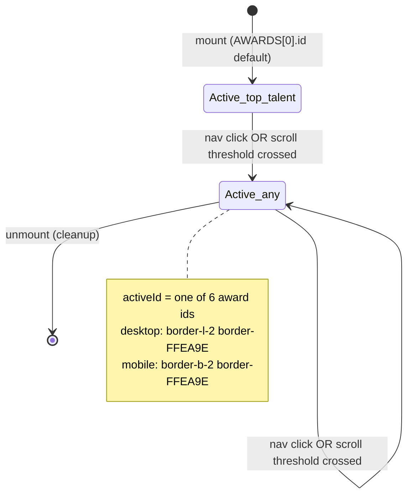

# Feature Specification: F028_AwardDetailNav

**Priority**: P2
**Type**: ui
**Generated**: 2026-06-01

## Overview

Sticky desktop sidebar nav and mobile horizontal sticky nav inside `REG002_AwardDetailSection` of the Awards page. Clicking an award name smoothly scrolls the page to that award's card. Active item is visually highlighted. Scroll position passively tracks which card is in view and updates the active item. All logic is client-side; 6 static award items sourced from the hardcoded `AWARDS` array in `award-info-section.tsx`. No API call.

## Why This Exists

N/A — inferred from code; domain confirmation needed.

## Who Uses It

- **Authenticated employee on `/awards`** — uses the nav to jump between the 6 award categories without manually scrolling through the full page

## Business Workflow

```
1. AwardInfoSection mounts on /awards → activeId initialised to AWARDS[0].id ("top-talent").
2. Passive scroll listener attached (rAF-debounced); iterates 6 card elements, sets activeId to last card whose top ≤ 100px.
3. Desktop: AwardInfoNav renders 6 buttons inside a sticky aside (top: 100px). Active item has yellow left-border + text-glow.
4. Mobile: inline horizontal nav rendered above content (sticky top: 72px, z-20). Active item has yellow bottom-border.
5. User clicks nav item → handleClick(id) / handleMobileNavClick(id) → setActiveId(id) → smooth scroll to card (desktop offset 100px, mobile offset 140px).
6. Mobile: useEffect on activeId fires → activeBtn.scrollIntoView({ inline: 'center', behavior: 'smooth' }).
7. Component unmounts → scroll listener removed, rAF cancelled.
```

## Screen Flow

**See:** ScreenFlow § F028_AwardDetailNav

| Screen | Route | Purpose |
|--------|-------|---------|
| SCR005_AwardsPage/REG002_AwardDetailSection | `/awards` | Award detail section — contains both the sticky nav and the 6 award cards |

## Cross-Cutting Logic

### Requirements

| Code | Description | Endpoint/Handler | Verifiable |
|------|-------------|------------------|------------|
| FR-001 | Desktop sticky sidebar renders 6 award items; active item highlighted | N/A — client render | yes |
| FR-002 | Mobile horizontal nav renders 6 items (MVP shortened); active item highlighted | N/A — client render | yes |

### Business Rules

None.

### State Machines

None.

### Algorithms

None.

### External Integrations

None.

### Verification

- **SC-001** — FR-001: on desktop viewport, sticky sidebar visible with 6 items and active item has border-l-2 border-[#FFEA9E]
- **SC-002** — FR-002: on mobile viewport, horizontal nav visible with 6 items; active item has border-b-2 border-[#FFEA9E]

## User Stories

### US012_NavigateAwardDetails — Navigate to Award Detail Section (Priority: P2)

**What happens:** Authenticated user on `/awards` clicks an award name in the sticky desktop sidebar (hidden on mobile) or the sticky mobile horizontal nav (hidden on md+). The page smoothly scrolls to that award's card with an appropriate offset (100px desktop, 140px mobile). The clicked item becomes active (yellow highlight). As the user scrolls manually, the active item updates to match the card currently crossing the 100px threshold.
**Why this priority:** Navigational convenience on a static page; the content is accessible by manual scroll without it.
**Independent Test:** On desktop `/awards`, click "Best Manager" in sidebar → page scrolls to Best Manager card (`id="best-manager"`) with visible yellow left-border on nav item.

**Acceptance Scenarios:**

1. **Given** desktop user on `/awards`, **When** user clicks any of the 6 award names in the sidebar, **Then** page scrolls smoothly to that card (card top = viewport top + 100px); nav item gains `border-[#FFEA9E] text-[#FFEA9E]` active styles.
2. **Given** mobile user on `/awards`, **When** user taps any award in horizontal nav, **Then** page scrolls smoothly to that card (offset 140px); nav item gains `border-[#FFEA9E]` bottom-border; nav scrolls to center active button.
3. **Given** user scrolls page manually, **When** an award card's `getBoundingClientRect().top` falls at or below 100px, **Then** that award's nav item becomes active; prior active item loses highlight.
4. **Given** "MVP (Most Valuable Person)" item on mobile nav, **When** rendered, **Then** label displays as "MVP" (parenthetical stripped).

**Requirements fulfilled:**
- **FR-003** Click nav item → smooth scroll to card at correct offset — `N/A (scroll)` via `AwardInfoNav::handleClick` and `AwardInfoSection::handleMobileNavClick`
- **FR-004** Active item visually distinguished on both desktop and mobile — `N/A (CSS classes)` via `isActive` conditional in `AwardInfoNav` and inline mobile nav
- **FR-005** Scroll tracker updates active item passively — `N/A (scroll event)` via `AwardInfoSection` scroll `useEffect`
- **FR-006** Mobile nav auto-centers active item — `N/A (scrollIntoView)` via `AwardInfoSection` activeId `useEffect`

**Rules enforced:**

### BR-001_ScrollOffsetByViewport
**Source:** `frontend/components/award-info/award-info-section.tsx:103-104`
**Applies to:** Both desktop and mobile nav click handlers
**Rule:** Desktop scroll offset is 100px (`SCROLL_OFFSET_PX` in `award-info-nav.tsx:19`, also `SCROLL_OFFSET = 100` in section). Mobile scroll offset is 140px (`MOBILE_NAV_SCROLL_OFFSET = 140`). The difference accounts for the sticky mobile nav bar height (~68px) stacked on top of the global sticky header (72px).

**Pseudocode:**
```ts
// Desktop (award-info-nav.tsx:26-28):
const SCROLL_OFFSET_PX = 100;
const top = el.getBoundingClientRect().top + window.scrollY - SCROLL_OFFSET_PX;
window.scrollTo({ top, behavior: 'smooth' });

// Mobile (award-info-section.tsx:148-151):
const MOBILE_NAV_SCROLL_OFFSET = 140;
const top = el.getBoundingClientRect().top + window.scrollY - MOBILE_NAV_SCROLL_OFFSET;
window.scrollTo({ top, behavior: 'smooth' });
```

**Linked FR:** FR-003

### BR-002_MvpLabelTruncation
**Source:** `frontend/components/award-info/award-info-section.tsx:161-162`
**Applies to:** Mobile nav item label rendering
**Rule:** The mobile nav button label for the MVP award strips the parenthetical suffix via hardcoded `String.replace` to fit the compact horizontal nav. Desktop nav label (`award-info-nav.tsx`) uses `item.label` which is `'MVP'` (already short — see `menuItems` array at line 6).

**Pseudocode:**
```ts
const shortLabel = award.title.replace(' (Most Valuable Person)', '');
// "MVP (Most Valuable Person)" → "MVP"
```

**Linked FR:** FR-002

**State transitions:**

### SM-001_NavActiveId
**Source:** `frontend/components/award-info/award-info-section.tsx:108-144`
**States:** Active(top-talent), Active(top-project), Active(top-project-leader), Active(best-manager), Active(signature-2025), Active(mvp)



**Transition rules:**
- `[*] → Active_top_talent`: guard = component mount; side effects = scroll listener + rAF registered
- `Active_any → Active_any` (scroll): guard = `el.getBoundingClientRect().top <= 100`; sets to last qualifying id; rAF-debounced
- `Active_any → Active_any` (click): guard = user click; side effects = `setActiveId(id)` + `window.scrollTo`

**Linked FR:** FR-005

**Algorithms:**

### ALG-001_ScrollActiveTracking
**Source:** `frontend/components/award-info/award-info-section.tsx:114-127`
**Input:** Window scroll events; 6 award card DOM elements keyed by `id` attribute
**Output:** `activeId` string — id of the most recently scrolled-past card
**Complexity:** O(6) per rAF tick — constant
**Description:** Iterates `AWARDS` in order. Tracks `currentId` starting at `AWARDS[0].id`. For each award whose card top ≤ 100px, overwrites `currentId`. After iteration, `currentId` is the deepest card the user has scrolled past. Called via `requestAnimationFrame` on every scroll event to avoid layout thrash.

**Pseudocode:**
```ts
function updateActive() {
  let currentId = AWARDS[0].id;
  for (const { id } of AWARDS) {
    const el = document.getElementById(id);
    if (!el) continue;
    if (el.getBoundingClientRect().top <= SCROLL_OFFSET) currentId = id;
  }
  setActiveId(currentId);
}
const onScroll = () => {
  if (rafRef.current) cancelAnimationFrame(rafRef.current);
  rafRef.current = requestAnimationFrame(updateActive);
};
window.addEventListener('scroll', onScroll, { passive: true });
```

**Linked FR:** FR-005

**Verification:**
- **SC-003** Desktop nav click scrolls to card with 100px offset; active item styled correctly (covers FR-003, FR-004, BR-001, SM-001)
- **SC-004** Mobile nav click scrolls to card with 140px offset; active item styled; mobile nav auto-centers (covers FR-003, FR-004, BR-001, FR-006)
- **SC-005** Manual scroll updates active nav item to match scrolled-past card (covers FR-005, ALG-001)
- **SC-006** MVP mobile label renders as "MVP" not full string (covers BR-002)

---

### Edge Cases

| Scenario | Behavior |
|----------|----------|
| Award card DOM element not found (`document.getElementById` returns null) | Both click handler and scroll tracker guard with `if (!el) return` / `if (!el) continue` — silently skips; no error thrown |
| User clicks nav item while scroll animation is in progress | `setActiveId` updates immediately; scroll continues to destination; next scroll event may re-set activeId if a different card crosses threshold mid-animation |
| Viewport width exactly at `md` breakpoint boundary | Tailwind `md:hidden` / `hidden md:block` — both navs could briefly coexist or both hide at the exact boundary pixel; negligible visual edge case |

## Key Entities

No database entities — purely client-side navigation component over static content.

| Entity | Table | Key Columns | Purpose |
|--------|-------|-------------|---------|
| N/A — static | — | — | Award items defined in hardcoded `AWARDS` array; no DB reads |

## Related Artifacts

- **Screens** (from ScreenList): SCR005_AwardsPage/REG002_AwardDetailSection
- **User Stories** (from UserStories): US012_NavigateAwardDetails
- **Routes** (from RouteList): _(none — client-side scroll)_
- **Data Models** (from DataModel): _(none)_
- **Background Logic** (from BackgroundLogic): _(none)_
- **Permissions** (from Permissions): _(none — gating at page level by PERM003, not within this component)_

## Spec Documents

- [x] [System Overview](../../system-overview.md)
- [x] [Feature List](../../feature-list.md) — F028_AwardDetailNav
- [x] [Screen List](../../screen-list.md) — SCR005_AwardsPage/REG002_AwardDetailSection
- [x] [User Stories](../../user-stories.md) — US012_NavigateAwardDetails
- [ ] [Route List](../../route-list.md) — none referenced
- [ ] [Data Model](../../data-model.md) — none referenced
- [ ] [Background Logic](../../background-logic.md) — none referenced
- [ ] [Permissions](../../permissions.md) — none directly (parent page guarded by PERM003)

## Assumptions

- `AwardInfoNav` (`award-info-nav.tsx`) and the inline mobile nav in `AwardInfoSection` are driven by the same `AWARDS` constant defined at module scope in `award-info-section.tsx:32-101`. The desktop `menuItems` array in `award-info-nav.tsx:5-12` is a separate, manually-maintained parallel list with the same 6 ids — a DRY violation risk if award ids change.
- Scroll tracking uses `getBoundingClientRect().top` with a fixed 100px threshold. This means on very short screens the last award may never reach ≤ 100px without the user scrolling past the page bottom — last item may never become active via scroll alone.
- `AwardInfoCard` uses `scroll-mt-[140px] md:scroll-mt-[100px]` CSS (`award-info-card.tsx:157`) for CSS anchor scroll margin. This complements but does not replace the JS scroll logic.

## Source Code References

| Symbol | Path | Purpose |
|--------|------|---------|
| `AwardInfoSection` | `frontend/components/award-info/award-info-section.tsx:106-228` | Parent component: manages `activeId` state, scroll listener, mobile nav, renders `AwardInfoNav` + 6 `AwardInfoCard` |
| `AwardInfoNav` | `frontend/components/award-info/award-info-nav.tsx:21-61` | Desktop sticky sidebar: 6 nav buttons, active styling via `isActive` prop, click-to-scroll |
| `AwardInfoCard` | `frontend/components/award-info/award-info-card.tsx:153-165` | Card root element: has `id={id}` for `getElementById` lookup and `scroll-mt` CSS anchor margin |
| `AWARDS constant` | `frontend/components/award-info/award-info-section.tsx:32-101` | 6 award definitions: id, title, descKey, image, count, unitKey, value — source of truth for nav items |

## Unresolved Questions

1. **Dual id arrays**: `award-info-nav.tsx` defines its own `menuItems` array (ids + labels) independently of `AWARDS` in `award-info-section.tsx`. If an award id changes in one place but not the other, scroll targeting breaks silently. Should these be unified into a single source?
2. **Scroll tracking vs nav-click activeId race**: After a nav click sets `activeId`, the passive scroll listener may immediately overwrite it on the next scroll event. Is it intentional that the scroll tracker always wins over the click-set value, or should there be a brief lock after a programmatic scroll?
