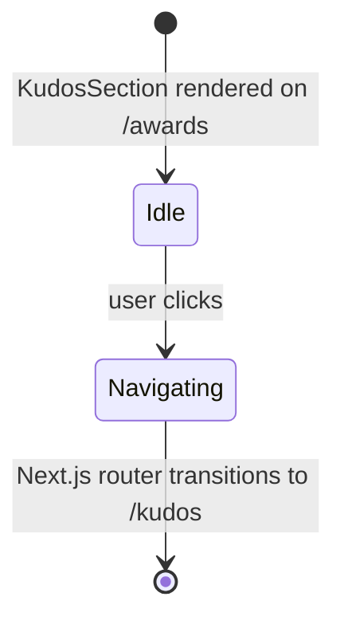

# Feature Specification: F029_AwardsCTA

**Priority**: P2
**Type**: ui
**Generated**: 2026-06-01

## Overview

Kudos CTA band rendered at the bottom of the Awards page (`/awards`) as `REG003_KudosCTA` on `SCR005_AwardsPage`. The band is the shared `KudosSection` component (also used on the homepage) and contains a single `<Link href="/kudos">` button. All content is static i18n. No API call. Client-side navigation only.

## Why This Exists

Bridges the awards information page to the kudos-sending flow — after reading about awards, users are immediately prompted to recognise colleagues via kudos. Reduces friction between award awareness and participation.

## Who Uses It

- **Authenticated employee on `/awards`** — clicks the CTA to navigate to `/kudos` and start the kudos flow (PERM003_FrontendAuthGuard gates the host page)

## Business Workflow

```
1. Authenticated user is on /awards and scrolls to the bottom KudosSection band.
2. KudosSection renders: i18n text (kudosTag, kudosHighlight, kudosDesc, kudosDetails), kudos logo image, and a <Link href="/kudos"> button.
3. User clicks the kudos details link button.
4. Next.js <Link> triggers client-side navigation → browser navigates to /kudos.
5. PERM003_FrontendAuthGuard on /kudos verifies auth_token still present → kudos page renders.
```

## Screen Flow

**See:** ScreenFlow § F029_AwardsCTA

| Screen | Route | Purpose |
|--------|-------|---------|
| SCR005_AwardsPage/REG003_KudosCTA | `/awards` (bottom band) | Kudos CTA — link to `/kudos` |

## Cross-Cutting Logic

### Requirements

| Code | Description | Endpoint/Handler | Verifiable |
|------|-------------|------------------|------------|
| FR-001 | KudosSection CTA band renders at bottom of /awards with a navigable link to /kudos | N/A — static render | yes |

### Business Rules

None.

### State Machines

None.

### Algorithms

None.

### External Integrations

None.

### Verification

- **SC-001** — FR-001: `<Link href="/kudos">` element is present in DOM when `/awards` is rendered

## User Stories

### US013_NavigateToKudosFromAwardsCTA — Navigate to Kudos from Awards CTA (Priority: P2)

**What happens:** Authenticated user on the Awards page scrolls to the bottom `KudosSection` band, reads the Sun* Kudos promotional text, and clicks the CTA button (labelled via `t.kudosDetails` i18n key). Next.js `<Link>` performs client-side navigation to `/kudos`. Authentication state is preserved (JWT in localStorage unaffected by navigation).
**Why this priority:** Low-friction secondary navigation path; same destination reachable from header nav. Value is contextual placement after award content.
**Independent Test:** At `/awards`, locate the kudos CTA band at the bottom → click the CTA button → browser URL changes to `/kudos`.

**Acceptance Scenarios:**

1. **Given** authenticated user is on `/awards`, **When** user scrolls to the kudos CTA band and clicks the kudos details link, **Then** browser navigates to `/kudos` without a full page reload.
2. **Given** authenticated user clicks the CTA, **When** `/kudos` loads, **Then** auth state is preserved and the kudos page renders normally.

**Requirements fulfilled:**
- **FR-002** KudosSection CTA button navigates to `/kudos` via Next.js `<Link>` — `N/A (client nav)` via `KudosSection` component (`frontend/components/homepage/kudos-section.tsx:39`)

**Rules enforced:** None

**State transitions:**

### SM-001_CTANavigation
**Source:** `frontend/components/homepage/kudos-section.tsx:38-44`
**States:** Idle, Navigating



**Transition rules:**
- `Idle → Navigating`: guard = user clicks CTA link; side effects = Next.js client-side navigation initiated
- `Navigating → [*]`: guard = navigation completes; side effects = `/kudos` page renders

**Linked FR:** FR-002

**Verification:**
- **SC-002** Clicking kudos CTA link on `/awards` navigates to `/kudos` (covers FR-002, SM-001)

---

### Edge Cases

| Scenario | Behavior |
|----------|----------|
| Unauthenticated user reaches `/awards` (impossible in practice) | PERM003 redirects to `/login` before page renders; CTA band never shown |
| i18n key `kudosDetails` missing from active language bundle | `useTranslations()` returns undefined for that key; button label renders empty string — no runtime error |
| User clicks CTA while already navigating (double-click) | Next.js deduplicates concurrent navigations to same route; no duplicate renders |

## Key Entities

No database entities — purely presentational static component.

| Entity | Table | Key Columns | Purpose |
|--------|-------|-------------|---------|
| N/A — static content | — | — | No data fetching; button target is a hardcoded `/kudos` path |

## Related Artifacts

- **Screens** (from ScreenList): SCR005_AwardsPage/REG003_KudosCTA
- **User Stories** (from UserStories): US013_NavigateToKudosFromAwardsCTA
- **Routes** (from RouteList): _(none — client-side navigation only)_
- **Data Models** (from DataModel): _(none)_
- **Background Logic** (from BackgroundLogic): _(none)_
- **Permissions** (from Permissions): PERM003_FrontendAuthGuard

## Spec Documents

- [x] [System Overview](../../system-overview.md)
- [x] [Feature List](../../feature-list.md) — F029_AwardsCTA
- [x] [Screen List](../../screen-list.md) — SCR005_AwardsPage/REG003_KudosCTA
- [x] [User Stories](../../user-stories.md) — US013_NavigateToKudosFromAwardsCTA
- [x] [Permissions](../../permissions.md) — PERM003_FrontendAuthGuard
- [ ] [Route List](../../route-list.md) — none referenced
- [ ] [Data Model](../../data-model.md) — none referenced
- [ ] [Background Logic](../../background-logic.md) — none referenced

## Assumptions

- `KudosSection` is a shared component used on both `app/page.tsx` (homepage) and `app/awards/page.tsx` (awards page). There is no awards-page-specific variant; the same component with the same `/kudos` link is reused in both contexts.
- The CTA button is a Next.js `<Link>` (not a `<button>` with `router.push`), so it is rendered as an `<a>` tag — supports right-click → "Open in new tab" and browser-native prefetching.
- `KudosSection` is a `'use client'` component (`frontend/components/homepage/kudos-section.tsx:1`) due to `useTranslations()` hook, even though it performs no stateful interactions beyond i18n resolution.

## Source Code References

| Symbol | Path | Purpose |
|--------|------|---------|
| `KudosSection` | `frontend/components/homepage/kudos-section.tsx:7-62` | CTA band: i18n text, kudos logo image, `<Link href="/kudos">` button |
| `AwardsPage` | `frontend/app/awards/page.tsx:14` | Renders `<KudosSection />` as the third `<main>` child |
| `PERM003_FrontendAuthGuard` | `frontend/components/auth/auth-guard.tsx` | Gates `/awards` route; ensures only authenticated users reach the CTA |

## Unresolved Questions

1. **Shared component ownership**: `KudosSection` is listed as a component of both F024_HomePage (homepage shell) and F027_AwardsPage / F029_AwardsCTA. There is no awards-specific CTA variant. If the homepage and awards CTA need to diverge (different copy, different link target), the shared component would need to be split or parameterised. Is divergence planned?
