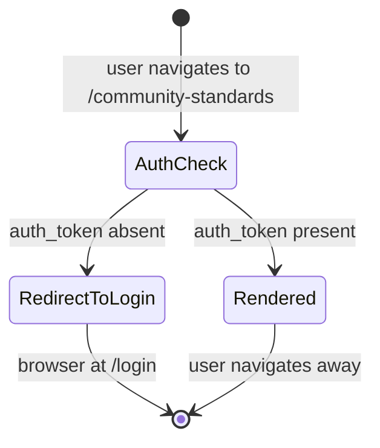

# Feature Specification: F030_CommunityStandardsPage

**Priority**: P3
**Type**: ui
**Generated**: 2026-06-01

## Overview

Static auth-gated page at `/community-standards`. Assembles `SiteHeader`, `CommunityStandardsHero` (key-visual banner with ROOT FURTHER logo), `CommunityStandardsContent` (two prose sections: Community Standards rules + Security Standards), `SiteFooter`, and `WidgetButton`. No API calls — all content is static i18n resolved via `useTranslations()`. Owns the bare `SCR006_CommunityStandardsPage` reference.

## Why This Exists

Provides a dedicated, navigable destination for the platform's participation rules and security guidelines. Keeps policy content separate from the home page RuleModal (which shows the same spirit of rules but with kudos-specific hero-level detail), giving a full-page reading experience for thorough review.

## Who Uses It

- **Authenticated employee** — reads community standards and security standards before participating in the kudos campaign (PERM003_FrontendAuthGuard gates the route)

## Business Workflow

```
1. Authenticated user navigates to /community-standards (via header nav "About SAA", direct URL, or rule modal link).
2. PERM003_FrontendAuthGuard checks auth_token in localStorage → present → page renders.
3. CommunityStandardsPage server component renders: SiteHeader (currentPath="/community-standards"), CommunityStandardsHero, CommunityStandardsContent, SiteFooter, WidgetButton.
4. CommunityStandardsHero renders: key-visual background image, gradient overlay, ROOT FURTHER logo image.
5. CommunityStandardsContent (use client) resolves i18n keys via useTranslations():
   - Section 1: communityStandardsTitle, communityStandardsIntro, communityStandardsSpamNote, csItem1–csItem10 (ordered list).
   - Section 2: securityStandardsTitle, securityStandardsIntro, securityInfoLabel + securityInfoDesc, securityScopeLabel + securityScopeDesc, securityContact.
6. User reads content. No interactive elements on this page beyond the shared SiteHeader and WidgetButton overlays.
```

## Screen Flow

**See:** ScreenFlow § F030_CommunityStandardsPage

| Screen | Route | Purpose |
|--------|-------|---------|
| SCR006_CommunityStandardsPage | `/community-standards` | Full-page static rules + security standards content |

## Cross-Cutting Logic

### Requirements

| Code | Description | Endpoint/Handler | Verifiable |
|------|-------------|------------------|------------|
| FR-001 | Page at `/community-standards` is auth-gated and renders without API calls | `GET /community-standards` — Next.js page route | yes |
| FR-002 | Page renders hero banner and two content sections (Community Standards + Security Standards) | N/A — static render | yes |

### Business Rules

None.

### State Machines

None.

### Algorithms

None.

### External Integrations

None.

### Verification

- **SC-001** — FR-001: unauthenticated request to `/community-standards` redirects to `/login`
- **SC-002** — FR-002: authenticated user sees hero banner, 10-item community standards list, and 2-item security standards list

## User Stories

### US014_ViewCommunityStandards — View Community Standards Page (Priority: P3)

**What happens:** Authenticated user navigates to `/community-standards`. The page renders a hero banner (key visual + ROOT FURTHER logo) followed by two content sections. Section 1 ("Community Standards") displays a title, intro paragraph, spam note, and a 10-item ordered list (`csItem1`–`csItem10`) of prohibited/discouraged behaviours. Section 2 ("Security Standards") displays a title, intro paragraph, two bullet points (Information Security + Scope), and a contact note. No user interaction beyond reading; all content is static i18n.
**Why this priority:** Informational policy page — important for compliance awareness but not blocking for core kudos functionality.
**Independent Test:** Authenticated user at `/community-standards` → page renders hero and both content sections with all 10 csItems visible in an ordered list.

**Acceptance Scenarios:**

1. **Given** authenticated user, **When** navigating to `/community-standards`, **Then** page renders `CommunityStandardsHero` (key-visual background + ROOT FURTHER logo) and `CommunityStandardsContent` with both sections.
2. **Given** page loaded, **When** user reads Community Standards section, **Then** 10 ordered list items (`csItem1`–`csItem10`) are visible, labelled with sequential numbers.
3. **Given** page loaded, **When** user reads Security Standards section, **Then** two bullet points (Information Security, Scope) and a contact note (`securityContact`) are visible.
4. **Given** unauthenticated user navigates to `/community-standards`, **When** PERM003 runs, **Then** user is redirected to `/login`.

**Requirements fulfilled:**
- **FR-003** Hero renders key-visual image + gradient overlay + ROOT FURTHER logo — `N/A (static render)` via `CommunityStandardsHero`
- **FR-004** Community Standards section renders title + intro + spam note + 10-item ordered list — `N/A (static render)` via `CommunityStandardsContent::spamItems`
- **FR-005** Security Standards section renders title + intro + 2 bullet points + contact note — `N/A (static render)` via `CommunityStandardsContent` section 2

**Rules enforced:**

### BR-001_AuthGateRedirect
**Source:** `frontend/components/auth/auth-guard.tsx:13-19` (referenced via PERM003_FrontendAuthGuard; `app/layout.tsx` mounts `AuthGuard`)
**Applies to:** `/community-standards` route
**Rule:** `AuthGuard` checks `auth_token` in `localStorage` on mount and on route change. If absent and path is not in `PUBLIC_PATHS` (`/login`, `/countdown`, `/auth/callback`), redirects to `/login`. `/community-standards` is not in `PUBLIC_PATHS` → auth required.

**Pseudocode:**
```ts
// AuthGuard (app/layout.tsx mounted):
const token = localStorage.getItem('auth_token');
const isPublic = PUBLIC_PATHS.includes(pathname);
if (!token && !isPublic) {
  router.replace('/login');
  return null; // render nothing until redirect
}
```

**Linked FR:** FR-001

**State transitions:**

### SM-001_PageLoadState
**Source:** `frontend/app/community-standards/page.tsx:1-19`
**States:** Unauthenticated (redirect), Authenticated (rendered)



**Transition rules:**
- `AuthCheck → RedirectToLogin`: guard = `localStorage.getItem('auth_token')` is null/empty; side effects = `router.replace('/login')`
- `AuthCheck → Rendered`: guard = token present; side effects = page components mount, i18n resolved, static content displayed

**Linked FR:** FR-001

**Verification:**
- **SC-003** Authenticated user sees hero + both content sections with correct i18n content (covers FR-003, FR-004, FR-005, SM-001)
- **SC-004** Unauthenticated user is redirected to `/login` (covers BR-001, SM-001)

---

### Edge Cases

| Scenario | Behavior |
|----------|----------|
| i18n key `csItem1`–`csItem10` missing in active language | `useTranslations()` returns undefined for missing key; list item renders as empty string — no crash, silent gap in content |
| User directly deep-links `/community-standards` while logged out | `AuthGuard` in `app/layout.tsx` fires before page content renders; user sees nothing then redirects to `/login` |
| User opens WidgetButton on this page and clicks "Thể lệ" | `RuleModal` opens (same community rules content, different format) — does not navigate away; closes on dismiss |

## Key Entities

No database entities — purely static content page.

| Entity | Table | Key Columns | Purpose |
|--------|-------|-------------|---------|
| N/A — static content | — | — | All content from i18n translation keys; no DB reads or writes |

## Related Artifacts

- **Screens** (from ScreenList): SCR006_CommunityStandardsPage
- **User Stories** (from UserStories): US014_ViewCommunityStandards
- **Routes** (from RouteList): _(none — static content page; no backend routes)_
- **Data Models** (from DataModel): _(none)_
- **Background Logic** (from BackgroundLogic): _(none)_
- **Permissions** (from Permissions): PERM003_FrontendAuthGuard

## Spec Documents

- [x] [System Overview](../../system-overview.md)
- [x] [Feature List](../../feature-list.md) — F030_CommunityStandardsPage
- [x] [Screen List](../../screen-list.md) — SCR006_CommunityStandardsPage
- [x] [User Stories](../../user-stories.md) — US014_ViewCommunityStandards
- [x] [Permissions](../../permissions.md) — PERM003_FrontendAuthGuard
- [ ] [Route List](../../route-list.md) — none referenced
- [ ] [Data Model](../../data-model.md) — none referenced
- [ ] [Background Logic](../../background-logic.md) — none referenced

## Assumptions

- `CommunityStandardsContent` is a `'use client'` component (`frontend/components/community-standards/community-standards-content.tsx:1`) because it calls `useTranslations()`. The page itself (`app/community-standards/page.tsx`) has no `'use client'` directive — it is a server component that renders `'use client'` children.
- `CommunityStandardsHero` is NOT `'use client'` (`frontend/components/community-standards/community-standards-hero.tsx` — no `'use client'` directive found) — it is a pure server component rendering static images.
- Content of `csItem1`–`csItem10` is defined exclusively in `lib/i18n.ts` translation bundles, not in the component. The 10-item count is hardcoded in the component array (`spamItems` at line 8–11 of `community-standards-content.tsx`); if the i18n bundle adds an 11th key it would not appear unless the array is extended.
- The page is semantically read-only — no forms, no mutations, no state beyond what the shared `SiteHeader` and `WidgetButton` manage independently.

## Source Code References

| Symbol | Path | Purpose |
|--------|------|---------|
| `CommunityStandardsPage` | `frontend/app/community-standards/page.tsx:1-19` | Page shell: assembles SiteHeader, hero, content, footer, WidgetButton |
| `CommunityStandardsHero` | `frontend/components/community-standards/community-standards-hero.tsx:5-43` | Hero banner: key-visual bg image, gradient overlay, ROOT FURTHER logo image |
| `CommunityStandardsContent` | `frontend/components/community-standards/community-standards-content.tsx:5-81` | Two-section content block: 10-item community standards list + 2-bullet security standards |
| `WidgetButton` | `frontend/components/homepage/widget-button.tsx:8-130` | FAB overlay present on this page; F026 owns its interaction spec |

## Unresolved Questions

1. **Content duplication with RuleModal**: `CommunityStandardsContent` covers spam/security rules while `RuleModal` (`rule-modal.tsx`) covers hero levels and sender badges — these are complementary, not duplicate. However, it is unclear whether the intent is for `/community-standards` to eventually include hero-level content (currently only in the modal) or remain a separate, narrower policy document. Domain confirmation needed.
2. **`csItem1`–`csItem10` i18n keys**: The exact content of these 10 keys was not read from `lib/i18n.ts`. The count (10) is confirmed from the component array, but the actual rule text is unverified in this research pass.
