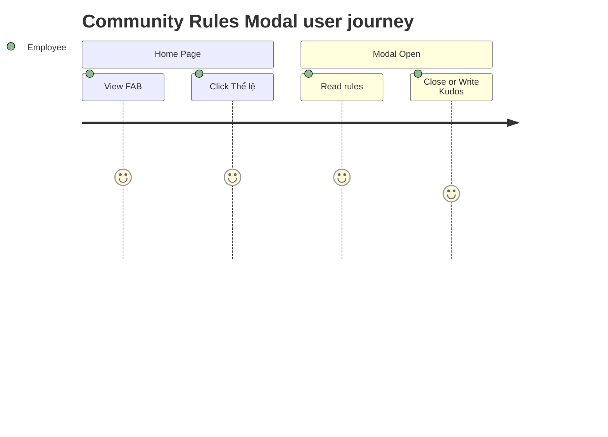
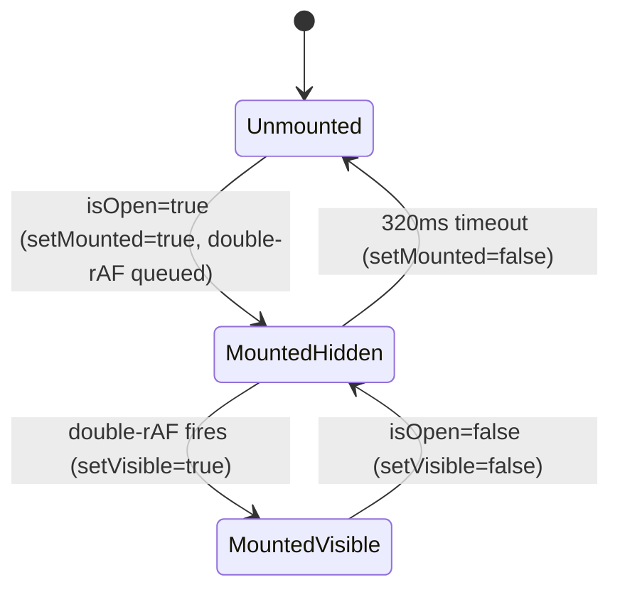

# Feature Specification: F031_RuleModal

**Priority**: P3
**Type**: ui
**Generated**: 2026-06-01

## Overview

`RuleModal` is a client-side-only slide-up panel (mobile) / right-drawer (desktop) that presents community participation rules and hero-level definitions. It is opened exclusively from the `WidgetButton` floating FAB on the home page when the user clicks "Thể lệ". No API call is made; all content is static i18n text and local badge images. The modal does not alter any application state beyond its own visibility.

## Why This Exists

Provides quick access to community guidelines without navigating away from the current page, reducing friction for users who want to review rules while composing or reading kudos.

## Who Uses It

- **Authenticated employee** — reviews community participation guidelines and hero-level conditions from the home page FAB (no PERM required; modal contains static content only).

## Business Workflow

```
1. User clicks the WidgetButton FAB pill on SCR001_HomePage → isOpen state set to true in WidgetButton.
2. User clicks "Thể lệ" button → WidgetButton.handleTheLe() fires: setIsOpen(false), setShowTheLe(true).
3. RuleModal mounts (mounted = true) → double-rAF transition: visible = false → visible = true → CSS translate animates in.
4. User closes modal via ✕ button, backdrop click, or "Đóng" footer button → onClose() → visible = false → 320ms setTimeout → mounted = false → component unmounts.
5. Alternatively, user clicks "Viết KUDOS" in footer → onVietKudos() → setShowTheLe(false) → router.push('/kudos').
```

## Screen Flow

**See:** ScreenFlow § F031_RuleModal

| Screen | Route | Purpose |
|--------|-------|---------|
| SCR001_HomePage | `/` | Host page; WidgetButton FAB triggers modal |



## Cross-Cutting Logic

### Requirements

None.

### Business Rules

None.

### State Machines

None.

### Algorithms

None.

### External Integrations

None.

### Verification

None.

## User Stories

### US005_OpenRuleModalFromWidget — Open Community Rules Modal from Widget (Priority: P3)

**What happens:** An authenticated employee on the home page clicks the FAB ("SAA Kudos widget"), which expands to show "Thể lệ" and "Viết KUDOS" options. Clicking "Thể lệ" closes the FAB menu and opens `RuleModal` as an animated panel. The modal displays community standards content (hero levels, badges, national kudos). User can close it (✕, backdrop, "Đóng" button) or navigate to /kudos via "Viết KUDOS" footer button.

**Why this priority:** P3 — informational content only; does not block the core kudos flow.

**Independent Test:** Navigate to `/`; expand FAB; click "Thể lệ" — verify modal animates in with hero-level rows and 6 badge images visible. Click ✕ — verify modal animates out and page returns to its prior state.

**Acceptance Scenarios:**

1. **Given** authenticated user is on `/` with WidgetButton visible, **When** user clicks FAB pill then "Thể lệ", **Then** `RuleModal` animates in (slide-up on mobile, right-drawer on desktop) showing community standards content; background page remains interactive.
2. **Given** `RuleModal` is open, **When** user clicks ✕ button, backdrop, or "Đóng" footer button, **Then** modal animates out (320ms transition) and is unmounted; underlying page state is unchanged.
3. **Given** `RuleModal` is open, **When** user clicks "Viết KUDOS" footer button, **Then** modal closes and browser navigates to `/kudos`.

**Requirements fulfilled:**
- **FR-001** RuleModal displays hero-level rows (name chip + condition + description) from `HERO_LEVELS` — static, no endpoint — via `RuleModal`
- **FR-002** RuleModal displays 6 badge images from `BADGES` constant — static, no endpoint — via `RuleModal`
- **FR-003** Modal is openable from WidgetButton "Thể lệ" button — no endpoint — via `WidgetButton.handleTheLe()`
- **FR-004** Modal is closeable; underlying page state unchanged — no endpoint — via `RuleModal.onClose()`
- **FR-005** "Viết KUDOS" footer CTA navigates to `/kudos` — no endpoint — via `WidgetButton` + `router.push('/kudos')`

**Rules enforced:**

### BR-001_MountOnlyWhenOpen
**Source:** `frontend/components/homepage/rule-modal.tsx:40-53`
**Linked FR:** FR-004
**Applies to:** `RuleModal` component
**Rule:** Component returns `null` when `mounted` is false. `mounted` is set true only when `isOpen` becomes true; set false 320ms after `isOpen` becomes false. This prevents DOM presence while invisible, avoiding tab-stop/focus leaks.

**Pseudocode:**
```ts
// isOpen changes to true:
setMounted(true)
requestAnimationFrame(() => requestAnimationFrame(() => setVisible(true)))

// isOpen changes to false:
setVisible(false)
setTimeout(() => setMounted(false), 320)

// render: if (!mounted) return null
```

### BR-002_DoubleRAFTransition
**Source:** `frontend/components/homepage/rule-modal.tsx:43-47`
**Linked FR:** FR-004
**Applies to:** Opening animation
**Rule:** Double `requestAnimationFrame` ensures initial `opacity-0` / `translate` state is painted before the transition class activates, preventing animation skip on first render.

**Pseudocode:**
```ts
const id = requestAnimationFrame(() =>
  requestAnimationFrame(() => setVisible(true))
)
return () => cancelAnimationFrame(id)
```

**State transitions:**

### SM-001_RuleModalVisibility
**Source:** `frontend/components/homepage/rule-modal.tsx:37-55`
**Linked FR:** FR-003, FR-004
**States:** Unmounted, MountedHidden, MountedVisible



**Transition rules:**
- `Unmounted → MountedHidden`: guard = `isOpen === true`; side effects = `setMounted(true)`, schedules double-rAF
- `MountedHidden → MountedVisible`: guard = double-rAF callback; side effects = `setVisible(true)` → CSS transition starts
- `MountedVisible → MountedHidden`: guard = `isOpen === false`; side effects = `setVisible(false)` → CSS translate-out begins
- `MountedHidden → Unmounted`: guard = 320ms elapsed after visibility false; side effects = `setMounted(false)` → DOM removed

**Algorithms:**

None.

**External integrations:**

None.

**Verification:**
- **SC-001** Clicking "Thể lệ" on expanded FAB opens modal; hero-level rows and 6 badge images are visible (covers FR-001, FR-002, FR-003, SM-001)
- **SC-002** Clicking ✕ / backdrop / "Đóng" closes modal within ~320ms and page remains at `/` (covers FR-004, BR-001)
- **SC-003** Clicking "Viết KUDOS" in modal footer navigates to `/kudos` (covers FR-005)

---

### Edge Cases

| Scenario | Behavior |
|----------|----------|
| User clicks backdrop (outside panel) while modal animating in | `onClose()` fires immediately; reverse animation starts; 320ms later modal unmounts |
| `isOpen` flips true→false→true rapidly | Prior timeout/rAF cleanup fires (`cancelAnimationFrame`, `clearTimeout`); a fresh mount cycle starts — no duplicate state |
| NEXT_PUBLIC env missing i18n key (`ruleModalTitle` etc.) | Placeholder text renders as empty string; no crash (i18n returns empty string for missing keys) |
| Viewport resize while modal open (mobile↔desktop breakpoint) | Tailwind breakpoint classes swap slide-up to right-drawer automatically; no re-mount required |

## Key Entities

No database tables. This feature is purely client-side / static.

| Entity | Table | Key Columns | Purpose |
|--------|-------|-------------|---------|
| Translations (i18n) | N/A (in-memory) | `ruleModalTitle`, `ruleHeroNew*`, `ruleSender*`, etc. | All copy rendered in modal |
| BADGES constant | N/A (static array) | `id`, `src`, `height` | 6 badge images rendered in 3-col grid |
| HERO_LEVELS constant | N/A (static array) | `name`, `conditionKey`, `descKey` | 4 hero tiers with i18n lookups |

## Related Artifacts

- **Screens** (from ScreenList): SCR001_HomePage
- **User Stories** (from UserStories): US005_OpenRuleModalFromWidget
- **Routes** (from RouteList): none
- **Data Models** (from DataModel): none
- **Background Logic** (from BackgroundLogic): none
- **Permissions** (from Permissions): none

## Spec Documents

- [x] [System Overview](../../system-overview.md)
- [x] [Feature List](../../feature-list.md) — F031_RuleModal
- [x] [User Stories](../../user-stories.md) — US005_OpenRuleModalFromWidget
- [x] [Screen List](../../screen-list.md) — SCR001_HomePage
- [ ] [Route List](../../route-list.md) — none referenced
- [ ] [Data Model](../../data-model.md) — none referenced
- [ ] [Permissions](../../permissions.md) — none referenced
- [ ] [Background Logic](../../background-logic.md) — none referenced

## Assumptions

- `useTranslations()` in `lib/i18n.ts` returns empty string (not undefined) for missing keys, so no crash on key absence.
- `WidgetButton` is rendered in both `SCR001_HomePage` and `SCR007_KudosPage` (both include `<WidgetButton />`). This spec covers only the SCR001 entry point per F031 artifact; the `SCR007` WidgetButton is architecturally identical.
- The 320ms unmount delay is hardcoded and matches the CSS `transition-transform duration-300` class; no synchronization mechanism is provided beyond this timeout.

## Source Code References

| Symbol | Path | Purpose |
|--------|------|---------|
| `RuleModal` | `frontend/components/homepage/rule-modal.tsx:1-207` | Modal panel: mount/unmount state machine, hero levels, badges, close/CTA buttons |
| `WidgetButton` | `frontend/components/homepage/widget-button.tsx:1-130` | FAB host: expands menu, calls handleTheLe to open modal |
| `HERO_LEVELS` | `frontend/components/homepage/rule-modal.tsx:17-26` | 4 hero tier definitions with i18n key references |
| `BADGES` | `frontend/components/homepage/rule-modal.tsx:7-14` | 6 badge image paths and heights |
| `KudosPage` | `frontend/app/kudos/page.tsx:1-24` | Also renders `<WidgetButton />` confirming shared usage |

## Unresolved Questions

1. **SCR007 WidgetButton scope**: The `WidgetButton` is also mounted on `/kudos` (SCR007). F031 artifact only references SCR001; if the rules modal should be covered as a distinct feature for SCR007, it is currently undocumented.
2. **Keyboard trap / focus management**: No `useEffect` traps focus inside the modal or restores focus to the FAB trigger on close. Accessibility compliance (WCAG 2.1 §2.1.2 focus trap) is unverified.
3. **Escape key**: No Escape key handler is present in `RuleModal` (unlike `WriteKudosModal` and `KudosDetailModal`). Omission is intentional or oversight — unconfirmed.
