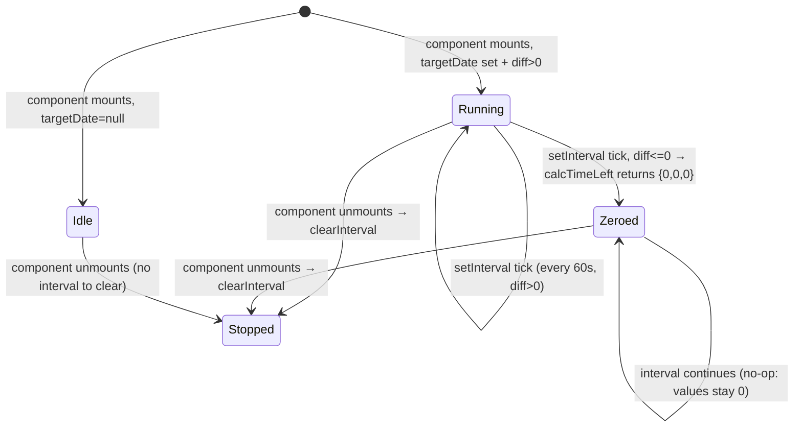

# Feature Specification: F032_CountdownPage

**Priority**: P3
**Type**: ui
**Generated**: 2026-06-01

## Overview

`CountdownPage` is a public, unauthenticated page at `/countdown` that renders a live client-side countdown timer to the Sun* Annual Awards event date. The page is a thin Next.js route (`app/countdown/page.tsx`) that delegates entirely to `PrelaunchPage`. The target date is read from `NEXT_PUBLIC_EVENT_DATETIME` env var; the timer ticks every 60 seconds. No API calls; no auth required; page is explicitly listed in `PUBLIC_PATHS` in `AuthGuard`.

## Why This Exists

Generates anticipation for the Sun* Annual Awards event by showing visitors — authenticated or not — how much time remains before the event, driving awareness without requiring sign-in.

## Who Uses It

- **Any visitor (unauthenticated or authenticated)** — views countdown to the event date; no action required (PERM003_FrontendAuthGuard exempts `/countdown` from auth redirect).

## Business Workflow

```
1. Visitor navigates to /countdown → Next.js renders CountdownPage (server) → PrelaunchPage mounts (client).
2. AuthGuard checks PUBLIC_PATHS: '/countdown' matches → no redirect to /login.
3. PrelaunchPage reads NEXT_PUBLIC_EVENT_DATETIME env var → constructs targetDate.
4. calcTimeLeft(targetDate) called once on mount → initial { days, hours, minutes } computed.
5. setInterval fires every 60 000 ms → setTimeLeft(calcTimeLeft(targetDate)) → UI re-renders countdown digits.
6. If NEXT_PUBLIC_EVENT_DATETIME is not set → targetDate = null → timeLeft stays at { 0, 0, 0 }; no interval set.
7. Visitor leaves page → component unmounts → clearInterval fires (useEffect cleanup).
```

## Screen Flow

**See:** ScreenFlow § F032_CountdownPage

| Screen | Route | Purpose |
|--------|-------|---------|
| SCR004_CountdownPage | `/countdown` | Public pre-launch countdown with live timer |

## Cross-Cutting Logic

### Requirements

None.

### Business Rules

None.

### State Machines

None.

### Algorithms

None.

### External Integrations

None.

### Verification

None.

## User Stories

### US011_ViewCountdownPage — View Pre-launch Countdown (Priority: P3)

**What happens:** Any visitor (unauthenticated or authenticated) navigates to `/countdown`. The `AuthGuard` allows the request through because `/countdown` is in `PUBLIC_PATHS`. The `PrelaunchPage` renders a full-screen dark layout with a key-visual background, the countdown title (from i18n), and three `TimeUnit` groups (days, hours, minutes) each composed of two `DigitBox` components. The timer updates every 60 seconds via `setInterval`.

**Why this priority:** P3 — purely informational marketing page; no business logic; feature does not affect kudos flows.

**Independent Test:** Navigate to `/countdown` without a JWT in localStorage — page renders with countdown digits (not redirect to /login). Verify `setInterval` fires every 60s by waiting one minute and confirming minute digit decrements.

**Acceptance Scenarios:**

1. **Given** any visitor (no auth token), **When** navigating to `/countdown`, **Then** page renders with countdown timer (days/hours/minutes) and no redirect to `/login`.
2. **Given** `NEXT_PUBLIC_EVENT_DATETIME` is set to a future ISO string, **When** page loads, **Then** timer shows correct remaining days/hours/minutes, updating every 60 seconds.
3. **Given** `NEXT_PUBLIC_EVENT_DATETIME` is unset or past, **When** page loads, **Then** timer displays `00 00 00` (zeroed); no JS error thrown.

**Requirements fulfilled:**
- **FR-001** Page publicly accessible without auth token — `AuthGuard PUBLIC_PATHS` includes `/countdown` — via `AuthGuard` + `app/countdown/page.tsx`
- **FR-002** Live countdown timer counts down to `NEXT_PUBLIC_EVENT_DATETIME` — no endpoint, client-side — via `PrelaunchPage` + `calcTimeLeft`
- **FR-003** Timer ticks every 60 seconds — no endpoint — via `setInterval(..., 60000)` in `PrelaunchPage:77-81`
- **FR-004** Static event info rendered (title, countdown digits with labels) — i18n keys `countdownTitle`, `days`, `hours`, `minutes` — via `PrelaunchPage`

**Rules enforced:**

### BR-001_EnvDateNullGuard
**Source:** `frontend/components/countdown/prelaunch-page.tsx:70-81`
**Linked FR:** FR-001, FR-002
**Applies to:** `PrelaunchPage` timer setup
**Rule:** If `NEXT_PUBLIC_EVENT_DATETIME` is absent/empty, `targetDate = null`; the `useEffect` returns early without creating an interval, and `timeLeft` stays at the initial zero state. No crash, no NaN digits.

**Pseudocode:**
```ts
const envDate = process.env.NEXT_PUBLIC_EVENT_DATETIME
const targetDate = envDate ? new Date(envDate) : null

// initial state
const [timeLeft, setTimeLeft] = useState(() =>
  targetDate ? calcTimeLeft(targetDate) : { days: 0, hours: 0, minutes: 0 }
)

useEffect(() => {
  if (!targetDate) return          // guard: no interval when env missing
  const id = setInterval(() => setTimeLeft(calcTimeLeft(targetDate)), 60000)
  return () => clearInterval(id)   // cleanup on unmount
}, [targetDate])
```

### BR-002_CountdownFloorAtZero
**Source:** `frontend/components/countdown/prelaunch-page.tsx:13-23`
**Linked FR:** FR-002
**Applies to:** `calcTimeLeft` algorithm
**Rule:** When `diff <= 0` (event has passed), returns `{ days: 0, hours: 0, minutes: 0 }` — never negative digits.

**Pseudocode:**
```ts
function calcTimeLeft(targetDate: Date): TimeLeft {
  const diff = targetDate.getTime() - Date.now()
  if (diff <= 0) return { days: 0, hours: 0, minutes: 0 }
  const totalMinutes = Math.floor(diff / 60000)
  const totalHours   = Math.floor(totalMinutes / 60)
  return {
    days:    Math.floor(totalHours / 24),
    hours:   totalHours % 24,
    minutes: totalMinutes % 60,
  }
}
```

**State transitions:**

### SM-001_CountdownTimerLifecycle
**Source:** `frontend/components/countdown/prelaunch-page.tsx:76-82`
**Linked FR:** FR-002, FR-003
**States:** Idle, Running, Zeroed, Stopped



**Transition rules:**
- `Idle → Running`: guard = `targetDate !== null && diff > 0`; side effects = `setInterval` created, initial `timeLeft` computed
- `Running → Zeroed`: guard = `calcTimeLeft` returns zero diff; side effects = `timeLeft` set to `{0,0,0}`
- Any → `Stopped`: guard = component unmount; side effects = `clearInterval(id)` from useEffect cleanup

**Algorithms:**

### ALG-001_CalcTimeLeft
**Source:** `frontend/components/countdown/prelaunch-page.tsx:13-23`
**Linked FR:** FR-002
**Input:** `targetDate: Date`
**Output:** `{ days: number, hours: number, minutes: number }` — all non-negative integers
**Complexity:** O(1)
**Description:** Computes the calendar-accurate remaining days/hours/minutes by floored integer division. Seconds are discarded (interval granularity is 1 minute). Does not account for DST transitions; relies on JS `Date.getTime()` (UTC epoch ms).

**Pseudocode:**
```ts
diff = targetDate.getTime() - Date.now()          // ms
if diff <= 0: return { days:0, hours:0, minutes:0 }
totalMinutes = floor(diff / 60_000)
totalHours   = floor(totalMinutes / 60)
days    = floor(totalHours / 24)
hours   = totalHours % 24
minutes = totalMinutes % 60
return { days, hours, minutes }
```

**External integrations:**

None.

**Verification:**
- **SC-001** GET `/countdown` without `auth_token` in localStorage renders countdown digits; no redirect (covers FR-001, PERM003 exemption)
- **SC-002** With future `NEXT_PUBLIC_EVENT_DATETIME`, rendered digit pairs match `calcTimeLeft` output (covers FR-002, ALG-001)
- **SC-003** With missing/past event date, all digit pairs show `00`; no console error (covers BR-001, BR-002)
- **SC-004** After 60 seconds, minute digit changes by -1 (covers FR-003, SM-001)

---

### Edge Cases

| Scenario | Behavior |
|----------|----------|
| `NEXT_PUBLIC_EVENT_DATETIME` is malformed (e.g. `"not-a-date"`) | `new Date("not-a-date")` produces `Invalid Date`; `getTime()` returns `NaN`; `diff <= 0` guard triggers (NaN <= 0 is false in JS) → `totalMinutes = NaN` → rendered as `NaN` string in `DigitBox`. Digits show `Na` — no crash but visually broken. |
| Event date in the past | `diff <= 0` → `calcTimeLeft` returns zeros immediately; `setInterval` still runs but always returns zeros |
| User's system clock is ahead of server | Countdown may reach zero early; no server-side validation |
| Multiple tabs open | Each tab runs an independent `setInterval`; no cross-tab synchronization |

## Key Entities

No database tables. This feature is purely client-side / static.

| Entity | Table | Key Columns | Purpose |
|--------|-------|-------------|---------|
| `NEXT_PUBLIC_EVENT_DATETIME` env var | N/A | ISO 8601 string | Target date for countdown calculation |
| `TimeLeft` interface | N/A (in-memory) | `days`, `hours`, `minutes` | State shape for countdown values |
| `PUBLIC_PATHS` constant | N/A (in-memory) | `/countdown` entry | Exempts route from auth redirect |

## Related Artifacts

- **Screens** (from ScreenList): SCR004_CountdownPage
- **User Stories** (from UserStories): US011_ViewCountdownPage
- **Routes** (from RouteList): none (frontend-only route, no backend API)
- **Data Models** (from DataModel): none
- **Background Logic** (from BackgroundLogic): none
- **Permissions** (from Permissions): PERM003_FrontendAuthGuard

## Spec Documents

- [x] [System Overview](../../system-overview.md)
- [x] [Feature List](../../feature-list.md) — F032_CountdownPage
- [x] [User Stories](../../user-stories.md) — US011_ViewCountdownPage
- [x] [Screen List](../../screen-list.md) — SCR004_CountdownPage
- [x] [Permissions](../../permissions.md) — PERM003_FrontendAuthGuard
- [ ] [Route List](../../route-list.md) — none referenced
- [ ] [Data Model](../../data-model.md) — none referenced
- [ ] [Background Logic](../../background-logic.md) — none referenced

## Assumptions

- `NEXT_PUBLIC_EVENT_DATETIME` must be a valid ISO 8601 string parseable by `new Date()`. No validation or error UI is provided for malformed values.
- The timer granularity is minutes (60 000 ms interval); seconds are never displayed. This matches the current `TimeLeft` interface which has no `seconds` field.
- `AuthGuard` is a client-side UX gate only (`auth-guard.tsx:6`). The countdown page contains no sensitive data, so the absence of server-side auth enforcement is intentional.
- The `key-visual.png` background image at `/key-visual.png` is a static asset served by Next.js and must be present in the `public/` directory.

## Source Code References

| Symbol | Path | Purpose |
|--------|------|---------|
| `CountdownPage` | `frontend/app/countdown/page.tsx:1-5` | Route entry point; renders `<PrelaunchPage />` |
| `PrelaunchPage` | `frontend/components/countdown/prelaunch-page.tsx:68-119` | Full countdown UI: env read, state, interval, layout |
| `calcTimeLeft` | `frontend/components/countdown/prelaunch-page.tsx:13-23` | Core time-left calculation algorithm |
| `DigitBox` | `frontend/components/countdown/prelaunch-page.tsx:25-48` | Single digit display with glassmorphism styling |
| `TimeUnit` | `frontend/components/countdown/prelaunch-page.tsx:50-66` | Pair of digits + label (days / hours / minutes) |
| `AuthGuard` | `frontend/components/auth/auth-guard.tsx:6` | `PUBLIC_PATHS` constant including `/countdown` |

## Unresolved Questions

1. **Malformed env date handling**: `new Date("invalid")` returns `Invalid Date`; `NaN <= 0` is false in JS so the zero guard does not fire and `Math.floor(NaN / 60000)` renders as `NaN`. No user-visible error message exists — whether this is acceptable UX is unconfirmed.
2. **Seconds display**: The current spec only shows days/hours/minutes. If the design requires seconds (future change), `calcTimeLeft` and `setInterval` interval must both be updated; the `DigitBox` grid would need a 4th `TimeUnit`.
3. **Timezone handling**: The countdown uses `Date.now()` (user's local system time) without UTC normalization. If the event date is meant to be Vietnam-local (UTC+7), users in other timezones will see incorrect countdowns.
