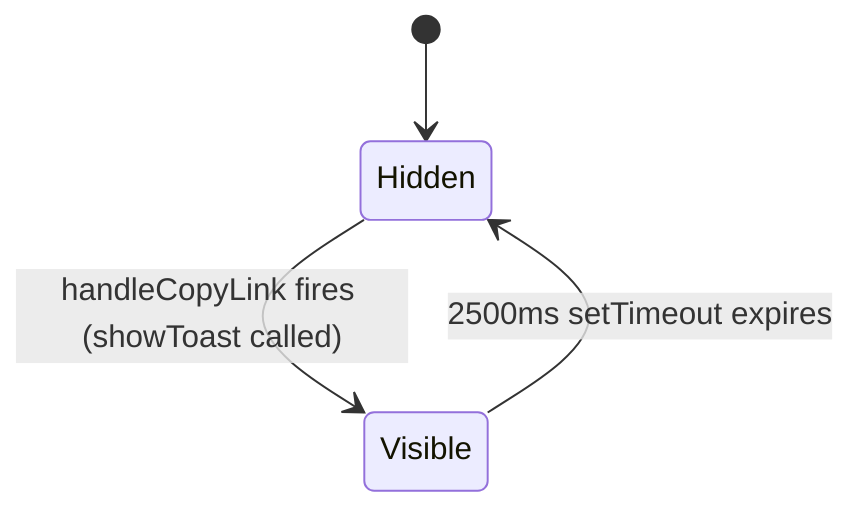

# Feature Specification: F033_CopyKudosLink

**Priority**: P3
**Type**: ui
**Generated**: 2026-06-01

## Overview

`CopyKudosLink` is a client-side-only action available on three surfaces: the all-kudos feed card (`KudosPostCard`), the kudos detail modal (`KudosDetailModal` via `DetailContent`), and the profile page kudos list (reuses `KudosPostCard`). Clicking the "Copy Link" button calls `navigator.clipboard.writeText(`${window.location.origin}/kudos/${kudos.id}`)` and shows a `KudosToast` confirmation. No API call is made; no state is persisted.

## Why This Exists

Enables users to share a direct permalink to any kudos with colleagues outside the app (e.g., via chat or email), increasing reach and engagement around recognition moments.

## Who Uses It

- **Authenticated employee on kudos feed** — copies link from feed card (`KudosPostCard` in `AllKudosSection`)
- **Authenticated employee viewing detail modal** — copies link from `KudosDetailModal` action row
- **Authenticated employee on profile page** — copies link from `KudosPostCard` in `ProfileKudosSection`

## Business Workflow

```
1. User is viewing a kudos card (feed, detail modal, or profile list) that has a "Copy Link" button.
2. User clicks "Copy Link" → handleCopyLink() fires on the respective component.
3. URL is constructed: `${window.location.origin}/kudos/${kudos.id}` — e.g. `https://ssa-two-theta.vercel.app/kudos/abc123`.
4. navigator.clipboard.writeText(url) is called → OS clipboard updated.
5. showToast(t.copyLinkToast) fires → KudosToast renders for 2500ms → auto-hides.
6. No API call; no state change beyond local toast visibility.
```

## Screen Flow

**See:** ScreenFlow § F033_CopyKudosLink

| Screen | Route | Purpose |
|--------|-------|---------|
| SCR007_KudosPage/REG003_AllKudosFeed | `/kudos` | Copy link from all-kudos feed card |
| SCR008_KudosDetailModal | `/kudos/:id` | Copy link from detail modal action row |
| SCR009_ProfilePage/REG003_ProfileKudosList | `/profile/:email` | Copy link from profile kudos list card |

## Cross-Cutting Logic

### Requirements

| Code | Description | Endpoint/Handler | Verifiable |
|------|-------------|------------------|------------|
| FR-001 | "Copy Link" button visible on kudos card in all three surfaces | no endpoint — client UI | yes |
| FR-002 | Clicking copies `<origin>/kudos/<id>` to clipboard via `navigator.clipboard.writeText` | no endpoint — browser API | yes |
| FR-003 | Toast confirmation visible for ~2500ms after copy | no endpoint — local state | yes |

### Business Rules

### BR-001_UrlConstruction
**Source:** `frontend/components/kudos/kudos-post-card.tsx:72-75`
**Linked FR:** FR-002
**Applies to:** All three `handleCopyLink` implementations (`kudos-post-card.tsx:72-75` is the canonical definition; the same logic is repeated at `kudos-detail-modal.tsx:154-157` and `kudos-action-bar.tsx:64-67`)
**Rule:** The permalink URL is always constructed as `window.location.origin + '/kudos/' + kudos.id`. `window.location.origin` includes protocol + host + optional port, ensuring the link works across dev (`localhost:3001`) and production (`https://ssa-two-theta.vercel.app`).

**Pseudocode:**
```ts
const handleCopyLink = async () => {
  const url = `${window.location.origin}/kudos/${kudosId}`
  await navigator.clipboard.writeText(url)
  showToast(t.copyLinkToast)
}
```

### State Machines

### SM-001_ToastVisibility
**Source:** `frontend/components/kudos/kudos-post-card.tsx:44-47` (same pattern in all three hosts)
**Linked FR:** FR-003
**States:** Hidden, Visible



**Transition rules:**
- `Hidden → Visible`: guard = `handleCopyLink` called successfully; side effects = `setToast({ msg: t.copyLinkToast, show: true })`
- `Visible → Hidden`: guard = 2500ms elapsed; side effects = `setToast(s => ({ ...s, show: false }))`

### Algorithms

None.

### External Integrations

None.

### Verification

- **SC-001** Copy Link button present on `KudosPostCard` in feed, detail modal, and profile list (covers FR-001)
- **SC-002** After click, clipboard contains `<origin>/kudos/<id>` (covers FR-002, BR-001)
- **SC-003** Toast appears immediately after click and disappears after ~2500ms (covers FR-003, SM-001)

## User Stories

### US030_CopyKudosLinkFromFeed — Copy Kudos Link from Feed Card (Priority: P3)

**What happens:** Authenticated employee on `/kudos` sees a "Copy Link" button (text + `LinkIcon`) on each `KudosPostCard` in `AllKudosSection`. Clicking calls `handleCopyLink` in `KudosPostCard`, writes `${origin}/kudos/${kudos.id}` to clipboard, and shows `KudosToast` with `t.copyLinkToast` message for 2500ms.

**Why this priority:** P3 — sharing convenience feature; no core kudos functionality blocked.

**Independent Test:** Open `/kudos` feed; click "Copy Link" on any card; paste clipboard into address bar — verify it matches `<origin>/kudos/<card-id>` and navigates to the kudos detail.

**Acceptance Scenarios:**

1. **Given** authenticated user on `/kudos` feed, **When** clicking "Copy Link" on a `KudosPostCard`, **Then** clipboard contains `<origin>/kudos/<id>` and a toast confirmation appears for ~2500ms.
2. **Given** toast is visible, **When** 2500ms elapse, **Then** toast disappears automatically.

**Requirements fulfilled:**
- **FR-001** Copy Link button on feed card — no endpoint — via `KudosPostCard` (line 168–174)
- **FR-002** Clipboard write with `<origin>/kudos/<id>` — no endpoint — via `KudosPostCard.handleCopyLink:72-75`
- **FR-003** Toast confirmation 2500ms — no endpoint — via `KudosPostCard.showToast:44-47`

**Rules enforced:** BR-001_UrlConstruction (see Cross-Cutting Logic), SM-001_ToastVisibility (see Cross-Cutting Logic)

**Verification:**
- **SC-004** Feed card "Copy Link" button renders for every card in the all-kudos list (covers FR-001)
- **SC-005** Clipboard content matches `window.location.origin + '/kudos/' + kudos.id` (covers FR-002, BR-001)

---

### US034_CopyKudosLinkFromDetailModal — Copy Kudos Link from Detail Modal (Priority: P3)

**What happens:** Authenticated employee viewing `KudosDetailModal` at `/kudos/:id` (intercepted or direct) sees a "Copy Link" button in the action row below the kudos content. Clicking calls `DetailContent.handleCopyLink` which writes the permalink to clipboard and shows `KudosToast`.

**Why this priority:** P3 — sharing convenience; detail modal is already a permalink surface.

**Independent Test:** Open a kudos detail modal; click "Copy Link" in action row; confirm clipboard content equals the current URL.

**Acceptance Scenarios:**

1. **Given** `KudosDetailModal` is open with loaded kudos data, **When** clicking "Copy Link", **Then** clipboard contains `<origin>/kudos/<id>` and toast appears.
2. **Given** kudos is still loading (spinner visible), **When** layout renders, **Then** "Copy Link" button is not rendered (it's inside `DetailContent` which mounts only when `kudos !== null`).

**Requirements fulfilled:**
- **FR-001** Copy Link button in detail modal action row — no endpoint — via `DetailContent` (kudos-detail-modal.tsx:233–238)
- **FR-002** Clipboard write — no endpoint — via `DetailContent.handleCopyLink:154-157`
- **FR-003** Toast confirmation — no endpoint — via `DetailContent.showToast:125-129`

**Rules enforced:** BR-001_UrlConstruction (see Cross-Cutting Logic), SM-001_ToastVisibility (see Cross-Cutting Logic)

**Verification:**
- **SC-006** "Copy Link" absent while modal is in loading state; present once kudos data loads (covers FR-001)
- **SC-007** Clipboard content matches `<origin>/kudos/<id>` after click from detail modal (covers FR-002)

---

### US039_CopyKudosLinkFromProfileFeed — Copy Kudos Link from Profile Feed Card (Priority: P3)

**What happens:** Authenticated employee on `/profile/:email` views kudos in `ProfileKudosSection`, which renders `KudosPostCard` for each item. The same `handleCopyLink` from `KudosPostCard` is used — identical behavior to US030.

**Why this priority:** P3 — same convenience feature as US030 on a different surface.

**Independent Test:** Open `/profile/:email`; click "Copy Link" on a profile kudos card; paste clipboard — verify `<origin>/kudos/<id>`.

**Acceptance Scenarios:**

1. **Given** profile page with kudos visible, **When** clicking "Copy Link" on a profile kudos card, **Then** clipboard contains `<origin>/kudos/<id>` and toast appears for ~2500ms.

**Requirements fulfilled:**
- **FR-001** Copy Link button on profile kudos card — no endpoint — via `KudosPostCard` rendered inside `ProfileKudosSection`
- **FR-002** Clipboard write — no endpoint — via `KudosPostCard.handleCopyLink:72-75`
- **FR-003** Toast confirmation — no endpoint — via `KudosPostCard.showToast:44-47`

**Rules enforced:** BR-001_UrlConstruction (see Cross-Cutting Logic), SM-001_ToastVisibility (see Cross-Cutting Logic)

**Verification:**
- **SC-008** Profile kudos list renders `KudosPostCard` with "Copy Link" button for each card (covers FR-001)
- **SC-009** Clipboard content is `<origin>/kudos/<id>` from profile card (covers FR-002)

---

### Edge Cases

| Scenario | Behavior |
|----------|----------|
| `navigator.clipboard` unavailable (non-HTTPS / old browser) | `writeText` throws `DOMException`; `handleCopyLink` is `async` but error is unhandled — no catch block in any implementation; toast still fires (no await-before-toast guard). In practice: toast shows but clipboard is not written. |
| User clicks "Copy Link" twice rapidly | Second click overwrites clipboard with same URL; a second toast is triggered; first toast's 2500ms timer is still running — two overlapping toasts may render (only one `KudosToast` component; second `setToast` call resets visibility to true and resets message). |
| `kudos.id` contains special characters | `kudos.id` is a UUID string from backend; no URL encoding applied. UUIDs are URL-safe — no issue in practice. |
| Detail modal in loading state | `DetailContent` not yet mounted; "Copy Link" button not in DOM; no interaction possible. |

## Key Entities

No database tables written. `kudos.id` is read from the already-loaded `KudosCard` prop.

| Entity | Table | Key Columns | Purpose |
|--------|-------|-------------|---------|
| `KudosCard` | `kudos` | `id` | Source of `kudos.id` used to construct permalink URL |
| Browser Clipboard API | N/A | `navigator.clipboard.writeText` | Receives the constructed URL |
| `KudosToast` | N/A (in-memory) | `message`, `visible` | Renders confirmation feedback |

## Related Artifacts

- **Screens** (from ScreenList): SCR007_KudosPage/REG003_AllKudosFeed, SCR008_KudosDetailModal, SCR009_ProfilePage/REG003_ProfileKudosList
- **User Stories** (from UserStories): US030_CopyKudosLinkFromFeed, US034_CopyKudosLinkFromDetailModal, US039_CopyKudosLinkFromProfileFeed
- **Routes** (from RouteList): none
- **Data Models** (from DataModel): none
- **Background Logic** (from BackgroundLogic): none
- **Permissions** (from Permissions): none

## Spec Documents

- [x] [System Overview](../../system-overview.md)
- [x] [Feature List](../../feature-list.md) — F033_CopyKudosLink
- [x] [User Stories](../../user-stories.md) — US030_CopyKudosLinkFromFeed, US034_CopyKudosLinkFromDetailModal, US039_CopyKudosLinkFromProfileFeed
- [x] [Screen List](../../screen-list.md) — SCR007_KudosPage/REG003_AllKudosFeed, SCR008_KudosDetailModal, SCR009_ProfilePage/REG003_ProfileKudosList
- [ ] [Route List](../../route-list.md) — none referenced
- [ ] [Data Model](../../data-model.md) — none referenced
- [ ] [Permissions](../../permissions.md) — none referenced
- [ ] [Background Logic](../../background-logic.md) — none referenced

## Assumptions

- `navigator.clipboard.writeText` is available in all supported browsers when the page is served over HTTPS (production). Local dev on HTTP may fail silently per the edge-case table above.
- `kudos.id` is always a UUID string; no URL encoding is required.
- `KudosActionBar` (`kudos-action-bar.tsx`) also implements `handleCopyLink` (line 64–67) using identical logic, but this component is used in the highlight-card context (REG001), not in the three surfaces owned by F033. Its behavior is architecturally identical and the same BR-001 applies.
- The toast duration of 2500ms is hardcoded identically in all three implementations (`showToast` / `showMessage` setTimeout). No shared constant exists — drift risk if individually changed.

## Source Code References

| Symbol | Path | Purpose |
|--------|------|---------|
| `KudosPostCard.handleCopyLink` | `frontend/components/kudos/kudos-post-card.tsx:72-76` | Copy link handler for feed and profile surfaces |
| `DetailContent.handleCopyLink` | `frontend/components/kudos/kudos-detail-modal.tsx:154-158` | Copy link handler inside detail modal |
| `KudosActionBar.handleCopyLink` | `frontend/components/kudos/kudos-action-bar.tsx:64-68` | Copy link in highlight card action bar (not F033-owned surface, but same pattern) |
| `KudosPostCard` (action row) | `frontend/components/kudos/kudos-post-card.tsx:168-175` | Renders "Copy Link" button with `LinkIcon` |
| `DetailContent` (action row) | `frontend/components/kudos/kudos-detail-modal.tsx:233-239` | Renders "Copy Link" button in detail modal |
| `ProfileKudosSection` | `frontend/components/profile/profile-kudos-section.tsx:196-201` | Renders `KudosPostCard` list (inherits copy-link behavior) |
| `KudosToast` | `frontend/components/kudos/kudos-toast.tsx` | Toast component used by all three surfaces |

## Unresolved Questions

1. **Clipboard error handling**: None of the three `handleCopyLink` implementations have a `try/catch`. If `navigator.clipboard.writeText` rejects (HTTPS not enforced in dev, permissions denied), the user sees the toast but the clipboard is not written. Confirm whether silent failure is acceptable or an error toast should be shown.
2. **`KudosActionBar` ownership**: `kudos-action-bar.tsx:64-67` implements the same clipboard logic for the highlight-card surface (REG001). It is not listed under F033 in the feature-list artifact. If coverage is desired, a separate feature or expansion of F033 scope may be needed.
3. **Duplicate toast on rapid clicks**: Two sequential clicks produce overlapping state (second `setToast` call resets `show=true` mid-timeout). Behavior is tolerable but not explicitly designed — confirm if debounce/disable is required.
