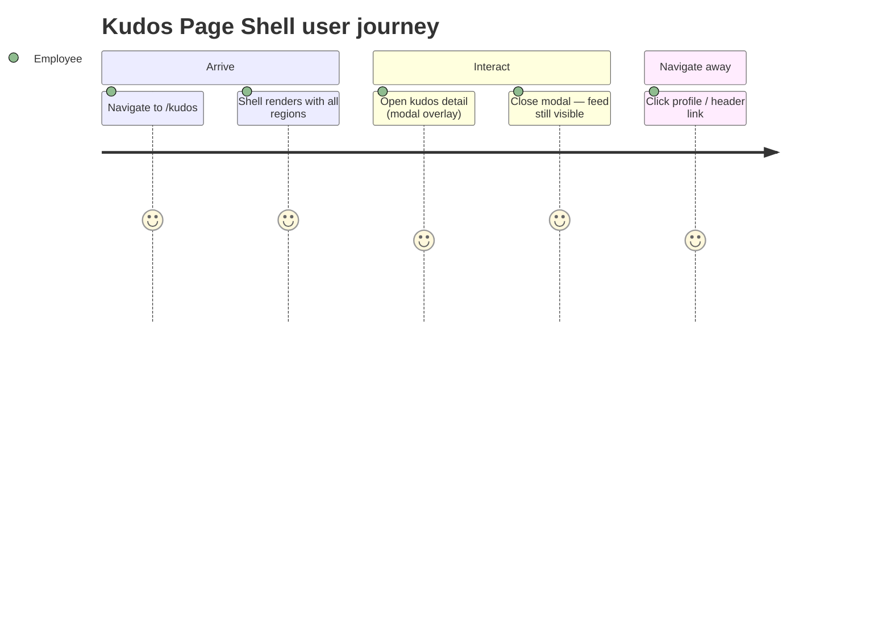
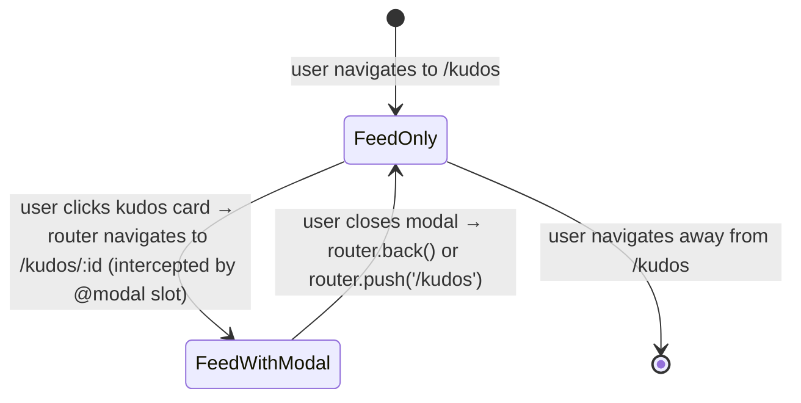

# Feature Specification: F034_KudosPageShell

**Priority**: P2
**Type**: ui
**Generated**: 2026-06-01

## Overview

`KudosPageShell` is the composite page layout at `/kudos`. It assembles `SiteHeader`, `KudosHero`, `HighlightSection`, `SpotlightSection`, `AllKudosSection`, `SiteFooter`, and `WidgetButton` into a single server-rendered page, plus `KudosLayout` which injects the `@modal` parallel route slot for the kudos detail modal. The shell owns the bare `SCR007_KudosPage` reference; individual content regions (REG001–REG004) and their data-fetching logic are owned by other features. The shell itself makes no API calls and holds no local state.

## Why This Exists

Provides the structural skeleton that composes all kudos-domain sections into a coherent page, and wires up the Next.js parallel route (`@modal`) that enables the kudos detail modal to overlay the feed without a full page navigation.

## Who Uses It

- **Authenticated employee** — lands here after login or navigation from homepage/awards CTA; sees the full kudos experience (PERM003_FrontendAuthGuard enforces auth on `/kudos`).

## Business Workflow

```
1. Authenticated user navigates to /kudos → Next.js App Router matches frontend/app/kudos/page.tsx.
2. AuthGuard (PERM003) checks localStorage for auth_token → present → render proceeds.
3. KudosLayout renders: {children} (KudosPage output) + {modal} (@modal slot, default = null via @modal/default.tsx).
4. KudosPage renders synchronously: SiteHeader → KudosHero → HighlightSection → SpotlightSection → AllKudosSection → SiteFooter → WidgetButton.
5. Each region component independently fetches its own data (owned by F008, F009, F007, F016 respectively).
6. User navigates to /kudos/:id from within /kudos → @modal slot intercepts via (.)kudos/[id]/page.tsx → KudosDetailModal renders as overlay; KudosPage (feed) remains mounted.
7. User closes modal → @modal slot resets to default.tsx (null) → feed visible again.
```

## Screen Flow

**See:** ScreenFlow § F034_KudosPageShell

| Screen | Route | Purpose |
|--------|-------|---------|
| SCR007_KudosPage | `/kudos` | Full kudos page shell: header, hero, 4 regions, footer, FAB |
| SCR008_KudosDetailModal | `/kudos/:id` (intercepted) | Modal overlay rendered in `@modal` slot without unmounting feed |



## Cross-Cutting Logic

### Requirements

| Code | Description | Endpoint/Handler | Verifiable |
|------|-------------|------------------|------------|
| FR-001 | `/kudos` route renders shell with SiteHeader, KudosHero, HighlightSection, SpotlightSection, AllKudosSection, SiteFooter, WidgetButton | no backend endpoint — page render | yes |
| FR-002 | KudosLayout mounts `@modal` parallel route slot alongside page children | no endpoint — Next.js parallel route | yes |
| FR-003 | `/kudos` requires auth; unauthenticated users redirected to `/login` by AuthGuard | no endpoint — client guard | yes |

### Business Rules

### BR-001_AuthGuardEnforcement
**Source:** `frontend/components/auth/auth-guard.tsx:6-16`
**Linked FR:** FR-003
**Applies to:** All routes not in `PUBLIC_PATHS`
**Rule:** `/kudos` is not in `PUBLIC_PATHS = ['/login', '/countdown', '/auth/callback']`. If `localStorage.getItem('auth_token')` is falsy, `router.replace('/login')` fires and `null` is returned (no flash of content). Shell does not render.

**Pseudocode:**
```ts
const isPublic = PUBLIC_PATHS.some(p =>
  pathname === p || pathname.startsWith(p + '/')
)
if (!isPublic && !localStorage.getItem('auth_token')) {
  router.replace('/login')
  return   // render null — no shell shown
}
setChecked(true)
// render children (shell)
```

### BR-002_ParallelRouteModalSlot
**Source:** `frontend/app/kudos/layout.tsx:1-14`
**Linked FR:** FR-002
**Applies to:** `/kudos` layout
**Rule:** `KudosLayout` renders `{children}` and `{modal}` side-by-side. The `@modal` slot defaults to `null` (via `@modal/default.tsx`) when no modal route is active. When `/kudos/:id` is navigated from within `/kudos`, Next.js intercepts it via `@modal/(.)kudos/[id]/page.tsx` and populates `{modal}` with `KudosDetailModal` as an overlay, keeping the feed (`{children}`) mounted. Direct navigation to `/kudos/:id` (e.g., external link) bypasses interception and renders the full detail page instead.

**Pseudocode:**
```ts
// layout.tsx
function KudosLayout({ children, modal }) {
  return <>
    {children}   // SCR007: full kudos feed page
    {modal}      // SCR008: KudosDetailModal overlay (or null)
  </>
}
```

### State Machines

### SM-001_ModalSlotLifecycle
**Source:** `frontend/app/kudos/layout.tsx:1-14` and `frontend/app/kudos/@modal/(.)kudos/[id]/page.tsx`
**Linked FR:** FR-002
**States:** FeedOnly, FeedWithModal



**Transition rules:**
- `FeedOnly → FeedWithModal`: guard = navigation to `/kudos/:id` originating from within `/kudos` (intercepted route matches); side effects = `@modal` slot populated with `KudosDetailModal`, feed remains mounted
- `FeedWithModal → FeedOnly`: guard = modal close (`router.back()` or `router.push('/kudos')`); side effects = `@modal` slot reverts to `default.tsx` (null)

### Algorithms

None.

### External Integrations

None.

### Verification

- **SC-001** GET `/kudos` with valid JWT renders all 7 shell components in DOM order (covers FR-001, BR-001)
- **SC-002** GET `/kudos` without JWT redirects to `/login`; no shell renders (covers FR-003, BR-001)
- **SC-003** Clicking a kudos card from feed opens detail modal as overlay without unmounting feed (covers FR-002, BR-002, SM-001)
- **SC-004** Closing detail modal returns to feed with prior scroll position (covers SM-001)

## User Stories

### US007_NavigateToProfileFromHeader — Navigate to Own Profile from Header (Priority: P2)

**What happens:** Authenticated employee on any auth-required page (including `/kudos`) clicks their avatar/name in `SiteHeader`, navigating to `/profile/:email`. The shell provides the `SiteHeader` context; navigation itself is handled by `SiteHeader`.

**Why this priority:** P2 — core navigation; without it users cannot access their profile from the kudos page.

**Independent Test:** On `/kudos`, click user avatar in header → verify navigation to `/profile/<current-user-email>`.

**Acceptance Scenarios:**

1. **Given** authenticated user on `/kudos`, **When** clicking own avatar in `SiteHeader`, **Then** browser navigates to `/profile/:email`.

**Requirements fulfilled:**
- **FR-004** SiteHeader renders on `/kudos` shell with `currentPath="/kudos"` — no backend endpoint — via `KudosPage:12`

**Rules enforced:** BR-001_AuthGuardEnforcement (see Cross-Cutting Logic)

**Verification:**
- **SC-005** `SiteHeader` present in DOM with `currentPath="/kudos"` prop (covers FR-004)

---

### US008_LogOut — Log Out (Priority: P2)

**What happens:** Authenticated employee clicks "Log out" in the user dropdown of `SiteHeader`. The handler clears `auth_token` from `localStorage` and redirects to `/login`. Shell is available on `/kudos` as one of the pages that renders `SiteHeader`.

**Why this priority:** P2 — core auth lifecycle; users must be able to sign out from any page.

**Independent Test:** On `/kudos`, open user dropdown → click Log out → verify `localStorage.auth_token` is cleared and browser is at `/login`.

**Acceptance Scenarios:**

1. **Given** authenticated user on `/kudos`, **When** clicking Log out in header dropdown, **Then** `auth_token` removed from localStorage and redirected to `/login`.

**Requirements fulfilled:**
- **FR-004** SiteHeader renders on kudos shell — no endpoint — via `KudosPage:12`

**Rules enforced:** BR-001_AuthGuardEnforcement (see Cross-Cutting Logic)

**Verification:**
- **SC-006** After logout, `/kudos` redirects to `/login` (auth_token absent triggers AuthGuard redirect)

---

### US009_ToggleLanguage — Toggle UI Language (Priority: P2)

**What happens:** Authenticated employee on `/kudos` clicks the language toggle in `SiteHeader` to switch between Vietnamese and English. All i18n strings across the shell (hero, sections) re-render in the selected language.

**Why this priority:** P2 — accessibility; VN/EN bilingual product requirement.

**Independent Test:** On `/kudos`, toggle language → verify hero title and section labels change language.

**Acceptance Scenarios:**

1. **Given** language is set to VN, **When** user toggles to EN, **Then** all visible text strings in shell re-render in English.

**Requirements fulfilled:**
- **FR-004** SiteHeader with language toggle renders on kudos shell — no endpoint — via `KudosPage:12`

**Rules enforced:** None additional.

**Verification:**
- **SC-007** Language toggle in header switches visible i18n strings on `/kudos` page

---

### US010_ViewNotificationPanel — View Notification Panel (Priority: P2)

**What happens:** Authenticated employee clicks the notification bell in `SiteHeader` on `/kudos`. The notification panel opens inline. Shell provides the header context.

**Why this priority:** P2 — part of SiteHeader which is present on all auth pages.

**Independent Test:** On `/kudos`, click notification bell → notification panel visible.

**Acceptance Scenarios:**

1. **Given** authenticated user on `/kudos`, **When** clicking notification bell, **Then** notification panel renders without navigating away.

**Requirements fulfilled:**
- **FR-004** SiteHeader renders on kudos shell — no endpoint — via `KudosPage:12`

**Rules enforced:** None additional.

**Verification:**
- **SC-008** Notification panel opens on bell click while on `/kudos` shell

---

### Edge Cases

| Scenario | Behavior |
|----------|----------|
| Direct navigation to `/kudos/:id` (not from within `/kudos`) | Parallel route interception does not fire; `frontend/app/kudos/[id]/page.tsx` renders `KudosPage` + forced-open `KudosDetailModal` as a full page (not overlay) |
| Auth token expires while user is on `/kudos` | Next API call from any region component returns 401; individual region components handle their own error state; AuthGuard does not re-check after initial mount |
| `@modal/default.tsx` missing | Next.js throws a build-time error for the parallel route slot; shell fails to render |
| SiteHeader `currentPath` prop mismatch | Navigation highlight incorrect; no functional impact on shell |

## Key Entities

No database tables are read or written by the shell itself. Child components own their data.

| Entity | Table | Key Columns | Purpose |
|--------|-------|-------------|---------|
| `auth_token` | N/A (localStorage) | JWT string | Read by AuthGuard to gate shell render |
| Next.js parallel route (`@modal`) | N/A (routing) | `modal` slot | Enables overlay modal without unmounting feed |
| `KudosLayout` | N/A (layout component) | `children`, `modal` props | Composes feed and modal slot |

## Related Artifacts

- **Screens** (from ScreenList): SCR007_KudosPage
- **User Stories** (from UserStories): US007_NavigateToProfileFromHeader, US008_LogOut, US009_ToggleLanguage, US010_ViewNotificationPanel
- **Routes** (from RouteList): none (page shell; API calls owned by region features)
- **Data Models** (from DataModel): none
- **Background Logic** (from BackgroundLogic): none
- **Permissions** (from Permissions): PERM003_FrontendAuthGuard

## Spec Documents

- [x] [System Overview](../../system-overview.md)
- [x] [Feature List](../../feature-list.md) — F034_KudosPageShell
- [x] [User Stories](../../user-stories.md) — US007_NavigateToProfileFromHeader, US008_LogOut, US009_ToggleLanguage, US010_ViewNotificationPanel
- [x] [Screen List](../../screen-list.md) — SCR007_KudosPage
- [x] [Permissions](../../permissions.md) — PERM003_FrontendAuthGuard
- [ ] [Route List](../../route-list.md) — none referenced (shell has no backend route)
- [ ] [Data Model](../../data-model.md) — none referenced
- [ ] [Background Logic](../../background-logic.md) — none referenced

## Assumptions

- `KudosPage` is a server component (no `'use client'` directive); child components that need client interactivity declare `'use client'` themselves. The shell composition is safe for server rendering.
- `WidgetButton` on `/kudos` renders the same `RuleModal` as on `/`; the "Viết KUDOS" action in the FAB on `/kudos` calls `router.push('/kudos')` (no-op — already there) or opens `WriteKudosModal` via `KudosInputTrigger` (owned by the hero region, not the shell).
- The `@modal/default.tsx` file exports a `null` render and must exist for the parallel route to compile. Its absence would break the build.
- US007/US008/US009/US010 are shared across multiple page shells (SCR001, SCR005, SCR006, SCR007, SCR009). These US are assigned to F034 per the feature-list artifact; the underlying implementation lives in `SiteHeader`.

## Source Code References

| Symbol | Path | Purpose |
|--------|------|---------|
| `KudosPage` | `frontend/app/kudos/page.tsx:1-24` | Shell: imports and renders all 7 layout components |
| `KudosLayout` | `frontend/app/kudos/layout.tsx:1-14` | Parallel route layout: `{children}` + `{modal}` slot |
| `@modal/default.tsx` | `frontend/app/kudos/@modal/default.tsx` | Default (null) for modal slot when no modal is active |
| `@modal/(.)kudos/[id]/page.tsx` | `frontend/app/kudos/@modal/(.)kudos/[id]/page.tsx` | Intercept route: renders `KudosDetailModal` in modal slot |
| `AuthGuard` | `frontend/components/auth/auth-guard.tsx:6-24` | Client-side auth gate wrapping all non-public routes |
| `KudosHero` | `frontend/components/kudos/kudos-hero.tsx:1-65` | Hero section assembled in shell |

## Unresolved Questions

1. **WidgetButton on `/kudos`**: The FAB "Viết KUDOS" action calls `router.push('/kudos')` (already on that page). The intended behavior — open `WriteKudosModal` directly — is handled via `KudosInputTrigger` inside `KudosHero`, not via the FAB. Whether the FAB should open the modal directly on `/kudos` (rather than navigate) is not confirmed in source or spec artifacts.
2. **`SiteHeader` US ownership**: US007/US008/US009/US010 are listed under F034 in the feature-list but the same US codes also appear on SCR001/SCR005/SCR006/SCR009. Placement under F034 implies F034 is the canonical spec for these stories; downstream implementers should not duplicate the US in sibling shell features.
3. **SSR/streaming**: `KudosPage` is a server component, but region components (`HighlightSection`, `SpotlightSection`, `AllKudosSection`) are `'use client'`. No `Suspense` boundaries are visible in the shell. If region fetches are slow, the shell may have layout shift — unconfirmed whether this is acceptable.
