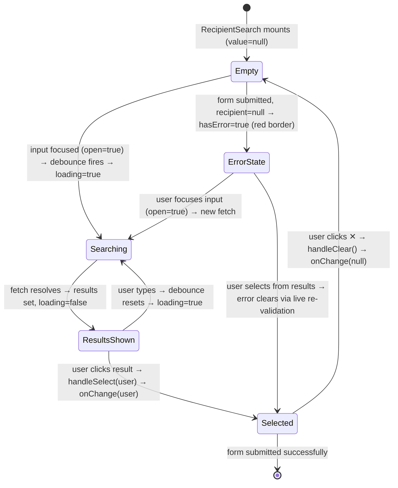

# Feature Specification: F035_RecipientSearchModal

**Priority**: P1
**Type**: ui (backend + frontend)
**Generated**: 2026-06-01

## Overview

`RecipientSearchModal` is the recipient-selection field inside `WriteKudosModal`. It renders a controlled `RecipientSearch` component: a text input with a 300ms debounced query to `GET /users?search=<term>` (empty query returns all users, up to 10). Selecting a user replaces the input with a chip (avatar + name + ✕ clear button). On form submit without a recipient, the field shows a red border and `t.writeKudosRequiredField` error message. The backend `UsersController@search` is a JWT-protected endpoint returning `UserSearchResult[]` from the `user` table.

## Why This Exists

Without recipient search, the kudos form cannot be addressed to the correct colleague. This is a P1 blocker for the core kudos-creation flow (F005); selecting a recipient is the first required field in `WriteKudosModal`.

## Who Uses It

- **Authenticated employee composing kudos** — searches for and selects a recipient in `WriteKudosModal` (PERM001_BackendJwtRouteGuard enforces JWT on `GET /users`).

## Business Workflow

```
1. Authenticated user opens WriteKudosModal (via KudosInputTrigger or WidgetButton → router.push('/kudos')).
2. User focuses the recipient field → RecipientSearch sets open=true → debounced effect fires with empty query.
3. GET /users (no search param) → UsersService.search('', limit=10) → returns up to 10 users ordered by firstName ASC.
4. Dropdown renders UserSearchResult[] (name + department + avatar).
5. User types a search term → 300ms debounce → GET /users?search=<term> → ILIKE match on CONCAT(firstName,' ',lastName) OR email.
6. User clicks a result row → handleSelect(user) → onChange(user) propagates to WriteKudosModal recipient state → chip renders.
7. User clicks ✕ on chip → handleClear() → onChange(null) → field reverts to empty input.
8. User submits form without selecting → runValidation sets errors.recipient = t.writeKudosRequiredField → red border + error text below field.
9. After recipient selected, live re-validation (post-first-submit) clears the error.
```

## Screen Flow

**See:** ScreenFlow § F035_RecipientSearchModal

| Screen | Route | Purpose |
|--------|-------|---------|
| SCR007_KudosPage/REG003_AllKudosFeed | `/kudos` | WriteKudosModal opens from KudosInputTrigger; RecipientSearch is the first form field |

## Cross-Cutting Logic

### Requirements

None.

### Business Rules

None.

### State Machines

None.

### Algorithms

None.

### External Integrations

None.

### Verification

None.

## User Stories

### US023_SelectRecipientInModal — Select Recipient in Write Kudos Modal (Priority: P1)

**What happens:** An authenticated employee composing kudos in `WriteKudosModal` interacts with the `RecipientSearch` component. Focusing the input triggers a debounced `GET /users` fetch (empty query = all users). Typing filters via `GET /users?search=<term>`. Clicking a result populates a chip. Clicking ✕ clears it. Submitting the form with no recipient selected shows a red border and inline error message.

**Why this priority:** P1 — `receiverEmail` is a required field on `POST /kudos` (CreateKudosDto). Without a recipient, the kudos cannot be created; this is the critical first step of the form.

**Independent Test:** Open `WriteKudosModal`; focus recipient field → verify dropdown appears with user list. Type partial name → verify filtered results. Select user → verify chip appears. Click ✕ → verify chip removed. Click "Gửi" without selecting → verify red border and error message on recipient field.

**Acceptance Scenarios:**

1. **Given** `WriteKudosModal` is open, **When** user focuses the recipient input, **Then** `GET /users` fires after 300ms and dropdown shows up to 10 results ordered by first name.
2. **Given** dropdown is open, **When** user types a partial name/email, **Then** `GET /users?search=<term>` fires 300ms after last keystroke and dropdown updates to filtered results.
3. **Given** dropdown is showing results, **When** user clicks a result row, **Then** dropdown closes, chip renders with user avatar and name, recipient field is locked (no further search).
4. **Given** chip is shown, **When** user clicks ✕, **Then** chip is removed, input field shown empty, dropdown can be opened again.
5. **Given** form is submitted with no recipient selected, **When** `handleSubmit` runs `runValidation`, **Then** recipient field border turns red and `t.writeKudosRequiredField` error text is shown below.
6. **Given** error state shown, **When** user selects a recipient, **Then** error clears (live re-validation after first submit attempt via `useEffect` on `[recipient, title, hashtags, submitted]`).

**Requirements fulfilled:**
- **FR-001** Debounced `GET /users?search=<term>` query (300ms) — `GET /users` via `UsersController@search` — via `RecipientSearch` effect (line 44–66)
- **FR-002** Empty query returns all users (up to 10) — `GET /users` (no param) via `UsersService.search('', 10)` — via `RecipientSearch:51-53`
- **FR-003** Selecting user renders chip with avatar and name — no endpoint — via `RecipientSearch:89-103`
- **FR-004** ✕ button on chip clears selection — no endpoint — via `RecipientSearch.handleClear:75-78`
- **FR-005** Red border + error message on submit without recipient — no endpoint — via `WriteKudosModal.runValidation:91-93` and `RecipientSearch hasError` prop (line 183)
- **FR-006** Live re-validation after first submit attempt — no endpoint — via `WriteKudosModal useEffect:103-107`

**Rules enforced:**

### BR-001_RecipientRequired
**Source:** `frontend/components/kudos/write-kudos-modal.tsx:91-93`
**Linked FR:** FR-005
**Applies to:** `WriteKudosModal.runValidation`
**Rule:** If `recipient` is null at form submission, `errors.recipient = t.writeKudosRequiredField` is set and validation returns false, blocking `POST /kudos`.

**Pseudocode:**
```ts
const runValidation = (r, titleVal, ht, contentText): boolean => {
  const next: FormErrors = {}
  if (!r) next.recipient = t.writeKudosRequiredField
  if (!titleVal.trim()) next.title = t.writeKudosRequiredField
  if (!contentText) next.content = t.writeKudosRequiredField
  if (ht.length === 0) next.hashtags = t.writeKudosHashtagRequired
  setErrors(next)
  return Object.keys(next).length === 0
}
```

### BR-002_DebounceDelay
**Source:** `frontend/components/kudos/recipient-search.tsx:16` and `48`
**Linked FR:** FR-001
**Applies to:** `RecipientSearch` search effect
**Rule:** `DEBOUNCE_MS = 300`. Every keystroke resets the timer; the `GET /users` fetch fires only 300ms after the last change. Applies only while `open === true`; if the dropdown is closed, the effect returns early (line 46).

**Pseudocode:**
```ts
const DEBOUNCE_MS = 300

useEffect(() => {
  if (!open) return
  if (timerRef.current) clearTimeout(timerRef.current)
  const term = query.trim()
  timerRef.current = setTimeout(async () => {
    setLoading(true)
    const data = await apiFetch(
      term ? `/users?search=${encodeURIComponent(term)}` : '/users'
    )
    setResults(data)
    setLoading(false)
  }, DEBOUNCE_MS)
  return () => clearTimeout(timerRef.current)
}, [query, open])
```

### BR-003_BackendSearchLimit
**Source:** `backend/src/users/users.service.ts:21-27`
**Linked FR:** FR-001
**Applies to:** `UsersService.search`
**Rule:** Results are capped at `limit = 10` by default (`.take(limit)`). Results are ordered by `u.firstName ASC`. No pagination; the caller cannot request more than 10 results per query.

**Pseudocode:**
```ts
async search(q: string, limit = 10): Promise<UserSearchResult[]> {
  const term = q?.trim() ?? ''
  const qb = repo.createQueryBuilder('u')
    .orderBy('u.firstName', 'ASC')
    .take(limit)
  if (term) {
    qb.where(
      `CONCAT(u."firstName", ' ', u."lastName") ILIKE :term OR u.email ILIKE :term`,
      { term: `%${term}%` }
    )
  }
  return (await qb.getMany()).map(u => ({
    email: u.email,
    name: `${u.firstName} ${u.lastName}`.trim(),
    picture: u.picture ?? '',
    department: u.department ?? '',
  }))
}
```

### BR-004_SubmitDisabledWithoutRecipient
**Source:** `frontend/components/kudos/write-kudos-modal.tsx:148-149`
**Linked FR:** FR-005
**Applies to:** Submit button disabled state
**Rule:** `isSubmitDisabled = submitting || !recipient || !title.trim() || !getContentText() || hashtags.length === 0`. The submit button is visually disabled (styled with reduced opacity, `cursor-not-allowed`) when recipient is null, preventing accidental submission.

**Pseudocode:**
```ts
const isSubmitDisabled =
  submitting || !recipient || !title.trim() ||
  !getContentText() || hashtags.length === 0
```

**State transitions:**

### SM-001_RecipientFieldState
**Source:** `frontend/components/kudos/recipient-search.tsx:8-163`
**Linked FR:** FR-001, FR-002, FR-003, FR-004, FR-005, FR-006
**States:** Empty, Searching, ResultsShown, Selected, ErrorState



**Transition rules:**
- `Empty → Searching`: guard = input focused (`onFocus → setOpen(true)`) + debounce timer fires; side effects = `setLoading(true)`, `GET /users` dispatched
- `Searching → ResultsShown`: guard = fetch resolves; side effects = `setResults(data)`, `setLoading(false)`
- `ResultsShown → Selected`: guard = user clicks result row; side effects = `onChange(user)`, `setOpen(false)`, `setResults([])`
- `Selected → Empty`: guard = ✕ clicked; side effects = `onChange(null)`, `setQuery('')`
- `Empty/Searching → ErrorState`: guard = `submitted && !recipient`; side effects = `errors.recipient` set, `hasError=true` prop → red border
- `ErrorState → Selected`: guard = user selects a recipient; side effects = live `useEffect` re-validation clears `errors.recipient`

**Algorithms:**

### ALG-001_UserSearchILIKE
**Source:** `backend/src/users/users.service.ts:28-34`
**Linked FR:** FR-001
**Input:** `q: string` — search term (trimmed); `limit: number` (default 10)
**Output:** `UserSearchResult[]` — up to `limit` rows matching name or email, ordered `firstName ASC`
**Complexity:** O(n) table scan (no full-text index observed); `ILIKE` with leading `%` prevents index use on name/email columns.
**Description:** Matches users whose concatenated full name (`firstName + ' ' + lastName`) or `email` contains `q` (case-insensitive). Empty `q` bypasses the WHERE clause and returns all users up to `limit`.

**Pseudocode:**
```ts
if term is empty:
  SELECT * FROM user ORDER BY firstName ASC LIMIT 10
else:
  SELECT * FROM user
  WHERE CONCAT(firstName, ' ', lastName) ILIKE '%<term>%'
     OR email ILIKE '%<term>%'
  ORDER BY firstName ASC
  LIMIT 10
```

**External integrations:**

### INT-001_GetUsersSearch
**Source:** `frontend/components/kudos/recipient-search.tsx:48-60` and `backend/src/users/users.controller.ts:10-14`
**Linked FR:** FR-001
**Type:** api-call
**Target:** `GET /users?search=<term>` — `UsersController@search` (JWT-protected)
**Trigger:** 300ms after last keystroke in `RecipientSearch` input, while dropdown is open
**Payload:** Query param `search` (optional string). JWT Bearer token in `Authorization` header (added by `apiFetch`).
**Failure handling:** `catch` block in `RecipientSearch:55-58` sets `results = []` and `loading = false` — silent failure; dropdown shows "Không tìm thấy kết quả". No retry logic; no error toast. HTTP 401 from expired token falls into the same silent catch.

**Pseudocode:**
```ts
try {
  const data = await apiFetch<UserSearchResult[]>(
    term ? `/users?search=${encodeURIComponent(term)}` : '/users'
  )
  setResults(data)
} catch {
  setResults([])   // show empty list, no error message
} finally {
  setLoading(false)
}
```

**Verification:**
- **SC-001** Focusing recipient field triggers `GET /users` after 300ms; dropdown shows up to 10 results (covers FR-001, FR-002, BR-002, BR-003)
- **SC-002** Typing "Nguyen" triggers `GET /users?search=Nguyen`; results match ILIKE on name/email (covers FR-001, ALG-001)
- **SC-003** Clicking a result closes dropdown and renders chip with user name and avatar (covers FR-003, SM-001)
- **SC-004** Clicking ✕ on chip clears selection and re-shows empty input (covers FR-004, SM-001)
- **SC-005** Submitting without recipient: recipient field has red border + error text (covers FR-005, BR-001, BR-004)
- **SC-006** After selecting recipient post-error, error message disappears (covers FR-006, SM-001)
- **SC-007** `GET /users` returns 401 if JWT missing/expired → dropdown shows empty list, no crash (covers INT-001 failure handling)

---

### Edge Cases

| Scenario | Behavior |
|----------|----------|
| User types then immediately closes dropdown (clicks outside) | `open` set to false → debounce `useEffect` returns early (`if (!open) return`) → pending timer is cleared → no fetch fired |
| Search returns 0 results | `results = []` → dropdown shows "Không tìm thấy kết quả" (line 139–141 in recipient-search.tsx) |
| Network error / 401 during fetch | `catch` block → `setResults([])`, `setLoading(false)` → empty list shown, no error feedback to user |
| User selects recipient, then re-opens dropdown | `value !== null` → input not shown (chip shown instead); `onFocus` is on the `<input>`, which is absent when chip is present → dropdown cannot be re-opened until chip is cleared |
| `initialRecipient` prop set (from spotlight prefill) | `WriteKudosModal` initializes `recipient` state from `initialRecipient ?? null`; `RecipientSearch` receives non-null `value`; chip renders immediately without user interaction |
| Search term with special regex characters (e.g. `%`, `_`) | Backend uses TypeORM parameterized query `{ term: '%${term}%' }` which passes raw `term` into LIKE pattern. A user-supplied `%` in `term` becomes `%%<input>%`, potentially broadening matches. No escaping observed. |

## Key Entities

| Entity | Table | Key Columns | Purpose |
|--------|-------|-------------|---------|
| `User` | `user` | `email` (PK), `firstName`, `lastName`, `picture`, `department` | Source rows for search results; `email` becomes `receiverEmail` on kudos creation |
| `UserSearchResult` (DTO) | N/A (mapped in service) | `email`, `name`, `picture`, `department` | Wire format returned by `GET /users` |
| `FormErrors.recipient` | N/A (in-memory) | string or undefined | Validation error state in `WriteKudosModal` |

## Related Artifacts

- **Screens** (from ScreenList): SCR007_KudosPage/REG003_AllKudosFeed
- **User Stories** (from UserStories): US023_SelectRecipientInModal
- **Routes** (from RouteList): `GET /users` — `UsersController@search`
- **Data Models** (from DataModel): MODEL001 — User
- **Background Logic** (from BackgroundLogic): none
- **Permissions** (from Permissions): PERM001_BackendJwtRouteGuard

## Spec Documents

- [x] [System Overview](../../system-overview.md)
- [x] [Feature List](../../feature-list.md) — F035_RecipientSearchModal
- [x] [User Stories](../../user-stories.md) — US023_SelectRecipientInModal
- [x] [Screen List](../../screen-list.md) — SCR007_KudosPage/REG003_AllKudosFeed
- [x] [Route List](../../route-list.md) — `GET /users` (UsersController@search)
- [x] [Data Model](../../data-model.md) — MODEL001 — User
- [x] [Permissions](../../permissions.md) — PERM001_BackendJwtRouteGuard
- [ ] [Background Logic](../../background-logic.md) — none referenced

## Assumptions

- `GET /users` always returns at most 10 results (`limit = 10` hardcoded in `UsersService.search`). The frontend dropdown shows all results without its own limit; the cap is backend-enforced.
- `user.email` is the primary key and is passed as `receiverEmail` in `CreateKudosDto`. The `RecipientSearch` stores the full `UserSearchResult` object (including `email`) in `WriteKudosModal.recipient` state.
- The `apiFetch` helper (in `frontend/lib/api.ts`) automatically injects the `Authorization: Bearer <token>` header from `localStorage.auth_token` on every call, so `RecipientSearch` does not manage auth headers directly.
- `ILIKE` with a leading `%` wildcard performs a full-table scan on the `user` table. For the current user base size (Sun Asterisk Vietnam employees), this is acceptable. At larger scale, a trigram index (`pg_trgm`) would be needed.
- The `initialRecipient` prop (pre-fill from spotlight hover card, feature F039) bypasses the search flow entirely; the chip renders immediately and cannot be cleared (per F039 spec: "Recipient field in the modal cannot be cleared"). However, `RecipientSearch` itself does have a ✕ button when `value !== null`. Enforcement of the "cannot clear" constraint is the responsibility of the calling context (F039), not `RecipientSearch`.

## Source Code References

| Symbol | Path | Purpose |
|--------|------|---------|
| `RecipientSearch` | `frontend/components/kudos/recipient-search.tsx:18-163` | Full component: debounced search, chip display, clear, error border |
| `DEBOUNCE_MS` | `frontend/components/kudos/recipient-search.tsx:16` | Debounce constant (300ms) |
| `WriteKudosModal` (recipient field) | `frontend/components/kudos/write-kudos-modal.tsx:172-189` | Mounts `RecipientSearch`, passes `hasError`, shows error text |
| `WriteKudosModal.runValidation` | `frontend/components/kudos/write-kudos-modal.tsx:84-100` | Validates recipient (and other fields) on submit |
| `UsersController.search` | `backend/src/users/users.controller.ts:10-14` | `GET /users?search=q` — JWT-guarded endpoint |
| `UsersService.search` | `backend/src/users/users.service.ts:21-44` | ILIKE query + result mapping |
| `User` entity | `backend/src/database/entities/user.entity.ts:1-28` | `user` table definition (email PK, firstName, lastName, picture, department) |

## Unresolved Questions

1. **LIKE injection via `%` / `_`**: The search term is inserted raw into the LIKE pattern (`%${term}%`). A user-typed `%` or `_` widens the match unexpectedly. TypeORM parameterized queries prevent SQL injection but do not escape LIKE metacharacters. Confirm whether escaping is required.
2. **401 silent failure**: When the JWT expires mid-session, `GET /users` returns 401 and the catch block silently shows an empty list. The user sees no feedback and cannot diagnose the issue. Confirm whether an auth-error redirect or toast is required.
3. **Result limit**: 10 results may be insufficient for large teams. If the company has hundreds of employees with similar names, the relevant match may not appear in the first 10. Confirm whether the limit should be configurable or pagination added.
4. **Self-exclusion**: `UsersService.search` returns all users including the currently authenticated sender. There is no guard to exclude the sender from the recipient list. Confirm whether self-kudos should be prevented at the search level or at `POST /kudos` validation level.
