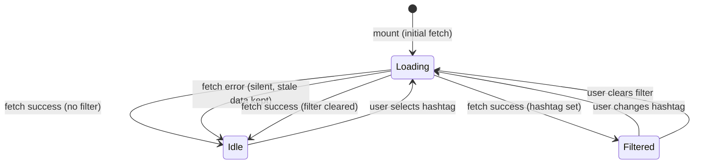

# Feature Specification: F036_HashtagFilter

**Priority**: P2
**Type**: ui
**Generated**: 2026-06-01

## Overview

F036 provides a hashtag filter dropdown in the HighlightSection header row (SCR007_KudosPage/REG001_HighlightSection). Options are populated on mount from `GET /hashtags`. Selecting a hashtag rewrites the query string and refetches `GET /kudos/highlight?hashtag=<name>`, replacing the carousel content. Selecting "All" (or clicking a selected option) sets the filter to null and resets to unfiltered results. A spinner loading state covers the carousel during each refetch.

## Why This Exists

Users want to browse peer recognition by theme (e.g., "Aim High", "Cống hiến") rather than sifting an unfiltered carousel. Hashtag filtering gives each employee a focused view of top-liked kudos related to their interests or team culture pillars.

## Who Uses It

- **Authenticated employee** — selects a hashtag to narrow the highlight carousel to kudos tagged with that theme (PERM001_BackendJwtRouteGuard)

## Business Workflow

```
1. HighlightSection mounts → calls GET /hashtags (no JWT required) and
   GET /kudos/highlight (JWT required) in parallel useEffect hooks.
2. HashtagsService.findAll() merges DB rows with CANONICAL_HASHTAGS list
   (13 fixed entries) and returns sorted Hashtag[]{id, name} array.
3. Frontend maps Hashtag[] to string[] of names, stores in `hashtags` state
   (highlight-section.tsx:58).
4. User clicks FilterDropdown → setActiveHashtag(name) or null (highlight-section.tsx:123-125).
5. fetchHighlight() useCallback re-runs: builds URLSearchParams with
   activeHashtag → calls GET /kudos/highlight?hashtag=<name> with Bearer JWT.
6. KudosService.findHighlight(hashtag, department, userEmail) → innerJoin
   kudos_hashtag + hashtag tables, WHERE hashtag.name = :ht, ORDER BY
   likeCount DESC LIMIT 5 → returns KudosCardDto[].
7. setKudos(data) updates carousel; loading spinner removed.
```

## Screen Flow

**See:** ScreenFlow § F036_HashtagFilter

| Screen | Route | Purpose |
|--------|-------|---------|
| SCR007_KudosPage/REG001_HighlightSection | `/kudos` | Highlight carousel with hashtag filter dropdown |

## Cross-Cutting Logic

### Requirements

| Code | Description | Endpoint/Handler | Verifiable |
|------|-------------|------------------|------------|
| FR-001 | GET /hashtags populates filter options on mount | `GET /hashtags` via `HashtagsController::findAll` | yes |
| FR-002 | GET /kudos/highlight?hashtag refetches carousel on selection change | `GET /kudos/highlight` via `KudosController::findHighlight` | yes |

### Business Rules

None.

### State Machines

None.

### Algorithms

None.

### External Integrations

None.

### Verification

- **SC-001** — Dropdown lists all hashtag names returned by GET /hashtags; count matches DB rows + canonical list (covers FR-001)
- **SC-002** — Selecting a hashtag shows only kudos whose `hashtags[]` array contains that name; selecting "All" restores full carousel (covers FR-002)

## User Stories

### US015_FilterHighlightByHashtag — Filter Highlight Feed by Hashtag (Priority: P2)

**What happens:** An authenticated employee on `/kudos` sees the HighlightSection header row. A `FilterDropdown` labeled with the hashtag-filter i18n key is pre-populated with hashtag names. On selection, `activeHashtag` state changes, triggering `fetchHighlight()` via `useCallback` + `useEffect`; the carousel shows a spinner then renders the filtered result (top 5 by `likeCount`). Clicking the active option (or "✕ Clear filter") resets to null.
**Why this priority:** Secondary discovery UX — helps employees explore recognition by theme. P2 because the unfiltered view remains functional without it.
**Independent Test:** On `/kudos`, open the hashtag dropdown, select "Aim High", verify carousel only shows kudos with `hashtags` containing "Aim High". Then click the active option to reset; verify unfiltered carousel returns.

**Acceptance Scenarios:**

1. **Given** the user is on `/kudos` and hashtags have loaded, **When** they select "Aim High" from the dropdown, **Then** the carousel spinner appears, then renders only kudos tagged "Aim High" ordered by likeCount DESC (max 5).
2. **Given** a hashtag filter is active, **When** the user clicks the active option or "✕ Clear filter", **Then** `activeHashtag` is set to null, `GET /kudos/highlight` is called without `hashtag` param, and the unfiltered carousel is restored.
3. **Given** a hashtag has no matching highlighted kudos, **When** selected, **Then** the carousel renders empty (no cards shown, no error).

**Requirements fulfilled:**
- **FR-001** Hashtag options populated from GET /hashtags on mount — `GET /hashtags` via `HashtagsController::findAll`
- **FR-002** Selecting a hashtag refetches highlight feed with filter — `GET /kudos/highlight?hashtag=<name>` via `KudosController::findHighlight`

**Rules enforced:**

### BR-001_HashtagFilterJoinGuard
**Source:** `backend/src/kudos/kudos.service.ts:226-231`
**Linked FR:** FR-002
**Applies to:** `GET /kudos/highlight?hashtag=<name>`
**Rule:** When a `hashtag` query param is present, the query builder applies an `INNER JOIN` on `kudos_hashtag` and `hashtag` tables, filtering by `hashtag.name = :ht`. Only kudos with at least one matching hashtag row are returned. If the hashtag name matches no DB rows, the result set is empty (HTTP 200 with `[]`), not an error.

**Pseudocode:**
```ts
if (hashtag) {
  qb = qb
    .innerJoin('k.hashtags', 'kh_filter')
    .innerJoin('kh_filter.hashtag', 'ht_filter')
    .andWhere('ht_filter.name = :ht', { ht: hashtag });
}
// Then: ORDER BY k.likeCount DESC, LIMIT 5
```

### BR-002_CanonicalHashtagMerge
**Source:** `backend/src/hashtags/hashtags.service.ts:6-37`
**Linked FR:** FR-001
**Applies to:** `GET /hashtags`
**Rule:** `HashtagsService.findAll()` merges DB-persisted hashtags with a hardcoded `CANONICAL_HASHTAGS` array of 13 Vietnamese/English values. Canonical tags not yet in DB are injected with synthetic negative IDs (e.g., `id: -(idx+1)`). The merged list is sorted by `name.localeCompare`. This ensures the dropdown always shows canonical tags even before any kudos are created.

**Pseudocode:**
```ts
const fromDb = await repo.find();
const byName = new Map(fromDb.map(t => [t.name, t]));
CANONICAL_HASHTAGS.forEach((name, idx) => {
  if (!byName.has(name)) byName.set(name, { id: -(idx+1), name });
});
return Array.from(byName.values()).sort((a, b) => a.name.localeCompare(b.name));
```

### BR-003_FilterFallbackSilent
**Source:** `frontend/components/kudos/highlight-section.tsx:37-49`
**Linked FR:** FR-002
**Applies to:** `fetchHighlight` on filter change
**Rule:** If the refetch call throws (network error or non-2xx), the error is swallowed silently; stale carousel data is retained and the spinner is removed. No error toast or message is displayed.

**Pseudocode:**
```ts
const fetchHighlight = useCallback(async () => {
  try {
    const params = new URLSearchParams();
    if (activeHashtag) params.set('hashtag', activeHashtag);
    if (activeDept) params.set('department', activeDept);
    const data = await apiFetch(`/kudos/highlight?${params}`);
    setKudos(data);
  } catch { /* silent — keep stale data */ }
  finally { setLoading(false); }
}, [activeHashtag, activeDept]);
```

**State transitions:**

### SM-001_HashtagFilterState
**Source:** `frontend/components/kudos/highlight-section.tsx:20-49`
**Linked FR:** FR-001, FR-002
**States:** Idle, Loading, Filtered, Error(silent)



**Transition rules:**
- `* → Loading`: triggered by `setActiveHashtag()` → `useEffect([fetchHighlight])` re-runs
- `Loading → Filtered`: `setKudos(data)` called with non-empty result; `activeHashtag !== null`
- `Loading → Idle`: either filter cleared (activeHashtag = null) or fetch error (stale data retained)
- `Filtered → Loading`: `setActiveHashtag(newValue)` — guard = value changed

**Verification:**
- **SC-001** — GET /hashtags response contains all CANONICAL_HASHTAGS names; dropdown renders them (covers FR-001, BR-002)
- **SC-002** — After selecting a hashtag, GET /kudos/highlight?hashtag=X is called; carousel cards all contain that hashtag in their `hashtags[]` field (covers FR-002, BR-001)
- **SC-003** — Selecting the same option again or clicking "Clear filter" removes `hashtag` param from next request (covers SM-001)

---

### Edge Cases

| Scenario | Behavior |
|----------|----------|
| Hashtag name exists in canonical list but no kudos tagged with it | HTTP 200 `[]`; carousel renders empty (no cards, no error message) |
| GET /hashtags fails on mount | `catch` swallows error; `hashtags` state stays `[]`; dropdown renders with zero options (only label shown); `GET /kudos/highlight` still fires unfiltered |
| GET /kudos/highlight fails after filter selection | `catch` swallows error; stale previous kudos remain; loading spinner removed; no user feedback |
| Hashtag param contains special chars (e.g. "&", Vietnamese diacritics) | `URLSearchParams.set()` URL-encodes the value; backend receives decoded string via NestJS `@Query('hashtag')` |
| Both hashtag and department filters active simultaneously | Both params appended: `?hashtag=X&department=Y`; `KudosService.findHighlight` applies both WHERE clauses (BR-001 + kudos.service.ts:233-235) |

## Key Entities

| Entity | Table | Key Columns | Purpose |
|--------|-------|-------------|---------|
| Kudos | `kudos` | `id`, `likeCount`, `receiverEmail` | Queried for top-5 by likeCount; filtered via join |
| Hashtag | `hashtag` | `id`, `name` (UNIQUE) | Source of filter options; joined to filter kudos |
| KudosHashtag | `kudos_hashtag` | `kudosId`, `hashtagId` (composite PK) | M2M join enabling the INNER JOIN filter |
| User | `user` | `email`, `department` | Joined as `sender`/`receiver` on kudos query |

## Related Artifacts

- **Screens**: SCR007_KudosPage/REG001_HighlightSection
- **User Stories**: US015_FilterHighlightByHashtag
- **Routes**: GET /kudos/highlight, GET /hashtags
- **Data Models**: MODEL004 (Hashtag)
- **Background Logic**: _(none)_
- **Permissions**: PERM001_BackendJwtRouteGuard

## Spec Documents

- [x] [System Overview](../../system-overview.md)
- [x] [Feature List](../../feature-list.md) — F036_HashtagFilter
- [x] [User Stories](../../user-stories.md) — US015_FilterHighlightByHashtag
- [x] [Route List](../../route-list.md) — GET /kudos/highlight, GET /hashtags
- [x] [Data Model](../../data-model.md) — MODEL004
- [x] [Screen List](../../screen-list.md) — SCR007_KudosPage/REG001_HighlightSection
- [ ] [Screen Flow](../../screen-flow.md)
- [ ] [Background Logic](../../background-logic.md)
- [x] [Permissions](../../permissions.md) — PERM001_BackendJwtRouteGuard

## Assumptions

- Hashtag name matching is exact and case-sensitive — the backend uses `WHERE hashtag.name = :ht` with no ILIKE or normalization. If the canonical name has Vietnamese diacritics, the frontend must pass the exact string.
- The `GET /hashtags` endpoint has no JWT guard (confirmed: `HashtagsController` has no `@UseGuards`). Dropdown population will succeed even if the JWT expires before mount, but the subsequent `GET /kudos/highlight` call will fail with 401.
- Canonical hashtags with synthetic negative IDs (`id: -(idx+1)`) will not match any `kudos_hashtag.hashtagId` row until a kudos uses that tag; filtering by them returns empty results without error.
- The `loading` state spinner covers the entire carousel region, not individual cards. There is no per-card skeleton.

## Source Code References

| Symbol | Path | Purpose |
|--------|------|---------|
| `KudosController::findHighlight` | `backend/src/kudos/kudos.controller.ts:47-55` | Handler for GET /kudos/highlight; passes hashtag + department query params to service |
| `KudosService::findHighlight` | `backend/src/kudos/kudos.service.ts:214-249` | Builds TypeORM query with optional hashtag INNER JOIN; ORDER BY likeCount DESC LIMIT 5 |
| `HashtagsController::findAll` | `backend/src/hashtags/hashtags.controller.ts:8-11` | Handler for GET /hashtags; no auth guard |
| `HashtagsService::findAll` | `backend/src/hashtags/hashtags.service.ts:26-38` | Merges DB + CANONICAL_HASHTAGS; returns sorted list |
| `HighlightSection` | `frontend/components/kudos/highlight-section.tsx:15-145` | Client component; manages activeHashtag state, calls fetchHighlight on change |
| `FilterDropdown` | `frontend/components/kudos/filter-dropdown.tsx:32-103` | Dropdown UI; supports prefix ("#"), clear-on-reclick, outside-click close |
| `Hashtag` entity | `backend/src/database/entities/hashtag.entity.ts:1-10` | `@Entity('hashtag')` with `id` PK, `name` UNIQUE column |

## Unresolved Questions

1. **Empty-result UX**: When the filtered carousel returns `[]`, `HighlightCarousel` receives an empty array. The spec assumes it renders gracefully with no cards, but the `HighlightCarousel` component wasn't read — confirm it handles an empty `items` prop without crash or layout break.
2. **Error feedback**: The silent error swallow (BR-003) means users get no indication when the filter fetch fails. Is this intentional product behavior or a known gap?
