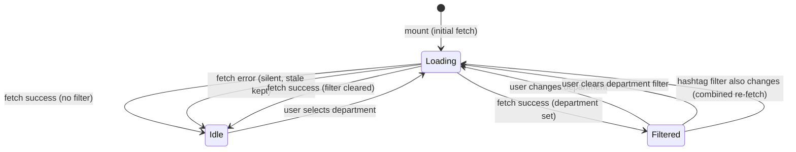

# Feature Specification: F037_DepartmentFilter

**Priority**: P2
**Type**: ui
**Generated**: 2026-06-01

## Overview

F037 provides a department filter dropdown in the HighlightSection header row (SCR007_KudosPage/REG001_HighlightSection). Options are populated on mount from `GET /departments`. Selecting a department rewrites `activeDept` state and refetches `GET /kudos/highlight?department=<name>`, replacing the carousel content. The filter is independent of the hashtag filter (F036) — both can be active simultaneously, producing a combined `?hashtag=X&department=Y` query. A spinner loading state covers the carousel during each refetch.

## Why This Exists

Employees want to see top kudos within a specific business unit (e.g., "CEVC1", "STVC - R&D"). Department filtering lets teams see how peers are recognized within their own unit, supporting team-level culture visibility beyond the global feed.

## Who Uses It

- **Authenticated employee** — selects a department to narrow the highlight carousel to kudos whose receiver belongs to that department (PERM001_BackendJwtRouteGuard)

## Business Workflow

```
1. HighlightSection mounts → calls GET /departments (no JWT required) in
   parallel with GET /hashtags and GET /kudos/highlight (highlight-section.tsx:52-62).
2. DepartmentsService.findAll() queries DISTINCT user.department from `user`
   table, merges with CANONICAL_DEPARTMENTS (50 entries), sorts alphabetically,
   returns string[] (departments.service.ts:63-74).
3. Frontend stores string[] in `departments` state (highlight-section.tsx:59).
4. User clicks FilterDropdown (no prefix) → setActiveDept(name) or null
   (highlight-section.tsx:129-132).
5. fetchHighlight() useCallback re-runs: appends `department` param to
   URLSearchParams → calls GET /kudos/highlight?department=<name> with Bearer JWT.
6. KudosService.findHighlight(hashtag, department, userEmail) → WHERE
   receiver.department = :dept, ORDER BY likeCount DESC LIMIT 5.
7. setKudos(data) updates carousel; loading spinner removed.
```

## Screen Flow

**See:** ScreenFlow § F037_DepartmentFilter

| Screen | Route | Purpose |
|--------|-------|---------|
| SCR007_KudosPage/REG001_HighlightSection | `/kudos` | Highlight carousel with department filter dropdown |

## Cross-Cutting Logic

### Requirements

| Code | Description | Endpoint/Handler | Verifiable |
|------|-------------|------------------|------------|
| FR-001 | GET /departments populates filter options on mount | `GET /departments` via `DepartmentsController::findAll` | yes |
| FR-002 | Selecting a department refetches highlight feed filtered by receiver department | `GET /kudos/highlight?department=<name>` via `KudosController::findHighlight` | yes |
| FR-003 | Hashtag and department filters are independent and combinable | `GET /kudos/highlight?hashtag=X&department=Y` via `KudosController::findHighlight` | yes |

### Business Rules

None.

### State Machines

None.

### Algorithms

None.

### External Integrations

None.

### Verification

- **SC-001** — Dropdown lists all department names returned by GET /departments; at least the CANONICAL_DEPARTMENTS entries are present (covers FR-001)
- **SC-002** — Selecting a department shows only kudos whose `receiver.department` equals that value; carousel is empty when no kudos match (covers FR-002)
- **SC-003** — With both hashtag and department filters active, the request URL contains both `hashtag` and `department` params; only kudos matching both constraints appear (covers FR-003)

## User Stories

### US016_FilterHighlightByDepartment — Filter Highlight Feed by Department (Priority: P2)

**What happens:** An authenticated employee on `/kudos` sees a second `FilterDropdown` (no `#` prefix) in the HighlightSection header row. On mount, `GET /departments` is fetched and options loaded. Selecting a department sets `activeDept`, triggering `fetchHighlight()`. The backend filters kudos by `receiver.department = :dept`. Hashtag and department filters compose additively — both are appended to the same request when active.
**Why this priority:** Secondary discovery UX. Department visibility supports team-level culture metrics. P2 because the unfiltered view remains useful without it.
**Independent Test:** On `/kudos`, open the department dropdown, select "CEVC1". Verify the carousel only shows kudos where the receiver's department is "CEVC1". Then also activate a hashtag filter; verify the URL has both params and results satisfy both constraints.

**Acceptance Scenarios:**

1. **Given** the user is on `/kudos` and departments have loaded, **When** they select "CEVC1" from the dropdown, **Then** the carousel shows only kudos where `receiver.department === 'CEVC1'`, ordered by likeCount DESC (max 5).
2. **Given** a hashtag filter ("Aim High") is already active, **When** the user also selects department "CEVC1", **Then** `GET /kudos/highlight?hashtag=Aim+High&department=CEVC1` is called; only kudos satisfying both constraints are shown.
3. **Given** a department filter is active, **When** the user clicks the active option or "✕ Clear filter", **Then** `activeDept` resets to null; `GET /kudos/highlight` is called without `department` param.

**Requirements fulfilled:**
- **FR-001** Department options populated from GET /departments on mount — `GET /departments` via `DepartmentsController::findAll`
- **FR-002** Selecting a department refetches highlight feed with department filter — `GET /kudos/highlight?department=<name>` via `KudosController::findHighlight`
- **FR-003** Both filters compose independently in the same request — `GET /kudos/highlight?hashtag=X&department=Y` via `KudosController::findHighlight`

**Rules enforced:**

### BR-001_DepartmentFilterWhereClause
**Source:** `backend/src/kudos/kudos.service.ts:233-235`
**Linked FR:** FR-002
**Applies to:** `GET /kudos/highlight?department=<name>`
**Rule:** When `department` is provided, the query appends `WHERE receiver.department = :dept` on the joined `user` entity (aliased `receiver`). Matching is exact and case-sensitive. If the value matches no user record, result set is empty (HTTP 200 `[]`).

**Pseudocode:**
```ts
if (department) {
  qb = qb.andWhere('receiver.department = :dept', { dept: department });
}
// Combined with optional hashtag JOIN and ORDER BY likeCount DESC, LIMIT 5
```

### BR-002_CanonicalDepartmentMerge
**Source:** `backend/src/departments/departments.service.ts:6-74`
**Linked FR:** FR-001
**Applies to:** `GET /departments`
**Rule:** `DepartmentsService.findAll()` queries `DISTINCT user.department` (non-null, non-empty) then merges with `CANONICAL_DEPARTMENTS` (50 hardcoded strings). Uses `Set` deduplication, then `localeCompare` sort. Returns `string[]` — not objects with IDs.

**Pseudocode:**
```ts
const fromDb = await userRepo
  .createQueryBuilder('u')
  .select('DISTINCT u.department', 'department')
  .where('u.department IS NOT NULL')
  .andWhere("u.department != ''")
  .getRawMany();
const merged = Array.from(new Set([...CANONICAL_DEPARTMENTS, ...fromDb.map(r => r.department)]));
merged.sort((a, b) => a.localeCompare(b));
return merged;
```

### BR-003_DepartmentFilterSilentError
**Source:** `frontend/components/kudos/highlight-section.tsx:37-49`
**Linked FR:** FR-002
**Applies to:** `fetchHighlight` on department change
**Rule:** Network or API errors during refetch are caught and swallowed silently. Stale carousel data is retained; the spinner is dismissed. No error feedback is shown to the user. (Same pattern as F036 BR-003.)

**Pseudocode:**
```ts
try {
  const data = await apiFetch(`/kudos/highlight?${params}`);
  setKudos(data);
} catch { /* silent — keep stale data */ }
finally { setLoading(false); }
```

**State transitions:**

### SM-001_DepartmentFilterState
**Source:** `frontend/components/kudos/highlight-section.tsx:20-49`
**Linked FR:** FR-001, FR-002, FR-003
**States:** Idle, Loading, Filtered, Error(silent)



**Transition rules:**
- `* → Loading`: `setActiveDept()` triggers `fetchHighlight` useCallback re-run via `useEffect([fetchHighlight])`
- `Loading → Filtered`: `setKudos(data)` with `activeDept !== null`
- `Loading → Idle`: filter cleared or fetch error
- `Filtered → Loading`: either `activeDept` or `activeHashtag` changes — both are in the `fetchHighlight` dependency array

**Verification:**
- **SC-001** — GET /departments response includes canonical department names; dropdown renders them (covers FR-001, BR-002)
- **SC-002** — After selecting a department, GET /kudos/highlight?department=X called; all carousel cards show receiver from that department (covers FR-002, BR-001)
- **SC-003** — With both filters active, single request uses both params; results match intersection (covers FR-003)
- **SC-004** — On fetch error, carousel retains previous content and spinner is removed without error toast (covers BR-003)

---

### Edge Cases

| Scenario | Behavior |
|----------|----------|
| Department name exists in canonical list but no user with that department | `WHERE receiver.department = :dept` matches no rows; HTTP 200 `[]`; carousel renders empty |
| GET /departments fails on mount | Error swallowed (highlight-section.tsx:60); `departments` stays `[]`; dropdown renders with zero options; highlight fetch still fires unfiltered |
| Department name contains special characters (e.g. " - ", "&") | `URLSearchParams.set()` URL-encodes; backend `@Query('department')` receives decoded value; exact-match still applies |
| Both hashtag and department filters active; no kudos match intersection | HTTP 200 `[]`; empty carousel; no error |
| User rapidly switches departments | Each `setActiveDept` call triggers a new `fetchHighlight`; no debounce — multiple in-flight requests possible; last `setKudos` call wins (no request cancellation implemented) |

## Key Entities

| Entity | Table | Key Columns | Purpose |
|--------|-------|-------------|---------|
| Kudos | `kudos` | `id`, `likeCount`, `receiverEmail` | Queried for top-5 by likeCount; filtered via receiver join |
| User | `user` | `email`, `department` | Joined as `receiver`; `department` column is the filter target |
| Hashtag | `hashtag` | `id`, `name` | Used when combined with hashtag filter (BR-001 composes with F036 BR-001) |
| KudosHashtag | `kudos_hashtag` | `kudosId`, `hashtagId` | Join table for hashtag filter composition |

## Related Artifacts

- **Screens**: SCR007_KudosPage/REG001_HighlightSection
- **User Stories**: US016_FilterHighlightByDepartment
- **Routes**: GET /kudos/highlight, GET /departments
- **Data Models**: _(none — Department is derived from User.department string column, not a separate model)_
- **Background Logic**: _(none)_
- **Permissions**: PERM001_BackendJwtRouteGuard

## Spec Documents

- [x] [System Overview](../../system-overview.md)
- [x] [Feature List](../../feature-list.md) — F037_DepartmentFilter
- [x] [User Stories](../../user-stories.md) — US016_FilterHighlightByDepartment
- [x] [Route List](../../route-list.md) — GET /kudos/highlight, GET /departments
- [ ] [Data Model](../../data-model.md)
- [x] [Screen List](../../screen-list.md) — SCR007_KudosPage/REG001_HighlightSection
- [ ] [Screen Flow](../../screen-flow.md)
- [ ] [Background Logic](../../background-logic.md)
- [x] [Permissions](../../permissions.md) — PERM001_BackendJwtRouteGuard

## Assumptions

- `user.department` is stored as a free-text string, not a FK to a departments table. No DB-level uniqueness constraint exists on department values. The canonical list is app-level only.
- `GET /departments` has no JWT guard (confirmed: `DepartmentsController` has no `@UseGuards`). Department list loads even if JWT expires, but the subsequent `GET /kudos/highlight` call will fail 401.
- Department matching is exact and case-sensitive — no ILIKE normalization. A department name from the dropdown will always match exactly if sourced from the same DB column.
- No request cancellation (AbortController) is implemented in `fetchHighlight`. Rapid filter changes can produce concurrent in-flight requests; last `setKudos` wins, which may not correspond to the most recently dispatched request.

## Source Code References

| Symbol | Path | Purpose |
|--------|------|---------|
| `KudosController::findHighlight` | `backend/src/kudos/kudos.controller.ts:47-55` | Handler; passes `department` query param to `KudosService.findHighlight` |
| `KudosService::findHighlight` | `backend/src/kudos/kudos.service.ts:214-249` | Applies `WHERE receiver.department = :dept` when param present; composes with hashtag JOIN |
| `DepartmentsController::findAll` | `backend/src/departments/departments.controller.ts:8-11` | Handler for GET /departments; no auth guard |
| `DepartmentsService::findAll` | `backend/src/departments/departments.service.ts:60-74` | Merges DB DISTINCT departments with CANONICAL_DEPARTMENTS; sorted string[] |
| `HighlightSection` | `frontend/components/kudos/highlight-section.tsx:15-145` | Manages `activeDept` state; passes to `FilterDropdown` and `fetchHighlight` |
| `FilterDropdown` | `frontend/components/kudos/filter-dropdown.tsx:32-103` | Shared dropdown UI; no prefix for department; clear-on-reclick behavior |

## Unresolved Questions

1. **Race condition on rapid selection**: No `AbortController` or debounce is present in `fetchHighlight`. If a user selects departments in quick succession, multiple concurrent requests can resolve out of order. Is stale-data risk acceptable at current load?
2. **Department not in canonical list**: If a user's `user.department` value is not in `CANONICAL_DEPARTMENTS` and was added via direct DB insert, it appears in the dropdown (merged via `Set`). Is there a curation/moderation step intended for new department values?
