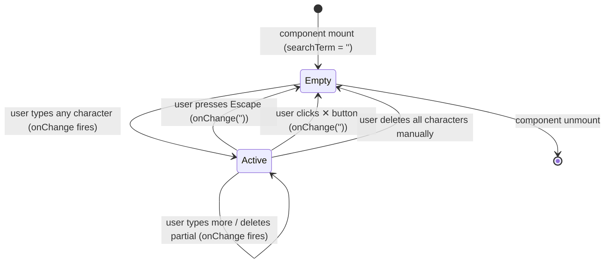

# Feature Specification: F038_SpotlightNameSearch

**Priority**: P2
**Type**: ui
**Generated**: 2026-06-01

## Overview

F038 provides a client-side name search input rendered inside the SpotlightWordCloud board (SCR007_KudosPage/REG002_SpotlightSection). The `SpotlightSearch` component accepts free-text input; the word cloud SVG filters the already-loaded `SpotlightWord[]` array by matching the trimmed, lowercase query against each word's `text` field. No API call is made — the feature operates entirely on data already resident in component state. Matching names are rendered at full opacity with an orange highlight color (`#FF7A59`); non-matching names fade to 8% opacity. Clearing the input (Escape key or ✕ button) restores the full unfiltered cloud.

## Why This Exists

The spotlight word cloud can contain dozens of names at small font sizes. A search input lets employees quickly locate a specific colleague by name without panning/zooming the cloud manually, reducing friction before initiating a "Gửi KUDO" action.

## Who Uses It

- **Authenticated employee** — types a name substring to highlight and locate a colleague in the word cloud (no permission guard — client-side only; data already loaded)

## Business Workflow

```
1. SpotlightSection mounts → fetches GET /kudos/spotlight → stores SpotlightWord[]
   in `words` state (spotlight-section.tsx:17-26).
2. SpotlightSection passes `searchTerm` state and `onSearchChange` setter to
   SpotlightWordCloud (spotlight-section.tsx:57-63).
3. SpotlightWordCloud renders SpotlightSearch input in a fixed overlay strip
   at top-left of the SVG board (spotlight-word-cloud.tsx:277-279).
4. User types → SpotlightSearch calls `onChange(e.target.value)` →
   `onSearchChange` updates `searchTerm` in SpotlightSection state.
5. SpotlightWordCloud computes `lowerSearch = searchTerm.trim().toLowerCase()`
   (spotlight-word-cloud.tsx:235).
6. For each laid word datum, `matches = !lowerSearch || w.text.toLowerCase().includes(lowerSearch)`;
   opacity set to 1 (match) or 0.08 (no match); fill set to HIGHLIGHT_COLOR (#FF7A59)
   when `isHighlight = !!lowerSearch && matches` (spotlight-word-cloud.tsx:304-306).
7. User clears input via Escape key or ✕ button → onChange('') → lowerSearch = '' →
   all words render at full opacity with their default cycling colors.
```

## Screen Flow

**See:** ScreenFlow § F038_SpotlightNameSearch

| Screen | Route | Purpose |
|--------|-------|---------|
| SCR007_KudosPage/REG002_SpotlightSection | `/kudos` | Spotlight word cloud with search input overlay |

## Cross-Cutting Logic

### Requirements

| Code | Description | Endpoint/Handler | Verifiable |
|------|-------------|------------------|------------|
| FR-001 | Search input filters word cloud client-side without API call | client-only — no endpoint | yes |
| FR-002 | Clearing input restores full word cloud at default appearance | client-only — no endpoint | yes |

### Business Rules

None.

### State Machines

None.

### Algorithms

None.

### External Integrations

None.

### Verification

- **SC-001** — Typing a name substring causes non-matching words to fade to near-invisible; matching words highlighted orange; no network request fired (covers FR-001)
- **SC-002** — Pressing Escape or clicking ✕ resets all words to full opacity and cycling colors (covers FR-002)

## User Stories

### US018_SearchRecipientInSpotlight — Search Recipient in Spotlight Word Cloud (Priority: P2)

**What happens:** An authenticated employee on `/kudos` sees the spotlight word cloud with a `SpotlightSearch` input pinned to the top-left of the board. Typing any substring of a colleague's name immediately (no debounce) filters the SVG: matching name instances highlight in orange (`#FF7A59`, font-weight 700) and stay at opacity 1; all other names fade to opacity 0.08. The `searchTerm` state lives in `SpotlightSection`; the filter logic (`lowerSearch` + `includes`) runs synchronously in `SpotlightWordCloud`'s render via the `laid` memo array. No fetch is triggered. Pressing Escape or clicking ✕ clears the input.
**Why this priority:** Quality-of-life navigation aid for a dense visual. P2 — the word cloud is fully functional without search; this accelerates name lookup.
**Independent Test:** Load `/kudos`; wait for word cloud to appear. Type a partial name visible in the cloud. Verify non-matching words fade out and the typed name is rendered orange. Open DevTools Network tab and confirm no new XHR/fetch request is fired. Press Escape; verify full cloud restores.

**Acceptance Scenarios:**

1. **Given** the spotlight word cloud is loaded with ≥2 distinct names, **When** the user types a substring matching exactly one name, **Then** that name's instances render at opacity 1 with orange fill (`#FF7A59`, bold), and all other names render at opacity 0.08.
2. **Given** a search term is active, **When** the user presses Escape, **Then** the input clears (`onChange('')`), `lowerSearch` becomes `''`, and all words restore full opacity with their default cycling colors (COLORS array).
3. **Given** a search term is active, **When** the user clicks the ✕ button inside `SpotlightSearch`, **Then** same outcome as Escape: full cloud restored.
4. **Given** the search input has a value, **When** no word text includes that substring (case-insensitive), **Then** all words fade to opacity 0.08; the cloud appears nearly blank with no error message.

**Requirements fulfilled:**
- **FR-001** Client-side filter on loaded SpotlightWord[] data — no endpoint
- **FR-002** Escape key and ✕ button both call `onChange('')` — no endpoint

**Rules enforced:**

### BR-001_ClientSideSubstringMatch
**Source:** `frontend/components/kudos/spotlight-word-cloud.tsx:235,304-306`
**Linked FR:** FR-001
**Applies to:** Word rendering loop in `SpotlightWordCloud`
**Rule:** Filter is a case-insensitive substring match: `lowerSearch = searchTerm.trim().toLowerCase()`; each word evaluated as `w.text.toLowerCase().includes(lowerSearch)`. When `lowerSearch` is empty string, `!lowerSearch` is `true` → all words match (no filtering). The search does not match on `email` or `count` — name text only.

**Pseudocode:**
```ts
const lowerSearch = searchTerm.trim().toLowerCase();
// Per word datum w:
const matches = !lowerSearch || w.text.toLowerCase().includes(lowerSearch);
const isHighlight = !!lowerSearch && matches;
const fill = isHighlight ? HIGHLIGHT_COLOR : COLORS[i % COLORS.length];
// SVG <g> style:
opacity: matches ? 1 : 0.08
```

### BR-002_EscapeKeyClear
**Source:** `frontend/components/kudos/spotlight-search.tsx:29-31`
**Linked FR:** FR-002
**Applies to:** `SpotlightSearch` input keydown handler
**Rule:** Pressing Escape while the search input is focused calls `onChange('')`, which bubbles to `SpotlightSection.setSearchTerm('')`. This is the only keyboard shortcut handled. Tab, Enter, and other keys have no special behavior.

**Pseudocode:**
```ts
onKeyDown={(e) => {
  if (e.key === 'Escape') onChange('');
}}
```

### BR-003_SearchMaxLength
**Source:** `frontend/components/kudos/spotlight-search.tsx:33`
**Linked FR:** FR-001
**Applies to:** `SpotlightSearch` input
**Rule:** `maxLength={100}` is set on the input element. Input beyond 100 characters is silently truncated by the browser. No validation error is shown; the filter still applies on the truncated value.

**State transitions:**

### SM-001_SearchTermLifecycle
**Source:** `frontend/components/kudos/spotlight-section.tsx:13,57-63` and `spotlight-word-cloud.tsx:235`
**Linked FR:** FR-001, FR-002
**States:** Empty, Active



**Transition rules:**
- `Empty → Active`: any `input.onChange` call with non-empty string; guard = `value.trim() !== ''` determines whether filter is visually applied
- `Active → Empty`: `onChange('')` from Escape or ✕; or user backspaces to empty string
- Visual filter activates when `lowerSearch !== ''` — i.e., `searchTerm.trim()` must be non-empty

**Algorithms:**

### ALG-001_WordCloudScatterLayout
**Source:** `frontend/components/kudos/spotlight-word-cloud.tsx:101-182`
**Linked FR:** FR-001
**Input:** `SpotlightWord[]` — array of `{name, email, count}` from GET /kudos/spotlight
**Output:** `WordDatum[]` — each word with computed `{x, y, size, driftSeed}` for SVG placement
**Complexity:** O(N log N) approximate — grid construction + Fisher-Yates shuffle twice
**Description:** Grid-fitted scatter ensures no two names overlap. Words are repeated up to `MAX_INSTANCES_PER_NAME=8` times (capped: `max(3, min(8, ceil(count/2)))`). A seeded PRNG (`mulberry32(SCATTER_SEED=20260529)`) makes positions deterministic. Cells tile the `WIDTH×HEIGHT` board minus `TOP_RESERVE=56` and `BOTTOM_RESERVE=100` pixel strips. Each word's jitter is bounded so it never exits its cell. The search filter does NOT re-run this layout — it only controls opacity/fill via the `lowerSearch` variable, keeping layout stable.

**Pseudocode:**
```ts
// 1. Build instance list; Fisher-Yates shuffle
// 2. Compute cols×rows from minCellW/minCellH constraints
// 3. Shuffle cellOrder (full permutation)
// 4. Assign each slot to a cell; add bounded jitter
// 5. Return WordDatum[] with x, y, driftSeed
// Note: runs once on `words` change via useMemo — search does not re-trigger
```

**Verification:**
- **SC-001** — No fetch fires when typing into search input (Network tab clean) (covers FR-001, BR-001)
- **SC-002** — Matching words rendered with fill `#FF7A59` and font-weight 700; non-matching at opacity 0.08 (covers BR-001)
- **SC-003** — Escape key clears input and restores full cloud (covers FR-002, BR-002, SM-001)
- **SC-004** — Input accepts up to 100 characters; 101st character is rejected by browser (covers BR-003)

---

### Edge Cases

| Scenario | Behavior |
|----------|----------|
| Search term matches zero words | All words fade to opacity 0.08; board appears nearly blank; no error state or empty message |
| Word cloud is empty (`words = []`) | `SpotlightSection` renders `<p>{t.kudosEmptyLeaderboard}</p>` instead of `SpotlightWordCloud`; search input never mounts (spotlight-section.tsx:52-54) |
| Search term is only whitespace (e.g. "   ") | `lowerSearch = searchTerm.trim().toLowerCase()` = `''`; filter inactive; full cloud shown |
| Multiple instances of same person's name | All instances of a matching name highlight orange; all instances of non-matching names fade — per-instance logic (spotlight-word-cloud.tsx:303-308) |
| User types while cloud is in fullscreen mode | Search input is rendered inside the board div which is inside the fullscreen overlay; behavior identical — `searchTerm` state is hoisted to `SpotlightSection`, not the board |

## Key Entities

| Entity | Table | Key Columns | Purpose |
|--------|-------|-------------|---------|
| Kudos | `kudos` | `id`, `receiverEmail` | Source data for word cloud counts via `GET /kudos/spotlight` |
| User | `user` | `email`, `firstName`, `lastName` | Name concatenation used as `SpotlightWord.name` for filter matching |

## Related Artifacts

- **Screens**: SCR007_KudosPage/REG002_SpotlightSection
- **User Stories**: US018_SearchRecipientInSpotlight
- **Routes**: _(none — client-side filter; data from GET /kudos/spotlight already loaded)_
- **Data Models**: _(none)_
- **Background Logic**: _(none)_
- **Permissions**: _(none — no API call; frontend auth guard covers page access)_

## Spec Documents

- [x] [System Overview](../../system-overview.md)
- [x] [Feature List](../../feature-list.md) — F038_SpotlightNameSearch
- [x] [User Stories](../../user-stories.md) — US018_SearchRecipientInSpotlight
- [ ] [Route List](../../route-list.md)
- [ ] [Data Model](../../data-model.md)
- [x] [Screen List](../../screen-list.md) — SCR007_KudosPage/REG002_SpotlightSection
- [ ] [Screen Flow](../../screen-flow.md)
- [ ] [Background Logic](../../background-logic.md)
- [ ] [Permissions](../../permissions.md)

## Assumptions

- `SpotlightWord.name` is a full display name (concatenated `firstName + ' ' + lastName`). The filter matches against this single string — not against email or partial first/last name fields separately.
- There is no debounce on the search input — filtering is synchronous on every keystroke. With large word arrays (hundreds of names × `MAX_INSTANCES_PER_NAME=8` instances = potentially 800+ SVG elements), this may cause frame drops on low-end devices. No throttle is implemented.
- The `laid` memo (ALG-001) is keyed on `words` only — not on `searchTerm`. Layout positions never change when the user types; only opacity and fill change. This is correct behavior per the implementation.
- The `SpotlightSearch` component is pointer-events-enabled (`pointer-events-auto`) while the surrounding board overlay is `pointer-events-none`, preventing the search from capturing pan/zoom events on the SVG.

## Source Code References

| Symbol | Path | Purpose |
|--------|------|---------|
| `SpotlightSection` | `frontend/components/kudos/spotlight-section.tsx:9-66` | Owns `searchTerm` state; passes to `SpotlightWordCloud` |
| `SpotlightWordCloud` | `frontend/components/kudos/spotlight-word-cloud.tsx:72-454` | Renders SVG; applies `lowerSearch` filter to opacity/fill per word |
| `SpotlightSearch` | `frontend/components/kudos/spotlight-search.tsx:16-50` | Input component; Escape key handler; ✕ clear button; maxLength=100 |
| `lowerSearch` filter | `frontend/components/kudos/spotlight-word-cloud.tsx:235,304-306` | Substring match logic — trim + lowercase + includes |
| `KudosService::findSpotlight` | `backend/src/kudos/kudos.service.ts:251-276` | Backend source of `SpotlightWord[]` data; not invoked by this feature |

## Unresolved Questions

1. **Performance with large clouds**: No debounce or virtualization is implemented. If the `user` table has 200+ employees and each appears 3–8 times, the SVG can have 600–1600 `<g>` elements being re-evaluated on each keystroke. Performance impact on mobile/low-end devices is unconfirmed.
2. **Fullscreen interaction**: When `isFullscreen=true`, the board is rendered in a portal-like fixed overlay. Confirm that `searchTerm` state, hoisted to `SpotlightSection`, propagates correctly through the re-render when the fullscreen toggle fires.
