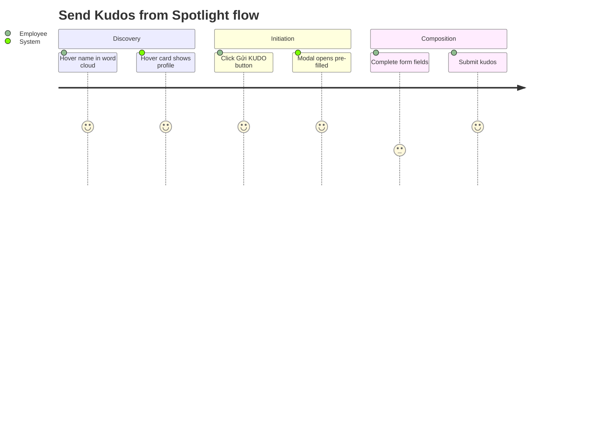
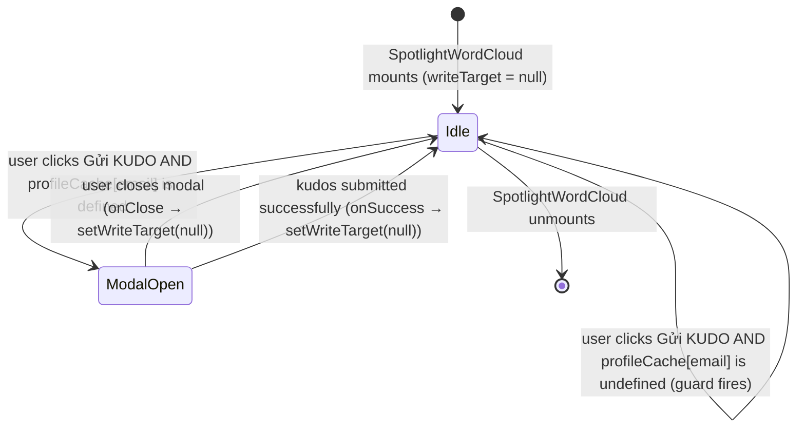

# Feature Specification: F039_SendKudosFromSpotlight

**Priority**: P2
**Type**: ui
**Generated**: 2026-06-01

## Overview

F039 enables the "Gửi KUDO" button on the spotlight hover card (`RecipientHoverCard`) to open `WriteKudosModal` with the hovered recipient pre-filled. When clicked, `onSendKudo` fires in `SpotlightWordCloud`, which dismisses the hover card, stores the `RecipientProfile` in `writeTarget` state, and renders `WriteKudosModal` with `initialRecipient` set to the profile's `{email, name, picture, department}`. The modal's `RecipientSearch` component pre-populates the recipient field via `useState(initialRecipient ?? null)`. Submission itself is handled by F005_SubmitKudos — this feature's scope ends when the modal opens with the correct recipient.

## Why This Exists

Users discovering colleagues through the spotlight word cloud need a zero-friction path to send recognition. Pre-filling the recipient removes the search step from the write-kudos flow, reducing the action to one click from discovery to composition.

## Who Uses It

- **Authenticated employee** — clicks "Gửi KUDO" on a hover card to open the write-kudos modal pre-filled with the spotlight recipient (implicitly guarded by frontend `AuthGuard` on `/kudos`; no backend permission invoked by this feature itself)

## Business Workflow

```
1. User hovers a name in SpotlightWordCloud → RecipientHoverCard renders with
   profile data from `profileCache[email]` (spotlight-word-cloud.tsx:411-426).
2. User clicks "Gửi KUDO" button (recipient-hover-card.tsx:88-96) →
   `onSendKudo()` callback fires.
3. SpotlightWordCloud.onSendKudo handler (spotlight-word-cloud.tsx:417-421):
   a. Reads `profileCache[hovered.email]` — the already-fetched RecipientProfile.
   b. Calls setHovered(null) — dismisses hover card.
   c. Calls setWriteTarget(p) — stores RecipientProfile in state.
4. Conditional render (spotlight-word-cloud.tsx:440-451): `writeTarget !== null`
   → renders <WriteKudosModal initialRecipient={{email, name, picture, department}}
     onClose={() => setWriteTarget(null)} onSuccess={() => setWriteTarget(null)} />.
5. WriteKudosModal mounts with `initialRecipient` prop → `useState(initialRecipient ?? null)`
   pre-populates `recipient` state (write-kudos-modal.tsx:36).
6. RecipientSearch renders with the pre-filled `value` showing the recipient chip
   (recipient-search.tsx:89-103). The ✕ clear button is present and functional —
   recipient CAN be changed or cleared by the user.
7. User completes form and submits → F005_SubmitKudos handles POST /kudos.
8. On success or modal close → setWriteTarget(null) → modal unmounts.
```

## Screen Flow

**See:** ScreenFlow § F039_SendKudosFromSpotlight

| Screen | Route | Purpose |
|--------|-------|---------|
| SCR007_KudosPage/REG002_SpotlightSection | `/kudos` | Spotlight word cloud; hover card entry point |



## Cross-Cutting Logic

### Requirements

| Code | Description | Endpoint/Handler | Verifiable |
|------|-------------|------------------|------------|
| FR-001 | Clicking "Gửi KUDO" on hover card opens WriteKudosModal with recipient pre-filled | client-only — no endpoint | yes |
| FR-002 | Modal mounts with `initialRecipient` from hover card profile data | client-only — no endpoint | yes |

### Business Rules

None.

### State Machines

None.

### Algorithms

None.

### External Integrations

None.

### Verification

- **SC-001** — Clicking "Gửi KUDO" dismisses the hover card and opens WriteKudosModal (covers FR-001)
- **SC-002** — Modal's recipient field shows the hovered person's name chip on open; no further search needed to submit (covers FR-002)

## User Stories

### US020_SendKudosFromSpotlightHoverCard — Send Kudos from Spotlight Hover Card (Priority: P2)

**What happens:** An authenticated employee with a hover card open (rendered by F019_SpotlightHoverCard) clicks "Gửi KUDO". `SpotlightWordCloud` reads the cached `RecipientProfile` for the hovered email, calls `setHovered(null)` and `setWriteTarget(profile)`. `WriteKudosModal` mounts with `initialRecipient = {email, name, picture, department}`. The `RecipientSearch` component renders the recipient as a pre-filled chip. The user can change or clear the recipient (the ✕ button remains active — no lock is implemented in code, contrary to the user story's "cannot be cleared" acceptance criterion). Closing the modal via onClose or onSuccess resets `writeTarget` to null.
**Why this priority:** Convenience accelerator for the spotlight-to-recognition flow. P2 because kudos can still be sent via the normal trigger bar (F010) without spotlight context.
**Independent Test:** Hover a name in the word cloud until the profile card appears. Click "Gửi KUDO". Verify `WriteKudosModal` opens with that person's name shown in the recipient chip. Verify no second API call is made for the recipient (profile already cached). Close the modal; verify the word cloud is still visible.

**Acceptance Scenarios:**

1. **Given** a hover card is showing profile for "Nguyen Van A", **When** the user clicks "Gửi KUDO", **Then** the hover card closes and `WriteKudosModal` opens with "Nguyen Van A" shown in the recipient chip.
2. **Given** `WriteKudosModal` is open with a pre-filled recipient, **When** the user clicks Cancel or the backdrop, **Then** the modal closes, `writeTarget` resets to null, and the spotlight section is visible again.
3. **Given** `WriteKudosModal` is open with a pre-filled recipient, **When** the user completes all required fields and submits, **Then** `POST /kudos` is called (F005), modal closes on success, and `setWriteTarget(null)` fires.
4. **Given** `profileCache[email]` is null at click time (profile fetch in-flight or failed), **When** the user clicks "Gửi KUDO", **Then** nothing happens — `onSendKudo` checks `if (!p) return` (spotlight-word-cloud.tsx:418).

**Requirements fulfilled:**
- **FR-001** Clicking "Gửi KUDO" triggers modal open with recipient — client-only
- **FR-002** `initialRecipient` prop pre-populates modal recipient state — client-only

**Rules enforced:**

### BR-001_ProfileCacheGuard
**Source:** `frontend/components/kudos/spotlight-word-cloud.tsx:417-421`
**Linked FR:** FR-001
**Applies to:** `onSendKudo` handler in `RecipientHoverCard` callback
**Rule:** Before setting `writeTarget`, the handler reads `profileCache[hovered.email]`. If the profile is not yet in cache (fetch still in-flight or failed), `p` is `undefined` and the handler returns early — the modal does NOT open. This prevents `WriteKudosModal` from mounting with a null recipient, which would fail validation.

**Pseudocode:**
```ts
onSendKudo={() => {
  const p = profileCache[hovered.email];
  if (!p) return;          // guard: profile must be cached
  setHovered(null);        // dismiss hover card
  setWriteTarget(p);       // trigger modal render
}}
```

### BR-002_RecipientPreFillViaState
**Source:** `frontend/components/kudos/write-kudos-modal.tsx:36`
**Linked FR:** FR-002
**Applies to:** `WriteKudosModal` mount with `initialRecipient`
**Rule:** `WriteKudosModal` initialises `recipient` state via `useState(initialRecipient ?? null)`. The value is set once at mount from the prop — React `useState` ignores subsequent prop changes. The `RecipientSearch` component is rendered with `onChange={setRecipient}` and a ✕ clear button (recipient-search.tsx:94-102), so the user CAN change or clear the recipient after the modal opens. The user story's "cannot be cleared" criterion is NOT enforced in the current implementation.

**Pseudocode:**
```ts
// WriteKudosModal.tsx:36
const [recipient, setRecipient] = useState<UserSearchResult | null>(
  initialRecipient ?? null   // set once at mount; not locked
);
// RecipientSearch always renders ✕ clear button when value !== null
```

### BR-003_ModalCleanupOnClose
**Source:** `frontend/components/kudos/spotlight-word-cloud.tsx:440-451`
**Linked FR:** FR-001
**Applies to:** `onClose` and `onSuccess` callbacks passed to `WriteKudosModal`
**Rule:** Both `onClose` and `onSuccess` call `setWriteTarget(null)`, which unmounts `WriteKudosModal` and returns the user to the spotlight view. There is no distinction in cleanup behavior between cancel and success paths — both reset state identically.

**Pseudocode:**
```ts
{writeTarget && (
  <WriteKudosModal
    initialRecipient={{
      email: writeTarget.email,
      name: writeTarget.name,
      picture: writeTarget.picture,
      department: writeTarget.department,
    }}
    onClose={() => setWriteTarget(null)}
    onSuccess={() => setWriteTarget(null)}
  />
)}
```

**State transitions:**

### SM-001_WriteTargetLifecycle
**Source:** `frontend/components/kudos/spotlight-word-cloud.tsx:90,417-421,440-451`
**Linked FR:** FR-001, FR-002
**States:** Idle, ModalOpen



**Transition rules:**
- `Idle → ModalOpen`: guard = `profileCache[hovered.email] !== undefined`; side effects = `setHovered(null)` + `setWriteTarget(profile)`
- `ModalOpen → Idle`: either `onClose` or `onSuccess` fires `setWriteTarget(null)`; `WriteKudosModal` unmounts

**Verification:**
- **SC-001** — Hover card closes immediately on "Gửi KUDO" click; modal appears with recipient chip (covers FR-001, BR-001, SM-001)
- **SC-002** — Recipient chip shows correct name from `profileCache`; no extra fetch for recipient data (covers FR-002, BR-002)
- **SC-003** — Closing modal returns spotlight to normal; hover card does not re-appear (covers BR-003, SM-001)
- **SC-004** — Clicking "Gửi KUDO" while profile is still loading (skeleton state) does nothing (covers BR-001)

---

### Edge Cases

| Scenario | Behavior |
|----------|----------|
| User clicks "Gửi KUDO" while profile fetch is in-flight (skeleton card shown) | `profileCache[email]` is `undefined`; BR-001 guard fires; modal does NOT open; no visible feedback to user |
| User opens modal, clears the pre-filled recipient, selects a different person | Allowed — `RecipientSearch` ✕ button calls `setRecipient(null)`; user can search and select any other user; submission proceeds with the new recipient (BR-002) |
| User has two hover cards triggered rapidly (fast mouse movement) | `hovered` state holds only the most recent `{email, x, y}`; only one hover card rendered at a time; `writeTarget` is set from the last card clicked |
| `writeTarget` is set but `WriteKudosModal` crashes on mount | Error boundary not present; React error would propagate up — unhandled; spotlight section would unmount |
| User presses Escape while modal is open | `WriteKudosModal` Escape handler calls `onClose()` → `setWriteTarget(null)` (write-kudos-modal.tsx:62) |

## Key Entities

| Entity | Table | Key Columns | Purpose |
|--------|-------|-------------|---------|
| User | `user` | `email`, `firstName`, `lastName`, `picture`, `department` | Source of `RecipientProfile` data shown in hover card and pre-filled in modal |
| Kudos | `kudos` | `id`, `receiverEmail`, `senderEmail` | Written on modal submit (F005 scope); `kudosReceived`/`kudosSent` counts cached in hover card profile |

## Related Artifacts

- **Screens**: SCR007_KudosPage/REG002_SpotlightSection
- **User Stories**: US020_SendKudosFromSpotlightHoverCard
- **Routes**: _(none — modal trigger only; POST /kudos on submit is F005 scope)_
- **Data Models**: _(none)_
- **Background Logic**: _(none)_
- **Permissions**: _(none — no API call in this feature; PERM003_FrontendAuthGuard covers page-level access)_

## Spec Documents

- [x] [System Overview](../../system-overview.md)
- [x] [Feature List](../../feature-list.md) — F039_SendKudosFromSpotlight
- [x] [User Stories](../../user-stories.md) — US020_SendKudosFromSpotlightHoverCard
- [ ] [Route List](../../route-list.md)
- [ ] [Data Model](../../data-model.md)
- [x] [Screen List](../../screen-list.md) — SCR007_KudosPage/REG002_SpotlightSection
- [ ] [Screen Flow](../../screen-flow.md)
- [ ] [Background Logic](../../background-logic.md)
- [ ] [Permissions](../../permissions.md)

## Assumptions

- `RecipientProfile` shape from `GET /kudos/recipient/:email/profile` (fetched by F019) includes `{email, name, picture, department, kudosReceived, kudosSent, badge}`. Only the first four fields are passed to `WriteKudosModal` as `initialRecipient`; stats and badge are not surfaced in the modal.
- `WriteKudosModal` accepts `initialRecipient` typed as `UserSearchResult | null` (write-kudos-modal.tsx:22). `RecipientProfile` is structurally compatible for the four fields passed (`email`, `name`, `picture`, `department`) — no explicit type cast or conversion needed at the call site.
- The "cannot be cleared" acceptance criterion in US020 is NOT implemented in code — the `RecipientSearch` ✕ clear button is always rendered when `value !== null` (recipient-search.tsx:94-102). This is a spec-code discrepancy documented in Unresolved Questions.
- The modal is rendered as a sibling of the spotlight board inside `SpotlightWordCloud`'s fragment return, not in a portal. Z-index `z-50` on the modal backdrop should stack above the board's `z-10` SVG and `z-20` overlay elements.

## Source Code References

| Symbol | Path | Purpose |
|--------|------|---------|
| `SpotlightWordCloud` (writeTarget state + handler) | `frontend/components/kudos/spotlight-word-cloud.tsx:90,417-421,440-451` | Owns `writeTarget` state; `onSendKudo` callback reads `profileCache` before setting target |
| `RecipientHoverCard` (Gửi KUDO button) | `frontend/components/kudos/recipient-hover-card.tsx:88-96` | Renders "Gửi KUDO" CTA button; calls `onSendKudo` prop |
| `WriteKudosModal` (initialRecipient) | `frontend/components/kudos/write-kudos-modal.tsx:19-36` | `initialRecipient` prop type; `useState` pre-fill on mount |
| `RecipientSearch` (clear button) | `frontend/components/kudos/recipient-search.tsx:89-102` | Shows ✕ button when `value !== null`; calls `onChange(null)` on click |
| `KudosService::getRecipientProfile` | `backend/src/kudos/kudos.service.ts:309-325` | Backend source of profile data cached before this feature fires (F019 scope) |

## Unresolved Questions

1. **"Cannot be cleared" discrepancy**: US020 acceptance criterion states "The recipient field in the modal cannot be cleared (pre-filled context)." The code (`RecipientSearch`) always renders a ✕ clear button when `value !== null` — no `locked` or `readOnly` prop is passed from `WriteKudosModal`. Is the lock behavior intentionally omitted, or is this a missing implementation that should be added?
2. **No-profile guard UX**: When `profileCache[email]` is undefined at click time (BR-001 guard), the button click silently does nothing. The skeleton card is still visible but the "Gửi KUDO" button appears normally interactive. Should the button be disabled or show a loading indicator while the profile fetch is pending?
