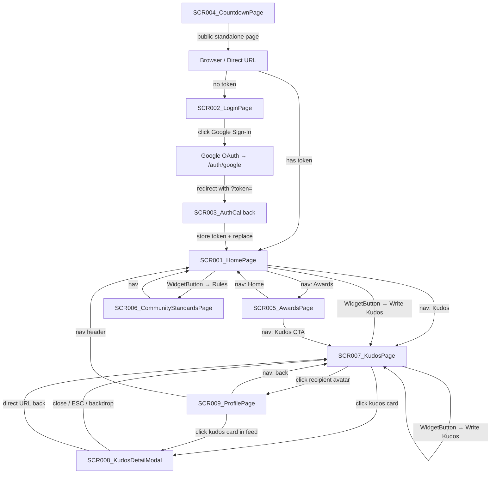
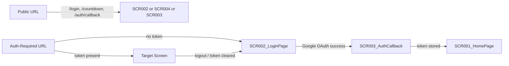

# Screen Flow

**Project**: Sun* Kudos
**Generated**: 2026-06-01
**Analysis Scope**: frontend/app/** navigation, auth-guard logic, parallel route intercept pattern

**Code Format**: All SCR codes follow `SCR###_NameSlug` | `SCR###/REG###` for region-scoped transitions.

---

## Navigation Map

---

## Screen Access Paths

| From | To | Action / Trigger | Condition | Region |
|------|----|-----------------|-----------|--------|
| ENTRY (no token) | SCR002_LoginPage | AuthGuard redirect | `auth_token` absent in localStorage | |
| ENTRY (has token) | SCR001_HomePage | AuthGuard pass-through | `auth_token` present | |
| SCR001_HomePage | SCR005_AwardsPage | Click "Về Giải Thưởng" CTA or nav link | authenticated | SCR001_HomePage/REG001_HeroBand |
| SCR001_HomePage | SCR007_KudosPage | Click "Về Kudos" CTA or nav link | authenticated | SCR001_HomePage/REG001_HeroBand |
| SCR001_HomePage | SCR007_KudosPage | WidgetButton → "Viết Kudos" | authenticated | |
| SCR001_HomePage | SCR006_CommunityStandardsPage | WidgetButton → "Thể lệ" | authenticated | |
| SCR002_LoginPage | SCR001_HomePage | Token exists in localStorage on mount | token already in localStorage | |
| SCR002_LoginPage | GOOGLE_OAUTH | Click Google sign-in button | no token | |
| GOOGLE_OAUTH | SCR003_AuthCallback | Google redirects to /auth/callback?token= | OAuth success | |
| SCR003_AuthCallback | SCR001_HomePage | `router.replace('/')` after token stored | always | |
| SCR005_AwardsPage | SCR007_KudosPage | KudosSection CTA click | authenticated | SCR005_AwardsPage/REG002_KudosCTA |
| SCR005_AwardsPage | SCR001_HomePage | Header nav: Home | authenticated | |
| SCR006_CommunityStandardsPage | SCR001_HomePage | Header nav: Home | authenticated | |
| SCR007_KudosPage | SCR008_KudosDetailModal | Click kudos card (intercept: parallel route) | authenticated; navigating within /kudos | SCR007_KudosPage/REG001_HighlightSection |
| SCR007_KudosPage | SCR008_KudosDetailModal | Click kudos card (intercept: parallel route) | authenticated; navigating within /kudos | SCR007_KudosPage/REG003_AllKudosFeed |
| SCR007_KudosPage | SCR009_ProfilePage | Click recipient name/avatar in sidebar | authenticated | SCR007_KudosPage/REG004_KudosSidebar |
| SCR007_KudosPage | SCR009_ProfilePage | Click recipient name/avatar on kudos card | authenticated | SCR007_KudosPage/REG003_AllKudosFeed |
| SCR008_KudosDetailModal | SCR007_KudosPage | Close button / ESC / backdrop click | always | |
| SCR008_KudosDetailModal | SCR007_KudosPage | `router.back()` (no history) → `router.push('/kudos')` | always | |
| SCR009_ProfilePage | SCR008_KudosDetailModal | Click kudos card in profile feed | authenticated | SCR009_ProfilePage/REG003_ProfileKudosList |
| SCR009_ProfilePage | SCR001_HomePage | Header nav: Home | authenticated | |

> Region column: `SCR###/REG###` for region-scoped transitions; blank for whole-screen transitions.

---

## Screen Transitions

### SCR001_HomePage

**Entry Points**:
- AuthGuard pass-through on any auth-required URL when token present
- Post-login redirect from SCR003_AuthCallback
- Header nav click from SCR005_AwardsPage, SCR006_CommunityStandardsPage, SCR009_ProfilePage

**Exit Points**:
- To SCR005_AwardsPage: "Về Giải Thưởng" CTA button or nav link (REG001_HeroBand)
- To SCR007_KudosPage: "Về Kudos" CTA or nav link (REG001_HeroBand / REG003_KudosCTA)
- To SCR007_KudosPage: WidgetButton → "Viết Kudos" action
- To SCR006_CommunityStandardsPage: WidgetButton → "Thể lệ" action

**Decision Points**:
- WidgetButton state: if "Viết Kudos" → open WriteKudosModal overlay on current screen (no navigation); if "Thể lệ" → navigate to /community-standards

---

### SCR002_LoginPage

**Entry Points**:
- AuthGuard redirect when `auth_token` absent from localStorage and target path is auth-required
- Direct URL `/login`

**Exit Points**:
- To SCR001_HomePage: token already present on mount (auto-redirect via `router.replace('/')`)
- To Google OAuth: click Google sign-in button → `GET /auth/google` backend route

**Decision Points**:
- On mount: if `localStorage.auth_token` exists → redirect to `/` without rendering login UI

---

### SCR003_AuthCallback

**Entry Points**:
- Google OAuth redirect to `/auth/callback?token=<jwt>`

**Exit Points**:
- To SCR001_HomePage: always, via `router.replace('/')` after token stored

**Decision Points**:
- If `?token=` present: store in localStorage, then redirect
- If `?token=` absent: redirect anyway (token-less; AuthGuard will catch on next route)

---

### SCR004_CountdownPage

**Entry Points**:
- Direct URL `/countdown` (public, no auth guard)

**Exit Points**:
- None defined in component; user must use browser nav or header links

**Decision Points**:
- None

---

### SCR005_AwardsPage

**Entry Points**:
- CTA from SCR001_HomePage (HeroSection or nav)
- Direct URL `/awards`

**Exit Points**:
- To SCR007_KudosPage: KudosSection CTA click (REG002_KudosCTA)
- To SCR001_HomePage: header nav

**Decision Points**:
- Award nav section (sticky sidebar + mobile tab): client-state only, no navigation change (scroll tracking within REG001_AwardDetailSection)

---

### SCR006_CommunityStandardsPage

**Entry Points**:
- WidgetButton → "Thể lệ" from SCR001_HomePage, SCR005_AwardsPage, SCR007_KudosPage
- Direct URL `/community-standards`

**Exit Points**:
- To SCR001_HomePage: header nav

**Decision Points**:
- None

---

### SCR007_KudosPage

**Entry Points**:
- Nav link / CTA from SCR001_HomePage, SCR005_AwardsPage
- WidgetButton write-kudos flow (post-submit stays on /kudos)
- Direct URL `/kudos`

**Exit Points**:
- To SCR008_KudosDetailModal: click any kudos card (parallel route intercept → overlay)
- To SCR009_ProfilePage: click recipient name/avatar (full navigation)
- To SCR001_HomePage: header nav

**Decision Points**:
- Kudos card click from within `/kudos`: parallel route `@modal` slot intercepts → SCR008 renders as overlay (no full page reload, URL changes to `/kudos/:id`)
- Kudos card click via direct URL: `kudos/[id]/page.tsx` renders KudosPage + KudosDetailModal forced open

---

### SCR008_KudosDetailModal

**Entry Points**:
- From SCR007_KudosPage: kudos card click → parallel route intercept (URL: `/kudos/:id`, background: SCR007)
- Direct URL `/kudos/:id`: `kudos/[id]/page.tsx` renders SCR007 + modal forced open

**Exit Points**:
- To SCR007_KudosPage: close button / ESC key / backdrop click → `router.back()` or `router.push('/kudos')`

**Decision Points**:
- On close: `window.history.length <= 1` → `router.push('/kudos')`; else → `router.back()`

---

### SCR009_ProfilePage

**Entry Points**:
- Click recipient avatar from SCR007_KudosPage/REG004_KudosSidebar (SidebarRecipients)
- Click recipient avatar/name on kudos card from SCR007_KudosPage/REG003_AllKudosFeed
- Click sender/receiver block from SCR008_KudosDetailModal (if link is present)
- Direct URL `/profile/:email`

**Exit Points**:
- To SCR008_KudosDetailModal: click kudos card in profile feed (REG003_ProfileKudosList)
- To SCR001_HomePage: header nav
- To SCR007_KudosPage: header nav

**Decision Points**:
- Filter toggle (sent/received): client-state only → triggers new `GET /kudos?sender=` or `?receiver=` call; URL does not change; no navigation

---

## Region Transitions

> Region transitions are typically client-state (no URL change); documented when they change user-visible state or cross region boundary.

| From Region | To Target | Action / Trigger | Client-State Only |
|-------------|-----------|-----------------|-------------------|
| SCR007_KudosPage/REG001_HighlightSection | SCR008_KudosDetailModal | Click kudos card | No (URL → /kudos/:id) |
| SCR007_KudosPage/REG003_AllKudosFeed | SCR008_KudosDetailModal | Click kudos card | No (URL → /kudos/:id) |
| SCR007_KudosPage/REG003_AllKudosFeed | SCR009_ProfilePage | Click recipient avatar | No (URL → /profile/:email) |
| SCR007_KudosPage/REG004_KudosSidebar | SCR009_ProfilePage | Click recipient link in SidebarRecipients | No (URL → /profile/:email) |
| SCR009_ProfilePage/REG003_ProfileKudosList | SCR008_KudosDetailModal | Click kudos card | No (URL → /kudos/:id) |
| SCR009_ProfilePage/REG003_ProfileKudosList | (same region) | Toggle sent/received filter | Yes (re-fetches GET /kudos) |
| SCR007_KudosPage/REG001_HighlightSection | (same region) | Change hashtag/dept filter | Yes (re-fetches GET /kudos/highlight) |

---

## Authentication Flow

| Screen | Auth Required | Notes |
|--------|--------------|-------|
| SCR001_HomePage | Yes | AuthGuard in `app/layout.tsx` |
| SCR002_LoginPage | No (public) | Auto-redirects if token present |
| SCR003_AuthCallback | No (public) | Token arrives as URL param |
| SCR004_CountdownPage | No (public) | Standalone pre-launch page |
| SCR005_AwardsPage | Yes | AuthGuard |
| SCR006_CommunityStandardsPage | Yes | AuthGuard |
| SCR007_KudosPage | Yes | AuthGuard |
| SCR008_KudosDetailModal | Yes | AuthGuard (rendered within /kudos/:id) |
| SCR009_ProfilePage | Yes | AuthGuard |

**Auth guard implementation**: `frontend/components/auth/auth-guard.tsx` — checks `auth_token` in localStorage; redirects to `/login` for protected routes. Public paths: `/login`, `/countdown`, `/auth/callback`.

---

## Error Handling Flows

| Screen | Error | Handling | Scope |
|--------|-------|----------|-------|
| SCR003_AuthCallback | Missing token param | Silent — redirects to `/` (AuthGuard will redirect to /login) | screen |
| SCR007_KudosPage | Highlight load failure | Silent — keeps stale data (no error UI) | region:REG001_HighlightSection |
| SCR007_KudosPage | Spotlight load failure | Silent — empty state rendered | region:REG002_SpotlightSection |
| SCR007_KudosPage | Feed load failure | Silent — empty state rendered | region:REG003_AllKudosFeed |
| SCR007_KudosPage | Stats load failure | Empty stats — no error UI | region:REG004_KudosSidebar |
| SCR008_KudosDetailModal | `GET /kudos/:id` failure | "Not found." text inside modal | screen |
| SCR009_ProfilePage | `GET /kudos/profile/:email` failure | Inline error message in main area | screen |
| SCR009_ProfilePage | Kudos list load failure | Inline error text in kudos section | region:REG003_ProfileKudosList |
| All auth-required | 401 / token expired | AuthGuard redirects to `/login` | screen |

> Scope values: `screen` (affects entire screen) | `region:REG###` (error contained within region).

---

## Circular Dependencies Check

- [x] No circular navigation dependencies detected
- [x] All screens have valid entry points
- [x] All navigation paths terminate
- [x] SCR008_KudosDetailModal ↔ SCR007_KudosPage is an overlay pattern (not a circular dependency — modal close returns to parent)
- [x] Every SCR### in ScreenList appears in this ScreenFlow
