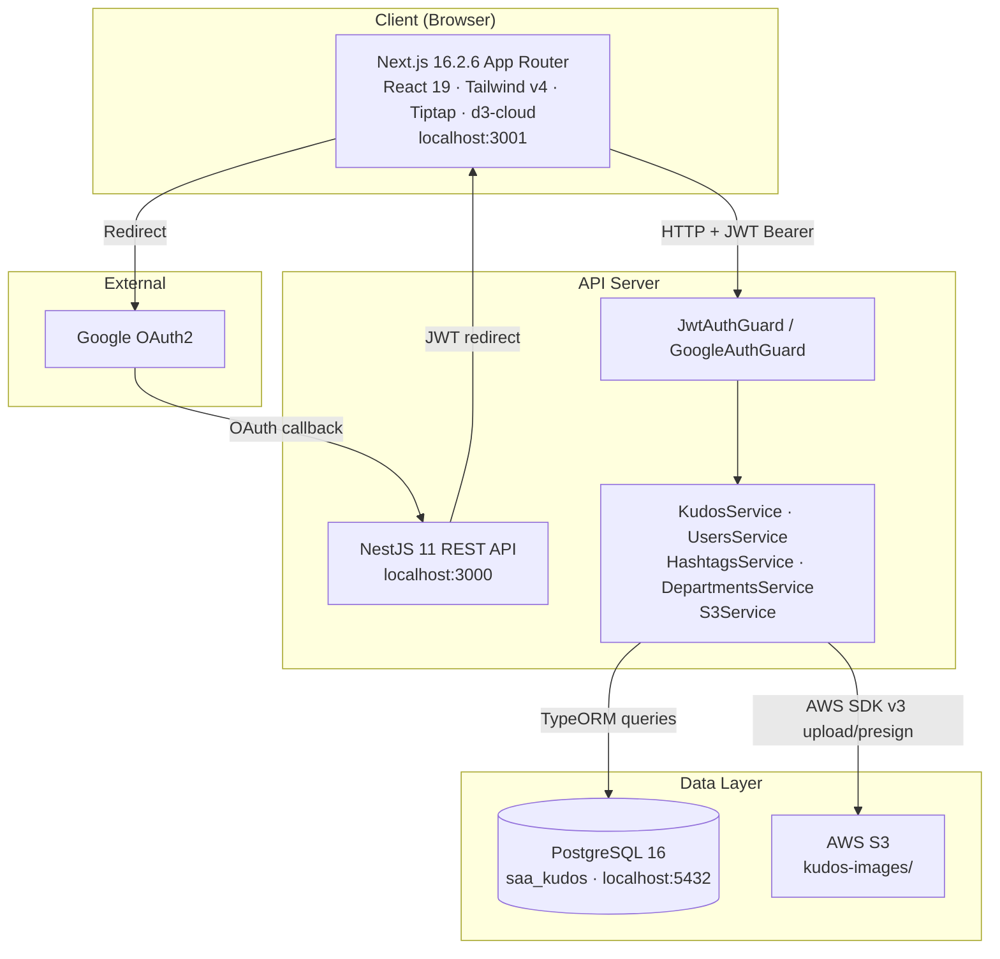
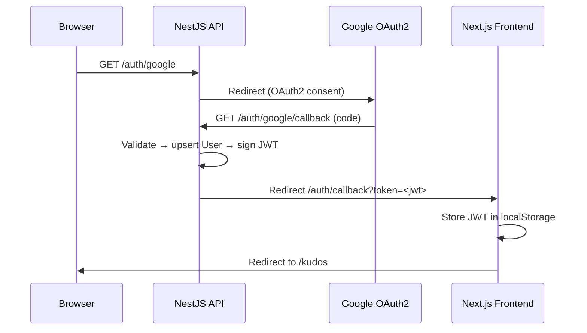
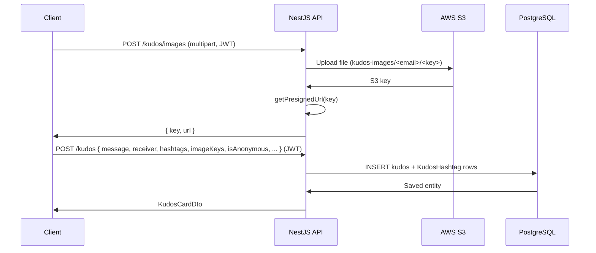
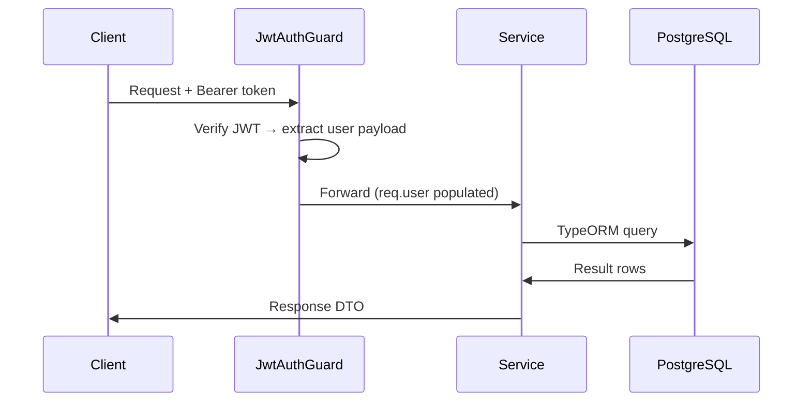

# System Overview

**Project**: Sun* Kudos
**Generated**: 2026-06-01
**Architecture Type**: Monorepo — full-stack web (REST API + SPA-like App Router frontend)

## Executive Summary

Sun* Kudos is an internal peer-recognition board for Sun Asterisk employees. Authenticated users (Google OAuth2 → JWT) send kudos to colleagues with rich-text messages, optional hashtags, optional anonymous identity, and optional S3-hosted images. Kudos are displayed in a paginated feed, a "highlight" carousel (top-liked), and a "spotlight" section (word cloud + recent receivers). Users can like/unlike kudos and view aggregate stats on profile pages.

The system is a classic two-tier web app: a stateless NestJS 11 REST API backed by PostgreSQL 16, consumed by a Next.js 16.2.6 (App Router) frontend. No background jobs, queues, or event-driven architecture exist. All business logic is synchronous request-response. AWS S3 is used exclusively for image uploads (upload via API → presigned URL returned to client). Live demo: https://ssa-two-theta.vercel.app/

## System Architecture

### High-Level Architecture

### Technology Stack

| Layer | Technology | Version |
|-------|------------|---------|
| Frontend framework | Next.js (App Router) | 16.2.6 |
| Frontend runtime | React | 19 |
| Frontend styling | Tailwind CSS | v4 |
| Frontend rich text | Tiptap | No data |
| Frontend word cloud | d3-cloud | No data |
| Backend framework | NestJS | 11 |
| Backend ORM | TypeORM | No data |
| Backend auth | Passport (Google OAuth2 + JWT) | No data |
| Backend file upload | Multer (memory storage) | No data |
| Database | PostgreSQL | 16 |
| Object storage | AWS S3 | AWS SDK v3 |
| Cache | None | — |
| Queue | None | — |
| Container (dev DB) | Docker Compose | No data |

## Data Flow

### Authentication Flow

### Kudos Creation Flow

### Standard Authenticated Request

## Key Design Decisions

### Decision 1: Email as Primary Key for User

**Context**: Users are identified by their Google account; no surrogate integer PK was chosen.

**Decision**: `user.email` is the `@PrimaryColumn()`. All foreign keys in `Kudos` (`senderEmail`, `receiverEmail`) and `Like` (`userEmail`) reference it directly.

**Rationale**: Simplifies join queries and user lookup; Google guarantees email uniqueness within a workspace. Trade-off: email changes (rare) would cascade or break references.

### Decision 2: Denormalized `likeCount` on Kudos

**Context**: Displaying like counts on every feed card would require a COUNT subquery per row.

**Decision**: `kudos.likeCount` is a cached integer counter, incremented/decremented in the service when likes are added/removed.

**Rationale**: Read performance on feed queries. Trade-off: counter can drift if concurrent likes race (no DB-level atomic increment visible in service code).

### Decision 3: `synchronize: false` — Migration-only Schema Management

**Context**: TypeORM's `synchronize: true` auto-alters schema on startup — dangerous in production.

**Decision**: Schema changes are managed exclusively via TypeORM migration files in `backend/src/database/migrations/`.

**Rationale**: Prevents accidental data loss; provides auditable schema history. Adds migration authoring overhead per change.

### Decision 4: Stateless API — No Background Processing

**Context**: The app has no scheduled jobs, queues, mail, or event listeners.

**Decision**: All logic is synchronous request-response within NestJS controllers and services.

**Rationale**: KISS — sufficient for current load. No operational complexity of workers/schedulers. Trade-off: real-time push (e.g., live like counts) is not possible without adding WebSocket or polling.

### Decision 5: Anonymous Kudos via Alias

**Context**: Some senders want privacy.

**Decision**: `kudos.isAnonymous` flag + `kudos.senderAlias` (nullable string). When `isAnonymous=true`, the frontend displays `senderAlias` instead of real name.

**Rationale**: Simple, no separate table. The true sender identity is still stored server-side for moderation purposes.

## Security Overview

- **Authentication**: Google OAuth2 via `passport-google-oauth20`; on callback, user is upserted and a JWT (HS256, configurable expiry `JWT_EXPIRES_IN`, default `7d`) is issued and redirected to the frontend via query parameter.
- **Authorization**: Route-level guard (`JwtAuthGuard`) on all mutating and most read endpoints. Public endpoints: `GET /kudos/spotlight`, `GET /kudos/spotlight/recent`, `GET /kudos/recipient/:email/profile`, `GET /hashtags`, `GET /departments`.
- **Authorization type**: Ownership-based (resource ownership on image uploads scoped to `kudos-images/<email>/`); no roles defined — all authenticated users have identical permissions.
- **Data Encryption**: HTTPS in production (Vercel); JWT signed with `JWT_SECRET` env var (secret must be set in deployment). Passwords: not applicable (SSO-only).
- **API Security**: Global `ValidationPipe({ whitelist: true, transform: true })` strips unknown fields and validates DTOs via `class-validator`. CORS restricted to `FRONTEND_URL`. Image upload: MIME type allowlist (`image/jpeg|png|gif|webp`), 5 MB file size limit enforced by Multer.
- **Sensitive data**: JWT stored in `localStorage` (XSS risk — no HttpOnly cookie). AWS credentials via env vars; S3 access is server-side only.

## Scalability

- **Current Capacity**: Single Node.js process (no clustering configured); single PostgreSQL instance; no caching layer.
- **Scaling Strategy**: Horizontal scaling of the NestJS API is possible (stateless, JWT-based auth). Database is the single scaling bottleneck. No read replicas or connection pooling layer (PgBouncer) configured.
- **Performance Targets**: No data — no explicit SLA or benchmark documented in the codebase.
- **Known constraints**: `likeCount` denormalization may produce race conditions under concurrent load. No pagination cursor — offset-based pagination in `KudosQueryDto`. No CDN for S3 assets (presigned URLs served directly from S3).
